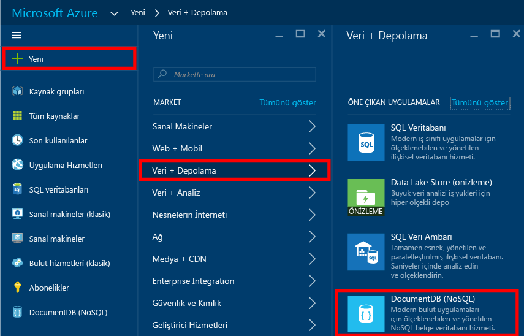
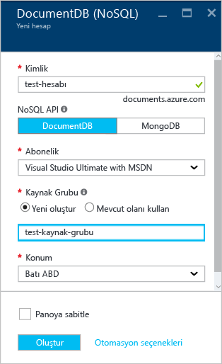
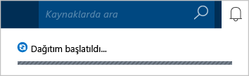
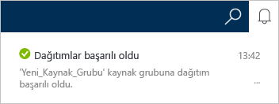
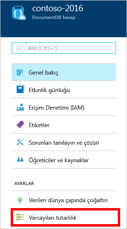
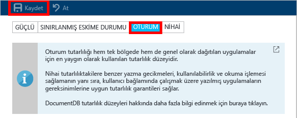

# Azure portalını kullanarak DocumentDB NoSQL hesabı oluşturma
> [!div class="op_single_selector"]
> * [Azure Portal](documentdb-create-account.md)
> * [Azure CLI'si ve Azure Resource Manager](documentdb-automation-resource-manager-cli.md)
>
>

Microsoft Azure DocumentDB ile bir veritabanı oluşturmak için:

* Bir Azure hesabınızın olması gerekir. Hesabınız yoksa [ücretsiz bir Azure hesabı](https://azure.microsoft.com/free) edinebilirsiniz.
* Bir DocumentDB hesabı oluşturmanız gerekir.  

Azure portalını, Azure Resource Manager şablonlarını veya Azure komut satırı arabiriminden (CLI) herhangi birini kullanarak bir DocumentDB hesabı oluşturabilirsiniz. Bu makalede Azure portalını kullanarak DocumentDB hesabını nasıl oluşturacağınız gösterilmektedir. Azure Resource Manager'ı veya Azure CLI'sini kullanarak bir hesap oluşturmak için bkz. [DocumentDB veritabanı hesabı oluşturmayı otomatikleştirme](documentdb-automation-resource-manager-cli.md).

DocumentDB'yi ilk kez mi kullanıyorsunuz? Çevrimiçi portalda en yaygın görevleri nasıl tamamlayacağınızı görmek için Scott Hanselman tarafından hazırlanan [bu](https://azure.microsoft.com/documentation/videos/create-documentdb-on-azure/) dört dakikalık videoyu izleyin.

1. [Azure Portal](https://portal.azure.com/) oturum açın.
2. Atlama Çubuğunda **Yeni**'ye, **Veritabanları**'na ve ardından **DocumentDB (NoSQL)** öğesine tıklayın.

     
3. **Yeni hesap** dikey penceresinde, DocumentDB hesabı için istenen yapılandırmayı belirtin.

    

   * **Kimlik** kutusuna, DocumentDB hesabını tanımlayacak bir ad girin.  **Kimlik** doğrulandığında, **Kimlik** kutusunda yeşil bir onay işareti görünür. **Kimlik** değeri, URI içinde konak adı olarak kullanılır. **Kimlik**, yalnızca küçük harf, rakam ve "-" karakteri içerebilir; 3 ila 50 karakter uzunluğunda olmalıdır. *documents.azure.com*'un seçtiğiniz uç nokta adına eklendiğine ve bunun, DocumentDB hesabınızın uç noktası olarak kullanıldığına dikkat edin.
   * **NoSQL API** kutusunda, kullanılacak programlama modelini seçin:

     * **DocumentDB**: DocumentDB API'si; HTTP [REST](https://msdn.microsoft.com/library/azure/dn781481.aspx)'in yanı sıra .NET, Java, Node.js, Python ve JavaScript [SDK'ları](documentdb-sdk-dotnet.md) aracılığıyla kullanılabilir ve tüm DocumentDB işlevlerine programlama erişimi sunar.
     * **MongoDB**: DocumentDB, **MongoDB** API'leri için de [protokol düzeyinde destek](documentdb-protocol-mongodb.md) sunar. MongoDB API'si seçeneğini belirlediğinizde, DocumentDB ile iletişim kurmak için var olan MongoDB SDK'larını ve [araçlarını](documentdb-mongodb-mongochef.md) kullanabilirsiniz. DocumentDB'yi [hiçbir kod değişikliğine ihtiyaç duymadan](documentdb-connect-mongodb-account.md) kullanmak için, var olan MongoDB uygulamalarınızı [taşıyabilir](documentdb-import-data.md) ve sınırsız ölçek, küresel çoğaltma ve diğer özelliklere sahip bir hizmet olarak tamamı yönetilen veritabanınızdan faydalanabilirsiniz.
   * **Abonelik** için, DocumentDB hesabınızda kullanmak istediğiniz Azure aboneliğini seçin. Hesabınızda yalnızca bir abonelik varsa bu hesap varsayılan olarak seçilidir.
   * **Kaynak Grubu**'nda, DocumentDB hesabınız için bir kaynak grubu seçin veya oluşturun.  Varsayılan olarak yeni bir kaynak grubu oluşturulur. Daha fazla bilgi edinmek için bkz. [Azure portalını kullanarak Azure kaynaklarınızı yönetme](../azure-portal/resource-group-portal.md).
   * DocumentDB hesabınızın barındırılacağı coğrafi konumu belirtmek için **Konum**'u kullanın.
4. Yeni DocumentDB hesabı seçenekleri yapılandırıldıktan sonra **Oluştur**'a tıklayın. Dağıtım durumunu denetlemek için, Bildirimler hub'ına bakın.  

     

   
5. DocumentDB hesabı oluşturulduktan sonra, varsayılan ayarlarla birlikte kullanıma hazırdır. DocumentDB hesabının varsayılan tutarlılığı **Oturum** olarak ayarlandı.  Kaynak menüsünde **Varsayılan Tutarlılık** seçeneğine tıklayarak varsayılan tutarlılık ayarını belirleyebilirsiniz. DocumentDB tarafından sunulan tutarlılık düzeyleri hakkında daha fazla bilgi edinmek için bkz. [DocumentDB'deki tutarlılık düzeyleri](documentdb-consistency-levels.md).

     

     

[How to: Create a DocumentDB account]: #Howto
[Next steps]: #NextSteps

## Sonraki adımlar
Artık bir DocumentDB hesabınız var. Bir sonraki adımda DocumentDB koleksiyonu ve veritabanı oluşturacağız.

Şunlardan birini kullanarak yeni bir koleksiyon ve veritabanı oluşturabilirsiniz:

* Azure portalı (bkz. [Azure portalını kullanarak DocumentDB koleksiyonu oluşturma](documentdb-create-collection.md)).
* [.NET](documentdb-get-started.md), [.NET MVC](documentdb-dotnet-application.md), [Java](documentdb-java-application.md), [Node.js](documentdb-nodejs-application.md) veya [Python](documentdb-python-application.md) örnek verilerini içeren geniş kapsamlı öğreticiler.
* GitHub'da bulunan [.NET](documentdb-dotnet-samples.md#database-examples), [Node.js](documentdb-nodejs-samples.md#database-examples) veya [Python](documentdb-python-samples.md#database-examples) örnek kodu.
* [.NET](documentdb-sdk-dotnet.md), [.NET Core](documentdb-sdk-dotnet-core.md), [Node.js](documentdb-sdk-node.md), [Java](documentdb-sdk-java.md), [Python](documentdb-sdk-python.md) ve [REST](https://msdn.microsoft.com/library/azure/mt489072.aspx) SDK'ları.

Veritabanınızı ve koleksiyonunuzu oluşturduktan sonra, koleksiyonlara [belge eklemeniz](documentdb-view-json-document-explorer.md) gerekir.

Koleksiyonda belge yükledikten sonra, [DocumentDB SQL](documentdb-sql-query.md)'i kullanarak belgelerinizde [sorgu yürütebilirsiniz](documentdb-sql-query.md#executing-sql-queries). Portaldaki [Sorgu Gezgini](documentdb-query-collections-query-explorer.md)'ni, [REST API](https://msdn.microsoft.com/library/azure/dn781481.aspx)'yi veya [SDK](documentdb-sdk-dotnet.md)'lardan birini kullanarak sorgu yürütebilirsiniz.

### Daha fazla bilgi edinin
DocumentDB hakkında daha fazla bilgi edinmek için şu kaynakları keşfedin:

* [DocumentDB için öğrenme yolu](https://azure.microsoft.com/documentation/learning-paths/documentdb/)
* [DocumentDB hiyerarşik kaynak modeli ve kavramları](documentdb-resources.md)

<!--HONumber=Jan17_HO2-->

