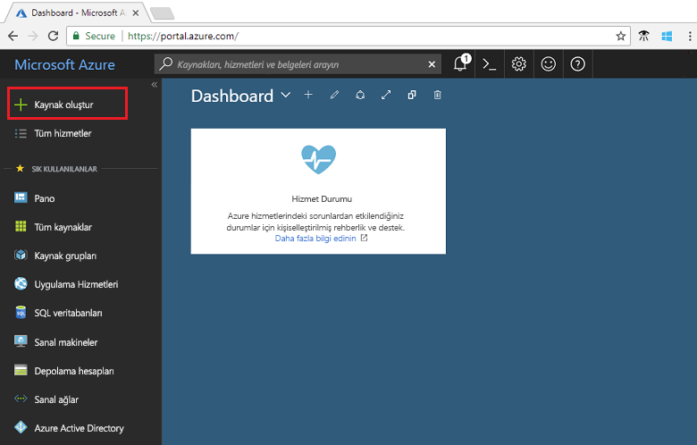
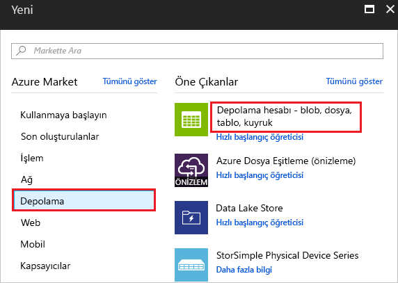
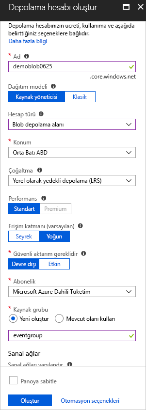
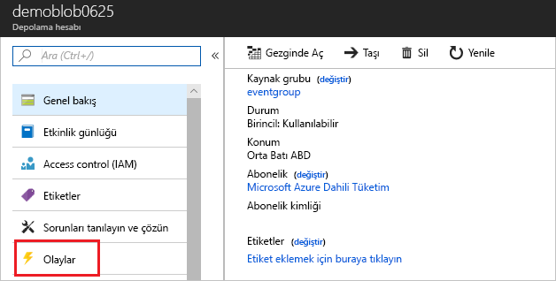
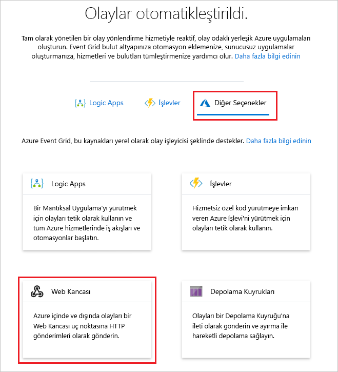
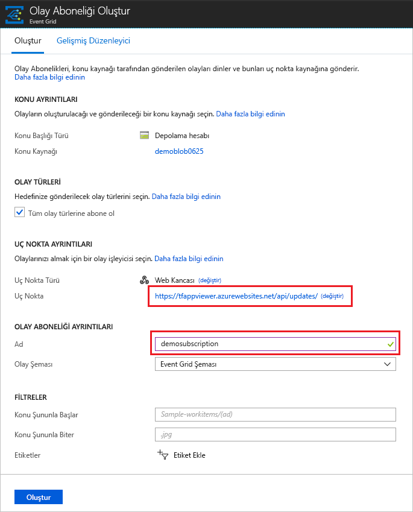
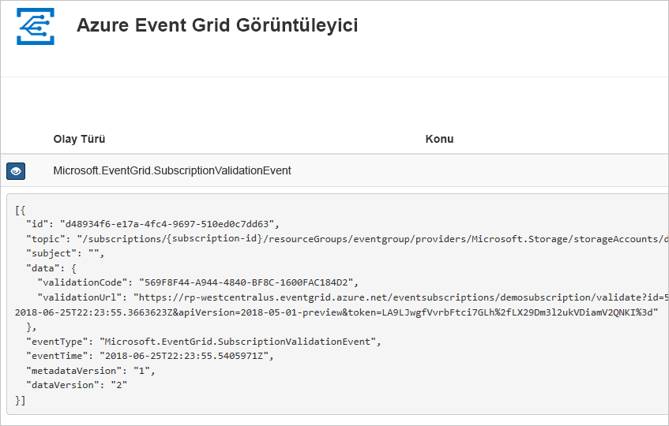
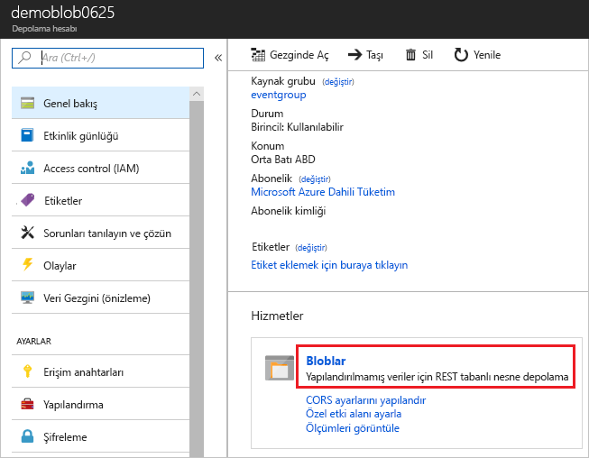
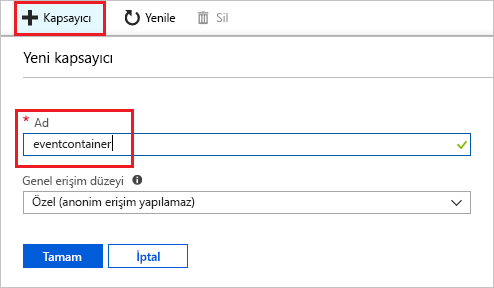
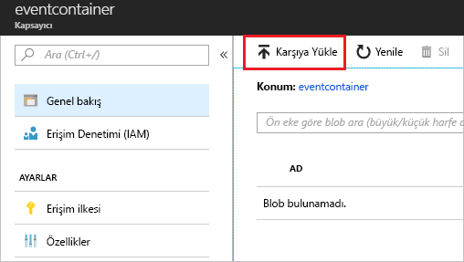

# <a name="create-and-route-blob-storage-events-with-the-azure-portal-and-event-grid"></a>Azure portalı ve Event Grid ile Blob depolama olayları oluşturma ve yönlendirme

Azure Event Grid, bulut için bir olay oluşturma hizmetidir. Bu makalede Azure portalını kullanarak bir Blob depolama hesabı oluşturur, bu blob depolama hesabının olaylarına abone olur ve sonucu görmek için bir olayı tetiklersiniz. Normalde olayları, olay verilerini işleyen ve eylemler gerçekleştiren bir uç noktaya gönderirsiniz. Bununla birlikte, bu makaleyi basitleştirmek için olayları iletilerin toplandığı ve görüntülendiği bir web uygulamasına gönderirsiniz.

[!INCLUDE [quickstarts-free-trial-note.md](../../includes/quickstarts-free-trial-note.md)]

İşiniz bittiğinde, olay verilerinin web uygulamasına gönderildiğini görürsünüz.


## <a name="create-a-storage-account"></a>Depolama hesabı oluşturma

Blob depolama olaylarını kullanmak için [Blob depolama hesabına](../storage/common/storage-create-storage-account.md?toc=%2fazure%2fstorage%2fblobs%2ftoc.json#blob-storage-accounts) veya [Genel Amaçlı v2 depolama hesabına](../storage/common/storage-account-options.md#general-purpose-v2-accounts) sahip olmanız gerekir. **Genel Amaçlı v2 (GPv2)** hesapları Bloblar, Dosyalar, Kuyruklar ve Tablolar dahil olmak üzere depolama hizmetlerinin tamamına yönelik tüm özellikleri destekleyen depolama hesaplarıdır. **Blob depolama hesabı**, yapılandırılmamış verilerinizi bloblar (nesneler) olarak Azure Storage’da depolamanıza yönelik özel depolama hesabıdır. Blob Storage hesapları, genel amaçlı depolama hesaplarınıza benzer ve blok blobları ve ilave blobları için %100 API tutarlığı dahil günümüzde kullandığınız tüm harika dayanıklılık, kullanılabilirlik, ölçeklenebilirlik ve performans özelliklerini paylaşır. Yalnızca blok veya engelleme blobunun gerektiği uygulamalar için Blob Storage hesaplarının kullanılmasını öneririz. 

1. [Azure portalda](https://portal.azure.com/) oturum açın.

1. Bir Blob depolaması oluşturmak için **Kaynak oluşturun**'u seçin. 

   

1. Kullanılabilir seçenekleri filtrelemek için **Depolama**'yı seçip **Depolama hesabı - blob, dosya, tablo, kuyruk** öğesini seçin.

   

1. Hesap için benzersiz bir ad dahil olmak üzere Blob depolama değerlerini girin. Hesap türü olarak **Blob depolama**'yı seçin. Konum için aşağıdaki Event Grid destekleyen [konumlardan](overview.md) birini seçin. Değerleri girmeyi tamamladığınızda **Oluştur**'u seçin.

   

## <a name="create-a-message-endpoint"></a>İleti uç noktası oluşturma

Blob depolamasındaki olaylara abone olmadan önce olay iletisi için uç noktayı oluşturalım. Normalde, olay verileri temelinde uç nokta eylemleri gerçekleştirir. Bu hızlı başlangıcı basitleştirmek için, olay iletilerini görüntüleyin bir [önceden oluşturulmuş web uygulaması](https://github.com/dbarkol/azure-event-grid-viewer) dağıtırsınız. Dağıtılan çözüm bir App Service planı, App Service web uygulaması ve GitHub'dan kaynak kod içerir.

1. Çözümü aboneliğinize dağıtmak için **Azure'a Dağıt**'ı seçin. Azure portalında parametre değerlerini girin.

   <a href="https://portal.azure.com/#create/Microsoft.Template/uri/https%3A%2F%2Fraw.githubusercontent.com%2Fdbarkol%2Fazure-event-grid-viewer%2Fmaster%2Fazuredeploy.json" target="_blank"></a>

1. Dağıtımın tamamlanması birkaç dakika sürebilir. Dağıtım başarıyla gerçekleştirildikten sonra, web uygulamanızı görüntüleyip çalıştığından emin olun. Web tarayıcısında şu adrese gidin: `https://<your-site-name>.azurewebsites.net`

1. Siteyi görürsünüz ancak henüz yayımlanmış olay yoktur.

   

[!INCLUDE [event-grid-register-provider-portal.md](../../includes/event-grid-register-provider-portal.md)]

## <a name="subscribe-to-the-blob-storage"></a>Blob depolamaya abone olma

Event Grid’e hangi olayları izlemek istediğinizi ve olayların nereye gönderileceğini bildirmek için bir konuya abone olursunuz.

1. Portalda blob depolamanızı ve ardından **Olaylar**'ı seçin.

   

1. Olayları görüntüleyici uygulamanıza göndermek için uç noktada bir web kancası kullanın. **Diğer Seçenekler**'i ve **Web Kancası**'nı seçin.

   

1. Olay aboneliği, Blob depolamanızın değerleriyle doldurulmuş şekilde görünür. Web kancası uç noktası için web uygulamanızın URL'sini girin ve ana sayfa URL'sine `api/updates` ekleyin. Aboneliğinize bir ad verin. İşiniz bittiğinde **Oluştur**’u seçin.

   

1. Web uygulamanızı yeniden görüntüleyin ve buna bir abonelik doğrulama olayının gönderildiğine dikkat edin. Göz simgesini seçerek olay verilerini genişletin. Uç noktanın olay verilerini almak istediğini doğrulayabilmesi için Event Grid doğrulama olayını gönderir. Web uygulaması aboneliği doğrulamak için kod içerir.

   

Şimdi, Event Grid’in iletiyi uç noktanıza nasıl dağıttığını görmek için bir olay tetikleyelim.

## <a name="send-an-event-to-your-endpoint"></a>Uç noktanıza olay gönderme

Dosya yükleyerek Blob depolaması için bir olay tetiklemiş olursunuz. Dosyanın belirli bir içeriğe sahip olmasına gerek yoktur. Bu makalede testfile.txt adlı bir dosyaya sahip olduğunuz kabul edilmektedir ancak herhangi bir dosyayı kullanabilirsiniz.

1. Blob depolamanız için **Bloblar**'ı seçin.

   

1. **+ Kapsayıcı**'yı seçin. Kapsayıcınıza bir ad verin ve herhangi bir erişim düzeyini kullanın.

   

1. Yeni kapsayıcınızı seçin.

   

1. Dosya yüklemek için **Yükle**'yi seçin.

   

1. Test dosyanıza göz atın ve yükleyin.

1. Olayı tetiklediniz ve Event Grid, iletiyi abone olurken yapılandırdığınız uç noktaya gönderdi. Web uygulamanızı görüntülediğinizde blob oluşturma olayının gönderildiğini göreceksiniz. 

  ```json
  {
    "topic": "/subscriptions/{subscription-id}/resourceGroups/eventgroup/providers/Microsoft.Storage/storageAccounts/demoblob0625",
    "subject": "/blobServices/default/containers/eventcontainer/blobs/testfile.txt",
    "eventType": "Microsoft.Storage.BlobCreated",
    "eventTime": "2018-06-25T22:50:41.1823131Z",
    "id": "89a2f9da-c01e-00bb-13d6-0c599506e4e3",
    "data": {
      "api": "PutBlockList",
      "clientRequestId": "41341a9b-e977-4a91-9000-c64125039047",
      "requestId": "89a2f9da-c01e-00bb-13d6-0c5995000000",
      "eTag": "0x8D5DAEE13C8F9ED",
      "contentType": "text/plain",
      "contentLength": 4,
      "blobType": "BlockBlob",
      "url": "https://demoblob0625.blob.core.windows.net/eventcontainer/testfile.txt",
      "sequencer": "00000000000000000000000000001C24000000000004712b",
      "storageDiagnostics": {
        "batchId": "ef633252-32fd-464b-8f5a-0d10d68885e6"
      }
    },
    "dataVersion": "",
    "metadataVersion": "1"
  }
  ```

## <a name="clean-up-resources"></a>Kaynakları temizleme

Bu olayla çalışmaya devam etmeyi planlıyorsanız bu makalede oluşturulan kaynakları temizlemeyin. Aksi takdirde, bu makalede oluşturduğunuz kaynakları silin.

Kaynak grubunu seçin ve **Kaynak grubunu sil** seçeneğini belirleyin.

## <a name="next-steps"></a>Sonraki adımlar

Özel konu ve olay abonelikleri oluşturma işlemini öğrendiğinize göre artık Event Grid’in size nasıl yardımcı olabileceği konusunda daha fazla bilgi edinebilirsiniz:

- [Event Grid Hakkında](overview.md)
- [Blob depolama olaylarını bir özel web uç noktasına yönlendirme](../storage/blobs/storage-blob-event-quickstart.md?toc=%2fazure%2fevent-grid%2ftoc.json)
- [Azure Event Grid ve Logic Apps ile sanal makine değişikliklerini izleme](monitor-virtual-machine-changes-event-grid-logic-app.md)
- [Veri ambarına büyük veri akışı yapma](event-grid-event-hubs-integration.md)
