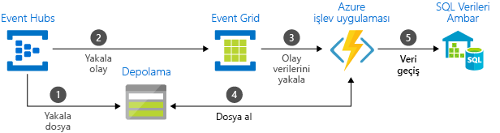

# Azure Mesajlaşma hizmetleri arasında - Event Grid, Event Hubs ve Service Bus'ı seçin

Azure bir çözüm genelinde olay iletilerini teslim etmeye yardımcı olan üç hizmet sunar. Bu hizmetler şunlardır:

* [Event Grid](/azure/event-grid/)
* [Event Hubs](/azure/event-hubs/)
* [Service Bus](/azure/service-bus-messaging/)

Bazı benzerlikleri olsa da her hizmet belirli senaryolar için tasarlanmıştır. Bu makale, bu hizmetler arasındaki farklılıkları açıklar ve uygulamanız için seçeceğiniz hizmeti anlamanıza yardımcı olur. Çoğu durumda, mesajlaşma hizmetleri birbirini tamamlayıcı özelliktedir ve birlikte kullanılabilir.

## Olay ve ileti hizmetleri karşılaştırması

Bir olayı teslim eden hizmetler ile bir iletiyi teslim eden hizmetler arasında dikkat edilmesi gereken önemli bir farklılık vardır.

### Olay

Olay, bir koşulun veya durum değişikliğinin basit bir bildirimidir. Olayın yayımcısı, olayın nasıl işleneceğiyle ilgili bir beklentiye sahip değildir. Bildirimle ne yapılacağına, olayın tüketicisi karar verir. Olaylar, ayrık birimler veya bir dizinin parçası olabilir.

Ayrık olaylar, durum değişikliğini bildirir ve eyleme dönüştürülebilir. Sonraki adımı uygulamak için tüketicinin yalnızca bir şeyler olduğunu bilmesi gerekir. Olay verileri, ne olduğuyla ilgili bilgiler içerir ancak olayı tetikleyen verileri içermez. Örneğin, bir olay, tüketicilere bir dosyanın oluşturulduğunu bildirir. Dosya hakkında genel bilgiler içerebilir ancak dosyanın kendisini içermez. Ayrık olayları için ideal [sunucusuz](https://azure.com/serverless) ölçeklendirmek için gereken çözümleri.

Seri olaylar bir koşulu bildirir ve çözümlenebilir. Olaylar zamana göre sıralanır ve birbiriyle ilişkilidir. Tüketicinin ne olduğunu çözümlemesi için sıralanmış olay serisi gerekir.

### İleti

İleti, tüketilecek veya başka bir yerde depolanacak bir hizmet tarafından üretilen ham veridir. İleti, ileti işlem hattını tetikleyen verileri içerir. İletinin yayımcısı, tüketicinin iletiyi nasıl işlediğine yönelik bir beklentiye sahiptir. İki taraf arasında bir sözleşme mevcuttur. Örneğin, yayımcı ham verileri içeren bir ileti gönderir ve tüketicinin bu verilerden bir dosya oluşturmasını ve iş bittiğinde bir yanıt göndermesini bekler.

## Hizmetleri karşılaştırması

| Hizmet | Amaç | Tür | Kullanılması gereken durumlar |
| ------- | ------- | ---- | ----------- |
| Event Grid | Duyarlı programlama | Olay dağıtımı (ayrık) | Durum değişikliklerine yanıt verme |
| Event Hubs | Büyük veri işlem hattı | Olay akışı (seri) | Telemetri ve dağıtılmış veri akışı |
| Service Bus | Yük değerli kurumsal mesajlaşma | İleti | Sipariş işleme ve finansal işlemler |

### Event Grid

Event Grid, olay temelli duyarlı programlamayı sağlayan bir olay devre kartıdır. Bir yayımla-abone ol modeli kullanır. Yayımcılar olayları yayar ancak hangi olayların işlendiği hakkında beklentileri yoktur. Hangi olayların işleneceğine aboneler karar verir.

Event Grid, Azure hizmetleriyle tümleşiktir ve üçüncü taraf hizmetlerle tümleştirilebilir. Olay tüketimini kolaylaştırır ve sürekli yoklama gereksinimini ortadan kaldırarak maliyetleri düşürür. Event Grid, olayları Azure’dan Azure dışı kaynaklara verimli ve güvenilir bir biçimde yönlendirir. Olayları kayıtlı abone uç noktalarına dağıtır. Olay iletisi, hizmet ve uygulamalardaki değişikliklere yanıt vermeniz için gereken bilgileri içerir. Event Grid bir veri işlem hattı değildir ve güncelleştirilmiş gerçek nesneyi teslim etmez.

Event Grid, bir uç noktaya teslim olmayan olaylar için ulaşmayan destekler.

Aşağıdaki özelliklere sahiptir:

* dinamik olarak ölçeklenebilir
* düşük maliyetli
* sunucusuz
* en az bir kere teslim

### Event Hubs

Azure Event Hubs bir büyük veri işlem hattıdır. Telemetri ve olay akışı verilerinin yakalanmasını, tutulmasını ve yeniden yürütülmesini kolaylaştırır. Veriler çok sayıda eşzamanlı kaynaktan gelebilir. Event Hubs, telemetri ve olay verilerinin çeşitli akış işleme altyapılarında ve analiz hizmetlerinde kullanılabilir hale getirilmesini sağlar. Veri akışları veya paketlenmiş toplu olaylar olarak kullanılabilir. Bu hizmet, gerçek zamanlı işlemenin yanı sıra depolanmış ham verilerin yinelenerek yeniden oynatılması için hızlı veri alımı sağlayan tek bir çözüm sunar. Akış verilerini, işleme ve analiz için bir dosyada yakalayabilir.

Aşağıdaki özelliklere sahiptir:

* düşük gecikme süresi
* saniyede milyonlarca olay alma ve işleme özelliği
* en az bir kere teslim

### Service Bus

Service Bus, geleneksel kurumsal uygulamalara yöneliktir. Bu kurumsal uygulamalar sipariş verme, yinelenen algılama ve anında tutarlılık gerektirir. Hizmet veri yolu sağlayan [bulutta yerel](https://azure.microsoft.com/overview/cloudnative/) güvenilir durumu sağlamak için uygulama yönetimi için iş süreçlerini geçiş. Kaybedilmesi veya yinelenmesi mümkün olmayan yüksek değerli iletileri işlerken Azure Service Bus kullanın. Service Bus ayrıca karma bulut çözümlerinde yüksek oranda güvenli iletişimi kolaylaştırır ve mevcut şirket içi sistemleri bulut çözümlerine bağlayabilir.

Service Bus bir aracılı mesajlaşma sistemidir. Kullanan taraf iletileri almaya hazır olana kadar, iletileri bir "aracıda" (örneğin, bir kuyruk) depolar.

Aşağıdaki özelliklere sahiptir:

* yoklama gerektiren, güvenilir zaman uyumsuz ileti teslimi (hizmet olarak kurumsal mesajlaşma)
* FIFO, toplu iş/oturumlar, işlemler, teslim edilemeyen iletiler, zamana bağlı denetim, yönlendirme ve filtreleme ile yinelenen algılama
* en az bir kere teslim
* isteğe bağlı sıralı teslim

## Hizmetleri birlikte kullanma

Bazı durumlarda, farklı rolleri yerine getirmek için hizmetleri yan yana kullanırsınız. Örneğin, bir e-ticaret sitesi sipariş işlemek için Service Bus, site telemetrisini yakalamak için Event Hubs ve bir ürünün gönderilmesi gibi olaylara yanıt vermek için Event Grid kullanabilir.

Bazı durumlarda ise bir olay ve veri işlem hattı oluşturmak üzere hizmetleri birbirine bağlarsınız. Diğer hizmetlerdeki olaylara yanıt vermek için Event Grid kullanabilirsiniz. Verileri bir veri ambarına geçirmek amacıyla Event Grid’i Event Hubs ile birlikte kullanma örneği için bkz. [Veri ambarına veri akışı yapma](event-grid-event-hubs-integration.md). Aşağıdaki görüntüde veri akışı yapma iş akışı gösterilmektedir.

## Sonraki adımlar
Aşağıdaki makalelere bakın: 

- [Olayları, veri noktaları ve verileriniz için doğru Azure Mesajlaşma hizmeti seçerek iletileri -](https://azure.microsoft.com/blog/events-data-points-and-messages-choosing-the-right-azure-messaging-service-for-your-data/).
- [Depolama kuyrukları ve Service Bus kuyrukları - benzerlikler ve karşıtlıklar](../service-bus-messaging/service-bus-azure-and-service-bus-queues-compared-contrasted.md)
- Event Grid kullanmaya başlamak için bkz. [Azure Event Grid ile özel olaylar oluşturma ve yönlendirme](custom-event-quickstart.md).
- Event Hubs kullanmaya başlamak için bkz. [Azure portalını kullanarak bir Event Hubs ad alanı ve bir olay hub’ı oluşturma](../event-hubs/event-hubs-create.md).
- Service Bus kullanmaya başlamak için bkz. [Azure portalını kullanarak bir Service Bus ad alanı oluşturma](../service-bus-messaging/service-bus-create-namespace-portal.md).
