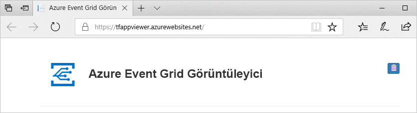

# <a name="build-your-own-disaster-recovery-for-custom-topics-in-event-grid"></a>Kendi olağanüstü durum kurtarma için Event Grid özel konulardaki oluşturun

Olağanüstü durum kurtarma uygulama işlevselliği ciddi bir kaybından kurtarma üzerinde odaklanır. Bu öğreticide, Event Grid hizmeti bozulursa, belirli bir bölgede, kurtarılır olay Mimarinizi ayarlama konusunda size yol gösterir.

Bu öğreticide, Event Grid özel konu için bir Aktif-Pasif yük devretme mimarisi oluşturulacağını öğreneceksiniz. Konuları ve abonelikleri iki bölgede yansıtma ve bir konu sistem durumu kötü olduğunda bir yük devretme ardından yönetme yük devretme gerçekleştirilmesi. Bu öğreticide bir mimari üzerinden tüm yeni trafiğe başarısız olur. Bu kurulum ile uyumlu olması önemli olan, güvenliği aşılmış bölge yeniden sağlıklı duruma gelene kadar zaten uçuş olayları kurtarılması gerekmez.

## <a name="create-a-message-endpoint"></a>İleti uç noktası oluşturma

Yük devretme yapılandırmanızı test etme, olayları almak için bir uç nokta gerekir. Uç nokta yük devretme altyapınızın bir parçası değildir, ancak test daha kolay hale getirmek için sunduğumuz olay işleyicisi davranacak.

Test etmeyi kolaylaştırmak için dağıtma bir [önceden oluşturulmuş bir web uygulaması](https://github.com/Azure-Samples/azure-event-grid-viewer) , olay iletileri görüntüler. Dağıtılan çözüm bir App Service planı, App Service web uygulaması ve GitHub'dan kaynak kod içerir.

1. Çözümü aboneliğinize dağıtmak için **Azure'a Dağıt**'ı seçin. Azure portalında parametre değerlerini girin.

   <a href="https://portal.azure.com/#create/Microsoft.Template/uri/https%3A%2F%2Fraw.githubusercontent.com%2FAzure-Samples%2Fazure-event-grid-viewer%2Fmaster%2Fazuredeploy.json" target="_blank"></a>

1. Dağıtımın tamamlanması birkaç dakika sürebilir. Dağıtım başarıyla gerçekleştirildikten sonra, web uygulamanızı görüntüleyip çalıştığından emin olun. Web tarayıcısında şu adrese gidin: `https://<your-site-name>.azurewebsites.net`
Daha sonra ihtiyacınız olacak şekilde bu URL'yi Not aldığınızdan emin olun.

1. Siteyi görürsünüz ancak henüz yayımlanmış olay yoktur.

   

[!INCLUDE [event-grid-register-provider-portal.md](../../includes/event-grid-register-provider-portal.md)]


## <a name="create-your-primary-and-secondary-topics"></a>Oluşturma, birincil ve ikincil konuları

İlk olarak iki Event Grid konuları oluşturun. Bu konular, birincil ve ikincil görür. Varsayılan olarak, olaylarınızı birincil Konunuza akar. Birincil bölgede bir hizmet kesintisi durumunda, ikincil üstlenir.

1. [Azure Portal](https://portal.azure.com) oturum açın. 

1. Ana Azure menüsünde sol üst köşesinden seçin **tüm hizmetleri** > arama **Event Grid** > seçin **olay ızgarası konu başlıkları**.

   

    Bunu daha kolay erişmek için kaynak menüsünde gelecekte eklemek için Event Grid konuları yanındaki yıldızı seçin.

1. Olay Kılavuzu konuları menüde **+ Ekle** birincil konuyu oluşturmak için.

   * Konu mantıksal bir ad verin ve Ekle "-birincil" olarak izlemek kolay hale getirmek için bir son eki.
   * Bu konunun bölgede, birincil bölge olacaktır.

     

1. Konu oluşturulduktan sonra buna gitmek ve kopyalama **konu başlığı uç noktası**. URI daha sonra ihtiyacınız olacak.

    

1. Ayrıca daha sonra ihtiyacınız olacak konu için erişim anahtarı alınamadı. Tıklayarak **erişim anahtarları** kaynak menüsünde ve anahtar 1 kopya.

    

1. Konu dikey penceresinde **+ olay aboneliği** bağlanma öğreticisi için Önkoşullar içinde yaptığınız olay alıcısı Web sitesi abone olan bir abonelik oluşturmak için.

   * Olay aboneliği mantıksal bir ad verin ve Ekle "-birincil" olarak izlemek kolay hale getirmek için bir son eki.
   * Uç nokta türü Web kancasını seçin.
   * Görünmelidir olay alıcı olay URL'si için uç nokta ayarlamak ister: `https://<your-event-reciever>.azurewebsites.net/api/updates`

     

1. İkincil bir konu ve abonelik oluşturmak için aynı akışı yineleyin. Bu kez, Değiştir "-birincil" soneki ile "-ikincil" daha kolay izlemek için. Son olarak, farklı bir Azure bölgesinde koyduğunuzdan emin olun. Onu istediğiniz yere koyabilirsiniz ancak kullanmanız önerilir [Azure eşleştirilmiş bölgeleri](../best-practices-availability-paired-regions.md). İkincil konu ve abonelik farklı bir bölgede koyarak birincil bölgeye devre dışı kalsa bile yeni olaylarınızı akışı sağlar.

Artık sahip olmalıdır:

   * Test etmek için bir olay alıcısı Web sitesi.
   * Birincil bölgede, birincil bir konu.
   * Birincil Konunuza olay alıcısı Web sitesine bağlanma birincil olay aboneliği.
   * İkincil bir konu, ikincil bölgede.
   * Birincil Konunuza olay alıcısı Web sitesine bağlanma ikincil olay aboneliği.

## <a name="implement-client-side-failover"></a>İstemci tarafı yük devretmeyi uygulama

Konuları ve abonelikleri Kurulum bölgesel olarak yedekli bir çift olduğuna göre istemci tarafı yük devredilmesini hazırsınız. Bunu yapmanın birkaç yolu vardır, ancak tüm yük devretme uygulamalarında ortak bir özellik gerekir: bir konu artık sağlam değilse bir konu başlığına trafiği yönlendirir.

### <a name="basic-client-side-implementation"></a>Temel istemci-tarafı uygulaması

Aşağıdaki örnek kod, her zaman öncelikle birincil Konunuza yayımlama girişiminde basit bir .NET yayımcısıdır. Başarısız olursa, sonra yük devretmesi yapar ikincil konu. Her iki durumda da, da sistem denetler API üzerinde bir alma yaparak diğer konu `https://<topic-name>.<topic-region>.eventgrid.azure.net/api/health`. Sağlıklı bir konu her zaman ile yanıt vermelidir **200 Tamam** ne zaman bir GET yapılan üzerinde **/api/sistem durumu** uç noktası.

```csharp
using System;
using System.Net.Http;
using System.Collections.Generic;
using Microsoft.Azure.EventGrid;
using Microsoft.Azure.EventGrid.Models;
using Newtonsoft.Json;

namespace EventGridFailoverPublisher
{
    // This captures the "Data" portion of an EventGridEvent on a custom topic
    class FailoverEventData
    {
        [JsonProperty(PropertyName = "teststatus")]
        public string TestStatus { get; set; }
    }

    class Program
    {
        static void Main(string[] args)
        {
            // TODO: Enter the endpoint each topic. You can find this topic endpoint value
            // in the "Overview" section in the "Event Grid Topics" blade in Azure Portal..
            string primaryTopic = "https://<primary-topic-name>.<primary-topic-region>.eventgrid.azure.net/api/events";
            string secondaryTopic = "https://<secondary-topic-name>.<secondary-topic-region>.eventgrid.azure.net/api/events";

            // TODO: Enter topic key for each topic. You can find this in the "Access Keys" section in the
            // "Event Grid Topics" blade in Azure Portal.
            string primaryTopicKey = "<your-primary-topic-key>";
            string secondaryTopicKey = "<your-secondary-topic-key>";

            string primaryTopicHostname = new Uri( primaryTopic).Host;
            string secondaryTopicHostname = new Uri(secondaryTopic).Host;

            Uri primaryTopicHealthProbe = new Uri("https://" + primaryTopicHostname + "/api/health");
            Uri secondaryTopicHealthProbe = new Uri("https://" + secondaryTopicHostname + "/api/health");

            var httpClient = new HttpClient();

            try
            {
                TopicCredentials topicCredentials = new TopicCredentials(primaryTopicKey);
                EventGridClient client = new EventGridClient(topicCredentials);

                client.PublishEventsAsync(primaryTopicHostname, GetEventsList()).GetAwaiter().GetResult();
                Console.Write("Published events to primary Event Grid topic.");

                HttpResponseMessage health = httpClient.GetAsync(secondaryTopicHealthProbe).Result;
                Console.Write("\n\nSecondary Topic health " + health);
            }
            catch (Microsoft.Rest.Azure.CloudException e)
            {
                TopicCredentials topicCredentials = new TopicCredentials(secondaryTopicKey);
                EventGridClient client = new EventGridClient(topicCredentials);

                client.PublishEventsAsync(secondaryTopicHostname, GetEventsList()).GetAwaiter().GetResult();
                Console.Write("Published events to secondary Event Grid topic. Reason for primary topic failure:\n\n" + e);

                HttpResponseMessage health = httpClient.GetAsync(primaryTopicHealthProbe).Result;
                Console.Write("\n\nPrimary Topic health " + health);
            }

            Console.ReadLine();
        }

        static IList<EventGridEvent> GetEventsList()
        {
            List<EventGridEvent> eventsList = new List<EventGridEvent>();

            for (int i = 0; i < 5; i++)
            {
                eventsList.Add(new EventGridEvent()
                {
                    Id = Guid.NewGuid().ToString(),
                    EventType = "Contoso.Failover.Test",
                    Data = new FailoverEventData()
                    {
                        TestStatus = "success"
                    },
                    EventTime = DateTime.Now,
                    Subject = "test" + i,
                    DataVersion = "2.0"
                });
            }

            return eventsList;
        }
    }
}
```

### <a name="try-it-out"></a>Deneyin

Bütün bileşenleriniz yerinde sahip olduğunuza göre yük devretme uygulamanızı test edebilirsiniz. Yukarıdaki örnek, Visual Studio Code'u veya sık kullandığınız ortamınızı çalıştırın. Aşağıdaki dört değerden uç noktaları ve anahtarları, konulardan değiştirin:

   * primaryTopic - birincil konu başlığınız için uç nokta.
   * secondaryTopic - ikincil konu başlığınız için uç nokta.
   * primaryTopicKey - birincil Konunuza ait anahtar.
   * secondaryTopicKey - ikincil Konunuza ait anahtar.

Olay yayımcısı çalıştırmayı deneyin. Aşağıdaki gibi Event Grid Görüntüleyicisi'nde, test olaylarını land görmeniz gerekir.


Yük devretme çalıştığından emin olmak için birkaç karakter birincil konu anahtarınızı artık geçerli hale getirmek için değiştirebilirsiniz. Yayımcısı'nı yeniden çalıştırmayı deneyin. Konsolunuzda baktığınızda, bunlar artık ikincil konu yayımlanmakta olduğunu görürsünüz ancak yine de, Event Grid Görüntüleyicisi'nde, yeni olayları görüyor olmalısınız.

### <a name="possible-extensions"></a>Olası uzantılar

Gereksinimlerinize göre bu örnek genişletmek için birçok yolu vardır. Yüksek hacimli senaryolar için düzenli olarak konunun durumu denetlemek isteyebilirsiniz API bağımsız olarak. Bu şekilde, aşağı gitmek için bir konu varsa her tek yayımlama denetleyin gerekmez. Bir konuya iyi durumda olmayan öğrendikten sonra ikincil konuya yayımlamaya varsayılan.

Benzer şekilde, belirli gereksinimlerinize göre yeniden çalışma mantığı kullanmak isteyebilirsiniz. En yakın veri merkezine yayımlama gecikme süresini azaltmak için kritik öneme sahipse, sistem durumu araştırma düzenli aralıklarla API bir konunun yük devretti. Tekrar iyi durumda olduğunda, yeniden çalışma yakın veri merkezine güvenlidir bilirsiniz.

## <a name="next-steps"></a>Sonraki adımlar

- Bilgi edinmek için nasıl [bir http uç noktasında olayları alma](./receive-events.md)
- Bulma nasıl [olayları yönlendirmek için karma bağlantılar](./custom-event-to-hybrid-connection.md)
- Hakkında bilgi edinin [Traffic Manager ve Azure DNS kullanarak olağanüstü durum kurtarma](https://docs.microsoft.com/azure/networking/disaster-recovery-dns-traffic-manager)
