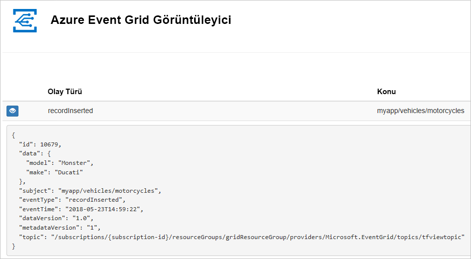
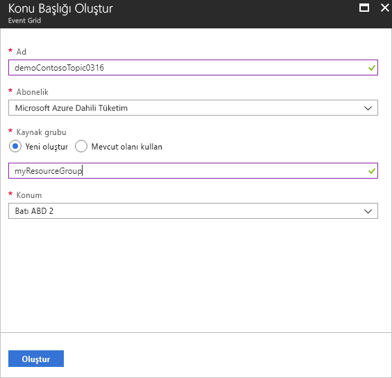
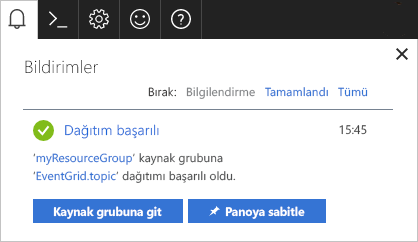
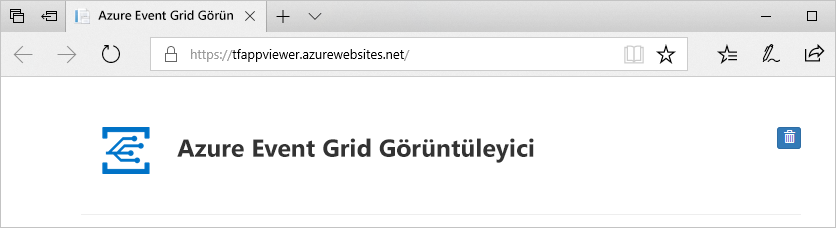
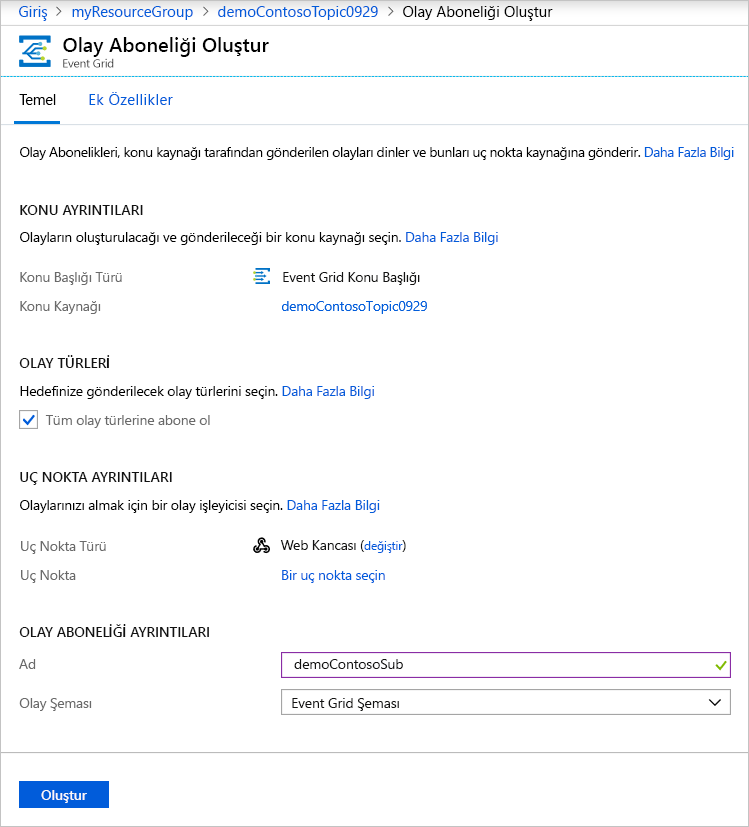
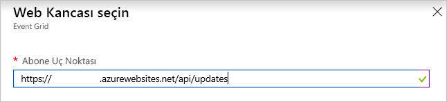
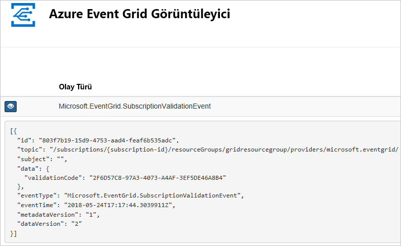

# <a name="quickstart-route-custom-events-to-web-endpoint-with-the-azure-portal-and-event-grid"></a>Hızlı Başlangıç: Web uç noktasına Azure portalı ve Event Grid ile özel olaylarını yönlendirme

Azure Event Grid, bulut için bir olay oluşturma hizmetidir. Bu makalede, Azure portalını kullanarak özel bir konu oluşturur, bu özel konuya abone olur ve sonucu görüntülemek için olayı tetiklersiniz. Normalde olayları, olay verilerini işleyen ve eylemler gerçekleştiren bir uç noktaya gönderirsiniz. Bununla birlikte, bu makaleyi basitleştirmek için olayları iletilerin toplandığı ve görüntülendiği bir web uygulamasına gönderirsiniz.

İşiniz bittiğinde, olay verilerinin web uygulamasına gönderildiğini görürsünüz.



[!INCLUDE [updated-for-az](../../includes/updated-for-az.md)]

[!INCLUDE [quickstarts-free-trial-note.md](../../includes/quickstarts-free-trial-note.md)]

[!INCLUDE [event-grid-register-provider-portal.md](../../includes/event-grid-register-provider-portal.md)]

## <a name="create-a-custom-topic"></a>Özel konu oluşturma

Event grid konusu, olaylarınızı göndereceğiniz kullanıcı tanımlı bir uç nokta sağlar. 

1. [Azure portalda](https://portal.azure.com/) oturum açın.
2. Seçin **tüm hizmetleri** sol gezinti menüsünde arama **Event Grid**seçip **olay ızgarası konu başlıkları**. 

    
3. Üzerinde **olay ızgarası konu başlıkları** sayfasında **+ Ekle** araç. 

    
4. Üzerinde **Create konusunda** sayfasında, aşağıdaki adımları izleyin:
    1. Benzersiz bir sağlamak **adı** özel konu için. Konu adı bir DNS girdisi ile temsil edildiğinden konu adı benzersiz olmalıdır. Görüntüde gösterilen adı kullanmayın. Bunun yerine, kendi adınızı oluşturun - 3-50 karakter arasında olması gerekir ve içeren yalnızca a-z, A-Z, 0-9, değerleri ve "-".
    2. Azure **aboneliğinizi** seçin.
    3. Mevcut bir kaynak grubunu seçin ya da seçin **Yeni Oluştur**girin bir **adı** için **kaynak grubu**.
    4. Seçin bir **konumu** olay Kılavuzu konusu için.
    5. Varsayılan değer tutmak **Event Grid şema** için **olay şeması** alan. 

       
    6. **Oluştur**’u seçin. 
5. Özel konu oluşturulduktan sonra başarılı bildirim görürsünüz. Seçin **kaynak grubuna gidin**. 

   
6. Üzerinde **kaynak grubu** sayfasında, olay ızgarası konu seçin. 

   
7. Gördüğünüz **olay Kılavuzu konusu** , event grid için sayfa. Bu sayfayı açık tutun. Bu hızlı başlangıçta kullanın. 

    

## <a name="create-a-message-endpoint"></a>İleti uç noktası oluşturma
Özel Konu aboneliği oluşturmadan önce olay iletisi için bir uç noktası oluşturun. Normalde, olay verileri temelinde uç nokta eylemleri gerçekleştirir. Bu hızlı başlangıcı basitleştirmek için, olay iletilerini görüntüleyin bir [önceden oluşturulmuş web uygulaması](https://github.com/Azure-Samples/azure-event-grid-viewer) dağıtırsınız. Dağıtılan çözüm bir App Service planı, App Service web uygulaması ve GitHub'dan kaynak kod içerir.

1. Makale sayfasında seçin **azure'a Dağıt** çözüm aboneliğinize dağıtın. Azure portalında parametre değerlerini girin.

   <a href="https://portal.azure.com/#create/Microsoft.Template/uri/https%3A%2F%2Fraw.githubusercontent.com%2FAzure-Samples%2Fazure-event-grid-viewer%2Fmaster%2Fazuredeploy.json" target="_blank"></a>
1. Dağıtımın tamamlanması birkaç dakika sürebilir. Dağıtım başarıyla gerçekleştirildikten sonra, web uygulamanızı görüntüleyip çalıştığından emin olun. Web tarayıcısında şu adrese gidin: `https://<your-site-name>.azurewebsites.net`
1. Siteyi görürsünüz ancak henüz yayımlanmış olay yoktur.

   

## <a name="subscribe-to-custom-topic"></a>Özel konuya abone olma

Event Grid’e hangi olayları izlemek istediğinizi ve olayların nereye gönderileceğini bildirmek için bir Event Grid konusuna abone olursunuz.

1. Şimdi, **olay Kılavuzu konusu** özel konuyu, seçme sayfası **+ olay aboneliği** araç.

   
2. Üzerinde **olay aboneliği oluşturma** sayfasında, aşağıdaki adımları izleyin:
    1. Girin bir **adı** olay aboneliği için.
    3. Seçin **Web kancası** için **uç noktası türü**. 
    4. Seçin **bir uç nokta seçin**. 

       
    5. Web kancası uç noktası için web uygulamanızın URL'sini girin ve ana sayfa URL'sine `api/updates` ekleyin. **Seçimi Onayla**'yı seçin.

       
    6. Yeniden **olay aboneliği oluşturma** sayfasında **Oluştur**.

3. Web uygulamanızı yeniden görüntüleyin ve buna bir abonelik doğrulama olayının gönderildiğine dikkat edin. Göz simgesini seçerek olay verilerini genişletin. Uç noktanın olay verilerini almak istediğini doğrulayabilmesi için Event Grid doğrulama olayını gönderir. Web uygulaması aboneliği doğrulamak için kod içerir.

    

## <a name="send-an-event-to-your-topic"></a>Konunuza olay gönderme

Şimdi, Event Grid’in iletiyi uç noktanıza nasıl dağıttığını görmek için bir olay tetikleyelim. Özel konunuza bir test olayı göndermek için Azure CLI veya PowerShell kullanın. Normalde olay verilerini bir uygulama veya Azure hizmeti gönderir.

Birinci örnekte, Azure CLI kullanılmaktadır. Özel konunun URL’si ve anahtarı ile örnek olay verilerini alır. `<topic name>` yerine özel konunuzun adını yazın. Örnek olay verileri oluşturulur. JSON’un `data` öğesi, olayınızın yüküdür. Bu alana doğru oluşturulmuş herhangi bir JSON gelebilir. Ayrıca, gelişmiş yönlendirme ve filtreleme için konu alanını da kullanabilirsiniz. CURL, HTTP istekleri gönderen bir yardımcı programdır.


### <a name="azure-cli"></a>Azure CLI'si
1. Azure portalında **Cloud Shell**. Seçin **Bash** Cloud Shell penceresinin sol üst köşesindeki. 

    
1. Almak için aşağıdaki komutu çalıştırın **uç nokta** konu için: Komutu kopyalayıp sonra güncelleştirme **konu adı** ve **kaynak grubu adı** komutu çalıştırmadan önce. 

    ```azurecli
    endpoint=$(az eventgrid topic show --name <topic name> -g <resource group name> --query "endpoint" --output tsv)
    ```
2. Almak için aşağıdaki komutu çalıştırın **anahtar** özel konu için: Komutu kopyalayıp sonra güncelleştirme **konu adı** ve **kaynak grubu** komutu çalıştırmadan önce adlandırın. 

    ```azurecli
    key=$(az eventgrid topic key list --name <topic name> -g <resource group name> --query "key1" --output tsv)
    ```
3. Aşağıdaki deyim olay tanımı ve basın kopyalama **ENTER**. 

    ```json
    event='[ {"id": "'"$RANDOM"'", "eventType": "recordInserted", "subject": "myapp/vehicles/motorcycles", "eventTime": "'`date +%Y-%m-%dT%H:%M:%S%z`'", "data":{ "make": "Ducati", "model": "Monster"},"dataVersion": "1.0"} ]'
    ```
4. Aşağıdaki komutu çalıştırın **Curl** komut olayı göndermek için:

    ```
    curl -X POST -H "aeg-sas-key: $key" -d "$event" $endpoint
    ```

### <a name="azure-powershell"></a>Azure PowerShell
İkinci örnek, benzer adımları gerçekleştirmek için PowerShell’i kullanır.

1. Azure portalında **Cloud Shell**. Seçin **PowerShell** Cloud Shell penceresinin sol üst köşesindeki. Örnek görmek **Cloud Shell** Azure CLI bölümünde penceresinin resmi. 
2. Almak için aşağıdaki komutu çalıştırın **uç nokta** konu için: Komutu kopyalayıp sonra güncelleştirme **konu adı** ve **kaynak grubu adı** komutu çalıştırmadan önce. 

    ```powershell
    $endpoint = (Get-AzEventGridTopic -ResourceGroupName <resource group name> -Name <topic name>).Endpoint
    ```
3. Almak için aşağıdaki komutu çalıştırın **anahtar** özel konu için: Komutu kopyalayıp sonra güncelleştirme **konu adı** ve **kaynak grubu** komutu çalıştırmadan önce adlandırın.

    ```powershell
    $keys = Get-AzEventGridTopicKey -ResourceGroupName gridResourceGroup -Name <topic name>
    ```
4. Olay hazırlayın. Kopyala ve Cloud Shell penceresine deyimleri çalıştırın. 

    ```azurepowershell
    $eventID = Get-Random 99999

    #Date format should be SortableDateTimePattern (ISO 8601)
    $eventDate = Get-Date -Format s

    #Construct body using Hashtable
    $htbody = @{
        id= $eventID
        eventType="recordInserted"
        subject="myapp/vehicles/motorcycles"
        eventTime= $eventDate   
        data= @{
            make="Ducati"
            model="Monster"
        }
        dataVersion="1.0"
    }
    
    #Use ConvertTo-Json to convert event body from Hashtable to JSON Object
    #Append square brackets to the converted JSON payload since they are expected in the event's JSON payload syntax
    $body = "["+(ConvertTo-Json $htbody)+"]"
    ```
5. Kullanım **Invoke-WebRequest** olay göndermek için cmdlet'i. 

    ```powershell
    Invoke-WebRequest -Uri $endpoint -Method POST -Body $body -Headers @{"aeg-sas-key" = $keys.Key1}
    ```

### <a name="verify-in-the-event-grid-viewer"></a>Olay ızgarası Görüntüleyicisi doğrulayın
Olayı tetiklediniz ve Event Grid, iletiyi abone olurken yapılandırdığınız uç noktaya gönderdi. Az önce gönderdiğiniz olayı görmek için web uygulamanızı görüntüleyin.

```json
{
  "id": "974",
  "eventType": "recordInserted",
  "subject": "myapp/vehicles/motorcycles",
  "eventTime": "2019-03-28T01:11:59+00:00",
  "data": {
    "make": "Ducati",
    "model": "Monster"
  },
  "dataVersion": "1.0",
  "metadataVersion": "1",
  "topic": "/subscriptions/11111111-1111-1111-1111-111111111111/resourceGroups/myegridrg/providers/Microsoft.EventGrid/topics/myegridtopic"
}
```

## <a name="clean-up-resources"></a>Kaynakları temizleme
Bu olayla çalışmaya devam etmeyi planlıyorsanız bu makalede oluşturulan kaynakları temizlemeyin. Aksi takdirde, bu makalede oluşturduğunuz kaynakları silin.

1. Seçin **kaynak grupları** sol menüsünde. Sol taraftaki menüde görmüyorsanız, seçin **tüm hizmetleri** seçin ve soldaki menüden **kaynak grupları**. 
2. Başlatmak için kaynak grubunu seçin **kaynak grubu** sayfası. 
3. Seçin **kaynak grubunu Sil** araç. 
4. Kaynak grubu adı girerek silme işlemini onaylayın ve **Sil**. 

    

    Görüntüde gördüğünüz diğer kaynak grubu oluşturulmuş ve Cloud Shell penceresi tarafından kullanılır. Cloud Shell penceresini daha sonra kullanmak üzere planlamıyorsanız silin. 

## <a name="next-steps"></a>Sonraki adımlar

Özel konu ve olay abonelikleri oluşturma işlemini öğrendiğinize göre artık Event Grid’in size nasıl yardımcı olabileceği konusunda daha fazla bilgi edinebilirsiniz:

- [Event Grid Hakkında](overview.md)
- [Blob depolama olaylarını bir özel web uç noktasına yönlendirme](../storage/blobs/storage-blob-event-quickstart.md?toc=%2fazure%2fevent-grid%2ftoc.json)
- [Azure Event Grid ve Logic Apps ile sanal makine değişikliklerini izleme](monitor-virtual-machine-changes-event-grid-logic-app.md)
- [Veri ambarına büyük veri akışı yapma](event-grid-event-hubs-integration.md)
