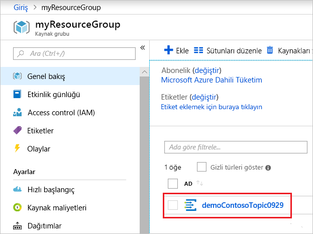

# <a name="quickstart-route-custom-events-to-web-endpoint-with-the-azure-portal-and-event-grid"></a>Hızlı Başlangıç: Web uç noktasına Azure portalı ve Event Grid ile özel olaylarını yönlendirme

Azure Event Grid, bulut için bir olay oluşturma hizmetidir. Bu makalede, Azure portalını kullanarak özel bir konu oluşturur, bu özel konuya abone olur ve sonucu görüntülemek için olayı tetiklersiniz. Normalde olayları, olay verilerini işleyen ve eylemler gerçekleştiren bir uç noktaya gönderirsiniz. Bununla birlikte, bu makaleyi basitleştirmek için olayları iletilerin toplandığı ve görüntülendiği bir web uygulamasına gönderirsiniz.

İşiniz bittiğinde, olay verilerinin web uygulamasına gönderildiğini görürsünüz.


[!INCLUDE [updated-for-az](../../includes/updated-for-az.md)]

[!INCLUDE [quickstarts-free-trial-note.md](../../includes/quickstarts-free-trial-note.md)]

[!INCLUDE [event-grid-register-provider-portal.md](../../includes/event-grid-register-provider-portal.md)]

## <a name="create-a-custom-topic"></a>Özel konu oluşturma

Event grid konusu, olaylarınızı göndereceğiniz kullanıcı tanımlı bir uç nokta sağlar. 

1. [Azure portalda](https://portal.azure.com/) oturum açın.

1. Özel bir konu oluşturmak için **Kaynak oluşturun** seçeneğini belirleyin. 

   

1. *Olay Kılavuzu Konu Başlığı* için arama yapın ve sağlanan seçeneklerden bunu seçin.

   

1. **Oluştur**’u seçin.

   

1. Özel konu için benzersiz bir ad belirtin. Konu adı bir DNS girdisi ile temsil edildiğinden konu adı benzersiz olmalıdır. Görüntüde gösterilen adı kullanmayın. Bunun yerine, kendi adınızı oluşturun - 3-50 karakter arasında olması gerekir ve içeren yalnızca a-z, A-Z, 0-9, değerleri ve "-". Kaynak grubu için bir ad belirtin. **Oluştur**’u seçin.

   

1. Özel konu oluşturulduktan sonra başarılı bildirim görürsünüz.

   

   Dağıtım başarılı olmadıysa neyin hataya neden olduğunu öğrenin. **Dağıtım başarısız** seçeneğini belirleyin.

   

   Hata iletisini seçin.

   

   Aşağıdaki resimde, özel konunun adı zaten kullanımda olduğundan başarısız olan bir dağıtım gösterilmektedir. Bu hatayı görürseniz, farklı bir adla dağıtımı yeniden deneyin.

   

## <a name="create-a-message-endpoint"></a>İleti uç noktası oluşturma

Özel konuya abone olmadan önce, olay iletisi için uç noktayı oluşturalım. Normalde, olay verileri temelinde uç nokta eylemleri gerçekleştirir. Bu hızlı başlangıcı basitleştirmek için, olay iletilerini görüntüleyin bir [önceden oluşturulmuş web uygulaması](https://github.com/Azure-Samples/azure-event-grid-viewer) dağıtırsınız. Dağıtılan çözüm bir App Service planı, App Service web uygulaması ve GitHub'dan kaynak kod içerir.

1. Çözümü aboneliğinize dağıtmak için **Azure'a Dağıt**'ı seçin. Azure portalında parametre değerlerini girin.

   <a href="https://portal.azure.com/#create/Microsoft.Template/uri/https%3A%2F%2Fraw.githubusercontent.com%2FAzure-Samples%2Fazure-event-grid-viewer%2Fmaster%2Fazuredeploy.json" target="_blank"></a>

1. Dağıtımın tamamlanması birkaç dakika sürebilir. Dağıtım başarıyla gerçekleştirildikten sonra, web uygulamanızı görüntüleyip çalıştığından emin olun. Web tarayıcısında şu adrese gidin: `https://<your-site-name>.azurewebsites.net`

1. Siteyi görürsünüz ancak henüz yayımlanmış olay yoktur.

   

## <a name="subscribe-to-custom-topic"></a>Özel konuya abone olma

Event Grid’e hangi olayları izlemek istediğinizi ve olayların nereye gönderileceğini bildirmek için bir Event Grid konusuna abone olursunuz.

1. Portalda özel konunuzu seçin.

   

1. **+ Olay Aboneliği**'ni seçin.

   

1. Uç noktası türü olarak **Web Kancası**'nı seçin. Olay aboneliği için bir ad belirtin.

   

1. **Bir uç nokta seçin**'i belirleyin. 

1. Web kancası uç noktası için web uygulamanızın URL'sini girin ve ana sayfa URL'sine `api/updates` ekleyin. **Seçimi Onayla**'yı seçin.

   

1. Olay aboneliği değerlerini girmeyi tamamladıktan sonra **Oluştur**'u seçin.

Web uygulamanızı yeniden görüntüleyin ve buna bir abonelik doğrulama olayının gönderildiğine dikkat edin. Göz simgesini seçerek olay verilerini genişletin. Uç noktanın olay verilerini almak istediğini doğrulayabilmesi için Event Grid doğrulama olayını gönderir. Web uygulaması aboneliği doğrulamak için kod içerir.


## <a name="send-an-event-to-your-topic"></a>Konunuza olay gönderme

Şimdi, Event Grid’in iletiyi uç noktanıza nasıl dağıttığını görmek için bir olay tetikleyelim. Özel konunuza bir test olayı göndermek için Azure CLI veya PowerShell kullanın. Normalde olay verilerini bir uygulama veya Azure hizmeti gönderir.

Birinci örnekte, Azure CLI kullanılmaktadır. Özel konunun URL’si ve anahtarı ile örnek olay verilerini alır. `<topic_name>` yerine özel konunuzun adını yazın. Örnek olay verileri oluşturulur. JSON’un `data` öğesi, olayınızın yüküdür. Bu alana doğru oluşturulmuş herhangi bir JSON gelebilir. Ayrıca, gelişmiş yönlendirme ve filtreleme için konu alanını da kullanabilirsiniz. CURL, HTTP istekleri gönderen bir yardımcı programdır.

```azurecli-interactive
endpoint=$(az eventgrid topic show --name <topic_name> -g myResourceGroup --query "endpoint" --output tsv)
key=$(az eventgrid topic key list --name <topic_name> -g myResourceGroup --query "key1" --output tsv)

event='[ {"id": "'"$RANDOM"'", "eventType": "recordInserted", "subject": "myapp/vehicles/motorcycles", "eventTime": "'`date +%Y-%m-%dT%H:%M:%S%z`'", "data":{ "make": "Ducati", "model": "Monster"},"dataVersion": "1.0"} ]'

curl -X POST -H "aeg-sas-key: $key" -d "$event" $endpoint
```

İkinci örnek, benzer adımları gerçekleştirmek için PowerShell’i kullanır.

```azurepowershell-interactive
$endpoint = (Get-AzEventGridTopic -ResourceGroupName gridResourceGroup -Name <topic-name>).Endpoint
$keys = Get-AzEventGridTopicKey -ResourceGroupName gridResourceGroup -Name <topic-name>

$eventID = Get-Random 99999

#Date format should be SortableDateTimePattern (ISO 8601)
$eventDate = Get-Date -Format s

#Construct body using Hashtable
$htbody = @{
    id= $eventID
    eventType="recordInserted"
    subject="myapp/vehicles/motorcycles"
    eventTime= $eventDate   
    data= @{
        make="Ducati"
        model="Monster"
    }
    dataVersion="1.0"
}

#Use ConvertTo-Json to convert event body from Hashtable to JSON Object
#Append square brackets to the converted JSON payload since they are expected in the event's JSON payload syntax
$body = "["+(ConvertTo-Json $htbody)+"]"

Invoke-WebRequest -Uri $endpoint -Method POST -Body $body -Headers @{"aeg-sas-key" = $keys.Key1}
```

Olayı tetiklediniz ve Event Grid, iletiyi abone olurken yapılandırdığınız uç noktaya gönderdi. Az önce gönderdiğiniz olayı görmek için web uygulamanızı görüntüleyin.

```json
[{
  "id": "1807",
  "eventType": "recordInserted",
  "subject": "myapp/vehicles/motorcycles",
  "eventTime": "2017-08-10T21:03:07+00:00",
  "data": {
    "make": "Ducati",
    "model": "Monster"
  },
  "dataVersion": "1.0",
  "metadataVersion": "1",
  "topic": "/subscriptions/{subscription-id}/resourceGroups/{resource-group}/providers/Microsoft.EventGrid/topics/{topic}"
}]
```


## <a name="clean-up-resources"></a>Kaynakları temizleme

Bu olayla çalışmaya devam etmeyi planlıyorsanız bu makalede oluşturulan kaynakları temizlemeyin. Aksi takdirde, bu makalede oluşturduğunuz kaynakları silin.

Kaynak grubunu seçin ve **Kaynak grubunu sil** seçeneğini belirleyin.

## <a name="next-steps"></a>Sonraki adımlar

Özel konu ve olay abonelikleri oluşturma işlemini öğrendiğinize göre artık Event Grid’in size nasıl yardımcı olabileceği konusunda daha fazla bilgi edinebilirsiniz:

- [Event Grid Hakkında](overview.md)
- [Blob depolama olaylarını bir özel web uç noktasına yönlendirme](../storage/blobs/storage-blob-event-quickstart.md?toc=%2fazure%2fevent-grid%2ftoc.json)
- [Azure Event Grid ve Logic Apps ile sanal makine değişikliklerini izleme](monitor-virtual-machine-changes-event-grid-logic-app.md)
- [Veri ambarına büyük veri akışı yapma](event-grid-event-hubs-integration.md)
