# <a name="create-and-route-custom-events-with-the-azure-portal-and-event-grid"></a>Azure portalı ve Event Grid ile özel olaylar oluşturma ve yönlendirme

Azure Event Grid, bulut için bir olay oluşturma hizmetidir. Bu makalede, Azure portalını kullanarak özel bir konu oluşturur, konuya abone olur ve sonucu görüntülemek için olayı tetiklersiniz. Olay verilerini günlüğe kaydeden bir Azure İşlevine olayı gönderirsiniz. İşiniz bittiğinde, olay verilerinin bir uç noktaya gönderildiğini ve günlüğe kaydedildiğini görürsünüz.

[!INCLUDE [quickstarts-free-trial-note.md](../../includes/quickstarts-free-trial-note.md)]

## <a name="create-a-custom-topic"></a>Özel konu oluşturma

Event grid konusu, olaylarınızı göndereceğiniz kullanıcı tanımlı bir uç nokta sağlar. 

1. [Azure portalı](https://portal.azure.com/)’nda oturum açın.

1. Özel bir konu oluşturmak için **Kaynak oluşturun** seçeneğini belirleyin. 

   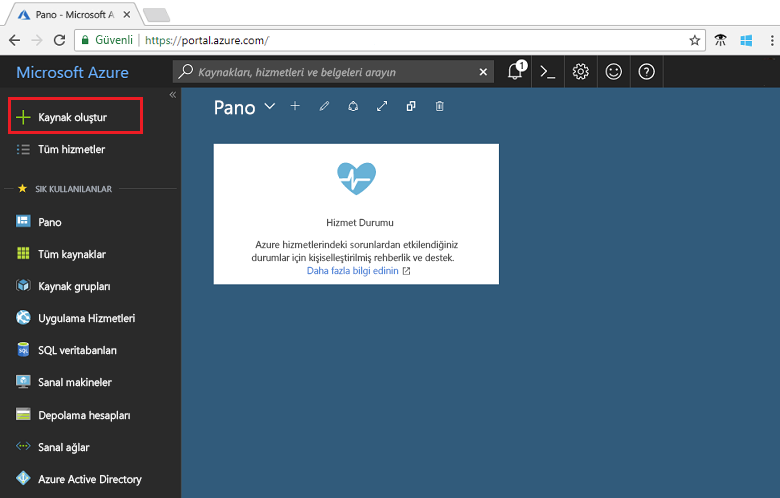

1. *Olay Kılavuzu Konu Başlığı* için arama yapın ve sağlanan seçeneklerden bunu seçin.

   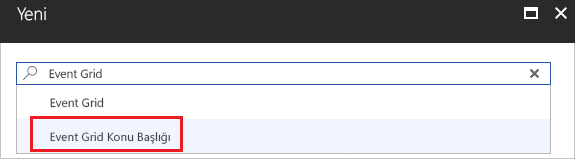

1. **Oluştur**’u seçin.

   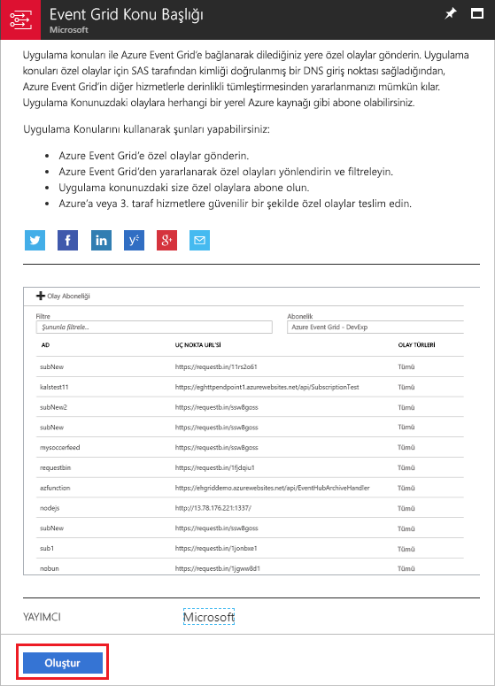

1. Özel konu için benzersiz bir ad belirtin. Konu adı bir DNS girdisi ile temsil edildiğinden benzersiz olmalıdır. Görüntüde gösterilen adı kullanmayın. Bunun yerine, kendi adınızı oluşturun. [Desteklenen bölgelerden](overview.md) birini seçin. Kaynak grubu için bir ad belirtin. **Oluştur**’u seçin.

   

1. Özel konu oluşturulduktan sonra başarılı bildirim görürsünüz.

   

   Dağıtım başarılı olmadıysa neyin hataya neden olduğunu öğrenin. **Dağıtım başarısız** seçeneğini belirleyin.

   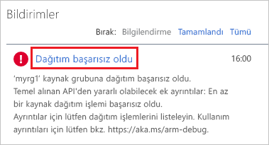

   Hata iletisini seçin.

   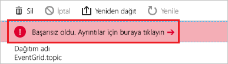

   Aşağıdaki resimde, özel konunun adı zaten kullanımda olduğundan başarısız olan bir dağıtım gösterilmektedir. Bu hatayı görürseniz, farklı bir adla dağıtımı yeniden deneyin.

   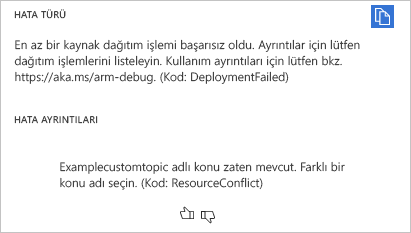

## <a name="create-an-azure-function"></a>Azure İşlevi oluşturma

Konuya abone olmadan önce olay iletisi için uç noktayı oluşturalım. Bu makalede, Azure İşlevleri’ni kullanarak uç nokta için bir işlev uygulaması oluşturacaksınız.

1. Bir işlev oluşturmak için **Kaynak oluşturun** seçeneğini belirleyin.

   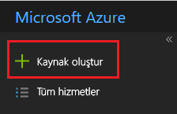

1. **İşlem** ve **İşlev Uygulaması** seçeneğini belirleyin.

   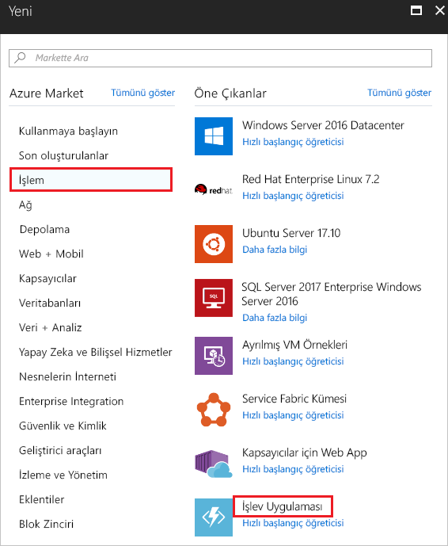

1. Azure İşlevi için benzersiz bir ad belirtin. Görüntüde gösterilen adı kullanmayın. Bu makalede oluşturduğunuz kaynak grubunu seçin. Barındırma planı için **Tüketim Planı**’nı kullanın. Önerilen yeni depolama hesabını kullanın. Değerleri girdikten sonra **Oluştur**’u seçin.

   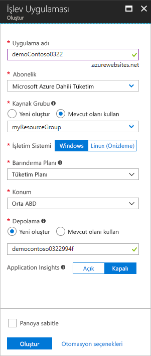

1. Dağıtım tamamlandığında **Kaynağa git** seçeneğini belirleyin.

   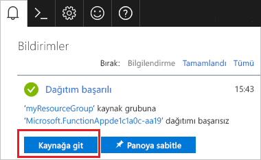

1. **İşlevler**’in yanında **+** seçeneğini belirleyin.

   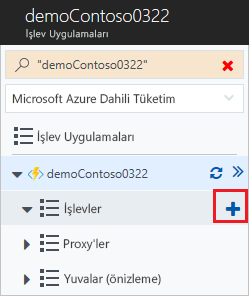

1. Kullanılabilir seçenekler arasından **Özel işlev**’i seçin.

   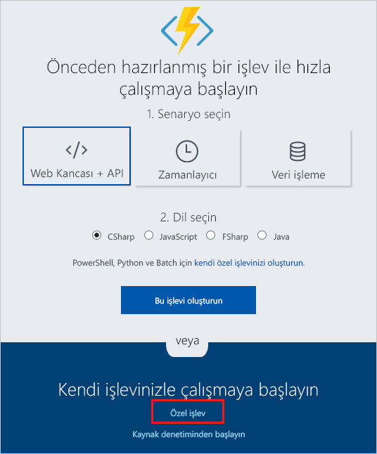

1. Sayfayı aşağı kaydırıp **Olay Kılavuzu tetikleyicisi**’ni bulun. **C#** seçeneğini belirleyin.

   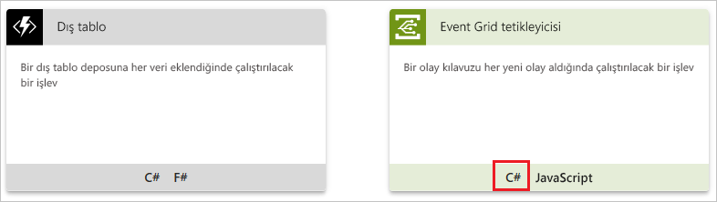

1. Varsayılan değerleri kabul edin ve **Oluştur**’u seçin.

   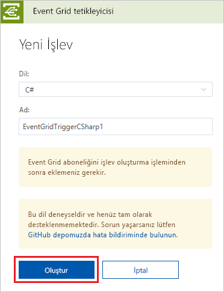

İşleviniz artık olayları almaya hazırdır.

## <a name="subscribe-to-a-topic"></a>Bir konuya abone olma

Event Grid’e hangi olayları izlemek istediğinizi ve olayların nereye gönderileceğini bildirmek için bir konuya abone olursunuz.

1. Azure işlevinizde **Event Grid Aboneliği Ekle**’yi seçin.

   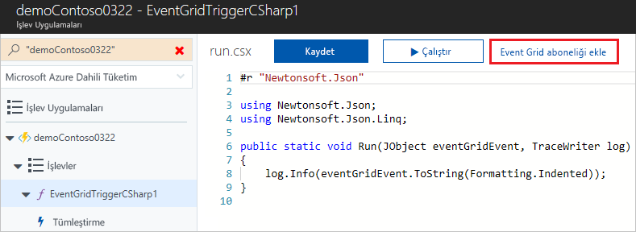

1. Abonelik için değerler belirtin. Konu türü için **Olay Kılavuzu Konuları**'nı seçin. Abonelik ve kaynak grubu için, özel konuyu oluşturduğunuz aboneliği ve kaynak grubunu seçin. Örneğin, özel konunuzun adını seçin. Abone uç noktası, işlevin URL’si ile önceden doldurulur.

   

1. Olayı tetiklemeden önce, olay verilerinin ne zaman gönderildiğini görebilmeniz için işlevin günlüklerini açın. Azure işlevinizin alt kısmında **Günlükler**’i seçin.

   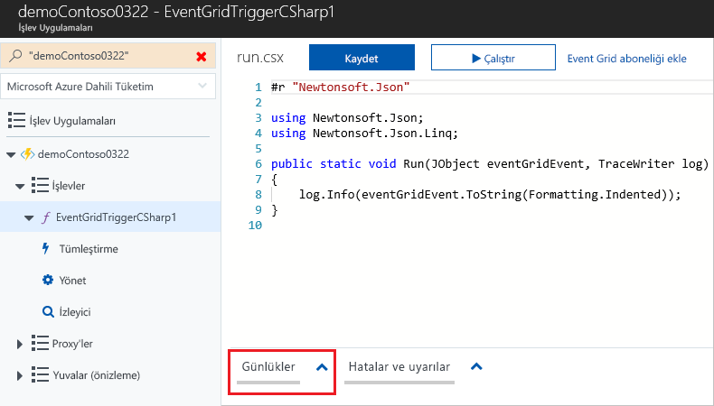

Şimdi, Event Grid’in iletiyi uç noktanıza nasıl dağıttığını görmek için bir olay tetikleyelim. Bu makaleyi basitleştirmek için Cloud Shell kullanarak özel konuya örnek olay verilerini gönderin. Normalde olay verilerini bir uygulama veya Azure hizmeti gönderir.

[!INCLUDE [cloud-shell-try-it.md](../../includes/cloud-shell-try-it.md)]

## <a name="send-an-event-to-your-topic"></a>Konunuza olay gönderme

Özel konunuza bir test olayı göndermek için Azure CLI veya PowerShell kullanın.

Birinci örnekte, Azure CLI kullanılmaktadır. Konunun URL’si ve anahtarı ile örnek olay verilerini alır. `<topic_name>` için kendi konu adınızı kullanın. Tüm olayı görmek için `echo "$body"` kullanın. JSON’un `data` öğesi, olayınızın yüküdür. Bu alana doğru oluşturulmuş herhangi bir JSON gelebilir. Ayrıca, gelişmiş yönlendirme ve filtreleme için konu alanını da kullanabilirsiniz. CURL, HTTP istekleri gönderen bir yardımcı programdır.

```azurecli-interactive
endpoint=$(az eventgrid topic show --name <topic_name> -g myResourceGroup --query "endpoint" --output tsv)
key=$(az eventgrid topic key list --name <topic_name> -g myResourceGroup --query "key1" --output tsv)

body=$(eval echo "'$(curl https://raw.githubusercontent.com/Azure/azure-docs-json-samples/master/event-grid/customevent.json)'")

curl -X POST -H "aeg-sas-key: $key" -d "$body" $endpoint
```

İkinci örnek, benzer adımları gerçekleştirmek için PowerShell’i kullanır.

```azurepowershell-interactive
$endpoint = (Get-AzureRmEventGridTopic -ResourceGroupName gridResourceGroup -Name <topic-name>).Endpoint
$keys = Get-AzureRmEventGridTopicKey -ResourceGroupName gridResourceGroup -Name <topic-name>

$eventID = Get-Random 99999

#Date format should be SortableDateTimePattern (ISO 8601)
$eventDate = Get-Date -Format s

#Construct body using Hashtable
$htbody = @{
    id= $eventID
    eventType="recordInserted"
    subject="myapp/vehicles/motorcycles"
    eventTime= $eventDate   
    data= @{
        make="Ducati"
        model="Monster"
    }
    dataVersion="1.0"
}

#Use ConvertTo-Json to convert event body from Hashtable to JSON Object
#Append square brackets to the converted JSON payload since they are expected in the event's JSON payload syntax
$body = "["+(ConvertTo-Json $htbody)+"]"

Invoke-WebRequest -Uri $endpoint -Method POST -Body $body -Headers @{"aeg-sas-key" = $keys.Key1}
```

Olayı tetiklediniz ve Event Grid, iletiyi abone olurken yapılandırdığınız uç noktaya gönderdi. Olay verilerini görmek için günlüklere bakın.

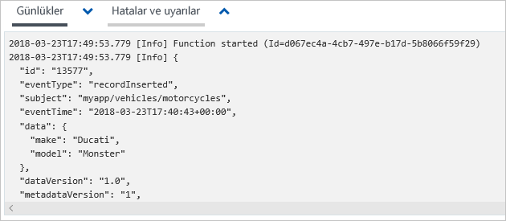

## <a name="clean-up-resources"></a>Kaynakları temizleme

Bu olayla çalışmaya devam etmeyi planlıyorsanız bu makalede oluşturulan kaynakları temizlemeyin. Aksi takdirde, bu makalede oluşturduğunuz kaynakları silin.

Kaynak grubunu seçin ve **Kaynak grubunu sil** seçeneğini belirleyin.

## <a name="next-steps"></a>Sonraki adımlar

Özel konu ve olay abonelikleri oluşturma işlemini öğrendiğinize göre artık Event Grid’in size nasıl yardımcı olabileceği konusunda daha fazla bilgi edinebilirsiniz:

- [Event Grid Hakkında](overview.md)
- [Blob depolama olaylarını bir özel web uç noktasına yönlendirme](../storage/blobs/storage-blob-event-quickstart.md?toc=%2fazure%2fevent-grid%2ftoc.json)
- [Azure Event Grid ve Logic Apps ile sanal makine değişikliklerini izleme](monitor-virtual-machine-changes-event-grid-logic-app.md)
- [Veri ambarına büyük veri akışı yapma](event-grid-event-hubs-integration.md)
