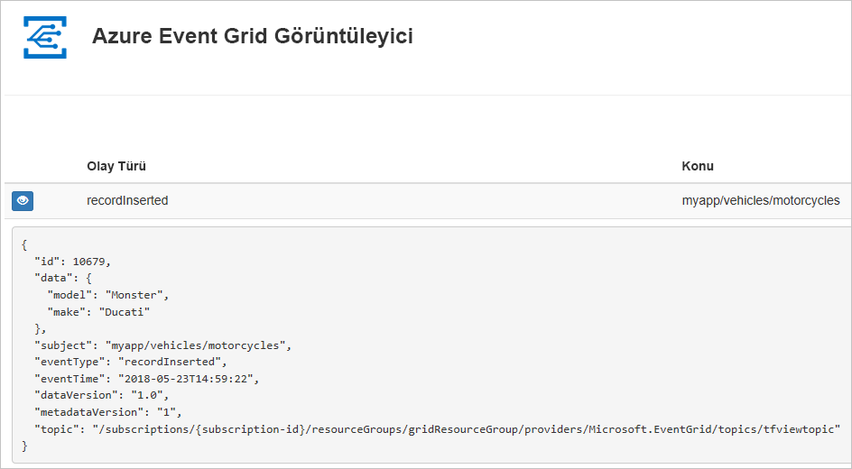
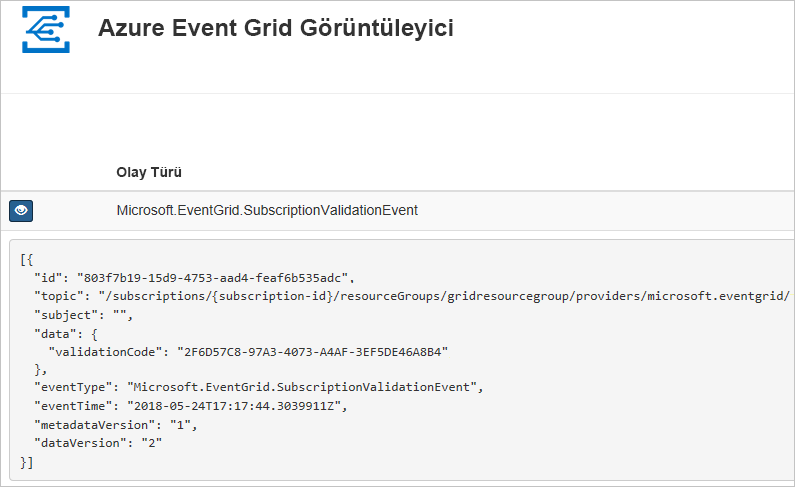

# <a name="quickstart-route-custom-events-to-web-endpoint-with-azure-cli-and-event-grid"></a>Hızlı Başlangıç: Web uç noktasına Azure CLI ve Event Grid ile özel olaylarını yönlendirme

Azure Event Grid, bulut için bir olay oluşturma hizmetidir. Bu makalede Azure CLI ile özel bir konu oluşturacak, bu özel konuya abone olacak ve olayı tetikleyerek sonucu görüntüleyeceksiniz. Normalde olayları, olay verilerini işleyen ve eylemler gerçekleştiren bir uç noktaya gönderirsiniz. Bununla birlikte, bu makaleyi basitleştirmek için olayları iletilerin toplandığı ve görüntülendiği bir web uygulamasına gönderirsiniz.

İşiniz bittiğinde, olay verilerinin web uygulamasına gönderildiğini görürsünüz.



[!INCLUDE [quickstarts-free-trial-note.md](../../includes/quickstarts-free-trial-note.md)]

[!INCLUDE [cloud-shell-try-it.md](../../includes/cloud-shell-try-it.md)]

CLI'yi yerel olarak yükleyip kullanmayı tercih ederseniz bu makale için Azure CLI’nın en son sürümünü (2.0.24 veya sonraki) kullanıyor olmanız gerekir. Sürümü bulmak için `az --version` komutunu çalıştırın. Yükleme veya yükseltme yapmanız gerekiyorsa bkz. [Azure CLI'yı yükleme](/cli/azure/install-azure-cli).

Cloud Shell kullanmıyorsanız önce `az login` kullanarak oturum açmanız gerekir.

## <a name="create-a-resource-group"></a>Kaynak grubu oluşturma

Event Grid konuları Azure kaynaklarıdır ve bir Azure kaynak grubuna yerleştirilmelidir. Kaynak grubu, Azure kaynaklarının dağıtıldığı ve yönetildiği bir mantıksal koleksiyondur.

[az group create](/cli/azure/group#az-group-create) komutuyla bir kaynak grubu oluşturun. 

Aşağıdaki örnek *westus2* konumunda *gridResourceGroup* adlı bir kaynak grubu oluşturur.

```azurecli-interactive
az group create --name gridResourceGroup --location westus2
```

[!INCLUDE [event-grid-register-provider-cli.md](../../includes/event-grid-register-provider-cli.md)]

## <a name="create-a-custom-topic"></a>Özel konu oluşturma

Event grid konusu, olaylarınızı göndereceğiniz kullanıcı tanımlı bir uç nokta sağlar. Aşağıdaki örnekte özel konu, kaynak grubunuzda oluşturulur. `<your-topic-name>` değerini konunuz için benzersiz bir adla değiştirin. Özel konu adı bir DNS girdisinin parçası olduğundan benzersiz olmalıdır. Ayrıca, 3-50 karakter arasında olmalı ve gerekir içeren yalnızca a-z, A-Z, 0-9, değerleri ve "-"

```azurecli-interactive
topicname=<your-topic-name>

az eventgrid topic create --name $topicname -l westus2 -g gridResourceGroup
```

## <a name="create-a-message-endpoint"></a>İleti uç noktası oluşturma

Özel konuya abone olmadan önce, olay iletisi için uç noktayı oluşturalım. Normalde, olay verileri temelinde uç nokta eylemleri gerçekleştirir. Bu hızlı başlangıcı basitleştirmek için, olay iletilerini görüntüleyin bir [önceden oluşturulmuş web uygulaması](https://github.com/Azure-Samples/azure-event-grid-viewer) dağıtırsınız. Dağıtılan çözüm bir App Service planı, App Service web uygulaması ve GitHub'dan kaynak kod içerir.

`<your-site-name>` değerini web uygulamanız için benzersiz bir adla değiştirin. Web uygulaması adı bir DNS girdisinin parçası olduğundan benzersiz olmalıdır.

```azurecli-interactive
sitename=<your-site-name>

az group deployment create \
  --resource-group gridResourceGroup \
  --template-uri "https://raw.githubusercontent.com/Azure-Samples/azure-event-grid-viewer/master/azuredeploy.json" \
  --parameters siteName=$sitename hostingPlanName=viewerhost
```

Dağıtımın tamamlanması birkaç dakika sürebilir. Dağıtım başarıyla gerçekleştirildikten sonra, web uygulamanızı görüntüleyip çalıştığından emin olun. Web tarayıcısında şu adrese gidin: `https://<your-site-name>.azurewebsites.net`

Şu anda iletilerin görüntülenmediği siteyi görüyor olmalısınız.

## <a name="subscribe-to-a-custom-topic"></a>Özel konuya abone olma

Event Grid’e hangi olayları izlemek istediğinizi ve bu olayların nereye gönderileceğini bildirmek için bir Event Grid konusuna abone olursunuz. Aşağıdaki örnek, oluşturduğunuz özel konuya abone olur ve web uygulamanızın URL’sini olay bildirimi için uç nokta olarak geçirir.

Web uygulamanızın uç noktası `/api/updates/` sonekini içermelidir.

```azurecli-interactive
endpoint=https://$sitename.azurewebsites.net/api/updates

az eventgrid event-subscription create \
  -g gridResourceGroup \
  --topic-name $topicname \
  --name demoViewerSub \
  --endpoint $endpoint
```

Web uygulamanızı yeniden görüntüleyin ve buna bir abonelik doğrulama olayının gönderildiğine dikkat edin. Göz simgesini seçerek olay verilerini genişletin. Uç noktanın olay verilerini almak istediğini doğrulayabilmesi için Event Grid doğrulama olayını gönderir. Web uygulaması aboneliği doğrulamak için kod içerir.



## <a name="send-an-event-to-your-custom-topic"></a>Özel konunuza olay gönderme

Event Grid’in iletiyi uç noktanıza nasıl dağıttığını görmek için bir olay tetikleyelim. İlk olarak özel konunun URL’sini ve anahtarını alalım.

```azurecli-interactive
endpoint=$(az eventgrid topic show --name $topicname -g gridResourceGroup --query "endpoint" --output tsv)
key=$(az eventgrid topic key list --name $topicname -g gridResourceGroup --query "key1" --output tsv)
```

Bu makaleyi kolaylaştırmak için özel konuya göndereceğiniz örnek olay verileri sağlanmıştır. Normalde olay verilerini bir uygulama veya Azure hizmeti gönderir. Aşağıdaki örnek, örnek olay verilerini oluşturur:

```azurecli-interactive
event='[ {"id": "'"$RANDOM"'", "eventType": "recordInserted", "subject": "myapp/vehicles/motorcycles", "eventTime": "'`date +%Y-%m-%dT%H:%M:%S%z`'", "data":{ "make": "Ducati", "model": "Monster"},"dataVersion": "1.0"} ]'
```

JSON’un `data` öğesi, olayınızın yüküdür. Bu alana doğru oluşturulmuş herhangi bir JSON gelebilir. Ayrıca, gelişmiş yönlendirme ve filtreleme için konu alanını da kullanabilirsiniz.

CURL, HTTP istekleri gönderen bir yardımcı programdır. Bu makalede, konuya olayı göndermek için CURL kullanın. 

```azurecli-interactive
curl -X POST -H "aeg-sas-key: $key" -d "$event" $endpoint
```

Olayı tetiklediniz ve Event Grid, iletiyi abone olurken yapılandırdığınız uç noktaya gönderdi. Az önce gönderdiğiniz olayı görmek için web uygulamanızı görüntüleyin.

```json
[{
  "id": "1807",
  "eventType": "recordInserted",
  "subject": "myapp/vehicles/motorcycles",
  "eventTime": "2017-08-10T21:03:07+00:00",
  "data": {
    "make": "Ducati",
    "model": "Monster"
  },
  "dataVersion": "1.0",
  "metadataVersion": "1",
  "topic": "/subscriptions/{subscription-id}/resourceGroups/{resource-group}/providers/Microsoft.EventGrid/topics/{topic}"
}]
```

## <a name="clean-up-resources"></a>Kaynakları temizleme
Bu olayla veya olay görüntüleyici uygulamasıyla çalışmaya devam etmeyi planlıyorsanız bu makalede oluşturulan kaynakları temizlemeyin. Aksi takdirde, bu makalede oluşturduğunuz kaynakları silmek için aşağıdaki komutu kullanın.

```azurecli-interactive
az group delete --name gridResourceGroup
```

## <a name="next-steps"></a>Sonraki adımlar

Artık konu oluşturma ve olay aboneliklerini öğrendiğinize göre, Event Grid’in size nasıl yardımcı olabileceği konusunda daha fazla bilgi edinebilirsiniz:

- [Event Grid Hakkında](overview.md)
- [Blob depolama olaylarını bir özel web uç noktasına yönlendirme](../storage/blobs/storage-blob-event-quickstart.md?toc=%2fazure%2fevent-grid%2ftoc.json)
- [Azure Event Grid ve Logic Apps ile sanal makine değişikliklerini izleme](monitor-virtual-machine-changes-event-grid-logic-app.md)
- [Veri ambarına büyük veri akışı yapma](event-grid-event-hubs-integration.md)
