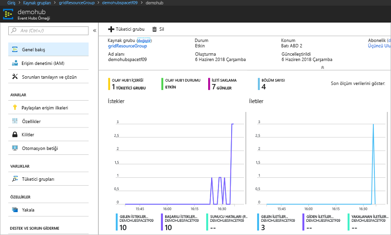

# <a name="quickstart-route-custom-events-to-azure-event-hubs-with-azure-cli-and-event-grid"></a>Hızlı Başlangıç: Azure CLI ve Event Grid ile özel olayları Azure Event Hubs’a yönlendirme

Azure Event Grid, bulut için bir olay oluşturma hizmetidir. Azure Event Hubs, desteklenen olay işleyicilerinden biridir. Bu makalede Azure CLI ile özel bir konu oluşturacak, bu özel konuya abone olacak ve olayı tetikleyerek sonucu görüntüleyeceksiniz. Bir Event Hub’a olaylar gönderirsiniz.

[!INCLUDE [quickstarts-free-trial-note.md](../../includes/quickstarts-free-trial-note.md)]

## <a name="create-a-resource-group"></a>Kaynak grubu oluşturma

Event Grid konuları Azure kaynaklarıdır ve bir Azure kaynak grubuna yerleştirilmelidir. Kaynak grubu, Azure kaynaklarının dağıtıldığı ve yönetildiği bir mantıksal koleksiyondur.

[az group create](/cli/azure/group#az-group-create) komutuyla bir kaynak grubu oluşturun. 

Aşağıdaki örnek *westus2* konumunda *gridResourceGroup* adlı bir kaynak grubu oluşturur.

```azurecli-interactive
az group create --name gridResourceGroup --location westus2
```

[!INCLUDE [event-grid-register-provider-cli.md](../../includes/event-grid-register-provider-cli.md)]

## <a name="create-a-custom-topic"></a>Özel Konu Oluşturma

Event grid konusu, olaylarınızı göndereceğiniz kullanıcı tanımlı bir uç nokta sağlar. Aşağıdaki örnekte özel konu, kaynak grubunuzda oluşturulur. `<your-topic-name>` değerini özel konunuz için benzersiz bir adla değiştirin. DNS girdisi ile temsil edildiğinden özel konu adı benzersiz olmalıdır.

```azurecli-interactive
topicname=<your-topic-name>
az eventgrid topic create --name $topicname -l westus2 -g gridResourceGroup
```

## <a name="create-event-hub"></a>Olay hub'ı oluşturma

Özel konuya abone olmadan önce, olay iletisi için uç noktayı oluşturalım. Olayları toplamak için bir event hub oluşturun.

```azurecli-interactive
namespace=<unique-namespace-name>
hubname=demohub

az eventhubs namespace create --name $namespace --resource-group gridResourceGroup
az eventhubs eventhub create --name $hubname --namespace-name $namespace --resource-group gridResourceGroup
```

## <a name="subscribe-to-a-custom-topic"></a>Özel konuya abone olma

Event Grid’e hangi olayları izlemek istediğinizi bildirmek için bir Event Grid konusuna abone olursunuz. Aşağıdaki örnek oluşturduğunuz özel konuya abone olur ve uç noktaya olay hub'ının kaynak kimliğini iletir. Uç nokta şu biçimdedir:

`/subscriptions/<subscription-id>/resourceGroups/<resource-group-name>/providers/Microsoft.EventHub/namespaces/<namespace-name>/eventhubs/<hub-name>`

Aşağıdaki betik, event hub için kaynak kimliğini alır ve bir event grid konusuna abone olur. Uç nokta türünü `eventhub` olarak ayarlar ve uç nokta için event hub kimliğini kullanır.

```azurecli-interactive
hubid=$(az eventhubs eventhub show --name $hubname --namespace-name $namespace --resource-group gridResourceGroup --query id --output tsv)

az eventgrid event-subscription create \
  --topic-name $topicname \
  -g gridResourceGroup \
  --name subtoeventhub \
  --endpoint-type eventhub \
  --endpoint $hubid
```

Olay aboneliğini oluşturan hesabın olay hub'ında yazma erişimine sahip olması gerekir.

## <a name="send-an-event-to-your-custom-topic"></a>Özel konunuza olay gönderme

Event Grid’in iletiyi uç noktanıza nasıl dağıttığını görmek için bir olay tetikleyelim. İlk olarak özel konunun URL’sini ve anahtarını alalım.

```azurecli-interactive
endpoint=$(az eventgrid topic show --name $topicname -g gridResourceGroup --query "endpoint" --output tsv)
key=$(az eventgrid topic key list --name $topicname -g gridResourceGroup --query "key1" --output tsv)
```

Bu makaleyi kolaylaştırmak için özel konuya göndereceğiniz örnek olay verileri sağlanmıştır. Normalde olay verilerini bir uygulama veya Azure hizmeti gönderir. CURL, HTTP istekleri gönderen bir yardımcı programdır. Bu makalede, özel konuya bir olay göndermek için CURL kullanın.  Aşağıdaki örnek, event grid konusuna üç olay gönderir:

```azurecli-interactive
for i in 1 2 3
do
   event='[ {"id": "'"$RANDOM"'", "eventType": "recordInserted", "subject": "myapp/vehicles/motorcycles", "eventTime": "'`date +%Y-%m-%dT%H:%M:%S%z`'", "data":{ "make": "Ducati", "model": "Monster"},"dataVersion": "1.0"} ]'
   curl -X POST -H "aeg-sas-key: $key" -d "$event" $endpoint
done
```

Portalda event hub’a gidin ve Event Grid’in bu üç olayı event hub’a gönderdiğine dikkat edin.



Genellikle, event hub’dan olayları alan bir uygulama oluşturursunuz. Event hub’dan iletileri alan bir uygulama oluşturmak için bkz:

* [.NET Standard’da Olay İşlemcisi Ana Bilgisayarı ile iletiler almaya başlama](../event-hubs/event-hubs-dotnet-standard-getstarted-receive-eph.md)
* [Java kullanarak Azure Event Hubs’dan olayları alma](../event-hubs/event-hubs-java-get-started-receive-eph.md)
* [Apache Storm kullanarak Event Hubs’dan olayları alma](../event-hubs/event-hubs-storm-getstarted-receive.md)

## <a name="clean-up-resources"></a>Kaynakları temizleme
Bu olayla çalışmaya devam etmeyi planlıyorsanız bu makalede oluşturulan kaynakları temizlemeyin. Aksi takdirde, bu makalede oluşturduğunuz kaynakları silmek için aşağıdaki komutu kullanın.

```azurecli-interactive
az group delete --name gridResourceGroup
```

## <a name="next-steps"></a>Sonraki adımlar

Artık konu oluşturma ve olay aboneliklerini öğrendiğinize göre, Event Grid’in size nasıl yardımcı olabileceği konusunda daha fazla bilgi edinebilirsiniz:

- [Event Grid Hakkında](overview.md)
- [Blob depolama olaylarını bir özel web uç noktasına yönlendirme](../storage/blobs/storage-blob-event-quickstart.md?toc=%2fazure%2fevent-grid%2ftoc.json)
- [Azure Event Grid ve Logic Apps ile sanal makine değişikliklerini izleme](monitor-virtual-machine-changes-event-grid-logic-app.md)
- [Veri ambarına büyük veri akışı yapma](event-grid-event-hubs-integration.md)
