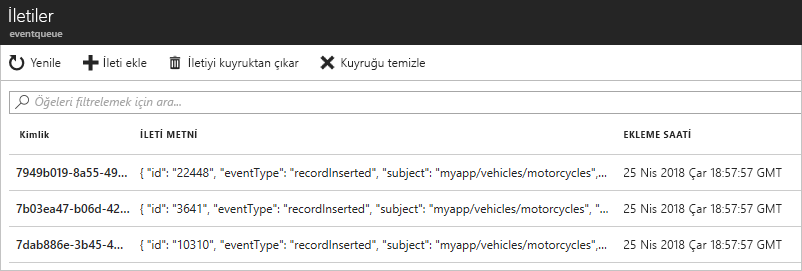

# <a name="quickstart-route-custom-events-to-azure-queue-storage-with-azure-cli-and-event-grid"></a>Hızlı Başlangıç: Azure CLI ve Event Grid ile özel olayları Azure Kuyruk depolamaya yönlendirme

Azure Event Grid, bulut için bir olay oluşturma hizmetidir. Azure Kuyruk depolama, desteklenen olay işleyicilerinden biridir. Bu makalede Azure CLI ile özel bir konu oluşturacak, bu özel konuya abone olacak ve olayı tetikleyerek sonucu görüntüleyeceksiniz. Kuyruk depolamaya olayları gönderirsiniz.

[!INCLUDE [quickstarts-free-trial-note.md](../../includes/quickstarts-free-trial-note.md)]

[!INCLUDE [cloud-shell-try-it.md](../../includes/cloud-shell-try-it.md)]

Azure portalında Cloud Shell kullanmak yerine, yerel makinenizde Azure CLI veya Azure PowerShell kullanıyorsanız, Azure CLI ve Azure PowerShell'ın şu sürümleri olduğundan emin olun. 

- Azure CLI Sürüm 2.0.56 veya büyük. Azure CLI'ın en son sürümü yükleme hakkında yönergeler için bkz. [Azure CLI'yı yükleme](/cli/azure/install-azure-cli). 
- Azure PowerShell sürüm 1.1.0 veya büyük. Windows makinenizde Azure PowerShell'in en son sürümünde indirme [Azure indirmeleri - komut satırı araçları](https://azure.microsoft.com/downloads/). 

Bu makalede, Azure CLI kullanmak için komutlar sağlar. 

## <a name="create-a-resource-group"></a>Kaynak grubu oluşturun

Event Grid konuları Azure kaynaklarıdır ve bir Azure kaynak grubuna yerleştirilmelidir. Kaynak grubu, Azure kaynaklarının dağıtıldığı ve yönetildiği bir mantıksal koleksiyondur.

[az group create](/cli/azure/group#az-group-create) komutuyla bir kaynak grubu oluşturun. 

Aşağıdaki örnek *westus2* konumunda *gridResourceGroup* adlı bir kaynak grubu oluşturur.

```azurecli-interactive
az group create --name gridResourceGroup --location westus2
```

[!INCLUDE [event-grid-register-provider-cli.md](../../includes/event-grid-register-provider-cli.md)]

## <a name="create-a-custom-topic"></a>Özel konu oluşturma

Event grid konusu, olaylarınızı göndereceğiniz kullanıcı tanımlı bir uç nokta sağlar. Aşağıdaki örnekte özel konu, kaynak grubunuzda oluşturulur. `<topic_name>` değerini özel konunuz için benzersiz bir adla değiştirin. Bir DNS girişi ile temsil edildiğinden Event Grid konusunun adı benzersiz olmalıdır.

```azurecli-interactive
az eventgrid topic create --name <topic_name> -l westus2 -g gridResourceGroup
```

## <a name="create-queue-storage"></a>Kuyruk depolama oluşturma

Özel konuya abone olmadan önce, olay iletisi için uç noktayı oluşturalım. Olayları toplamak için bir Kuyruk depolama oluşturun.

```azurecli-interactive
storagename="<unique-storage-name>"
queuename="eventqueue"

az storage account create -n $storagename -g gridResourceGroup -l westus2 --sku Standard_LRS
az storage queue create --name $queuename --account-name $storagename
```

## <a name="subscribe-to-a-custom-topic"></a>Özel konuya abone olma

Event Grid’e hangi olayları izlemek istediğinizi bildirmek için bir özel konuya abone olursunuz. Aşağıdaki örnek oluşturduğunuz özel konuya abone olur ve uç nokta Kuyruk depolama kaynak kimliğini iletir. Azure CLI ile uç nokta olarak Kuyruk depolama kimliğini geçirirsiniz. Uç nokta şu biçimdedir:

`/subscriptions/<subscription-id>/resourcegroups/<resource-group-name>/providers/Microsoft.Storage/storageAccounts/<storage-name>/queueservices/default/queues/<queue-name>`

Aşağıdaki betik, kuyruk için depolama hesabının kaynak kimliğini alır. Kuyruk depolama için kimliği oluşturur ve bir event grid konusuna abone olur. Uç nokta türünü `storagequeue` olarak ayarlar ve uç nokta için kuyruk kimliğini kullanır.

```azurecli-interactive
storageid=$(az storage account show --name $storagename --resource-group gridResourceGroup --query id --output tsv)
queueid="$storageid/queueservices/default/queues/$queuename"
topicid=$(az eventgrid topic show --name <topic_name> -g gridResourceGroup --query id --output tsv)

az eventgrid event-subscription create \
  --source-resource-id $topicid \
  --name <event_subscription_name> \
  --endpoint-type storagequeue \
  --endpoint $queueid \
  --expiration-date "<yyyy-mm-dd>"
```

Olay aboneliğini oluşturan hesabın kuyruk depolamada yazma erişimine sahip olması gerekir. Abonelik için bir [sona erme tarihi](concepts.md#event-subscription-expiration) belirlendiğine dikkat edin.

Aboneliği REST API kullanarak oluşturursanız depolama hesabının kimliğini ve kuyruğun adını ayrı birer parametre olarak geçirirsiniz.

```json
"destination": {
  "endpointType": "storagequeue",
  "properties": {
    "queueName":"eventqueue",
    "resourceId": "/subscriptions/<subscription-id>/resourcegroups/<resource-group-name>/providers/Microsoft.Storage/storageAccounts/<storage-name>"
  }
  ...
```

## <a name="send-an-event-to-your-custom-topic"></a>Özel konunuza olay gönderme

Event Grid’in iletiyi uç noktanıza nasıl dağıttığını görmek için bir olay tetikleyelim. İlk olarak özel konunun URL’sini ve anahtarını alalım. Burada da `<topic_name>` yerine özel konunuzun adını yazın.

```azurecli-interactive
endpoint=$(az eventgrid topic show --name <topic_name> -g gridResourceGroup --query "endpoint" --output tsv)
key=$(az eventgrid topic key list --name <topic_name> -g gridResourceGroup --query "key1" --output tsv)
```

Bu makaleyi kolaylaştırmak için özel konuya göndereceğiniz örnek olay verileri sağlanmıştır. Normalde olay verilerini bir uygulama veya Azure hizmeti gönderir. CURL, HTTP istekleri gönderen bir yardımcı programdır. Bu makalede, özel konuya bir olay göndermek için CURL kullanın.  Aşağıdaki örnek, event grid konusuna üç olay gönderir:

```azurecli-interactive
for i in 1 2 3
do
   event='[ {"id": "'"$RANDOM"'", "eventType": "recordInserted", "subject": "myapp/vehicles/motorcycles", "eventTime": "'`date +%Y-%m-%dT%H:%M:%S%z`'", "data":{ "make": "Ducati", "model": "Monster"},"dataVersion": "1.0"} ]'
   curl -X POST -H "aeg-sas-key: $key" -d "$event" $endpoint
done
```

Portalda Kuyruk depolamaya gidin ve Event Grid’in bu üç olayı kuyruğa gönderdiğine dikkat edin.




## <a name="clean-up-resources"></a>Kaynakları temizleme
Bu olayla çalışmaya devam etmeyi planlıyorsanız bu makalede oluşturulan kaynakları temizlemeyin. Aksi takdirde, bu makalede oluşturduğunuz kaynakları silmek için aşağıdaki komutu kullanın.

```azurecli-interactive
az group delete --name gridResourceGroup
```

## <a name="next-steps"></a>Sonraki adımlar

Artık konu oluşturma ve olay aboneliklerini öğrendiğinize göre, Event Grid’in size nasıl yardımcı olabileceği konusunda daha fazla bilgi edinebilirsiniz:

- [Event Grid Hakkında](overview.md)
- [Blob depolama olaylarını bir özel web uç noktasına yönlendirme](../storage/blobs/storage-blob-event-quickstart.md?toc=%2fazure%2fevent-grid%2ftoc.json)
- [Azure Event Grid ve Logic Apps ile sanal makine değişikliklerini izleme](monitor-virtual-machine-changes-event-grid-logic-app.md)
- [Veri ambarına büyük veri akışı yapma](event-grid-event-hubs-integration.md)
