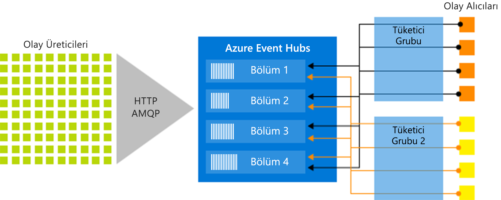

# Azure Event Hubs - Büyük veri akışı platformu ve olay alımı hizmeti
Azure Event Hubs, büyük bir veri akışı platformu ve olay alma hizmetidir. Bu bildirimleri alabilen ve saniye başına milyonlarca olayı işleme. Bir olay hub’ına gönderilen veriler, herhangi bir gerçek zamanlı analiz sağlayıcısı ve işlem grubu oluşturma/depolama bağdaştırıcıları kullanılarak dönüştürülüp depolanabilir.

Aşağıdaki senaryolarda, Event Hubs kullanabileceğiniz senaryolardan bazıları şunlardır:

- Anomali algılama (sahte/aykırı değer)
- Uygulama günlüğü
- Tıklama dizileri gibi analiz işlem hatları
- Canlı pano oluşturma
- Veri arşivleme
- İşlem gerçekleştirme
- Kullanıcı telemetrisi işleme
- Cihaz telemetrisi akışı 

## Event Hubs’ı neden kullanmalıyım?

Veriler ancak kolay bir şekilde işlenebildiğinde ve veri kaynaklarından tam zamanında içgörüler alındığında değerlidir. Event Hubs, düşük gecikme süresi ve veri ve Analiz Hizmetleri içindeki ve dışındaki tüm büyük veri işlem hattınızı oluşturma-Azure ile sorunsuz tümleştirme ile dağıtılmış bir akış işleme platformu sağlar.

Event Hubs bir olay işlem hattı için "ön kapı" görevi yapar ve çözüm mimarilerinde genelde *olay alıcı* olarak adlandırılır. Olay yutucu, bir olay akışının üretimini ilgili olayların kullanılmasına ayıran, olay yayımcıları ile olay tüketicileri arasında duran bir bileşen veya hizmettir. Event Hubs olay tüketicileri olay üreticilerden ayırma süresi bekletme arabelleği ile birleştirilmiş bir akış platformu sağlar. 

Aşağıdaki bölümlerde Azure Event Hubs hizmetinin temel özellikleri anlatılmaktadır: 

## Tam olarak yönetilen PaaS 

Event Hubs, bir tam olarak yönetilen platformu-bir hizmet olarak (PaaS) az yapılandırma veya yönetim yükü ile işletme çözümlerinizi odaklanın. [Apache Kafka ekosistemleri için Event Hubs](event-hubs-for-kafka-ecosystem-overview.md), kümelerinizi yönetmeye, yapılandırmaya veya çalıştırmaya gerek kalmadan PaaS Kafka deneyimi sunar.

## Gerçek zamanlı ve toplu işlem desteği

Eyleme dönüştürülebilir içgörüler elde etmek için akışınızı gerçek zamanlı olarak ekleyin, arabelleğe alın, depolayın ve işleyin. Event Hubs kullanan bir [bölümlenmiş tüketici modelinin](event-hubs-features.md#partitions), aynı anda birden çok uygulama için işlem akış etkinleştirme ve işleme hızını denetlemenize izin vererek.

[Yakalama](event-hubs-capture-overview.md) verilerinizi neredeyse gerçek zamanlı bir [Azure Blob Depolama](https://azure.microsoft.com/services/storage/blobs/) veya [Azure Data Lake Storage](https://azure.microsoft.com/services/data-lake-store/) uzun süreli saklama veya mikro toplu işleme için. Gerçek zamanlı analiz türetmek için kullandığınız aynı akışta bu davranışı elde edebilirsiniz. Olay verilerini yakalama ayarı hızlıdır. Çalıştırmak için hiçbir yönetim maliyeti yoktur ve Event Hubs ile otomatik olarak ölçeklenen [üretilen iş birimleri](event-hubs-features.md#throughput-units). Olay hub'ları olanak odak veri yakalama yerine veri işleme.

Azure Event Hubs, sunucusuz mimari için [Azure İşlevleri](/azure/azure-functions/) ile de tümleştirilebilir.

## Ölçeklenebilir 

Event Hubs ile megabayt boyutunda veri akışlarıyla başlayıp gigabayt veya terabayt boyutlarına ulaşabilirsiniz. [Otomatik şişme](event-hubs-auto-inflate.md) özelliği, aktarım hızı birimlerini kullanım ihtiyaçlarınıza göre ölçeklendirmek için kullanabileceğiniz birçok özellikten bir tanesidir. 

## Zengin ekosistem

[Event Hubs için Apache Kafka ekosistemlerini](event-hubs-for-kafka-ecosystem-overview.md) sağlayan [Apache Kafka (1.0 ve üzeri)](https://kafka.apache.org/) istemciler ve uygulamalar için Event Hubs bahsedeceğiz. Ayarlamak, yapılandırmak ve kendi Kafka kümelerini yönetme gerekmez.
 
Çeşitli [dillerde (.NET, Java, Python, Go, Node.js)](https://github.com/Azure/azure-event-hubs) kullanılabilen geniş ekosistem sayesinde akışlarınızı Event Hubs'dan işlemeye kolayca başlayabilirsiniz. Desteklenen tüm istemci dilleri, düşük düzeyde tümleştirme sağlar. Bir ekosistem, ayrıca, Azure Stream Analytics ve Azure işlevleri gibi Azure Hizmetleri ile sorunsuz tümleştirme sağlar ve bu nedenle, sunucusuz mimariler oluşturmanızı sağlar.

## Temel mimari bileşenler
Event Hubs şu [temel bileşenleri](event-hubs-features.md) içerir:

- **Olay üreticilerinden**: Olay hub'ına veri gönderen herhangi bir varlık. Olay yayımcıları HTTPS, AMQP 1.0 veya Apache Kafka (1.0 ve üzeri) kullanarak olayları yayımlayabilir
- **Bölümler**: Her tüketici, yalnızca belirli alt ya da ileti akışı bölümü okur.
- **Tüketici grupları**: Bir görünümüdür (durum, konum veya uzaklık) tüm olay hub'ı. Tüketici grupları etkinleştir tüketen uygulamayı her olay akışının ayrı bir görünümüne sahip. Bağımsız olarak kendi hızlarında ve kendi uzaklıkları ile akış okurlar.
- **Üretilen iş birimleri**: Event hubs işleme kapasitesi denetleyen önceden satın alınan kapasite birimleridir.
- **Olay alıcıları**: Bir olay hub'ından olay verilerini okuyan herhangi bir varlık. Tüm Event Hubs tüketicileri AMQP 1.0 oturumu üzerinden bağlanır. Event Hubs hizmeti kullanıma sunuldukça oturumu aracılığıyla olayları sağlar. Tüm Kafka tüketicileri Kafka protokol 1.0 ve üzeri ile bağlanır.

Aşağıdaki şekilde Event Hubs akış işleme mimarisi gösterilmektedir:

## Sonraki adımlar

Event Hubs ile çalışmaya başlamak için bkz: **olayları alıp göndermek** öğreticiler: 

- [.NET Core](event-hubs-dotnet-standard-getstarted-send.md)
- [.NET Framework](event-hubs-dotnet-framework-getstarted-send.md)
- [Java](event-hubs-java-get-started-send.md)
- [Python](event-hubs-python-get-started-send.md)
- [Node.js](event-hubs-node-get-started-send.md)
- [Go](event-hubs-go-get-started-send.md)
- [C (yalnızca gönderme)](event-hubs-c-getstarted-send.md)
- [Apache Storm (yalnızca alma)](event-hubs-storm-getstarted-receive.md)

Event Hubs hakkında daha fazla bilgi edinmek için şu makalelere göz atın:

- [Event Hubs özelliklerine genel bakış](event-hubs-features.md)
- [Sık sorulan sorular](event-hubs-faq.md).

