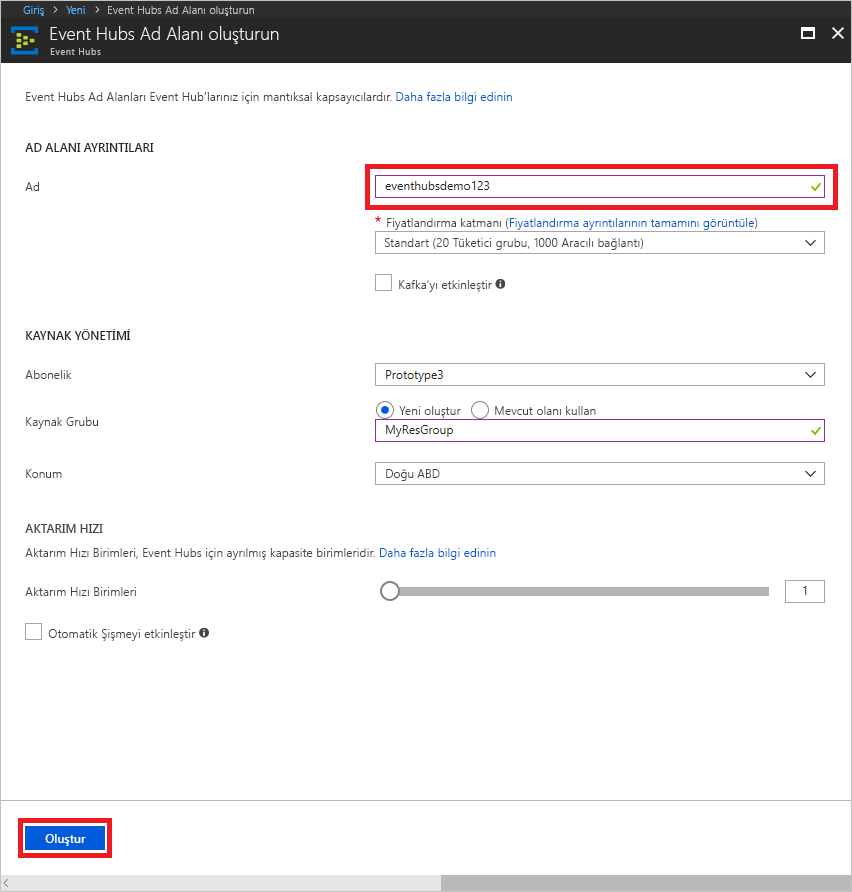

# Bir olay hub'ları ad alanı ve Azure portalını kullanarak bir event hub oluşturma

## Bir olay hub'ları ad alanı oluşturma
1. Oturum [Azure portal][Azure portal], tıklatıp **kaynak oluşturma** en üst ekranın sol.
1. Tıklatın **nesnelerin interneti**ve ardından **olay hub'ları**.
   
    
1. İçinde **ad alanı oluşturma**, bir ad alanı adı girin. Adın kullanılabilirliği sistem tarafından hemen denetlenir.
   
    
1. Ad alanı adının kullanılabilir durumda olduğundan emin olduktan sonra fiyatlandırma katmanını (Temel veya Standart) seçin. Ayrıca, bir Azure aboneliği, kaynak grubu ve kaynağın oluşturulacağı konumu seçin. 
1. Ad alanını oluşturmak için **Oluştur**’a tıklayın. Tam olarak kaynakları sağlamak üzere sistem için bir kaç dakika beklemeniz gerekebilir.
2. Ad alanları portal listesinde yeni oluşturulan ad alanına tıklayın.
2. Tıklatın **paylaşılan erişim ilkeleri**ve ardından **RootManageSharedAccessKey**.
    
    

3. **RootManageSharedAccessKey** bağlantı dizesini panoya kopyalamak için kopyala düğmesine tıklayın. Bu bağlantı dizesi daha sonra kullanmak üzere not defteri gibi geçici bir konuma kaydedin.
    
    

## Olay hub’ı oluşturma

1. Olay hub'ları ad listesinde yeni oluşturulan ad alanına tıklayın.      
   
     

2. Ad alanı dikey penceresinde **Event Hubs**’a tıklayın.
   
    

1. Dikey pencerenin en üstündeki **Olay Hub’ı Ekle** seçeneğine tıklayın.
   
    
1. Olay hub'ınız için bir ad yazın ve ardından **oluşturma**.
   
    

Olay hub'ınız şimdi oluşturulur ve olayları alıp göndermek için gereken bağlantı dizelerine sahipsiniz.

## Sonraki adımlar
Event Hubs hakkında daha fazla bilgi için aşağıdaki bağlantıları ziyaret edin:

* [Event Hubs’a genel bakış](event-hubs-what-is-event-hubs.md)
* [Event Hubs API’sine genel bakış](event-hubs-api-overview.md)

[Azure portal]: https://portal.azure.com/