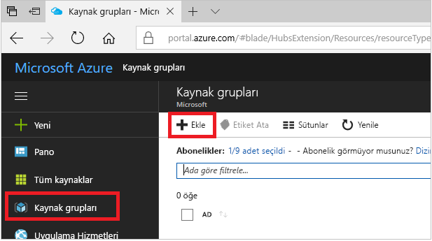
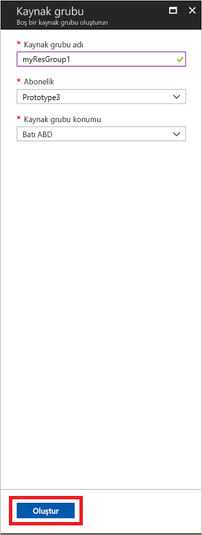
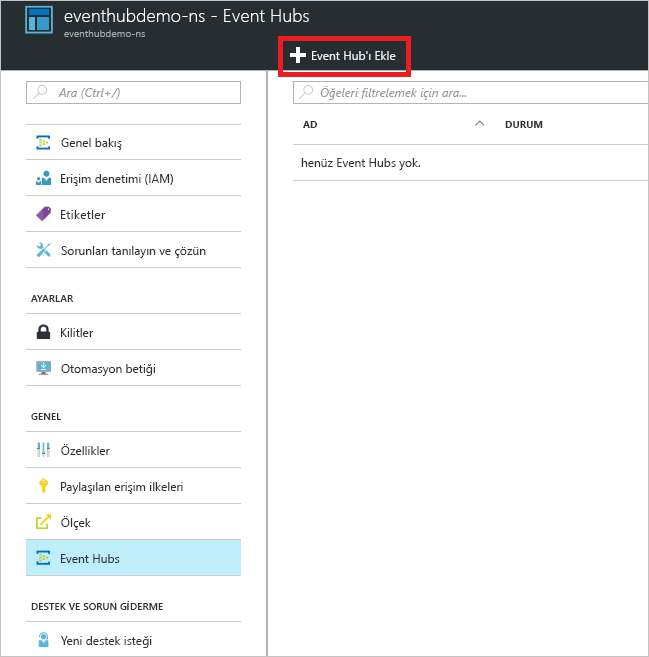
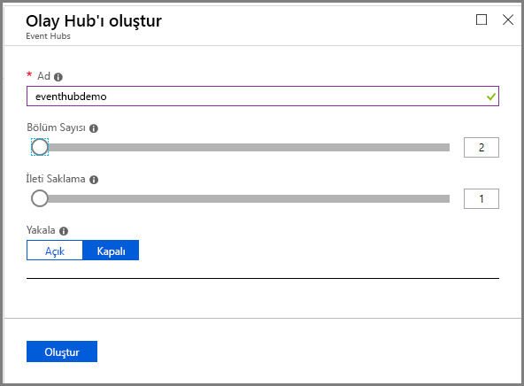

# Hızlı Başlangıç: Azure portalını kullanarak bir olay hub'ı oluşturma
Azure Event Hubs saniyede milyonlarca olay alıp işleme kapasitesine sahip olan bir Büyük Veri akış platformu ve olay alma hizmetidir. Event Hubs dağıtılan yazılımlar ve cihazlar tarafından oluşturulan olayları, verileri ve telemetrileri işleyebilir ve depolayabilir. Bir olay hub’ına gönderilen veriler, herhangi bir gerçek zamanlı analiz sağlayıcısı ve işlem grubu oluşturma/depolama bağdaştırıcıları kullanılarak dönüştürülüp depolanabilir. Olay Hub’larının ayrıntılı genel bakışı için bkz. [Olay Hub’larına genel bakış](event-hubs-about.md) ve [Olay Hub’ları özellikleri](event-hubs-features.md).

Bu hızlı başlangıçta [Azure portalı](https://portal.azure.com) kullanarak olay hub'ı oluşturacaksınız.

## Önkoşullar

Bu hızlı başlangıcı tamamlamak için aşağıdakileri yaptığınızdan emin olun:

- Azure aboneliği. Aboneliğiniz yoksa başlamadan önce [ücretsiz bir hesap oluşturun](https://azure.microsoft.com/free/).
- [Visual Studio 2019)](https://www.visualstudio.com/vs) veya üzeri.
- [.NET Standard SDK'sı](https://www.microsoft.com/net/download/windows), sürüm 2.0 veya üzeri.

## Kaynak grubu oluşturun

Kaynak grubu, Azure kaynakları için mantıksal bir koleksiyondur. Tüm kaynaklar bir kaynak grubuna dağıtılır ve buradan yönetilir. Bir kaynak grubu oluşturmak için:

1. [Azure Portal](https://portal.azure.com) oturum açın.
2. Soldaki menüden **Kaynak grupları**'na tıklayın. Daha sonra **Ekle**'ye tıklayın.

   

2. İçin **abonelik**, kaynak grubu oluşturmak istediğiniz Azure aboneliğini seçin.
3. Benzersiz bir türü **kaynak grubu adı**. Sistem, adın seçili Azure aboneliğinde var olup olmadığını kontrol eder.
4. Seçin bir **bölge** kaynak grubu için.
5. Seçin **gözden geçir + Oluştur**.

   
6. Üzerinde **gözden geçir + Oluştur** sayfasında **Oluştur**. 

## Event Hubs ad alanı oluşturma

Event Hubs ad alanı, tam etki alanı adının başvurduğu, içinde bir veya daha fazla olay hub'ı oluşturduğunuz benzersiz bir kapsam kapsayıcısı sağlar. Portalı kullanarak kaynak grubunuzda bir ad alanı oluşturmak için aşağıdaki eylemleri gerçekleştirin:

1. Azure portalda ekranın sol üst köşesindeki **Kaynak oluştur**'a tıklayın.
2. Seçin **tüm hizmetleri** seçin ve soldaki menüden **yıldız (`*`)** yanındaki **Event Hubs** içinde **Analytics** kategorisi. Onaylayın **Event Hubs** eklenir **Sık Kullanılanlar** sol gezinti menüsünde. 
    
   
3. Seçin **Event Hubs** altında **Sık Kullanılanlar** sol gezinti menüsünde, seçip **Ekle** araç.

   
4. Üzerinde **ad alanı oluşturma** sayfasında, aşağıdaki adımları uygulayın:
    1. Ad alanı için bir ad girin. Adın kullanılabilirliği sistem tarafından hemen denetlenir.
    2. Fiyatlandırma katmanını (temel veya standart) seçin.
    3. Seçin **abonelik** ad alanı oluşturmak istediğiniz.
    4. Seçin bir **konumu** ad alanı.
    5. **Oluştur**’u seçin. Sistemin kaynakları tam olarak sağlaması için birkaç dakika beklemeniz gerekebilir.

       
5. Yenileme **Event Hubs** olay hub'ı ad alanını görmek için sayfayı. Uyarılar, olay hub'ı oluşturma durumunu kontrol edebilirsiniz. 

    
6. Ad alanını seçin. Giriş sayfasını görürsünüz, **Event Hubs ad alanı** portalında. 

   
    
## Olay hub’ı oluşturma

Ad alanında bir olay hub'ı oluşturmak için aşağıdaki eylemleri gerçekleştirin:

1. Olay hub'ları Namespace sayfasında **Event Hubs** soldaki menüde.
1. Pencerenin en üstündeki **+ Olay Hub’ı** seçeneğine tıklayın.
   
    
1. Olay hub'ınız için bir ad yazın, ardından **Oluştur**’a tıklayın.
   
    
4. Uyarılar, olay hub'ı oluşturma durumunu kontrol edebilirsiniz. Olay hub'ı oluşturulduktan sonra bu olay hub'ları listesinde aşağıdaki görüntüde gösterildiği gibi görürsünüz:

    

Tebrikler! Portalı kullanarak bir Event Hubs ad alanı ve bu ad alanının içinde bir olay hub'ı oluşturdunuz. 

## Sonraki adımlar

Bu makalede bir kaynak grubu, bir Event Hubs ad alanı ve bir olay hub'ı oluşturdunuz. Olayları gönderme (veya) bir olay hub'ından olay alma hakkında adım adım yönergeler için bkz **olayları alıp göndermek** öğreticiler: 

- [.NET Core](event-hubs-dotnet-standard-getstarted-send.md)
- [.NET Framework](event-hubs-dotnet-framework-getstarted-send.md)
- [Java](event-hubs-java-get-started-send.md)
- [Python](event-hubs-python-get-started-send.md)
- [Node.js](event-hubs-node-get-started-send.md)
- [Go](event-hubs-go-get-started-send.md)
- [C (yalnızca gönderme)](event-hubs-c-getstarted-send.md)
- [Apache Storm (yalnızca reecive)](event-hubs-storm-getstarted-receive.md)

[Azure portal]: https://portal.azure.com/
[3]: ./media/event-hubs-quickstart-portal/sender1.png
[4]: ./media/event-hubs-quickstart-portal/receiver1.png
