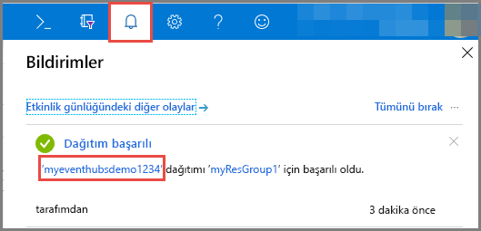
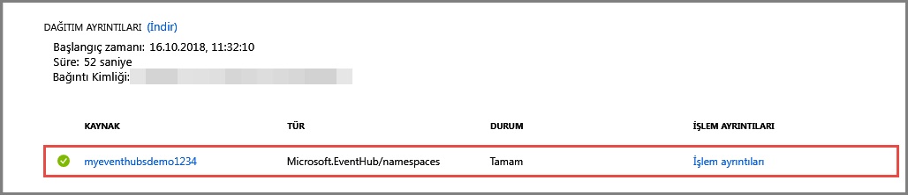

# Hızlı başlangıç: Azure portalı kullanarak olay hub'ı oluşturma
Azure Event Hubs saniyede milyonlarca olay alıp işleme kapasitesine sahip olan bir Büyük Veri akış platformu ve olay alma hizmetidir. Event Hubs dağıtılan yazılımlar ve cihazlar tarafından oluşturulan olayları, verileri ve telemetrileri işleyebilir ve depolayabilir. Bir olay hub’ına gönderilen veriler, herhangi bir gerçek zamanlı analiz sağlayıcısı ve işlem grubu oluşturma/depolama bağdaştırıcıları kullanılarak dönüştürülüp depolanabilir. Olay Hub’larının ayrıntılı genel bakışı için bkz. [Olay Hub’larına genel bakış](event-hubs-about.md) ve [Olay Hub’ları özellikleri](event-hubs-features.md).

Bu hızlı başlangıçta [Azure portalı](https://portal.azure.com) kullanarak olay hub'ı oluşturacaksınız.

## Önkoşullar

Bu hızlı başlangıcı tamamlamak için aşağıdakileri yaptığınızdan emin olun:

- Azure aboneliği. Aboneliğiniz yoksa başlamadan önce [ücretsiz bir hesap oluşturun](https://azure.microsoft.com/free/).
- [Visual Studio 2017 Güncelleştirme 3 (sürüm 15.3, 26730.01)](https://www.visualstudio.com/vs) veya sonraki sürümler.
- [.NET Standard SDK'sı](https://www.microsoft.com/net/download/windows), sürüm 2.0 veya üzeri.

## Kaynak grubu oluşturma

Kaynak grubu, Azure kaynakları için mantıksal bir koleksiyondur. Tüm kaynaklar bir kaynak grubuna dağıtılır ve buradan yönetilir. Kaynak grubu oluşturmak için aşağıdakileri yapın:

1. [Azure Portal](https://portal.azure.com) oturum açın.
2. Soldaki menüden **Kaynak grupları**'na tıklayın. Daha sonra **Ekle**'ye tıklayın.

   

2. Kaynak grubu için benzersiz bir ad yazın. Sistem, adın seçili Azure aboneliğinde var olup olmadığını kontrol eder.

3. **Abonelik** bölümünde kaynak grubunu oluşturmak istediğiniz Azure aboneliğinin adına tıklayın.

4. Kaynak grubu için bir coğrafi konum seçin.

5. **Oluştur**’a tıklayın.

   

## Event Hubs ad alanı oluşturma

Event Hubs ad alanı, tam etki alanı adının başvurduğu, içinde bir veya daha fazla olay hub'ı oluşturduğunuz benzersiz bir kapsam kapsayıcısı sağlar. Portalı kullanarak kaynak grubunuzda bir ad alanı oluşturmak için aşağıdaki eylemleri gerçekleştirin:

1. Azure portalda ekranın sol üst köşesindeki **Kaynak oluştur**'a tıklayın.

2. **Nesnelerin İnterneti**’ne ve ardından **Event Hubs**’a tıklayın.

3. **Ad alanı oluştur** bölümüne bir ad alanı adı girin. Adın kullanılabilirliği sistem tarafından hemen denetlenir.

   

4. Ad alanı adının kullanılabilir durumda olduğundan emin olduktan sonra fiyatlandırma katmanını (Temel veya Standart) seçin. Ayrıca, bir Azure aboneliği, kaynak grubu ve kaynağın oluşturulacağı konumu seçin.
 
5. Ad alanını oluşturmak için **Oluştur**’a tıklayın. Sistemin kaynakları tam olarak sağlaması için birkaç dakika beklemeniz gerekebilir.
6. **Uyarılar**'ı ve ardından olay hub'ı ad alanıyla aynı ada sahip olan **dağıtımı** seçin. 

   
6. Dağıtımda oluşturulan kaynakların listesinden olay hub'ı ad alanınızı seçin. 

   
7. **Event Hubs Ad Alanı** sayfasında **Paylaşılan erişim ilkeleri**'ni seçin ve **RootManageSharedAccessKey** öğesine tıklayın.
    
8. **RootManageSharedAccessKey** bağlantı dizesini panoya kopyalamak için kopyala düğmesine tıklayın. Bu bağlantı dizesini daha sonra kullanmak üzere Not Defteri gibi geçici bir konuma kaydedin.
    
## Olay hub’ı oluşturma

Ad alanında bir olay hub'ı oluşturmak için aşağıdaki eylemleri gerçekleştirin:

1. Event Hubs Ad Alanları sayfasında **Event Hubs**'ı seçin.
   
    

1. Pencerenin en üstündeki **+ Olay Hub’ı** seçeneğine tıklayın.
   
    
1. Olay hub'ınız için bir ad yazın, ardından **Oluştur**’a tıklayın.
   
    

Tebrikler! Portalı kullanarak bir Event Hubs ad alanı ve bu ad alanının içinde bir olay hub'ı oluşturdunuz. 

## Sonraki adımlar

Bu makalede bir kaynak grubu, bir Event Hubs ad alanı ve bir olay hub'ı oluşturdunuz. Bir olay hub'ına olay gönderip almaya yönelik adım adım yönergeler için aşağıdaki öğreticilere bakın:  

- **Olay hub'ına olayları gönderme**: [.NET Core](event-hubs-dotnet-standard-getstarted-send.md), [.NET Framework](event-hubs-dotnet-framework-getstarted-send.md), [Java](event-hubs-java-get-started-send.md), [Python](event-hubs-python-get-started-send.md), [Node.js](event-hubs-node-get-started-send.md), [Git](event-hubs-go-get-started-send.md), [C](event-hubs-c-getstarted-send.md)
- **Bir olay hub'ından olay alma**: [.NET Core](event-hubs-dotnet-standard-getstarted-receive-eph.md), [.NET Framework](event-hubs-dotnet-framework-getstarted-receive-eph.md), [Java](event-hubs-java-get-started-receive-eph.md), [Python](event-hubs-python-get-started-receive.md), [Node.js ](event-hubs-node-get-started-receive.md), [Git](event-hubs-go-get-started-receive-eph.md), [Apache Storm](event-hubs-storm-getstarted-receive.md)

[Azure portal]: https://portal.azure.com/
[3]: ./media/event-hubs-quickstart-portal/sender1.png
[4]: ./media/event-hubs-quickstart-portal/receiver1.png
