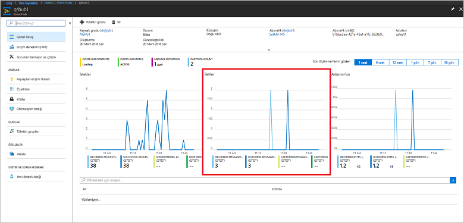

# <a name="quickstart-create-an-event-hub-using-azure-cli"></a>Hızlı başlangıç: Azure CLI'yi kullanarak olay hub'ı oluşturma

Azure Event Hubs saniyede milyonlarca olay alıp işleyebilen, ölçeklenebilirlik yüzeyi yüksek bir veri akışı platformu ve veri alma hizmetidir. Bu hızlı başlangıçta Azure CLI kullanarak Event Hubs kaynağı oluşturmayı ve Java kodu kullanarak olay hub'ı ile olay akışı alışverişi yapmayı öğreneceksiniz.

Bu hızlı başlangıcı tamamlamak bir Azure aboneliğinizin olması gerekir. Aboneliğiniz yoksa başlamadan önce [ücretsiz bir hesap oluşturun][].

## <a name="prerequisites"></a>Ön koşullar

[!INCLUDE [cloud-shell-try-it.md](../../includes/cloud-shell-try-it.md)]

Azure CLI'yı yerel olarak yükleyip kullanmayı tercih ederseniz bu öğretici için Azure CLI 2.0.4 veya sonraki bir sürümünü kullanmanız gerekir. Sürümünüzü kontrol etmek için `az --version` komutunu çalıştırın. Yüklemeniz veya yükseltmeniz gerekirse, bkz. [Azure CLI 2.0 yükleme]( /cli/azure/install-azure-cli).

## <a name="log-on-to-azure"></a>Azure'da oturum açma

Komutları Cloud Shell'de çalıştırıyorsanız aşağıdaki adımları atlayabilirsiniz. CLI'yı yerel ortamda çalıştırıyorsanız Azure'da oturum açmak ve geçerli aboneliğinizi ayarlamak için aşağıdaki adımları uygulayın:

Azure’da oturum açmak için aşağıdaki komutu çalıştırın:

```azurecli-interactive
az login
```

Geçerli abonelik bağlamını ayarlayın. `MyAzureSub` yerine kullanmak istediğiniz Azure aboneliğinin adını yazın:

```azurecli-interactive
az account set --subscription MyAzureSub
``` 

## <a name="provision-resources"></a>Kaynak sağlama

Event Hubs kaynaklarını sağlamak için aşağıdaki komutu çalıştırın. `myResourceGroup`, `namespaceName`, `eventHubName` ve `storageAccountName` yer tutucularını uygun değerlerle değiştirdiğinizden emin olun:

```azurecli-interactive
# Create a resource group
az group create --name myResourceGroup --location eastus

# Create an Event Hubs namespace
az eventhubs namespace create --name namespaceName --resource-group myResourceGroup -l eastus2

# Create an event hub
az eventhubs eventhub create --name eventHubName --resource-group myResourceGroup --namespace-name namespaceName

# Create a general purpose standard storage account
az storage account create --name storageAccountName --resource-group myResourceGroup --location eastus2 --sku Standard_RAGRS --encryption blob

# List the storage account access keys
az storage account keys list --resource-group myResourceGroup --account-name storageAccountName

# Get namespace connection string
az eventhubs namespace authorization-rule keys list --resource-group myResourceGroup --namespace-name namespaceName --name RootManageSharedAccessKey
```

Bağlantı dizesini kopyalayıp daha sonra kullanmak üzere Not Defteri gibi geçici bir konuma yapıştırın.

## <a name="stream-into-event-hubs"></a>Event Hubs'a akış sağlama

Bir sonraki adım, bir olay hub'ına olay akışı sağlayan ve bu olayları Olay İşlemcisi Ana Bilgisayarını kullanarak alan örnek kodu indirmektir. İlk olarak şu iletileri gönderin:

[Event Hubs GitHub deposunu](https://github.com/Azure/azure-event-hubs) aşağıdaki komutu çalıştırarak kopyalayın:

```bash
git clone https://github.com/Azure/azure-event-hubs.git
```

**SimpleSend** klasörüne gidin: `\azure-event-hubs\samples\Java\Basic\SimpleSend\src\main\java\com\microsoft\azure\eventhubs\samples\SimpleSend`. SimpleSend.java dosyasını açın ve `"Your Event Hubs namaspace name"` dizesini bu makalenin "Event Hubs ad alanı oluşturma" bölümünde aldığınız Event Hubs ad alanıyla değiştirin.

`"Your event hub"` yerine bu ad alanında oluşturduğunuz olay hub'ının adını, `"Your policy name"` yerine de ad alanının Paylaşılan erişim ilkesinin adını yazın. Yeni bir ilke oluşturmadıysanız varsayılan ilkenin adı **RootManageSharedAccessKey** olacaktır. 

Son olarak `"Your primary SAS key"` yerine bir önceki adımda aldığınız ilkenin SAS anahtarı değerini yazın.

### <a name="build-the-application"></a>Uygulama oluşturma 

`\azure-event-hubs\samples\Java\Basic\SimpleSend` klasörüne dönün ve aşağıdaki derleme komutunu kullanın:

```shell
mvn clean package -DskipTests
```

### <a name="receive"></a>Al

Şimdi, az önce gönderdiğiniz iletileri alan Olay İşlemcisi Ana Bilgisayarı örneğini indirin. **EventProcessorSample** klasörüne gidin: `\azure-event-hubs\samples\Java\Basic\EventProcessorSample\src\main\java\com\microsoft\azure\eventhubs\samples\eventprocessorsample`.

EventProcessorSample.java dosyasında `----EventHubsNamespaceName-----` değerini bu makalenin "Event Hubs ad alanı oluşturma" bölümünde aldığınız Event Hubs değeriyle değiştirin. 

Bu dosyadaki diğer dize değerlerini değiştirin: `----EventHubName-----` yerine bu ad alanında oluşturduğunuz olay hub'ının adını, `-----SharedAccessSignatureKeyName-----` yerine de ad alanının Paylaşılan erişim ilkesinin adını yazın. Yeni bir ilke oluşturmadıysanız varsayılan ilkenin adı **RootManageSharedAccessKey** olacaktır.

`---SharedAccessSignatureKey----` yerine bir önceki adımdaki ilkenin SAS anahtarı değerini, `----AzureStorageConnectionString----` yerine oluşturduğunuz depolama hesabının bağlantı dizesini, `----StorageContainerName----` yerine de oluşturduğunuz depolama hesabının altındaki kapsayıcının adını yazın. 

Son olarak `----HostNamePrefix----` değerini depolama hesabınızın adıyla değiştirin.

### <a name="build-the-receiver"></a>Alıcıyı oluşturma 

Alıcı uygulamasını derlemek için `\azure-event-hubs\samples\Java\Basic\EventProcessorSample` klasörüne gidin ve aşağıdaki komutu kullanın:

```shell
mvn clean package -DskipTests
```

### <a name="run-the-apps"></a>Uygulamaları çalıştırma

Derleme işlemlerinin başarıyla tamamlanması, olayları göndermeye ve almaya hazır olduğunuz gösterir. İlk olarak **SimpleSend** uygulamasını çalıştırın ve gönderilen olayları inceleyin. Programı çalıştırmak için `\azure-event-hubs\samples\Java\Basic\SimpleSend` klasörüne gidin ve aşağıdaki derleme komutu kullanın:

```shell
java -jar ./target/simplesend-1.0.0-jar-with-dependencies.jar
```

Ardından **EventProcessorSample** uygulamasını çalıştırın ve alınan olayları inceleyin. Programı çalıştırmak için `\azure-event-hubs\samples\Java\Basic\EventProcessorSample` klasörüne gidin ve aşağıdaki komutu kullanın:
   
```shell
java -jar ./target/eventprocessorsample-1.0.0-jar-with-dependencies.jar
```

İki programı da çalıştırdıktan sonra olay hub'ının Azure portal genel bakış sayfasında gelen ve giden ileti sayısını görebilirsiniz:



## <a name="clean-up-resources"></a>Kaynakları temizleme

Kaynak grubunu, ad alanını, depolama hesabını ve ilgili tüm kaynakları kaldırmak için aşağıdaki komutu çalıştırın. `myResourceGroup` değerini oluşturduğunuz kaynak grubunun adıyla değiştirin:

```azurecli
az group delete --resource-group myResourceGroup
```

## <a name="understand-the-sample-code"></a>Örnek kodu anlama

Bu bölümde örnek kodun işlevleri hakkında daha fazla ayrıntı bulunmaktadır.

### <a name="send"></a>Gönder

SimpleSend.java dosyasında işin çoğu main() metodunda gerçekleştirilir. Kod öncelikle `ConnectionStringBuilder` örneğini ve kullanıcı tarafından tanımlanan ad alanı adı, olay hub'ı adı, SAS anahtarı adı ve SAS anahtarı değerlerini kullanarak bağlantı dizesini oluşturur:

```java
final ConnectionStringBuilder connStr = new ConnectionStringBuilder()
        .setNamespaceName("Your Event Hubs namespace name")
        .setEventHubName("Your event hub")
        .setSasKeyName("Your policy name")
        .setSasKey("Your primary SAS key");
```

Ardından olay yükünü içeren Java nesnesi Json biçimine dönüştürülür:

```java
final Gson gson = new GsonBuilder().create();

final PayloadEvent payload = new PayloadEvent(1);
byte[] payloadBytes = gson.toJson(payload).getBytes(Charset.defaultCharset());
EventData sendEvent = EventData.create(payloadBytes);  
```

Event Hubs istemcisi kodun şu satırında oluşturulur:

```java
final EventHubClient ehClient = EventHubClient.createSync(connStr.toString(), executorService);
```

try/finally bloğu, belirtilmeyen bir bölüme tek bir olayı hepsini bir kez deneyecek şekilde gönderir:

```java
try {
    for (int i = 0; i < 100; i++) {

        String payload = "Message " + Integer.toString(i);
        //PayloadEvent payload = new PayloadEvent(i);
        byte[] payloadBytes = gson.toJson(payload).getBytes(Charset.defaultCharset());
        EventData sendEvent = EventData.create(payloadBytes);

        // Send - not tied to any partition
        // Event Hubs service will round-robin the events across all EventHubs partitions.
        // This is the recommended & most reliable way to send to EventHubs.
        ehClient.sendSync(sendEvent);
    }

    System.out.println(Instant.now() + ": Send Complete...");
    System.in.read();
} finally {
    ehClient.closeSync();
    executorService.shutdown();
}
```

### <a name="receive"></a>Al 

Alma işlemi EventProcessorSample.java dosyasında gerçekleştirilir. İlk olarak Event Hubs ad alanını ve diğer kimlik bilgilerini barındıracak sabitleri tanımlar:

```java
String consumerGroupName = "$Default";
String namespaceName = "----NamespaceName----";
String eventHubName = "----EventHubName----";
String sasKeyName = "----SharedAccessSignatureKeyName----";
String sasKey = "----SharedAccessSignatureKey----";
String storageConnectionString = "----AzureStorageConnectionString----";
String storageContainerName = "----StorageContainerName----";
String hostNamePrefix = "----HostNamePrefix----";
```

Kod daha sonra SimpleSend programına benzer şekilde bağlantı dizesini oluşturmak için bir ConnectionStringBuilder örneği oluşturur:

```java
ConnectionStringBuilder eventHubConnectionString = new ConnectionStringBuilder()
    .setNamespaceName(namespaceName)
    .setEventHubName(eventHubName)
    .setSasKeyName(sasKeyName)
    .setSasKey(sasKey);
```

*Olay İşleyicisi Ana Bilgisayarı*, olay hub’larına ait kalıcı denetim noktalarını ve paralel alımları yöneterek bu olay hub’larına ait alma olaylarını basitleştiren bir sınıftır. Kod bu adımda `EventProcessorHost` örneğini oluşturur:

```java
EventProcessorHost host = new EventProcessorHost(
    EventProcessorHost.createHostName(hostNamePrefix),
    eventHubName,
    consumerGroupName,
    eventHubConnectionString.toString(),
    storageConnectionString,
    storageContainerName);
```

Uygulama, birkaç hata işleme kodu tanımlamasından sonra `IEventProcessor` arabiriminin uygulaması olan `EventProcessor` sınıfını tanımlar. Bu sınıf alınan olayları işler:

```java
public static class EventProcessor implements IEventProcessor
{
    private int checkpointBatchingCount = 0;
    ...
```

`onEvents()` metodu, olay hub'ının bu bölümünden olay alındığında çağrılır:

```java
@Override
public void onEvents(PartitionContext context, Iterable<EventData> events) throws Exception
{
    System.out.println("SAMPLE: Partition " + context.getPartitionId() + " got event batch");
    int eventCount = 0;
    for (EventData data : events)
    {
        try
        {
         System.out.println("SAMPLE (" + context.getPartitionId() + "," + data.getSystemProperties().getOffset() + "," +
                data.getSystemProperties().getSequenceNumber() + "): " + new String(data.getBytes(), "UTF8"));
             eventCount++;
                
         // Checkpointing persists the current position in the event stream for this partition and means that the next
         // time any host opens an event processor on this event hub+consumer group+partition combination, it will start
         // receiving at the event after this one. Checkpointing is usually not a fast operation, so there is a tradeoff
         // between checkpointing frequently (to minimize the number of events that will be reprocessed after a crash, or
         // if the partition lease is stolen) and checkpointing infrequently (to reduce the impact on event processing
         // performance). Checkpointing every five events is an arbitrary choice for this sample.
         this.checkpointBatchingCount++;
         if ((checkpointBatchingCount % 5) == 0)
         {
            System.out.println("SAMPLE: Partition " + context.getPartitionId() + " checkpointing at " +
                    data.getSystemProperties().getOffset() + "," + data.getSystemProperties().getSequenceNumber());
            // Checkpoints are created asynchronously. It is important to wait for the result of checkpointing
            // before exiting onEvents or before creating the next checkpoint, to detect errors and to ensure proper ordering.
            context.checkpoint(data).get();
         }
    }
        catch (Exception e)
        {
            System.out.println("Processing failed for an event: " + e.toString());
        }
    }
    System.out.println("SAMPLE: Partition " + context.getPartitionId() + " batch size was " + eventCount + " for host " + context.getOwner());
}
```

## <a name="next-steps"></a>Sonraki adımlar

Bu makalede, Event Hubs ad alanını ve olay hub'ınızdan olay gönderip almak için gereken diğer kaynakları oluşturdunuz. Daha fazla bilgi edinmek için aşağıdaki öğreticiyle devam edin:

> [!div class="nextstepaction"]
> [Event Hubs veri akışları üzerindeki veri anormalliklerini görselleştirme](event-hubs-tutorial-visualize-anomalies.md)

[ücretsiz bir hesap oluşturun]: https://azure.microsoft.com/free/?ref=microsoft.com&utm_source=microsoft.com&utm_medium=docs&utm_campaign=visualstudio
[Install Azure CLI 2.0]: /cli/azure/install-azure-cli
[az group create]: /cli/azure/group#az-group-create
[fully qualified domain name]: https://wikipedia.org/wiki/Fully_qualified_domain_name
