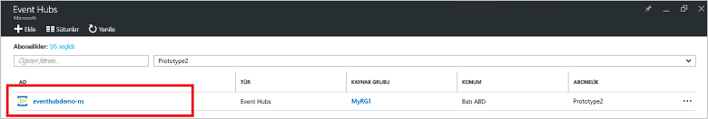
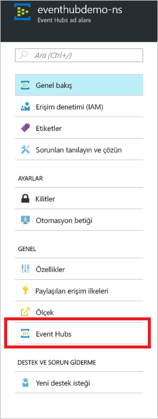
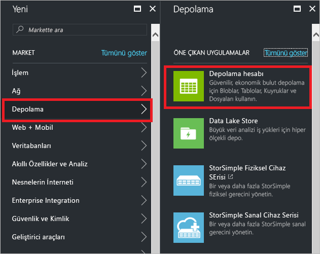

# Hızlı başlangıç: Azure portalı kullanarak olay hub'ı oluşturma

Azure Event Hubs saniyede milyonlarca olay alıp işleyebilen, ölçeklenebilirlik yüzeyi yüksek bir veri akışı platformu ve veri alma hizmetidir. Bu hızlı başlangıçta [Azure portalı](https://portal.azure.com) kullanarak olay hub'ı oluşturma ve .NET Standard SDK'sını kullanarak olay hub'ıyla ileti alışverişi yapma adımları gösterilmektedir.

Bu hızlı başlangıcı tamamlamak bir Azure aboneliğinizin olması gerekir. Aboneliğiniz yoksa başlamadan önce [ücretsiz bir hesap oluşturun][].

## Ön koşullar

Bu hızlı başlangıcı tamamlamak için aşağıdakileri yaptığınızdan emin olun:

- [Visual Studio 2017 Güncelleştirme 3 (sürüm 15.3, 26730.01)](http://www.visualstudio.com/vs) veya sonraki sürümler.
- [.NET Standard SDK'sı](https://www.microsoft.com/net/download/windows), sürüm 2.0 veya üzeri.

## Kaynak grubu oluşturma

Kaynak grubu, Azure kaynakları için mantıksal bir koleksiyondur. Tüm kaynaklar bir kaynak grubuna dağıtılır ve buradan yönetilir. Kaynak grubu oluşturmak için aşağıdakileri yapın:

1. Soldaki menüden **Kaynak grupları**'na tıklayın. Daha sonra **Ekle**'ye tıklayın.

   ![][1]

2. Kaynak grubu için benzersiz bir ad yazın. Sistem, adın seçili Azure aboneliğinde var olup olmadığını kontrol eder.

3. **Abonelik** bölümünde kaynak grubunu oluşturmak istediğiniz Azure aboneliğinin adına tıklayın.

4. Kaynak grubu için bir coğrafi konum seçin.

5. **Oluştur**’a tıklayın.

   ![][2]

## Event Hubs ad alanı oluşturma

Event Hubs ad alanı, tam etki alanı adının başvurduğu, içinde bir veya daha fazla olay hub'ı oluşturduğunuz benzersiz bir kapsam kapsayıcısı sağlar. Portalı kullanarak kaynak grubunuzda bir ad alanı oluşturmak için aşağıdakileri yapın:

1. [Azure portalda][] oturum açın ve ekranın sol üst köşesindeki **Kaynak oluştur**'a tıklayın.

2. **Nesnelerin İnterneti**’ne ve ardından **Event Hubs**’a tıklayın.

3. **Ad alanı oluştur** bölümüne bir ad alanı adı girin. Adın kullanılabilirliği sistem tarafından hemen denetlenir.

   

4. Ad alanı adının kullanılabilir durumda olduğundan emin olduktan sonra fiyatlandırma katmanını (Temel veya Standart) seçin. Ayrıca, bir Azure aboneliği, kaynak grubu ve kaynağın oluşturulacağı konumu seçin.
 
5. Ad alanını oluşturmak için **Oluştur**’a tıklayın. Sistemin kaynakları tam olarak sağlaması için birkaç dakika beklemeniz gerekebilir.

6. Portaldaki ad alanları listesinde, yeni oluşturulan ad alanına tıklayın.

7. **Paylaşılan erişim ilkeleri**'ne ve ardından **RootManageSharedAccessKey** öğesine tıklayın.
    
8. **RootManageSharedAccessKey** bağlantı dizesini panoya kopyalamak için kopyala düğmesine tıklayın. Bu bağlantı dizesini daha sonra kullanmak üzere Not Defteri gibi geçici bir konuma kaydedin.
    
## Olay hub’ı oluşturma

Ad alanında bir olay hub'ı oluşturmak için aşağıdakileri yapın:

1. Event Hubs ad alanı listesinde yeni oluşturulan ad alanına tıklayın.      
   
     

2. Ad alanı penceresinde **Event Hubs**’a tıklayın.
   
    

1. Pencerenin en üstündeki **+ Olay Hub’ı Ekle** seçeneğine tıklayın.
   
    
1. Olay hub'ınız için bir ad yazın, ardından **Oluştur**’a tıklayın.
   
    

Tebrikler! Portalı kullanarak bir Event Hubs ad alanı ve bu ad alanının içinde bir olay hub'ı oluşturdunuz.

## Olay İşleyicisi Ana Bilgisayarı için bir depolama hesabı oluşturma

Olay İşleyicisi Ana Bilgisayarı, olay hub’larına ait kalıcı denetim noktalarını ve paralel alımları yöneterek bu olay hub’larından olay almayı basitleştiren akıllı bir aracıdır. Olay İşleyicisi Ana Bilgisayarı, denetim noktası için bir depolama hesabına ihtiyaç duyar. Aşağıdaki örnekte depolama hesabı oluşturma ve erişim için anahtarını alma adımları gösterilmiştir:

1. [Azure portalda][Azure portalda] üzerinde oturum açın ve ekranın sol üst köşesindeki **Yeni**’ye tıklayın.

2. **Depolama** ve ardından **Depolama hesabı**’na tıklayın.
   
    

3. **Depolama hesabı oluştur** dikey penceresinde depolama hesabı için bir ad yazın. Bir Azure aboneliği, kaynak grubu ve kaynağın oluşturulacağı konumu seçin. Sonra **Oluştur**’a tıklayın.
   
    

4. Depolama hesabı listesinde, yeni oluşturulan depolama hesabına tıklayın.

5. Depolama hesabı penceresinde **Erişim anahtarları**'na tıklayın. **key1** değerini daha sonra kullanmak üzere kopyalayın.
   
    

## Örnekleri indirme ve çalıştırma

Bir sonraki adım, bir olay hub'ına olay gönderen ve bu olayları Olay İşlemcisi Ana Bilgisayarını kullanarak alan örnek kodu çalıştırmaktır. 

İlk olarak GitHub'dan [SampleSender](https://github.com/Azure/azure-event-hubs/tree/master/samples/DotNet/Microsoft.Azure.EventHubs/SampleSender) ve [SampleEphReceiver](https://github.com/Azure/azure-event-hubs/tree/master/samples/DotNet/Microsoft.Azure.EventHubs/SampleEphReceiver) örneklerini indirin veya [azure-event-hubs deposunu](https://github.com/Azure/azure-event-hubs) kopyalayın.

### Gönderen

1. Visual Studio’yu açın ve **Dosya** menüsünde **Aç**’a, ardından **Proje/Çözüm**’e tıklayın.

2. İndirdiğiniz **SampleSender** örnek klasörünü bulun ve SampleSender.sln dosyasına çift tıklayarak projeyi Visual Studio'da yükleyin.

3. Çözüm Gezgini'nde, Program.cs dosyasına çift tıklayarak dosyayı Visual Studio düzenleyicisinde açın.

4. `EventHubConnectionString` değerini ad alanını oluşturduğunuzda aldığınız bağlantı dizesiyle değiştirin.

5. `EventHubName` yerine bu ad alanında oluşturduğunuz olay hub'ının adını yazın.

6. **Derle** menüsünde **Çözümü Derle**'ye tıklayın ve hata oluşmadığından emin olun.

### Alıcı

1. Visual Studio’yu açın ve **Dosya** menüsünde **Aç**’a, ardından **Proje/Çözüm**’e tıklayın.

2. 1. adımda indirdiğiniz **SampleEphReceiver** örnek klasörünü bulun ve SampleEphReceiver.sln dosyasına çift tıklayarak projeyi Visual Studio'da yükleyin.

3. Çözüm Gezgini'nde, Program.cs dosyasına çift tıklayarak dosyayı Visual Studio düzenleyicisinde açın.

4. Aşağıdaki değişkenlerin değerlerini değiştirin:
    1. `EventHubConnectionString`: Ad alanını oluşturduğunuzda aldığınız bağlantı dizesiyle değiştirin.
    2. `EventHubName`: Bu ad alanında oluşturduğunuz olay hub'ının adıdır.
    3. `StorageContainerName`: Depolama kapsayıcısının adıdır. Benzersiz bir ad verin. Kapsayıcı, uygulamayı çalıştırdığınızda oluşturulur.
    4. `StorageAccountName`: Oluşturduğunuz depolama hesabının adıdır.
    5. `StorageAccountKey`: Azure portaldan aldığınız depolama hesabı anahtarıdır.

5. **Derle** menüsünde **Çözümü Derle**'ye tıklayın ve hata oluşmadığından emin olun.

### Uygulamaları çalıştırma

İlk olarak **SampleSender** uygulamasını çalıştırın ve 100 iletinin gönderilmesini bekleyin. Programı sonlandırmak için **Enter** tuşuna basın.

![][3]

Ardından **SampleEphReceiver** uygulamasını çalıştırarak iletilerin Olay İşleyicisi Ana Bilgisayarına gönderildiğinden emin olun.

![][4]
 
## Kaynakları temizleme

Depolama hesabını, ad alanını ve olay hub'ını kaldırmak için portalı kullanabilirsiniz. 

1. Azure portalda sol taraftaki **Tüm kaynaklar**'a tıklayın. 
2. Silmek istediğiniz depolama hesabına veya ad alanına tıklayın. Ad alanını sildiğinizde içindeki olay hub'ları da kaldırılır.
3. Ekranın üst tarafındaki menü çubuğunda **Sil**'e tıklayın. Silme işlemini onaylayın. 

## Sonraki adımlar

Bu makalede, Event Hubs ad alanını ve olay hub'ınızdan olay gönderip almak için gereken diğer kaynakları oluşturdunuz. Daha fazla bilgi edinmek için aşağıdaki öğreticiyle devam edin:

> [!div class="nextstepaction"]
> [Event Hubs veri akışları üzerindeki veri anormalliklerini görselleştirme](event-hubs-tutorial-visualize-anomalies.md)

[ücretsiz bir hesap oluşturun]: https://azure.microsoft.com/free/?ref=microsoft.com&utm_source=microsoft.com&utm_medium=docs&utm_campaign=visualstudio
[Azure portalda]: https://portal.azure.com/
[1]: ./media/event-hubs-quickstart-portal/resource-groups1.png
[2]: ./media/event-hubs-quickstart-portal/resource-groups2.png
[3]: ./media/event-hubs-quickstart-portal/sender1.png
[4]: ./media/event-hubs-quickstart-portal/receiver1.png
