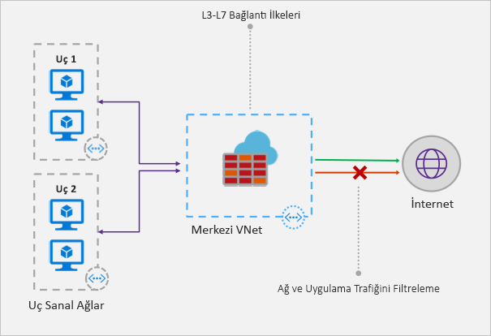

# Azure Güvenlik Duvarı nedir?

Azure Güvenlik Duvarı, Azure Sanal Ağ kaynaklarınızı koruyan yönetilen, bulut tabanlı bir güvenlik hizmetidir. Yerleşik yüksek kullanılabilirlik oranı ve kısıtlamasız bulut ölçeklenebilirliğiyle hizmet olarak tam durum bilgisi olan bir güvenlik duvarıdır. 

Aboneliklerle sanal ağlarda uygulama ve ağ bağlantısı ilkelerini merkezi olarak oluşturabilir, zorlayabilir ve günlüğe alabilirsiniz. Azure Güvenlik Duvarı, dış güvenlik duvarlarının sanal ağınızdan kaynaklanan trafiği tanımlamasına olanak tanımak amacıyla sanal ağ kaynaklarınız için statik genel bir IP adresi kullanır.  Hizmet, günlük ve analiz için Azure İzleyici ile tamamen tümleşik çalışır.

## Özellikler

Azure Güvenlik Duvarı şu özellikleri sunar:

### Yerleşik yüksek kullanılabilirlik
Yüksek kullanılabilirlik yerleşiktir; bu nedenle, ek bir yük dengeleyici gerekmez ve yapılandırmanız gereken hiçbir şey yoktur.

### Kısıtlamasız bulut ölçeklenebilirliği 
Azure Güvenlik Duvarı, değişen ağ trafiği akışlarıyla başa çıkmak için gerek duyduğunuz kadar ölçeklenebilir, bu sayede trafiğinizin en yoğun olduğu durum için bütçe yapmak zorunda kalmazsınız.

### Uygulama FQDN filtreleme kuralları

Giden HTTP/S trafiğini, joker karakter de içerebilen tam etki alanı adlarının (FQDN) belirtilen bir listesiyle sınırlayabilirsiniz. Bu özelliğe SSL sonlandırması gerekmez.

### Ağ trafiği filtreleme kuralları

Ağ filtreleme kurallarını kaynak ve hedef IP adresine, bağlantı noktasına ve protokole göre merkezi olarak oluşturabilir, *izin verebilir* veya *reddedebilirsiniz*. Azure Güvenlik Duvarı tamamen durum bilgisine sahiptir; bu nedenle, farklı türden bağlantıların geçerli paketlerini tanıyabilir. Kurallar, birden çok abonelik ve sanal ağda zorlanır ve günlüğe kaydedilir.

### FQDN etiketleri

FQDN etiketleri, tanınan Azure hizmeti ağ trafiğine güvenlik duvarınızda izin vermenizi kolaylaştırır. Örneğin Windows Update ağ trafiğine güvenlik duvarınızda izin vermek istediğiniz varsayalım. Bir uygulama kuralı oluşturup Windows Update etiketini eklersiniz. Artık Windows Update’in ağ trafiği, güvenlik duvarınızdan geçebilir.

### Giden SNAT desteği

Tüm giden sanal ağ trafiği IP adresleri Azure Güvenlik Duvarı genel IP’sine çevrilir (Kaynak Ağ Adresi Çevirisi). Sanal ağınızdan kaynaklanan uzak İnternet hedeflerine yönelik trafiği tanımlayabilir ve buna izin verebilirsiniz.

### Gelen DNAT desteği

Güvenlik duvarınızın genel IP adresine gelen trafik çevrilir (Hedef Ağ Adresi Çevirisi) ve sanal ağınızdaki özel IP adreslerine filtrelenir. 

### Azure İzleyici günlükleri

Günlükleri depolama hesabında arşivleyebilmeniz, olayların Event Hub'a akışını yapabilmeniz ve bunları Log Analytics'e gönderebilmeniz için, tüm olaylar Azure İzleyici ile tümleştirilmiştir.

## Bilinen sorunlar

Azure Güvenlik Duvarındaki bilinen sorunlar şunlardır:

|Sorun  |Açıklama  |Risk azaltma  |
|---------|---------|---------|
|Azure Güvenlik Merkezi (ASC) Tam Zamanında (JIT) özelliği çakışması|Sanal makineye JIT kullanılarak erişilirse ve bu sanal makine varsayılan ağ geçidi olarak Azure Güvenlik Duvarı'na işaret eden kullanıcı tanımlı bir yola sahip bir alt ağ içindeyse, ASC JIT çalışmaz. Bu, asimetrik yönlendirmenin bir sonucudur; paket, sanal makine genel IP'si yoluyla gelir (JIT erişimi açmıştır) ama dönüş yolu güvenlik duvarı üzerindendir ve güvenlik duvarında hiçbir oturum oluşturulmadığından güvenlik duvarı paketi bırakır.|Bu soruna geçici bir çözüm olarak, JIT sanal makinelerini güvenlik duvarına kullanıcı tanımlı bir yolu olmayan ayrı bir alt ağa yerleştirin.|
|Global eşlemeli merkez ve uç desteklenmiyor|Merkezle güvenlik duvarının bir Azure bölgesinde dağıtıldığı ve uçların başka Azure bölgesinde yer aldığı merkez ve uç modeli desteklenmez. Merkeze Global Sanal Ağ eşlemesi üzerinden bağlanma desteklenmez.|Bu tasarım gereğidir. Daha fazla bilgi için bkz. [Azure aboneliği ve hizmet sınırları, kotaları ve kısıtlamaları](../azure-subscription-service-limits.md#azure-firewall-limits)|
TCP/UDP dışı protokollere (örneğin ICMP) yönelik ağ filtreleme kuralları İnternet'e bağlı trafik için çalışmaz|TCP/UDP dışı protokollere yönelik ağ filtreleme kuralları genel IP adresinize SNAT ile çalışmaz. TCP/UDP dışı protokoller, uç alt ağlarla sanal ağlar arasında desteklenir.|Azure Güvenlik Duvarı, [bugün IP protokolleri için SNAT desteği olmayan](https://docs.microsoft.com/azure/load-balancer/load-balancer-standard-overview#limitations) Standart Load Balancer kullanır. Gelecek sürümlerden birinde bu senaryoyu destekleme seçeneklerini gözden geçiriyoruz.|
|ICMP için eksik PowerShell ve CLI desteği|Azure PowerShell ve CLI ağ kurallarında geçerli bir protokol olarak ICMP'yi desteklemez.|Ancak ICMP'yi portal ve REST API aracılığıyla bir protokol olarak kullanmak mümkündür. ICMP'yi yakında PowerShell ve CLI'ye eklemek üzere çalışıyoruz.|
|FQDN etiketleri bir protokol: bağlantı noktası ayarlamayı gerektirir|FQDN etiketleri olan uygulama kuralları bağlantı noktası:protokol tanımı gerektirir.|Bağlantı noktası:protokol değeri olarak **https** kullanabilirsiniz. Bu alanı FQDN etiketleri kullanıldığında isteğe bağlı yapmak için çalışıyoruz.|
|Bir Güvenlik Duvarı'nı bir farklı kaynak grubuna veya aboneliğe taşıma desteklenmiyor|Bir güvenlik duvarını başka bir gruba veya aboneliğe taşımak desteklenmez.|Bu işlevi destekleyen bizim üzerinde yol haritasıdır. Bir güvenlik duvarını başka bir kaynak grubuna veya aboneliğe taşımak için geçerli örneği silmeniz ve yeni kaynak grubunda veya abonelikte yeniden oluşturmanız gerekir.|
|Bağlantı noktası aralığında ağ ve uygulama kuralları|Yüksek bağlantı noktaları, yönetimi ve sistem durumu için ayrılmış olarak bağlantı noktaları için 64.000 sınırlı araştırmaları. |Bu sınırlama gevşetmek için çalışıyoruz.|
|

## Sonraki adımlar

- [Öğretici: Dağıtma ve Azure Azure portalını kullanarak güvenlik duvarı yapılandırma](tutorial-firewall-deploy-portal.md)
- [Şablon kullanarak Azure Güvenlik Duvarı’nı dağıtma](deploy-template.md)
- [Azure Güvenlik Duvarı test ortamı oluşturma](scripts/sample-create-firewall-test.md)

