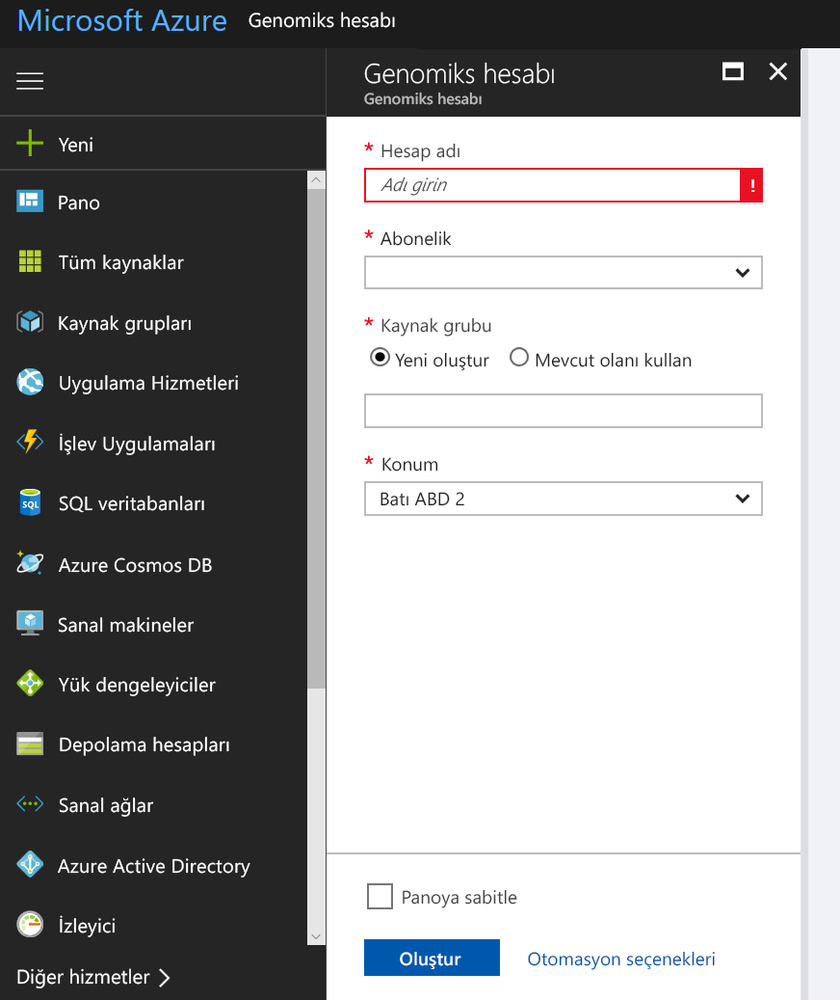
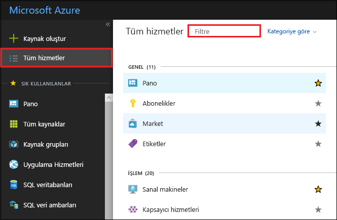
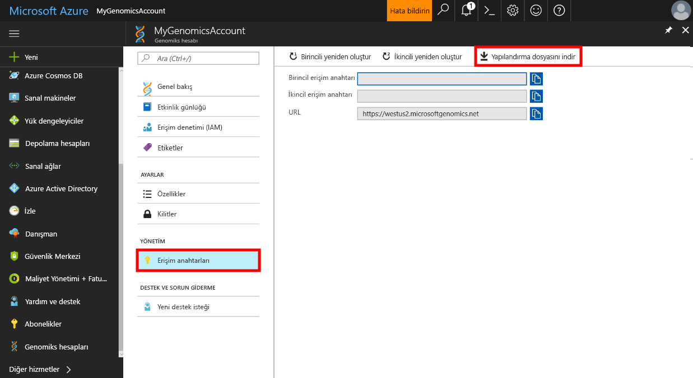

# <a name="quickstart-run-a-workflow-through-the-microsoft-genomics-service"></a>Hızlı Başlangıç: Microsoft Genomics hizmeti üzerinden iş akışı çalıştırma

Bu hızlı başlangıçta, giriş verilerini Azure Blob Depolama'ya yükleme ve Microsoft Genomiks hizmeti üzerinden iş akışı çalıştırma adımları gösterilir. Microsoft Genomiks, ham okumalardan başlayarak hizalanmış okumalar ve varyant ilanları üreten, bir genomu hızlı bir şekilde işleyebilen ikincil analize yönelik ölçeklenebilir ve güvenli bir hizmettir. 

Birkaç adımda kullanmaya başlayabilirsiniz: 
1.  Ayarlayın: Azure portalından bir Microsoft Genomics hesabı oluşturup Microsoft Genomics Python istemcisini yerel ortamınıza yükleyin. 
2.  Giriş verilerini yükleyin: Azure portalı üzerinden Microsoft Azure depolama hesabı oluşturma ve giriş dosyalarını yükleyin. Giriş dosyalarının uç okumalarında eşleştirilmesi gerekir (fastq veya bam dosyaları).
3.  Çalıştırın: Microsoft Genomics hizmeti üzerinden iş akışlarını çalıştırmak için Microsoft Genomics komut satırı arabirimini kullanın. 

Microsoft Genomiks hakkında daha fazla bilgi için bkz. [Microsoft Genomiks nedir?](overview-what-is-genomics.md)

## <a name="set-up-create-a-microsoft-genomics-account-in-the-azure-portal"></a>Ayarlayın: Azure portalında Microsoft Genomics hesabı oluşturma

Microsoft Genomiks hesabı oluşturmak için [Azure portalına](https://portal.azure.com/#create/Microsoft.Genomics) gidin. Azure aboneliğiniz yoksa Microsoft Genomiks hesabı oluşturmadan bir hesap açın. 




Genomiks hesabınızı bir önceki resimde gösterildiği gibi aşağıdaki bilgilerle yapılandırın. 

 |**Ayar**          |  **Önerilen değer**  | **Alan açıklaması** |
 |:-------------       |:-------------         |:----------            |
 |Subscription         | Aboneliğinizin adı|Bu, Azure hizmetleriniz için faturalandırma birimidir. Aboneliğiniz hakkında ayrıntılı bilgi için bkz. [Abonelikler](https://account.azure.com/Subscriptions) |      
 |Resource group       | MyResourceGroup       |  Kaynak grupları kolay yönetim için birden fazla Azure kaynağını (depolama hesabı, genomiks hesabı vs.) tek bir grupta toplamanızı sağlar. Daha fazla bilgi için bkz. [Kaynak Grupları](https://docs.microsoft.com/azure/azure-resource-manager/resource-group-overview#resource-groups). Geçerli kaynak grubu adları için bkz. [Adlandırma Kuralları](https://docs.microsoft.com/azure/architecture/best-practices/naming-conventions) |
 |Hesap adı         | MyGenomicsAccount     |Benzersiz bir hesap tanımlayıcı seçin. Geçerli adlar için bkz. [Adlandırma Kuralları](https://docs.microsoft.com/azure/architecture/best-practices/naming-conventions) |
 |Location                   | Batı ABD 2                    |    Bu hizmet Batı ABD 2, Batı Avrupa ve Güneydoğu Asya konumlarında kullanılabilir |


Dağıtım işlemini izlemek için üst menü çubuğundaki Bildirimler'e tıklayabilirsiniz.


## <a name="set-up-install-the-microsoft-genomics-python-client"></a>Ayarlayın: Microsoft Genomics Python istemcisini yükleme

Kullanıcıların hem Python hem de Microsoft Genomiks Python istemcisini yerel ortamlarına yüklemesi gerekir. 

### <a name="install-python"></a>Python'ı yükleme

Microsoft Genomiks Python istemcisi Python 2.7 ile uyumludur. 12 veya üzeri 2.7.xx sürümü; 2.7.15, bu makalenin yazıldığı sırada en yeni sürümdür; 2.7.14 önerilen sürümdür. Dosyayı [buradan](https://www.python.org/downloads/) indirebilirsiniz. 

NOT: Python 3.x Python 2.7.xx ile uyumlu değil.  MSGen bir Python 2.7 uygulamasıdır. MSGen'i çalıştırırken etkin Python ortamınızda Python'un 2.7.xx sürümünün kullanıldığından emin olun. MSGen'i Python 3.x sürümüyle kullanmaya çalışırsanız hatalarla karşılaşabilirsiniz.


### <a name="install-the-microsoft-genomics-client"></a>Microsoft Genomiks istemcisini yükleme

Microsoft Genomiks istemcisini `msgen` yüklemek için Python pip kullanın. Aşağıdaki talimatlarda Python uygulamasının sistem yolunuzda olduğu kabul edilmektedir. pip yüklemesinin tanınmaması nedenli sorunlarla karşılaşırsanız Python uygulamasını ve betik alt klasörünü sistem yolunuza eklemeniz gerekir.


```
pip install --upgrade --no-deps msgen
pip install msgen
```


`msgen` yüklemesini sistem çapında ikili dosya olarak yüklemek ve sistem çapındaki Python paketlerini değiştirmek istemezseniz `–-user` bayrağını `pip` ile kullanın.
Paket tabanlı yükleme veya setup.py dosyasını kullandığınızda gerekli tüm paketler yüklenir. Yüklenmezse msgen için gerekli temel paketler 

 * [Azure-storage](https://pypi.python.org/pypi/azure-storage). 
 * [İstekler](https://pypi.python.org/pypi/requests). 


Bu paketleri `pip`, `easy_install` veya standart `setup.py` yordamlarını kullanarak yükleyebilirsiniz. 


### <a name="test-the-microsoft-genomics-client"></a>Microsoft Genomiks istemcisini test etme
Microsoft Genomiks istemcisini test etmek için genomiks hesabınızdan yapılandırma dosyasını indirin. Sol üstte bulunan **Tüm hizmetler**'e tıklayıp, filtreleyip genomiks hesaplarını seçerek, genomiks hesabınıza gidebilirsiniz.





En son oluşturduğunuz genomiks hesabını seçin, **Erişim Anahtarları**'na gidin ve yapılandırma dosyasını indirin.




Aşağıdaki komutu kullanarak Microsoft Genomiks Python istemcisinin çalışıp çalışmadığını test edin


```
msgen list -f “<full path where you saved the config file>”
```

## <a name="create-a-microsoft-azure-storage-account"></a>Microsoft Azure Depolama Hesabı oluşturma 
Microsoft Genomiks hizmeti girişlerinin Azure depolama hesabında blok blobları olarak depolanmasını bekler. Ayrıca çıkış dosyalarını Azure depolama hesabında kullanıcı tarafından belirtilen bir kapsayıcıya blok blobları olarak yazar. Girişler ve çıkışlar farklı depolama hesaplarında tutulabilir.
Azure depolama hesabınızda veri varsa Genomiks hesabınızla aynı konumda olduğundan emin olmanız gerekir. Aksi halde Genomiks hizmeti çalıştırıldığında çıkış ücretleri alınabilir. Microsoft Azure Depolama hesabınız yoksa hesap oluşturup verilerinizi yüklemeniz gerekir. Depolama hesabı ve sunduğu hizmetler dahil olmak üzere Azure Depolama hesapları hakkında daha fazla bilgiye [buradan](https://docs.microsoft.com/azure/storage/common/storage-create-storage-account) ulaşabilirsiniz. Microsoft Azure Depolama hesabı oluşturmak için [Azure portalına](https://portal.azure.com/#create/Microsoft.StorageAccount-ARM ) gidin.  


Depolama hesabınızı bir önceki resimde gösterildiği gibi aşağıdaki bilgilerle yapılandırın. Depolama hesabı için standart seçenekleri kullanın ve yalnızca hesabın genel amaçlı değil blob depolama için olduğunu belirtin. Blob depolama indirme ve yükleme işlemlerinde 2-5 kat daha yüksek hız sunabilir.  Kaynak Yöneticisi, varsayılan dağıtım modeli önerilir.  


 |**Ayar**          |  **Önerilen değer**  | **Alan açıklaması** |
 |:-------------------------       |:-------------         |:----------            |
 |Subscription         | Azure aboneliğiniz |Aboneliğiniz hakkında daha ayrıntılı bilgi için bkz. [Abonelikler](https://account.azure.com/Subscriptions) |      
 |Resource group       | MyResourceGroup       |  Genomiks hesabınızla aynı kaynak grubunu seçebilirsiniz. Geçerli kaynak grubu adları için bkz. [Adlandırma Kuralları](https://docs.microsoft.com/azure/architecture/best-practices/naming-conventions) |
 |Depolama hesabı adı         | MyStorageAccount     |Benzersiz bir hesap tanımlayıcı seçin. Geçerli adlar için bkz. [Adlandırma Kuralları](https://docs.microsoft.com/azure/architecture/best-practices/naming-conventions) |
 |Location                  | Batı ABD 2                  | Çıkış ücretlerini ve gecikme süresini azaltmak için genomiks hesabınızla aynı konumu kullanın.  | 
 |Performans                  | Standart                   | Varsayılan olarak standart seçeneği kullanılır. Standart ve premium depolama hesapları hakkında daha fazla bilgi için bkz. [Microsoft Azure Depolama'ya giriş](https://docs.microsoft.com/azure/storage/common/storage-introduction)    |
 |Hesap türü       | Blob depolama       |  Blob depolama indirme ve yükleme işlemlerinde genel amaçlı depolama alanından 2-5 kat daha yüksek hız sunabilir. |
 |Çoğaltma                  | Yerel olarak yedekli depolama                  | Yerel olarak yedekli depolama, verilerinizi depolama hesabınızı oluşturduğunuz bölgedeki veri merkezi içinde çoğaltır. Daha fazla bilgi için bkz. [Azure Depolama çoğaltma](https://docs.microsoft.com/azure/storage/common/storage-redundancy)    |
 |Erişim katmanı                  | Sık Erişimli                   | Sık erişimli seçeneği, depolama hesabındaki nesnelere erişimin daha sık olduğunu belirtir.    |


Ardından `Review + create` depolama hesabınızı oluşturmak için. Genomiks Hesabınızı oluşturma işlemlerinde olduğu gibi üst menü çubuğundaki Bildirimler'e tıklayarak dağıtım işlemini izleyebilirsiniz. 


## <a name="upload-input-data-to-your-storage-account"></a>Giriş verilerini depolama hesabınıza yükleyin

Microsoft Genomiks hizmeti giriş dosyası olarak eşleştirilmiş uç okuma bekler. Kendi verilerinizi yükleyebilir veya sunulan genel kullanıma açık örnek verileri kullanarak hizmeti keşfedebilirsiniz. Genel kullanıma açık örnek verileri kullanmak isterseniz buradan ulaşabilirsiniz:


[https://msgensampledata.blob.core.windows.net/small/chr21_1.fq.gz](https://msgensampledata.blob.core.windows.net/small/chr21_1.fq.gz)
[https://msgensampledata.blob.core.windows.net/small/chr21_2.fq.gz](https://msgensampledata.blob.core.windows.net/small/chr21_2.fq.gz)


Depolama hesabınızda biri giriş verileriniz, biri de çıkış verileriniz için olmak üzere iki blob kapsayıcısı oluşturmanız gerekir.  Giriş verilerini giriş blob kapsayıcısına yükleyin. Bunu yapmak için [Microsoft Azure Depolama Gezgini](https://azure.microsoft.com/features/storage-explorer/), [blobporter](https://github.com/Azure/blobporter) veya [AzCopy](https://docs.microsoft.com/azure/storage/common/storage-use-azcopy?toc=%2fazure%2fstorage%2fblobs%2ftoc.json) gibi farklı araçları kullanabilirsiniz. 


## <a name="run-a-workflow-through-the-microsoft-genomics-service-using-the-python-client"></a>Python istemcisini kullanarak Microsoft Genomiks hizmeti üzerinden iş akışı çalıştırma 

Microsoft Genomiks hizmeti üzerinden bir iş akışı çalıştırmak için config.txt dosyasını verilerinizin giriş ve çıkış depolama kapsayıcısını belirtecek şekilde düzenleyin.
Genomiks hesabınızdan indirdiğiniz config.txt dosyasını açın. Belirtmeniz gereken bölümler abonelik anahtarınız ve en alttaki altı öğe, depolama hesabınızın adı, anahtar ve hem giriş hem de çıkış için kapsayıcı adı. Bu bilgiye portala gidip depolama hesabınızın **Erişim anahtarları** sayfasından veya doğrudan Azure Depolama Gezgini'nden ulaşabilirsiniz.  


GATK4 çalıştırmak istiyorsanız, ayarlama `process_name` parametresi `gatk4`.

Varsayılan olarak, Genomiks hizmeti VCF dosyaları çıkarır. Yerine bir VCF çıktısını bir gVCF gibi çıktısını alırsanız (eşdeğer `-emitRefConfidence` GATK içinde 3.x ve `emit-ref-confidence` GATK içinde 4.x), ekleme `emit_ref_confidence` parametresi, `config.txt` ve `gvcf`, yukarıdaki şekilde gösterildiği gibi.  VCF çıkışı değiştirmek için ya da kaldırabilirsiniz `config.txt` ayarlayın ya da dosya `emit_ref_confidence` parametresi `none`. 

### <a name="submit-your-workflow-to-the-microsoft-genomics-service-the-microsoft-genomics-client"></a>İş akışınızı Microsoft Genomiks hizmetine ve Microsoft Genomiks istemcisine gönderme

Aşağıdaki komutu kullanarak Microsoft Genomiks Python istemcisiyle iş akışınızı gönderin:


```python
msgen submit -f [full path to your config file] -b1 [name of your first paired end read] -b2 [name of your second paired end read]
```


İş akışlarınızın durumunu görüntülemek için aşağıdaki komutu kullanabilirsiniz: 
```python
msgen list -f c:\temp\config.txt 
```


İş akışınız tamamlandıktan sonra yapılandırdığınız Azure Depolama Hesabı çıkış kapsayıcısında çıkış dosyalarını görüntüleyebilirsiniz. 


## <a name="next-steps"></a>Sonraki adımlar
Bu makalede örnek giriş verilerini Azure Depolama'ya yükleyip `msgen` Python istemcisi üzerinden Microsoft Genomiks hizmetine bir iş akışı gönderdiniz. Microsoft Genomiks hizmeti ile kullanılabilecek diğer giriş dosya türleri hakkında daha fazla bilgi için şu sayfalara bakın: [eşleştirilmiş FASTQ](quickstart-input-pair-FASTQ.md) | [BAM](quickstart-input-BAM.md) | [Çoklu FASTQ veya BAM](quickstart-input-multiple.md). Bu öğreticiyi [Azure not defteri öğreticimizi](https://aka.ms/genomicsnotebook) kullanarak da keşfedebilirsiniz.
