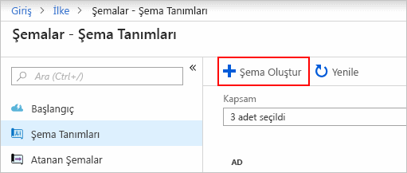
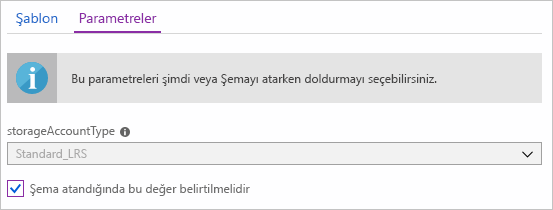
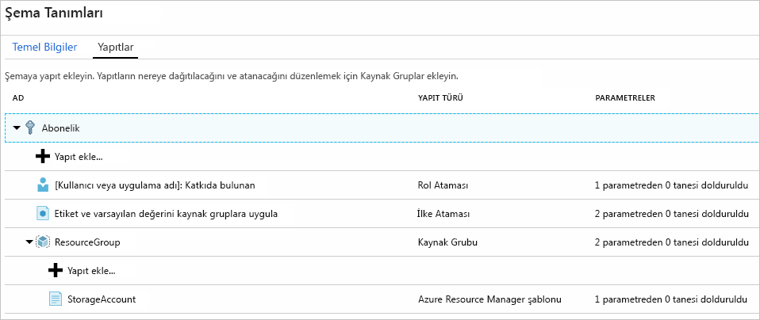
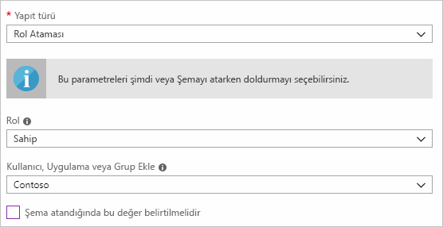
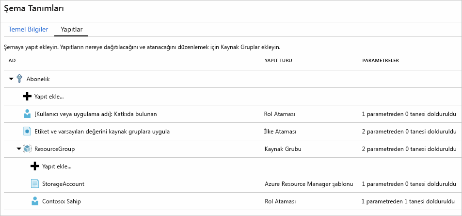
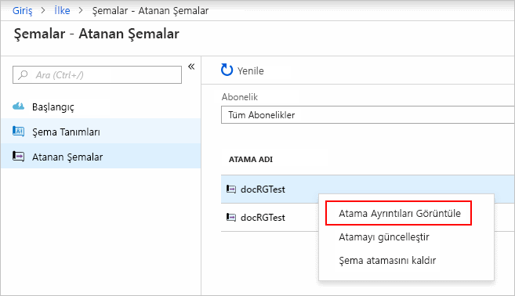

# <a name="define-and-assign-a-blueprint-in-the-portal"></a>Tanımlama ve Portalı'nda bir şema Ata

Planlar oluşturup öğrenin, Azure Resource Manager şablonları, ilke, güvenlik ve daha fazla bağlı yeniden kullanılabilir ve hızlı bir şekilde dağıtılabilen yapılandırmaları geliştirmek için ortak desenler tanımlayabilirsiniz. Bu öğreticide, bazı atama kuruluşunuz içindeki bir şema oluşturma ve yayımlama ile ilgili genel görevleri yapmak için Azure şemaları kullanmayı öğrenin. Bu görevler aşağıdakileri içerir:

> [!div class="checklist"]
> - Yeni bir şema oluşturma ve çeşitli desteklenen yapıtlar ekleme
> - **Taslak** durumundaki bir şemada değişiklik yapma
> - Bir şemayı **Yayımlandı** durumuna getirerek atamaya hazır hale getirme
> - Bir şemayı var olan bir aboneliğe atama
> - Atanmış bir şemanın durumunu ve ilerlemesini denetleme
> - Bir aboneliğe atanmış olan şemayı kaldırma

Azure aboneliğiniz yoksa başlamadan önce [ücretsiz bir hesap](https://azure.microsoft.com/free) oluşturun.

## <a name="create-a-blueprint"></a>Şema oluşturma

Uyumluluk için standart desen tanımlamanın ilk adımı kullanılabilir durumdaki kaynaklardan bir şema oluşturmaktır. Bu örnekte, adlı yeni bir şema oluşturmak **MyBlueprint** abonelik için rol ve ilke atamaları yapılandırmak için. Ardından yeni bir kaynak grubu ekleyin ve yeni bir kaynak grubu üzerinde bir Resource Manager şablonu ve rol ataması oluşturun.

1. Seçin **tüm hizmetleri** sol bölmesinde. Arayın ve seçin **şemaları**.

1. Seçin **Blueprint tanımları** seçeneğini ve sayfasında **+ Oluştur blueprint** sayfanın üstünde düğme.

   Ya da seçin **Oluştur** gelen **Başlarken** düz bir şema oluşturmak için Git sayfası.

   

1. Sağlayan bir **Blueprint adı** gibi **MyBlueprint**. (48 harf kullanacak ve sayıları, ancak hiçbir boşluk veya özel karakter). Bırakın **Blueprint açıklaması** şimdilik boş.

1. İçinde **tanım konumunu** kutusunda sağındaki üç nokta simgesini seçin, seçin [yönetim grubu](../management-groups/overview.md) veya şema kaydedin ve istediğiniz abonelik **seçin**.

1. Bilgilerin doğru olduğundan emin olun. **Blueprint adı** ve **tanım konumunu** alanlar daha sonra değiştirilemez. Ardından **sonraki: Yapıtları** sayfanın alt kısmındaki veya **Yapıtları** sayfanın üst kısmındaki sekme.

1. Bir rol ataması abonelik düzeyinde ekleyin:

   1. Seçin **+ yapıt ekleme** altında satır **abonelik**. **Yapıt ekleme** sağ tarafında bir tarayıcı penceresi açılır.

   1. Seçin **rol ataması** için **Yapıt türü**.

   1. Altında **rol**seçin **katkıda bulunan**. Bırakın **Ekle kullanıcı, uygulama veya grup** kutusu onay kutusuyla dinamik bir parametre belirtir.

   1. Seçin **Ekle** blueprint'e yapıt bu eklemek için.

   

   > [!NOTE]
   > Çoğu yapının parametreleri destekler. Blueprint oluşturma sırasında bir değer atadığı parametresi bir *statik parametresinin*. Blueprint ataması sırasında parametre atanırsa, bu bir *dinamik parametre*. Daha fazla bilgi için bkz. [Şema parametreleri](./concepts/parameters.md).

1. Abonelik düzeyinde bir ilke ataması ekleyin:

   1. Seçin **+ yapıt ekleme** rol atama yapıtındaki altında satır.

   1. Seçin **ilke ataması** için **Yapıt türü**.

   1. Değişiklik **türü** için **yerleşik**. İçinde **arama**, girin **etiketi**.

   1. Filtrelemenin yapılması için **Ara**’ya tıklayın. Seçin **kaynak gruplarına etiketi ve varsayılan değerini Uygula**.

   1. Seçin **Ekle** blueprint'e yapıt bu eklemek için.

1. İlke ataması satırı seçin **kaynak gruplarına etiketi ve varsayılan değerini Uygula**.

1. Blueprint tanımının bir parçası yapı parametreleri sağlamak için bir pencere açılır ve parametreler için tüm atamaları (statik Parametreler) yerine bu şema ataması sırasında (dinamik parametreleri) göre ayarı sağlar. Bu örnek, blueprint ataması sırasında dinamik parametreler kullanır, böylece seçin ve varsayılan değerleri bırakın **iptal**.

1. Bir kaynak grubu, abonelik düzeyinde ekleyin:

   1. Seçin **+ yapıt ekleme** altında satır **abonelik**.

   1. Seçin **kaynak grubu** için **Yapıt türü**.

   1. Bırakın **Yapıt görünen ad**, **kaynak grubu adı**, ve **konumu** kutularını boş, ancak her parametre özelliği okunmaları onay kutusunun seçili olduğundan emin olun dinamik parametreler.

   1. Seçin **Ekle** blueprint'e yapıt bu eklemek için.

1. Kaynak grubu altında bir şablon ekleyin:

   1. Seçin **+ yapıt ekleme** altında satır **ResourceGroup** girişi.

   1. Seçin **Azure Resource Manager şablonu** için **Yapıt türü**ayarlayın **Yapıt görünen ad** için **StorageAccount**ve bırakın **Açıklama** boş.

   1. Düzenleyici kutusundaki **Şablon** sekmesinde aşağıdaki Resource Manager şablonunu yapıştırın.
      Şablonu Yapıştır sonra seçin **parametreleri** sekmesini ve unutmayın şablon parametreleri **storageAccountType** ve **konumu** algılandı. Her parametre otomatik olarak algılandı ve doldurulur, ancak dinamik bir parametre olarak yapılandırılmış.

      > [!IMPORTANT]
      > Şablonu içe aktarıyorsanız, dosya yalnızca JSON ve HTML içermez emin olun. Github'da bir URL'ye işaret ettiğinizde, seçtiğiniz olduğunuzdan emin **ham** pure JSON dosyasını ve GitHub üzerinde görüntülemek için HTML ile sarmalanmış bir alınamıyor. İçeri aktarılan şablon saf JSON değilse bir hata oluşur.

      ```json
      {
          "$schema": "https://schema.management.azure.com/schemas/2015-01-01/deploymentTemplate.json#",
          "contentVersion": "1.0.0.0",
          "parameters": {
              "storageAccountType": {
                  "type": "string",
                  "defaultValue": "Standard_LRS",
                  "allowedValues": [
                      "Standard_LRS",
                      "Standard_GRS",
                      "Standard_ZRS",
                      "Premium_LRS"
                  ],
                  "metadata": {
                      "description": "Storage Account type"
                  }
              },
              "location": {
                  "type": "string",
                  "defaultValue": "[resourceGroup().location]",
                  "metadata": {
                      "description": "Location for all resources."
                  }
              }
          },
          "variables": {
              "storageAccountName": "[concat('store', uniquestring(resourceGroup().id))]"
          },
          "resources": [{
              "type": "Microsoft.Storage/storageAccounts",
              "name": "[variables('storageAccountName')]",
              "location": "[parameters('location')]",
              "apiVersion": "2018-07-01",
              "sku": {
                  "name": "[parameters('storageAccountType')]"
              },
              "kind": "StorageV2",
              "properties": {}
          }],
          "outputs": {
              "storageAccountName": {
                  "type": "string",
                  "value": "[variables('storageAccountName')]"
              }
          }
      }
      ```

   1. NET **storageAccountType** onay kutusu ve aşağı açılan liste yalnızca Resource Manager şablonu altında bulunan değerleri içerdiğini unutmayın **allowedValues**. Dinamik bir parametre ayarlamak için kutusunu seçin.

   1. Seçin **Ekle** blueprint'e yapıt bu eklemek için.

   

1. Tamamladığınız şema aşağıdakine benzer olmalıdır. Her yapıtının bildirimi  **_x_ tanesi _y_ dolduruldu** içinde **parametreleri** sütun. Dinamik parametreleri her blueprint ataması sırasında ayarlanır.

   

1. Planlanan tüm yapıtlar eklenmiş olan, seçin **Taslağı Kaydet** sayfanın alt kısmındaki.

## <a name="edit-a-blueprint"></a>Şema düzenleme

İçinde [blueprint oluşturma](#create-a-blueprint), fırsatınız bir açıklama belirtin veya rol ataması yeni kaynak grubuna ekleyin. Aşağıdaki adımları izleyerek her ikisi de düzeltebilirsiniz:

1. Seçin **Blueprint tanımları** sol sayfasında.

1. Blueprint listesinde, önceden oluşturduğunuz bir sağ tıklayıp **düzenleme şema**.

1. İçinde **Blueprint açıklaması**, şema ve onu oluşturan yapıları hakkında bazı bilgiler sağlamalısınız. Bu durumda, aşağıdaki gibi girin: **Bu şema etiket ilke ve rol ataması abonelikte ayarlar, bir kaynak grubu oluşturur ve bu kaynak grubu için bir şablon ve rol ataması dağıtır.**

1. Seçin **sonraki: Yapıtları** sayfanın alt kısmındaki veya **Yapıtları** sayfanın üst kısmındaki sekme.

1. Kaynak grubu altında bir rol ataması Ekle:

   1. Seçin **+ yapıt ekleme** doğrudan altında satır **ResourceGroup** girişi.

   1. Seçin **rol ataması** için **Yapıt türü**.

   1. Altında **rol**seçin **sahibi**, altındaki onay kutusunu temizleyin **Ekle kullanıcı, uygulama veya grup** kutusu.

   1. İçin arama yapın ve bir kullanıcı, uygulama veya grup eklemek için seçin. Bu yapıt statik parametre kümesi bu blueprint'in tüm atamasını aynı kullanır.

   e. Seçin **Ekle** blueprint'e yapıt bu eklemek için.

   

1. Tamamladığınız şema aşağıdakine benzer olmalıdır. Yeni eklenen rol ataması gösteren uyarı **1 / 1 dolduruldu**. Statik bir parametredir anlamına gelir.

   

1. Seçin **Taslağı Kaydet** güncelleştirilip güncelleştirilmediğini göre.

## <a name="publish-a-blueprint"></a>Şemayı yayımlama

Planlanan tüm yapıtları ekledikten sonra şemayı yayımlayabilirsiniz.
Yayımlama aboneliğine atanacak uygun şema yapar.

1. Seçin **Blueprint tanımları** sol sayfasında.

1. Daha önce oluşturduğunuz bir blueprint'i listesinde sağ tıklayıp **Yayımla şema**.

1. Açılan bölmede sağlayan bir **sürüm** (harf, rakam ve kısa çizgi maksimum uzunluğu en fazla 20 karakter) gibi **v1**. İsteğe bağlı olarak, metin girin **notları değiştirmek**, gibi **ilk yayımlama**.

1. Seçin **Yayımla** sayfanın alt kısmındaki.

## <a name="assign-a-blueprint"></a>Şema atama

Blueprint yayımlandıktan sonra bir aboneliğe atanabilir. Oluşturduğunuz plan, Yönetim Grup hiyerarşiniz altında aboneliklerden birine atayın. Blueprint bir abonelik için kaydedilmiş durumda ise, yalnızca bu aboneliğe atanabilir.

1. Seçin **Blueprint tanımları** sol sayfasında.

1. Blueprint listesinde, daha önce oluşturduğunuz bir sağ tıklayın (veya üç noktayı seçin) seçip **Ata şema**.

1. Üzerinde **Ata şema** sayfasında **abonelik** istediğiniz abonelikleri dağıtmak için bu şema aşağı açılan listesinde seçin.

   Kullanılabilir desteklenen Enterprise sürümüne yönelik teklifleri varsa [Azure faturalama](../../billing/index.md), **Yeni Oluştur** bağlantısı altında etkinleştirilirse **abonelik** kutusu. Şu adımları uygulayın:

   1. Seçin **Yeni Oluştur** var olanları seçmek yerine yeni bir abonelik oluşturmak için bağlantı.

   1. Sağlayan bir **görünen ad** yeni abonelik için.

   1. Kullanılabilir seçin **teklif** aşağı açılan listeden.

   1. Seçmek için üç nokta kullanın [yönetim grubu](../management-groups/index.md) abonelik alt olacaktır.

   1. Seçin **Oluştur** sayfanın alt kısmındaki.

   

   > [!IMPORTANT]
   > Yeni aboneliği hemen seçtikten sonra oluşturulan **Oluştur**.

   > [!NOTE]
   > Atama, seçtiğiniz her abonelik için oluşturulur. Bir sonraki bir zamanda tek abonelik atama için seçilen abonelikleri geri kalanında üzerindeki değişiklikleri zorlamadan değişiklik yapabilirsiniz.

1. İçin **atama adı**, bu atama için benzersiz bir ad belirtin.

1. İçinde **konumu**, oluşturulması yönetilen kimlik ve abonelik dağıtım nesnesi için bir bölge seçin. Azure Blueprint bu yönetilen kimliği kullanarak tüm yapıtları atanmış şemaya dağıtır. Daha fazla bilgi için bkz. [Azure kaynakları için yönetilen kimlikler](../../active-directory/managed-identities-azure-resources/overview.md).

1. Bırakın **şema tanımı sürümü** yanıdaki açılan seçimi **yayımlanan** sürümlerinde **v1** girişi. (En son yayımlanmış sürümüne varsayılandır.)

1. **Atamayı Kilitle** seçeneği için varsayılan **Kilitleme** ayarını değiştirmeyin. Daha fazla bilgi için [Blueprint kaynak kilitleme](./concepts/resource-locking.md).

   

1. Altında **yönetilen kimliği**, varsayılan değerini bırakın **sistem tarafından atanan**.

1. Abonelik düzeyi rol ataması **[kullanıcı grubu veya uygulama adı]: Katkıda bulunan**, arayın ve bir kullanıcı, uygulama veya grup seçin.

1. Abonelik düzeyi ilke ataması'için ayarlanmış **etiket adı** için **CostCenter** ve **etiket değeri** için **ContosoIT**.

1. İçin **ResourceGroup**, sağlayan bir **adı** , **StorageAccount** ve **konumu** , **Doğu ABD 2** gelen aşağı açılan liste.

   > [!NOTE]
   > Kaynak grubu altında sırasında şema tanımını eklediğiniz her bir yapıt için kaynak grubu veya onunla dağıtacaksınız nesne olması için bu yapıt girintili hale getirilir.
   > Ya da parametre almaz veya atamanın tanımlanması için parametresiz olmalıdır yapıtları için yalnızca bağlamsal bilgiler listelenir.

1. Azure Resource Manager şablonu **StorageAccount**seçin **Standard_GRS** için **storageAccountType** parametresi.

1. Sayfanın alt kısmındaki bilgi kutusunu okuyun ve ardından **atama**.

## <a name="track-deployment-of-a-blueprint"></a>Şema dağıtımını izleme

Bir şema bir veya daha fazla aboneliğe atandığında iki şey gerçekleşir:

- Blueprint eklenir **şemaları atanan** her abonelik için sayfa.
- Şema tarafından tanımlanan tüm yapıtlar dağıtma işlemi başlar.

Blueprint aboneliğe atanan, dağıtımın ilerleme durumunu doğrulayın:

1. Seçin **şemaları atanan** sol sayfasında.

1. Blueprint listesinde, önceden atanmış bir sağ tıklayıp **atama ayrıntıları görüntüle**.

   

1. Üzerinde **Blueprint ataması** sayfasında, tüm yapıtlar başarıyla dağıtılan ve dağıtım sırasında herhangi bir hata olduğunu doğrulayın. Hatası olduysa bkz [şemaları sorun giderme](./troubleshoot/general.md) neyin yanlış gittiğini belirlemek adımlar.

## <a name="unassign-a-blueprint"></a>Şema atamasını kaldırma

Şema atamasını artık ihtiyacınız yoksa, bir abonelikten kaldırın. Blueprint güncelleştirilmiş desenleri, ilkeleri ve tasarım ile daha yeni bir şema tarafından değiştirilmiş olabilir. Bir şema kaldırıldığında o şemanın bir parçası olarak atanan yapıtlar geride kalır. Şema atamasını kaldırmak için aşağıdaki adımları izleyin:

1. Seçin **şemaları atanan** sol sayfasında.

1. Blueprint listesinde atamasını kaldırmak istiyorum şema seçin. Ardından **Atamayı Kaldır blueprint** sayfanın üstünde düğme.

1. Onay iletisine okuyun ve ardından **Tamam**.

## <a name="delete-a-blueprint"></a>Şema silme

1. Seçin **Blueprint tanımları** sol sayfasında.

1. Sağ tıklayın, silmek ve istediğiniz şema **silme şema**. Ardından **Evet** ve onay iletişim kutusunda.

> [!NOTE]
> Bu yöntem bir blueprint'te silme, seçili şema yayımlanmış tüm sürümlerini siler.
> Tek bir sürüm silmek için şema açın, **sürümleri yayımlanan** sekmesinde, silmek ve ardından istediğiniz sürümü seçin **bu sürümü Sil**. Ayrıca, tüm şema atamasını, blueprint tanımının sildiğiniz kadar bir şema silemezsiniz.

## <a name="next-steps"></a>Sonraki adımlar

- Hakkında bilgi edinin [yaşam döngüsü blueprint](./concepts/lifecycle.md).
- [Statik ve dinamik parametrelerin](./concepts/parameters.md) kullanımını anlayın.
- [Şema sıralama düzenini](./concepts/sequencing-order.md) özelleştirmeyi öğrenin.
- [Şema kaynak kilitleme](./concepts/resource-locking.md) özelliğini kullanmayı öğrenin.
- [Mevcut atamaları güncelleştirmeyi](./how-to/update-existing-assignments.md) öğrenin.
- [Genel sorun giderme](./troubleshoot/general.md) adımlarıyla şema atama sorunlarını giderin.