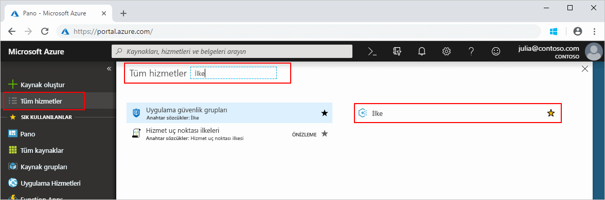
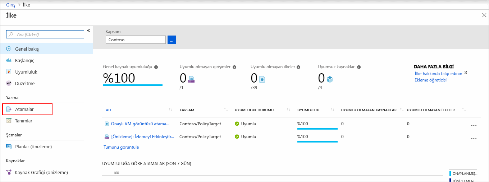
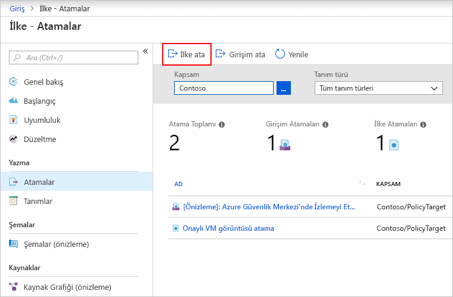
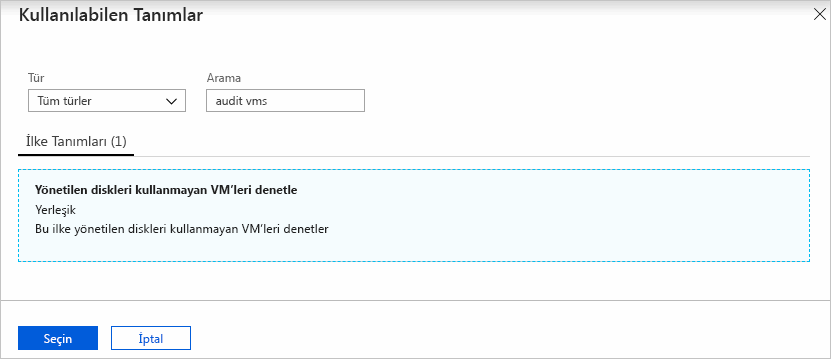
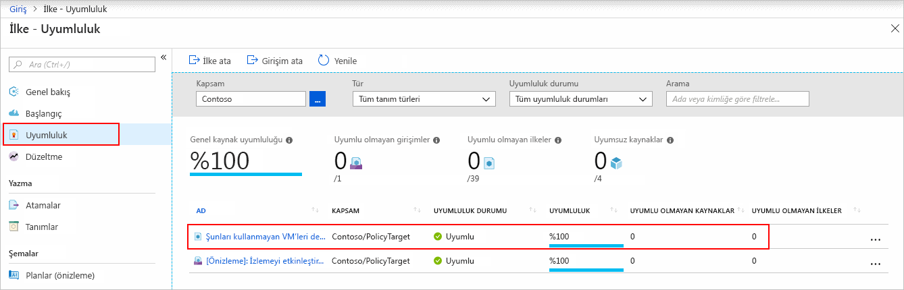
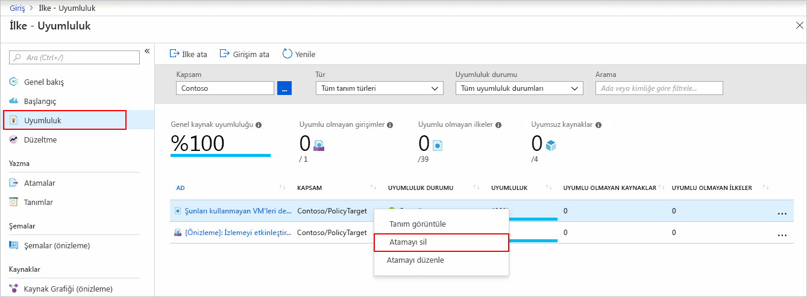

# Uyumlu olmayan kaynakları belirlemek üzere bir ilke ataması oluşturma

Azure’da uyumluluğu anlamanın ilk adımı, kaynaklarınızın durumunu belirlemektir.
Bu hızlı başlangıç, yönetilen disk kullanmayan sanal makineleri belirlemek üzere ilke ataması oluşturma işleminde size yol gösterir.

Bu işlemin sonunda, yönetilen disk kullanmayan sanal makineleri başarılı bir şekilde belirlemiş olacaksınız. Bu sanal makineler, ilke ataması ile *uyumsuzdur*.

Azure aboneliğiniz yoksa başlamadan önce [ücretsiz](https://azure.microsoft.com/free/) bir hesap oluşturun.

## İlke ataması oluşturma

Bu hızlı başlangıçta, bir ilke ataması oluşturma ve atama *denetim yönetilen diskleri kullanmayan Vm'leri* ilke tanımı.

1. Azure portalında **Tüm hizmetler**’e tıkladıktan sonra **İlke**'yi arayıp seçerek Azure İlkesi hizmetini başlatın.

   

1. Azure İlkesi sayfasının sol tarafından **Atamalar**'ı seçin. Atama, belirli bir kapsamda gerçekleşmesi için atanmış olan bir ilkedir.

   

1. **İlke - Atamalar** sayfasının üst kısmından **İlke Ata**'yı seçin.

   

1. **İlke Ata** sayfasında üç noktaya tıklayıp bir yönetim grubu veya abonelik belirleyerek **Kapsam**’ı seçin. İsterseniz bir kaynak grubu seçin. Kapsam, ilke atamasının hangi kaynaklarda veya kaynak gruplarında uygulanacağını belirler.  Ardından **Kapsam** sayfasının alt kısmından **Seç**’e tıklayın.

   Bu örnekte **Contoso** aboneliği kullanılır. Sizin aboneliğiniz farklı olacaktır.

1. Kaynaklar **Kapsam**’a göre dışlanabilir.  **Dışlamalar**, **Kapsam**’dan bir düzey aşağıda başlatılır. **Dışlamalar** isteğe bağlıdır, bu yüzden şimdilik boş bırakın.

1. **İlke tanımı** üç nokta öğesini seçerek kullanılabilen tanımların listesini açın. Azure İlkesi, kullanabileceğiniz yerleşik ilke tanımlarıyla birlikte gelir. Aşağıdakiler gibi çok sayıda ilke mevcuttur:

   - Etiketi ve değerini zorla
   - Etiketi ve değerini uygula
   - SQL Server sürüm 12.0 gerektir

   Kullanılabilir yerleşik ilkeler kısmi bir listesi için bkz. [ilkesi örnekleri](./samples/index.md).

1. İlke tanımları listenizde *Yönetilen disk kullanmayan VM'leri denetle* tanımını arayın. Bu ilkeye tıklayın ve **Seç**'e tıklayın.

   

1. **Atama adı** otomatik olarak seçtiğiniz ilke adıyla doldurulur, ancak bunu değiştirebilirsiniz. Bu örnek için *Yönetilen disk kullanmayan VM'leri denetle* ayarını değiştirmeyin. İsteğe bağlı bir **Açıklama** da ekleyebilirsiniz. Açıklama, bu ilke atamasıyla ilgili ayrıntıları sağlar. **Atayan**, oturum açmış kişiye göre otomatik olarak doldurulur. Bu alan isteğe bağlı olduğu için özel değerler girilebilir.

1. **Yönetilen Kimlik Oluşturun** seçeneğini işaretsiz bırakın. Bu kutuyu _gerekir_ işaretli olduğunda ilke veya girişim sahip bir ilke içerir [Deployıfnotexists](./concepts/effects.md#deployifnotexists) efekt. Bu Hızlı Başlangıç için kullandığınız ilke bulunmadığından, boş bırakın. Daha fazla bilgi için [yönetilen kimlikler](../../active-directory/managed-identities-azure-resources/overview.md) ve [düzeltme güvenliğinin işleyişi](./how-to/remediate-resources.md#how-remediation-security-works) bölümlerine bakın.

1. **Ata**'ya tıklayın.

Artık ortamınızın uyumluluk durumunu anlamak için uyumlu olmayan kaynakları belirlemeye hazırsınız.

## Uyumlu olmayan kaynakları belirleme

Seçin **Uyumluluk** sayfanın sol tarafındaki. Ardından bulun **denetim yönetilen diskleri kullanmayan Vm'leri** oluşturduğunuz ilke ataması.

Bu yeni atamayla uyumlu olmayan mevcut kaynaklar varsa, altında görünür **uyumlu olmayan kaynaklar**.

Bir koşul mevcut kaynaklarınıza göre değerlendirilip true sonucunu verdiğinde, bu kaynaklar ilkeyle uyumlu değil olarak işaretlenir. Aşağıdaki tabloda, elde edilen uyumluluk durumu için farklı ilke etkilerinin koşul değerlendirmesi ile nasıl çalıştığı gösterilmektedir. Azure portalında değerlendirme mantığı görünmese de, uyumluluk durumu sonuçları gösterilir. Uyumluluk durumu sonucu uyumlu veya uyumsuz şeklindedir.

| **Kaynak durumu** | **Etki** | **İlke Değerlendirmesi** | **Uyumluluk Durumu** |
| --- | --- | --- | --- |
| Var | Deny, Audit, Append\*, DeployIfNotExist\*, AuditIfNotExist\* | True | Uyumlu Değil |
| Var | Deny, Audit, Append\*, DeployIfNotExist\*, AuditIfNotExist\* | False | Uyumlu |
| Yeni | Audit, AuditIfNotExist\* | True | Uyumlu Değil |
| Yeni | Audit, AuditIfNotExist\* | False | Uyumlu |

\* Append, DeployIfNotExist ve AuditIfNotExist etkileri IF deyiminin TRUE olmasını gerektirir. Etkiler ayrıca varlık koşulunun uyumlu olmaması için FALSE olmasını gerektirir. TRUE olduğunda, IF koşulu ilgili kaynaklar için varlık koşulunun değerlendirilmesini tetikler.

## Kaynakları temizleme

Oluşturduğunuz atamayı kaldırmak için aşağıdaki adımları izleyin:

1. Azure İlkesi sayfasının sol tarafından **Uyumluluk**’u (veya **Atamalar**’ı) seçin ve oluşturduğunuz **Yönetilen disk kullanmayan VM'leri denetle** ilke atamasını bulun.

1. **Yönetilen disk kullanmayan VM'leri denetle** ilke atamasına sağ tıklayıp **Atamayı sil**’i seçin

   

## Sonraki adımlar

Bu hızlı başlangıçta bir kapsama ilke tanımı atadınız ve bunun uyumluluk raporunu değerlendirdiniz. İlke tanımı, kapsamdaki tüm kaynakların uyumlu olan ve olmayanları tanımlayan doğrular.

Yeni kaynakların uyumlu olduğunu doğrulamak için ilkeleri atama hakkında daha fazla bilgi için öğreticisiyle devam edin:

> [!div class="nextstepaction"]
> [İlke oluşturma ve yönetme](./tutorials/create-and-manage.md)