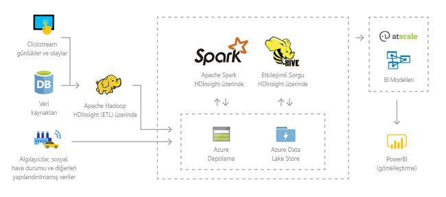
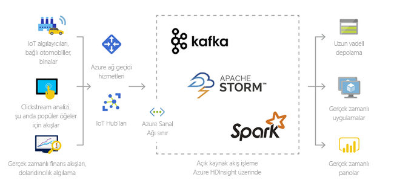
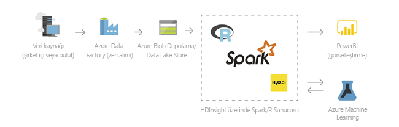
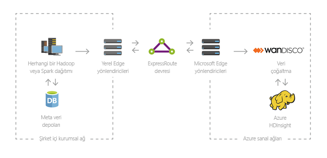

# Azure HDInsight, Apache Hadoop nedir?

Bu makalede, Azure HDInsight üzerinde Apache Hadoop için bir tanıtım sunulmaktadır. Azure HDInsight kuruluşlara yönelik bulutta bir tam olarak yönetilen, tam spektrumlu ve açık kaynak analiz hizmetidir. Hadoop, Apache Spark, Apache Hive, LLAP, Apache Kafka, Apache Storm, R ve daha fazlası gibi açık kaynak çerçeveleri kullanabilirsiniz. 

## HDInsight ve Hadoop teknoloji yığını nedir?

Kümelerde büyük veri kümelerinin dağıtılmış işlenmesi ve analizine yönelik ilk açık kaynak çerçeve [Apache Hadoop](https://hadoop.apache.org/)’tu. Yazılımlar ve yardımcı programlar, Apache Hive, Apache HBase, Spark, Kafka ve diğer birçok dahil olmak üzere, Hadoop teknoloji yığını içerir.

Azure HDInsight, Hadoop bileşenlerinin bulut dağıtımıdır. Azure HDInsight, devasa miktarlardaki verileri işlemeyi kolay, hızlı ve uygun maliyetli hale getirir. Hadoop, Spark, Hive, LLAP, Kafka, Storm ve R gibi en popüler açık kaynak çerçeveleri kullanabilirsiniz. Bu çerçeveler sayesinde ayıklama, dönüştürme ve yükleme (ETL), veri ambarı, makine öğrenimi ve IoT gibi diğer birçok senaryoyu mümkün kılabilirsiniz.

HDInsight kullanılabilir Hadoop teknolojisi yığını bileşenlerini görmek için bkz: [bileşenleri ve sürümleri HDInsight ile kullanılabilen](../hdinsight-component-versioning.md). HDInsight'ta Hadoop hakkında daha fazla bilgi edinmek için bkz. [HDInsight için Azure özellikleri sayfası](https://azure.microsoft.com/services/hdinsight/).

## Büyük veri nedir?

Hacmi gittikçe artan büyük veriler hiç olmadığı kadar yüksek hızlarda ve yüksek çeşitlilikteki biçimlerde toplanmaktadır. Geçmiş tarihli (depolanmış anlamına gelir) veya gerçek zamanlı (kaynaktan akışlı anlamına gelir) olabilir. Büyük veriler için en yaygın kullanım örnekleri hakkında bilgi edinmek için bkz. [HDInsight kullanma senaryoları](#scenarios-for-using-hdinsight).

## Neden HDInsight üzerinde Hadoop kullanmalıyım?

Bu bölümde Azure HDInsight özellikleri listelenmektedir.

|Özellik  |Açıklama  |
|---------|---------|
|Yerel bulut     |     Azure HDInsight, Azure üzerinde [Hadoop](apache-hadoop-linux-tutorial-get-started.md),  [Spark](../spark/apache-spark-jupyter-spark-sql.md),  [Etkileşimli sorgu (LLAP)](../interactive-query/apache-interactive-query-get-started.md),  [Kafka](../kafka/apache-kafka-get-started.md),  [Storm](../storm/apache-storm-tutorial-get-started-linux.md),  [HBase](../hbase/apache-hbase-tutorial-get-started-linux.md) ve  [ML Services](../r-server/r-server-overview.md) için en iyi duruma getirilmiş kümeler oluşturmanıza olanak sağlar. HDInsight ayrıca tüm üretim iş yüklerinizde uçtan uca SLA sağlar.  |
|Düşük maliyetli ve ölçeklendirilebilir     | HDInsight iş yüklerinin [ölçeğini](../hdinsight-administer-use-portal-linux.md#scale-clusters)  artırmanıza veya azaltmanıza olanak sağlar.  [İsteğe bağlı olarak kümeler oluşturup](../hdinsight-hadoop-create-linux-clusters-adf.md)  yalnızca kullandığınız kadarı için ödeme yaparak maliyetleri azaltabilirsiniz. İşlerinizi kullanıma hazır hale getirmek için veri işlem hatları da oluşturabilirsiniz. Ayrılmış işlem ve depolama daha iyi performans ve esneklik sağlar. |
|Güvenli ve uyumlu    | HDInsight; [Azure Sanal Ağ](../hdinsight-extend-hadoop-virtual-network.md), [şifreleme](../hdinsight-hadoop-create-linux-clusters-with-secure-transfer-storage.md) ve [Azure Active Directory](../domain-joined/apache-domain-joined-introduction.md) tümleştirmesi ile kurumsal veri varlıklarınızı korumanıza olanak sağlar. HDInsight ayrıca en popüler sektör ve kamu [uyumluluk standartlarını](https://azure.microsoft.com/overview/trusted-cloud) karşılar.        |
|İzleme    | Azure HDInsight ile tümleştirilir [Azure İzleyici günlükleri](../hdinsight-hadoop-oms-log-analytics-tutorial.md) ile izlemek için kullanabileceğiniz tüm kümelerinizi tek bir arabirim sağlamak üzere.        |
|Genel kullanılabilirlik | HDInsight diğer büyük veri analizi tekliflerinden daha fazla  [bölgede](https://azure.microsoft.com/regions/services/)  kullanılabilir. Azure HDInsight ayrıca temel bağımsız bölgelerde kurumsal ihtiyaçlarınızı karşılamanıza olanak sağlayan Azure Kamu, Çin ve Almanya’da da kullanılabilir. |  
|Üretkenlik     |  Azure HDInsight, tercih ettiğiniz geliştirme ortamlarıyla Hadoop ve Spark için zengin üretkenlik araçları kullanmanıza imkan tanır. Bu geliştirme ortamlarına Scala, Python, R, Java ve .NET için [Visual Studio](apache-hadoop-visual-studio-tools-get-started.md), [VSCode](../hdinsight-for-vscode.md), [Eclipse](../spark/apache-spark-eclipse-tool-plugin.md) ve [IntelliJ](../spark/apache-spark-intellij-tool-plugin.md) dahildir. Ayrıca, veri bilimcileri [Jupyter](../spark/apache-spark-jupyter-notebook-kernels.md) ve [Zeppelin](../spark/apache-spark-zeppelin-notebook.md) gibi popüler not defterlerini kullanarak işbirliği yapabilir.    |
|Genişletilebilirlik     |  [Betik eylemlerini](../hdinsight-hadoop-customize-cluster-linux.md) kullanarak, [kenar düğümleri ekleyerek](../hdinsight-apps-use-edge-node.md) veya [diğer büyük veri sertifikalı uygulamalarla tümleştirerek](../hdinsight-apps-install-applications.md) yüklü bileşenlerle (Hue, Presto, vb.) HDInsight kümelerini genişletebilirsiniz. HDInsight [tek tıklamayla](https://azure.microsoft.com/services/hdinsight/partner-ecosystem/) dağıtım ile en popüler büyük veri çözümleriyle sorunsuz tümleştirme sağlar.|

## HDInsight kullanma senaryoları

Azure HDInsight, büyük veri işlemeye yönelik çeşitli senaryolar için kullanılabilir. Geçmiş verileri (zaten toplanmış ve depolanmış veriler) veya gerçek zamanlı veriler (doğrudan kaynaktan akışı yapılan veriler) olabilir. Bu tür verileri işlemeye yönelik senaryolar aşağıdaki kategorilerde özetlenebilir: 

### Toplu işleme (ETL)

Ayıklama, dönüştürme ve yükleme (ETL), heterojen veri kaynaklarından yapılandırılmış veya yapılandırılmamış verilerin ayıklandığı bir süreçtir. Bunlar daha sonra yapılandırılmış bir biçime dönüştürülür ve bir veri deposuna yüklenir. Dönüştürülen verileri veri bilimi veya veri ambarlama için kullanabilirsiniz.

### Veri ambarlama

Herhangi bir biçimdeki yapılandırılmış veya yapılandırılmamış veriler üzerinde petabayt ölçeğinde etkileşimli sorgular gerçekleştirmek için HDInsight kullanabilirsiniz. Ayrıca bunları BI araçlarına bağlayan modeller de oluşturabilirsiniz. Daha fazla bilgi için, [bu müşteri başarı öyküsünü okuyun](https://customers.microsoft.com/story/milliman). 

### Nesnelerin İnterneti (IoT)

HDInsight kullanarak çeşitli cihazlardan gerçek zamanlı olarak alınan akış verilerini işleyebilirsiniz. Daha fazla bilgi edinmek için [Azure tarafından hazırlanan ve Azure Yönetilen disklerle HDInsight’ta Apache Kafka önizlemesinin genel önizlemeye sunulduğunu duyuran bu blog gönderisini okuyun](https://azure.microsoft.com/blog/announcing-public-preview-of-apache-kafka-on-hdinsight-with-azure-managed-disks/).

 

### Veri bilimi

Verilerden kritik öngörüleri ayıklayan uygulamalar oluşturmak için HDInsight kullanabilirsiniz. İşletmeniz için gelecekteki eğilimleri tahmin etmek için buna ek olarak Azure Machine Learning de kullanabilirsiniz. Daha fazla bilgi için, [bu müşteri başarı öyküsünü okuyun](https://customers.microsoft.com/story/pros).

### Hibrit

Bulutun gelişmiş analiz özelliklerinden yararlanmak üzere mevcut şirket içi büyük veri altyapınızı Azure’a genişletmek için HDInsight kullanabilirsiniz.

## HDInsight’taki küme türleri

HDInsight belirli küme türlerinin yanı sıra bileşen, yardımcı program ve dil ekleme olanağı gibi küme özelleştirme özelliklerini de içerir. HDInsight şu küme türlerini sunar:

|Küme Türü | Açıklama |
|---|---|
|[Apache Hadoop](https://wiki.apache.org/hadoop)|Bir çerçeve paralel toplu iş verilerini işlemek ve çözümlemek için kullanan HDFS, YARN kaynak yönetimini ve basit bir MapReduce programlama modeli.|
|[Apache Spark](https://spark.apache.org/)|Büyük veri analizi uygulamalarının performansını artırmak üzere bellek içi işlemeyi destekleyen açık kaynaklı ve Paralel işleme altyapısıdır. Bkz. [HDInsight’ta Apache Spark nedir?](../spark/apache-spark-overview.md)|
|[Apache HBase](https://hbase.apache.org/)|Büyük miktarlarda yapılandırmamış ve yarı yapılandırılmış veri--potansiyel olarak milyarlarca satır için rastgele erişim ve güçlü tutarlılık özellikleri sağlayan Hadoop'u temel alan bir NoSQL veritabanı milyonlarca sütun zaman. Bkz. [HDInsight'ta HBase nedir?](../hbase/apache-hbase-overview.md)|
|[ML Hizmetleri](https://docs.microsoft.com/machine-learning-server/rebranding-microsoft-r-server)|Dağıtılmış R işlemlerini barındırmak ve paralel olarak yönetmek için bir sunucu. Veri uzmanlarının, istatistikçilerin ve R programcılarının HDInsight üzerindeki ölçeklenebilir ve dağıtılmış analitik yöntemlerine istedikleri an erişmesini sağlar. Bkz. [HDInsight'ta ML Services'a genel bakış](../r-server/r-server-overview.md).|
|[Apache Storm](https://storm.incubator.apache.org/)|Büyük veri akışlarını hızlı şekilde işlemek için dağıtılmış, gerçek zamanlı hesaplama sistemi. Storm HDInsight’ta yönetilen küme olarak sunulur. Bkz. [Storm ve Hadoop kullanarak gerçek zamanlı algılayıcı verilerini çözümleme](../storm/apache-storm-sensor-data-analysis.md).|
|[Apache Interactive Query](https://cwiki.apache.org/confluence/display/Hive/LLAP)|Etkileşimli ve daha hızlı Hive sorguları için bellek içi caching. Bkz. [HDInsight'ta Interactive Query kullanımı](../interactive-query/apache-interactive-query-get-started.md).|
|[Apache Kafka](https://kafka.apache.org/)|Akış verisi işlem hatları ve uygulamaları oluşturmak için kullanılan bir açık kaynak platform. Kafka ayrıca veri akışları yayımlamanızı ve abone olmanızı sağlayan ileti-kuyruk işlevi de sunar. Bkz. [HDInsight'ta Apache Kafka'ya giriş](../kafka/apache-kafka-introduction.md).|

## HDInsight’ta açık kaynak bileşenler

Azure HDInsight, Hadoop, Spark, Hive, LLAP, Kafka, Storm, HBase ve r gibi açık kaynak çerçeveler ile kümeler oluşturmanıza olanak sağlar. Bu kümeler, varsayılan olarak, küme üzerinde yer alan şunun gibi diğer açık kaynak bileşenlerle gelen [Apache Ambari](https://github.com/apache/ambari/blob/trunk/ambari-server/docs/api/v1/index.md), [Avro](https://avro.apache.org/docs/current/spec.html), [Apache Hive](https://hive.apache.org), [ HCatalog](https://cwiki.apache.org/confluence/display/Hive/HCatalog/), [Apache Mahout](https://mahout.apache.org/), [Apache Hadoop MapReduce](https://wiki.apache.org/hadoop/MapReduce), [Apache Hadoop YARN](https://hadoop.apache.org/docs/current/hadoop-yarn/hadoop-yarn-site/YARN.html), [Apache Phoenix](https://phoenix.apache.org/), [Apache Pig](https://pig.apache.org/), [Apache Sqoop](https://sqoop.apache.org/), [Apache Tez](https://tez.apache.org/), [Apache Oozie](https://oozie.apache.org/), [Apache ZooKeeper](https://zookeeper.apache.org/).  

## HDInsight’taki programlama dilleri

Spark, HBase, Kafka ve Hadoop gibi HDInsight kümeleri birçok programlama dilini destekler. Bazı programlama dilleri varsayılan olarak yüklü değildir. Varsayılan olarak yüklü olmayan kitaplıklar, modüller veya paketler için [bileşeni betik eylemi kullanarak yükleyin](../hdinsight-hadoop-script-actions-linux.md).

|Programlama dili  |Bilgi  |
|---------|---------|
|Varsayılan programlama dili desteği     | Varsayılan olarak, HDInsight kümeleri aşağıdakileri destekler:<ul><li>Java</li><li>Python</li><li>.NET</li><li>Git</li></ul>  |
|Java sanal makine (JVM) dilleri     | Java sanal makinelerinde (JVM) Java dışındaki birçok dil çalışabilir. Bununla birlikte, bu dillerden bazılarını çalıştırırsanız kümeye ek bileşenler yüklemeniz gerekebilir. Aşağıdaki JVM tabanlı diller HDInsight kümelerinde desteklenir: <ul><li>Clojure</li><li>Jython (Java için Python)</li><li>Scala</li></ul>     |
|Hadoop’a özgü diller     | HDInsight kümeleri, Hadoop teknoloji yığınına özgü aşağıdaki dilleri destekler: <ul><li>Pig işleri için Pig Latin</li><li>Hive işleri için HiveQL ve SparkSQL</li></ul>        |

## HDInsight için geliştirme araçları

Azure sayesinde sorunsuz tümleştirmeyle HDInsight veri sorgusu ve işi yazıp göndermek için IntelliJ, Eclipse, Visual Studio Code ve Visual Studio gibi HDInsight geliştirme araçlarını kullanabilirsiniz.

* [IntelliJ için Azure araç seti](https://docs.microsoft.com/azure/hdinsight/spark/apache-spark-intellij-tool-plugin)

* [Eclipse için Azure araç seti](https://docs.microsoft.com/azure/hdinsight/spark/apache-spark-eclipse-tool-plugin)

* [VS Code için Azure HDInsight araçları](https://docs.microsoft.com/azure/hdinsight/hdinsight-for-vscode?branch=pr-en-us-22999)

* [Visual Studio için Azure Data Lake araçları](https://docs.microsoft.com/azure/hdinsight/hadoop/apache-hadoop-visual-studio-tools-get-started)

## HDInsight’ta İş Zekası

Bilinen iş zekası (BI) araçları, Power Query eklentisini veya Microsoft Hive ODBC sürücüsünü kullanarak HDInsight ile tümleştirilmiş verileri alır, çözümler ve raporlar:

* [Azure HDInsight ile veri görselleştirme araçları kullanarak Apache Spark BI](../spark/apache-spark-use-bi-tools.md)

* [Azure HDInsight, Microsoft Power BI ile Apache Hive verileri Görselleştirme](apache-hadoop-connect-hive-power-bi.md)

* [Azure HDInsight'ta Power BI ile Etkileşimli Sorgu Hive verilerini görselleştirme](../interactive-query/apache-hadoop-connect-hive-power-bi-directquery.md)

* [Excel'i Power Query ile Apache hadoop'a bağlama](apache-hadoop-connect-excel-power-query.md) (Windows gerekir)

* [Excel'i Microsoft Hive ODBC sürücüsü ile Apache hadoop'a bağlama](apache-hadoop-connect-excel-hive-odbc-driver.md) (Windows gerekir)

* [HDInsight ile SQL Server Analysis Services kullanma](https://docs.microsoft.com/previous-versions/msp-n-p/dn749857(v=pandp.10))

* [HDInsight ile SQL Server Reporting Services kullanma](https://docs.microsoft.com/previous-versions/msp-n-p/dn749856(v=pandp.10))

## Sonraki adımlar

* [HDInsight Apache Hadoop kümesi oluşturma](apache-hadoop-linux-create-cluster-get-started-portal.md)
