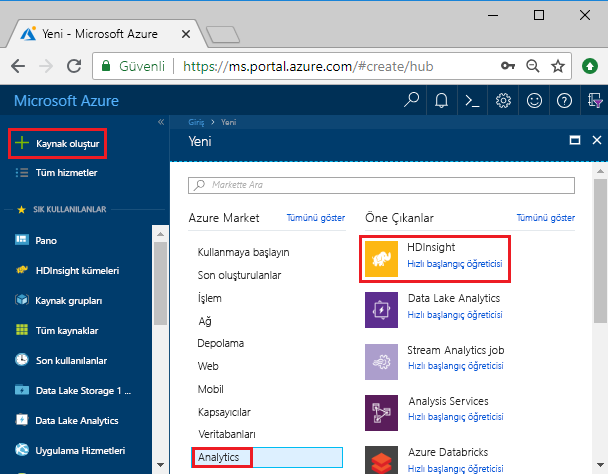
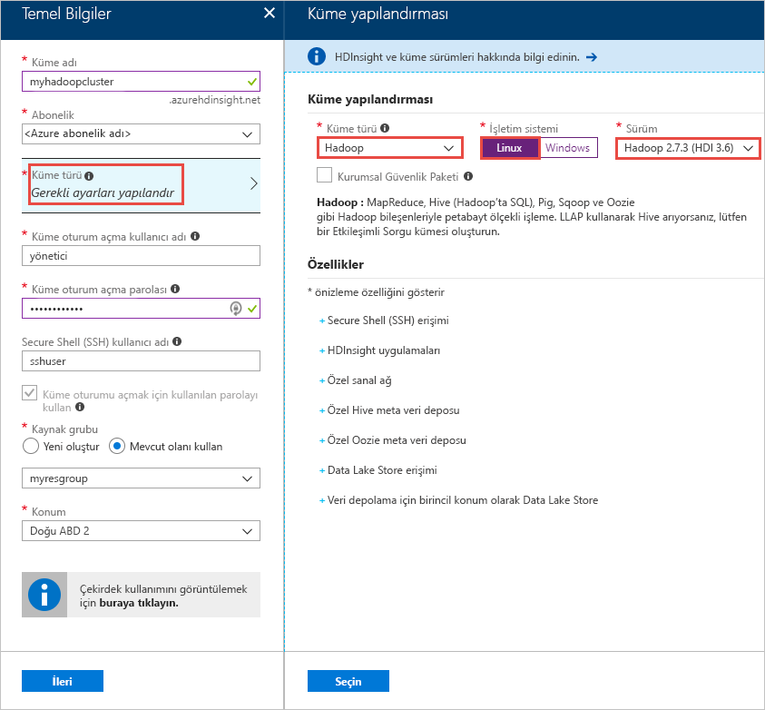
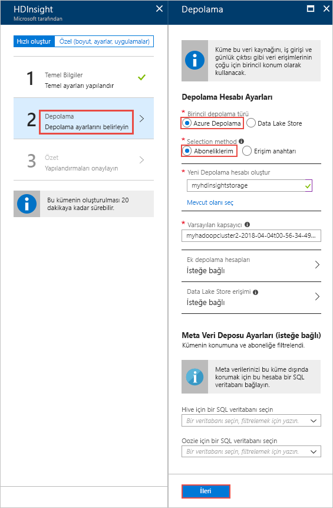
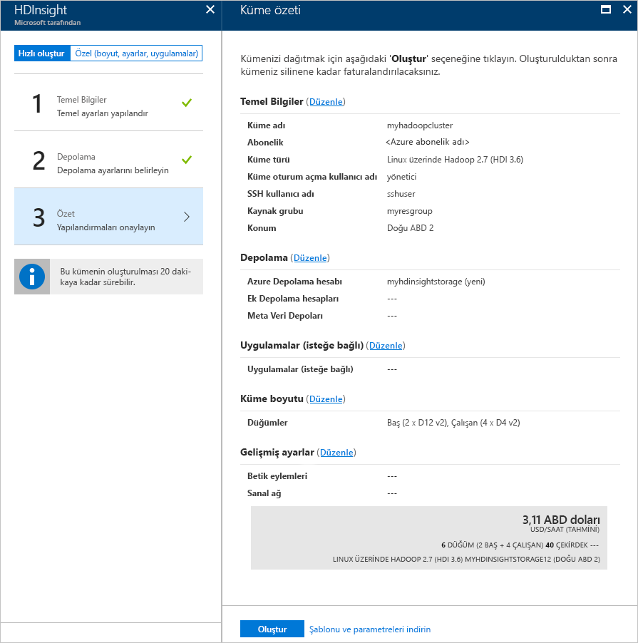

# Hızlı Başlangıç: Azure portalını kullanarak Azure HDInsight Apache Hadoop kümesi oluşturma

Bu makalede, nasıl oluşturulacağını öğreneceksiniz [Apache Hadoop](https://hadoop.apache.org/) Azure portalını kullanarak ve ardından HDInsight Apache Hive işlerini çalıştırın HDInsight kümeleri. Hadoop işlerinin çoğu toplu işlemdir. Bir küme oluşturur, bazı işleri çalıştırır ve kümeyi silersiniz. Bu makalede, üç görevi de gerçekleştirirsiniz.

Bu hızlı başlangıçta, HDInsight Hadoop kümesi oluşturmak için Azure portalını kullanırsınız. [Azure Resource Manager şablonunu](apache-hadoop-linux-tutorial-get-started.md) kullanarak da küme oluşturabilirsiniz.

Şu anda HDInsight [yedi farklı küme türüyle](./apache-hadoop-introduction.md#cluster-types-in-hdinsight) ile birlikte gelir. Her küme türü farklı bir bileşen kümesini destekler. Tüm küme türleri Hive'ı destekler. HDInsight desteklenen bileşenlerin listesi için bkz. [HDInsight tarafından sağlanan Apache Hadoop küme sürümlerindeki yenilikler nelerdir?](../hdinsight-component-versioning.md)  

Azure aboneliğiniz yoksa başlamadan önce [ücretsiz bir hesap oluşturun](https://azure.microsoft.com/free/).

## Bir Apache Hadoop kümesi oluşturma

Bu bölümde, Azure portalını kullanarak HDInsight’ta Hadoop kümesi oluşturursunuz. 

1. [Azure portalında](https://portal.azure.com) oturum açın.

1. Azure portalında **Kaynak oluşturun** > **Veri ve Analiz** > **HDInsight** seçeneklerini belirleyin. 

    

2. **HDInsight** > **Hızlı Oluştur** > **Temel Bilgiler** bölümünde, aşağıdaki ekran görüntüsünde önerildiği şekilde değerleri sağlayın:

    

    Aşağıdaki değerleri yazın veya seçin:
    
    |Özellik  |Açıklama  |
    |---------|---------|
    |**Küme adı**     | Hadoop kümesi için bir ad girin. HDInsight’taki tüm kümeler aynı DNS ad alanını paylaştığından, bu adın benzersiz olması gerekir. Ad, harf, rakam ve kısa çizgilerin dahil olduğu en fazla 59 karakterden oluşabilir. Adın ilk ve son karakterleri, kısa çizgi olamaz. |
    |**Abonelik**     |  Azure aboneliğinizi seçin. |
    |**Küme Türü**     | Bunu şimdilik atlayın. Bu yordamın sonraki adımında bu girdiyi sağlayacaksınız.|
    |**Küme oturum açma kullanıcı adı ve parolası**     | Varsayılan oturum açma adı **admin**’dir. Parola en az 10 karakter uzunluğunda olmalıdır ve en az bir rakam, bir büyük harf, bir küçük harf, bir alfasayısal olmayan karakter (' " ` karakterleri hariç\) içermelidir. "Pass@word1" gibi genel parolalar **sağlamadığınızdan** emin olun.|
    |**SSH kullanıcı adı** | Varsayılan kullanıcı adı **sshuser** şeklindedir.  SSH kullanıcı adı için başka bir ad sağlayabilirsiniz. |
    | **Küme oturum açmak için kullanılan parolayı kullan** | SSH kullanıcısı için, küme oturum açma kullanıcısı için sağlananla aynı parolayı kullanmak için bu onay kutusunu seçin.|
    |**Kaynak grubu**     | Bir kaynak grubu oluşturun veya mevcut bir kaynak grubunu seçin.  Kaynak grubu, Azure bileşenleri için bir kapsayıcıdır.  Bu durumda, kaynak grubu HDInsight kümesini ve bağımlı Azure Depolama hesabını içermektedir. |
    |**Konum**     | Kümenizi oluşturmak istediğiniz bir Azure konumunu seçin.  Daha iyi performans için kendinize yakın bir konum seçin. |
        
3. **Küme türü**’nü seçin ve sonra aşağıdaki ekran görüntüsünde gösterildiği şekilde girdileri sağlayın:

    

    Aşağıdaki değerleri seçin:
    
    |Özellik  |Açıklama  |
    |---------|---------|
    |**Küme türü**     | **Hadoop**’u seçin |
    |**İşletim sistemi**     | Seçin **Linux** |
    |**Sürüm**     | **Hadoop 2.7.3 (HDI 3.6)** seçeneğini belirleyin|

    **Seç**’e ve sonra **İleri**’ye tıklayın.

4. **Depolama** sekmesinde, aşağıdaki ekran görüntüsünde gösterildiği şekilde girdileri sağlayın:

    

    Aşağıdaki değerleri seçin:
    
    |Özellik  |Açıklama  |
    |---------|---------|
    |**Birincil depolama türü**     | Bu makale için, **Azure depolama**’yı seçerek Azure Depolama Blobunu varsayılan depolama hesabı olarak kullanın. Varsayılan depolama alanı olarak Azure Data Lake Storage’ı da kullanabilirsiniz. |
    |**Seçim yöntemi**     |  Bu makale için, **Aboneliklerim**’i seçerek Azure aboneliğinizdeki bir depolama hesabını kullanın. Diğer aboneliklerdeki depolama hesabını kullanmak için, **Erişim anahtarı**’nı seçin ve sonra o hesaba ilişkin erişim anahtarını sağlayın. |
    |**Yeni depolama hesabı oluşturma**     | Depolama hesabına bir ad verin.|

    Diğer tüm varsayılan değerleri kabul edin ve **İleri**’yi seçin.

5. **Özet** sekmesinde, önceki adımlarda seçtiğiniz değerleri doğrulayın.

    
      
4. **Oluştur**’u seçin. Portal panosunda, **HDInsight için dağıtım gönderme** başlıklı yeni bir kutucuk görürsünüz. Bir küme oluşturmak yaklaşık 20 dakika sürer.

    

4. Küme oluşturulduktan sonra, Azure portalında kümeye genel bakış sayfasını görürsünüz.
   
        
    
    Her kümenin bir [Azure Depolama hesabı](../hdinsight-hadoop-use-blob-storage.md) veya [Azure Data Lake hesabı](../hdinsight-hadoop-use-data-lake-store.md) bağımlılığı vardır. Bu genellikle varsayılan depolama hesabı olarak ifade edilir. HDInsight kümesi ve kümenin varsayılan depolama hesabının aynı Azure bölgesinde bulunması gerekir. Kümeleri silmek depolama hesabını silmez.

    > [!NOTE]  
    > Diğer küme oluşturma yöntemleri ve bu öğreticide kullanılan özellikler hakkında bilgi edinmek için bkz. [HDInsight kümeleri oluşturma](../hdinsight-hadoop-provision-linux-clusters.md).       

## Apache Hive sorguları çalıştırma

[Apache Hive](hdinsight-use-hive.md) HDInsight’ta kullanılan en popüler bileşendir. HDInsight’ta Hive işleri çalıştırmanın birçok yolu vardır. Bu öğreticide, portalda Ambari Hive görünümünü kullanırsınız. Hive işlerini göndermenin diğer yöntemleri için bkz. [HDInsight’ta Hive kullanma](hdinsight-use-hive.md).

1. Ambari’yi açmak için, önceki ekran görüntüsünden **Küme Panosu**’nu seçin.  Ayrıca, **https://&lt;ClusterName>.azurehdinsight.net** adresine de gidebilirsiniz. Burada &lt;ClusterName> değeri, önceki bölümde oluşturduğunuz kümedir.

    

2. Kümeyi oluştururken belirlediğiniz Hadoop kullanıcı adını ve parolasını girin. Varsayılan kullanıcı adı **admin** şeklindedir.

3. Aşağıdaki ekran görüntüsünde gösterildiği gibi **Hive Görünümü**’nü açın:
   
    

4. Sayfadaki **SORGU** sekmesinde, aşağıdaki HiveQL ifadelerini çalışma sayfasına yapıştırın:
   
        SHOW TABLES;

         

5. **Yürüt**’ü seçin. **SORGU** sekmesinin altında bir **SONUÇLAR** sekmesi görünür. Bu sekmede işle ilgili bilgiler görüntülenir. 
   
    Sorgu tamamladığında, **SORGU** sekmesinde işlemin sonuçları görüntülenir. **hivesampletable** adlı bir tablo görürsünüz. Bu örnek Hive tablosu tüm HDInsight kümeleri ile birlikte gelir.
   
    

6. Aşağıdaki sorguyu çalıştırmak için 4. ve 5. adımı yineleyin:
   
        SELECT * FROM hivesampletable;
   
7. Ayrıca sorgunun sonuçlarını da kaydedebilirsiniz. Sağdaki menü düğmesini seçtikten sonra, sonuçları CSV dosyası olarak indirme veya kümeyle ilişkili depolama hesabında depolama seçeneklerinden birini belirleyin.

    

Hive işini tamamladıktan sonra, [sonuçları Azure SQL Veritabanı’na veya SQL Server veritabanına aktarabilirsiniz](apache-hadoop-use-sqoop-mac-linux.md), ayrıca [Excel kullanarak sonuçları görselleştirebilirsiniz](apache-hadoop-connect-excel-power-query.md). HDInsight Hive kullanma hakkında daha fazla bilgi için bkz. [Apache Hive ve HiveQL kullanma HDInsight, Apache Hadoop ile bir örnek Apache log4j dosyasını çözümlemek için](hdinsight-use-hive.md).

## Sorun giderme

HDInsight kümeleri oluştururken sorun yaşarsanız bkz. [erişim denetimi gereksinimleri](../hdinsight-hadoop-create-linux-clusters-portal.md).

## Kaynakları temizleme
Öğreticiyi tamamladıktan sonra kümeyi silmek isteyebilirsiniz. HDInsight ile, verileriniz Azure Storage’da depolanır, böylece kullanılmadığında bir kümeyi güvenle silebilirsiniz. Ayrıca, kullanılmıyorken dahi HDInsight kümesi için sizden ücret kesilir. Küme ücretleri depolama ücretlerinin birkaç katı olduğundan, kullanılmadığında kümelerin silinmesi mantıklı olandır. 

> [!NOTE]  
> HDInsight üzerinde Hadoop kullanarak ETL işlemlerinin nasıl çalıştırılacağını öğrenmek için sonraki öğreticiye *hemen* ilerliyorsanız, kümeyi çalışır durumda tutmak isteyebilirsiniz. Bir Hadoop kümesini yeniden oluşturmak zorunda öğreticide olmasıdır. Ancak sonraki öğreticiye hemen geçmeyecekseniz şimdi kümeyi silmeniz gerekir.
> 
>  

**Küme ve/veya varsayılan depolama hesabını silmek için**

1. Azure portalın bulunduğu tarayıcı sekmesine dönün. Kümeye genel bakış sayfasında olmalısınız. Yalnızca kümeyi silmek, ancak varsayılan depolama hesabını korumak istiyorsanız **Sil**’i seçin.

    

2. Kümeyi ve varsayılan depolama hesabını silmek istiyorsanız, kaynak grubu sayfasını açmak için kaynak grubu adını (önceki ekran görüntüsünde vurgulanan) seçin.

3. **Kaynak grubunu sil**’i seçerek, kümeyi ve varsayılan depolama hesabını içeren kaynak grubunu silin. Kaynak grubu silindiğinde depolama hesabının da silindiğini unutmayın. Depolama hesabını tutmak istiyorsanız, yalnızca küme silmeyi seçin.

## Sonraki adımlar

Bu öğreticide, Kaynak Yöneticisi şablonu kullanarak Linux tabanlı bir HDInsight kümesi oluşturmayı ve temel Hive sorguları gerçekleştirmeyi öğrendiniz. Sonraki makalede, HDInsight üzerinde Hadoop kullanarak ayıklama, dönüştürme ve yükleme (ETL) işlemi gerçekleştirmeyi öğreneceksiniz.

> [!div class="nextstepaction"]
>[Ayıklama, dönüştürme ve HDInsight üzerinde Apache Hive kullanarak verileri yükleme](../hdinsight-analyze-flight-delay-data-linux.md)
