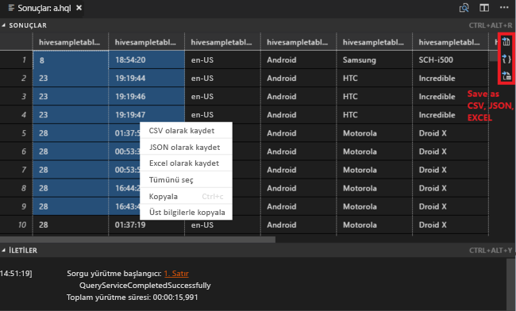
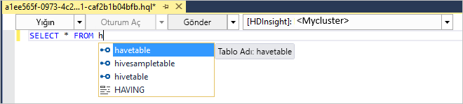
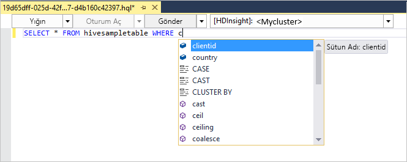
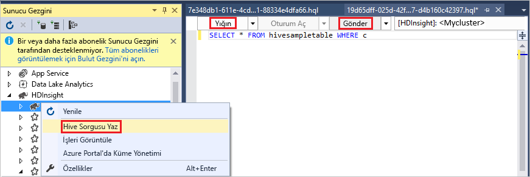
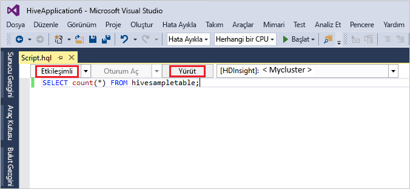
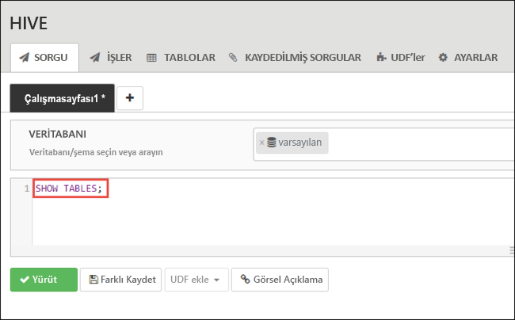
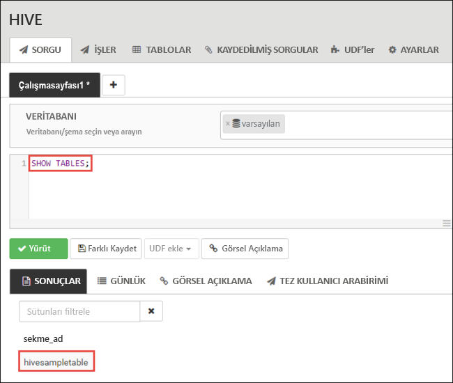
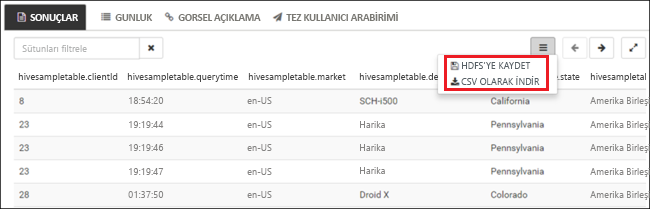

# <a name="quickstart-get-started-with-apache-hadoop-and-apache-hive-in-azure-hdinsight-using-resource-manager-template"></a>Hızlı Başlangıç: Apache Hadoop ve Apache Hive, Azure Resource Manager şablonu kullanarak HDInsight ile çalışmaya başlama

Bu makalede, nasıl oluşturulacağını öğreneceksiniz [Apache Hadoop](https://hadoop.apache.org/) Resource Manager şablonu kullanarak ve ardından HDInsight Hive işleri çalıştırmayı HDInsight kümeleri. Hadoop işlerinin çoğu toplu işlemdir. Bir küme oluşturur, bazı işleri çalıştırır ve kümeyi silersiniz. Bu makalede, üç görevi de gerçekleştirirsiniz.

Bu hızlı başlangıçta, HDInsight Hadoop kümesi oluşturmak için Kaynak Yöneticisi şablonu kullanırsınız. [Azure Portal](apache-hadoop-linux-create-cluster-get-started-portal.md)’ı kullanarak da küme oluşturabilirsiniz.  Benzer şablonları görüntülenebilir [Azure hızlı başlangıç şablonları](https://azure.microsoft.com/resources/templates/?resourceType=Microsoft.Hdinsight&pageNumber=1&sort=Popular). Şablon başvurusu bulunabilir [burada](https://docs.microsoft.com/azure/templates/microsoft.hdinsight/allversions).

Şu anda HDInsight [yedi farklı küme türüyle](./apache-hadoop-introduction.md#cluster-types-in-hdinsight) ile birlikte gelir. Her küme türü farklı bir bileşen kümesini destekler. Tüm küme türleri Hive'ı destekler. HDInsight’ta desteklenen bileşenlerin listesi için bkz. [HDInsight tarafından sağlanan Hadoop küme sürümlerindeki yenilikler nelerdir?](../hdinsight-component-versioning.md)  

Azure aboneliğiniz yoksa başlamadan önce [ücretsiz bir hesap oluşturun](https://azure.microsoft.com/free/).

<a name="create-cluster"></a>
## <a name="create-a-hadoop-cluster"></a>Hadoop kümesi oluşturma

Bu bölümde, Azure Resource Manager şablonu kullanarak HDInsight'ta Hadoop kümesi oluşturursunuz. Bu makaleyi izlemek için Kaynak Yöneticisi şablonuyla deneyim sahibi olmak gerekli değildir. 

1. Aşağıdaki **Azure’da dağıt** düğmesine tıklayarak Azure’da oturum açın ve Azure portalında Kaynak Yöneticisi şablonunu açın. 
   
    <a href="https://portal.azure.com/#create/Microsoft.Template/uri/https%3A%2F%2Fraw.githubusercontent.com%2FAzure%2Fazure-quickstart-templates%2Fmaster%2F101-hdinsight-linux-ssh-password%2Fazuredeploy.json" target="_blank"></a>

2. Aşağıdaki ekran görüntüsünde önerilen değerleri girin veya seçin:

    > [!NOTE]  
    > Sağladığınız değerler benzersiz olmalı ve adlandırma yönergelerini izlemelidir. Şablon, doğrulama denetimleri gerçekleştirmez. Sağladığınız değerler zaten kullanılıyorsa veya yönergelere uygun değilse, şablonu gönderdikten sonra bir hata alırsınız.    
    
    

    Aşağıdaki değerleri yazın veya seçin:
    
    |Özellik  |Açıklama  |
    |---------|---------|
    |**Abonelik**     |  Azure aboneliğinizi seçin. |
    |**Kaynak grubu**     | Bir kaynak grubu oluşturun veya mevcut bir kaynak grubunu seçin.  Kaynak grubu, Azure bileşenleri için bir kapsayıcıdır.  Bu durumda, kaynak grubu HDInsight kümesini ve bağımlı Azure Depolama hesabını içermektedir. |
    |**Konum**     | Kümenizi oluşturmak istediğiniz bir Azure konumunu seçin.  Daha iyi performans için kendinize yakın bir konum seçin. |
    |**Küme Adı**     | Hadoop kümesi için bir ad girin. HDInsight’taki tüm kümeler aynı DNS ad alanını paylaştığından, bu adın benzersiz olması gerekir. Ad yalnızca küçük harf, sayı ve kısa çizgi içerebilir ve bir harf ile başlaması gerekir.  Her kısa çizginin önünde ve arkasında kısa çizgi dışında bir karakter bulunmalıdır.  Adı, ayrıca 3 ila 59 karakter uzunluğunda olmalıdır. |
    |**Küme Türü**     | **hadoop**’u seçin. |
    |**Küme oturum açma adı ve parolası**     | Varsayılan oturum açma adı **admin**’dir. Parola en az 10 karakter uzunluğunda olmalıdır ve en az bir rakam, bir büyük harf, bir küçük harf, bir alfasayısal olmayan karakter (' " ` karakterleri hariç\) içermelidir. "Pass@word1" gibi genel parolalar **sağlamadığınızdan** emin olun.|
    |**SSH kullanıcı adı ve parolası**     | Varsayılan kullanıcı adı **sshuser** şeklindedir.  SSH kullanıcı adını yeniden adlandırabilirsiniz.  SSH kullanıcı parolasının gereksinimleri, küme oturum açma parolasıyla aynıdır.|
       
    Şablondaki bazı özellikler sabit kodlanmış olabilir.  Bu değerleri şablondan yapılandırabilirsiniz. Bu özellikler hakkında daha fazla açıklama için bkz: [Apache Hadoop kümeleri oluşturma HDInsight](../hdinsight-hadoop-provision-linux-clusters.md).

3. Seçin **hüküm ve koşulları yukarıda belirtilen kabul ediyorum**ve ardından **satın alma**. Dağıtımınızı sürmekte olan bir bildirim alırsınız.  Bir küme oluşturmak yaklaşık 20 dakika sürer.

4. Küme oluşturulduktan sonra alacak bir **dağıtım başarılı** bildirimi bir **kaynak grubuna gidin** bağlantı.  **Kaynak grubu** sayfası yeni HDInsight kümenize ve kümeyle ilişkilendirilmiş varsayılan depolama alanı listeler. Her küme sahip bir [Azure depolama hesabı](../hdinsight-hadoop-use-blob-storage.md) veya [Azure Data Lake Store hesabına](../hdinsight-hadoop-use-data-lake-store.md) bağımlılık. Bu genellikle varsayılan depolama hesabı olarak ifade edilir. HDInsight kümesi ve kümenin varsayılan depolama hesabının aynı Azure bölgesinde bulunması gerekir. Kümeleri silmek depolama hesabını silmez.

> [!NOTE]  
> Diğer küme oluşturma yöntemleri ve bu öğreticide kullanılan özellikler hakkında bilgi edinmek için bkz. [HDInsight kümeleri oluşturma](../hdinsight-hadoop-provision-linux-clusters.md).       


## <a name="use-vscode-to-run-hive-queries"></a>Hive sorgularını çalıştırmak için VSCode kullanma

VSCode’da HDInsight Araçları’nı edinme hakkında bilgi için bkz. [Visual Studio Code için Azure HDInsight Araçları’nı kullanma](../hdinsight-for-vscode.md).

### <a name="submit-interactive-hive-queries"></a>Etkileşimli Hive sorguları gönderme

VSCode için HDInsight Araçları ile, HDInsight etkileşimli sorgu kümelerine etkileşimli Hive sorguları gönderebilirsiniz.

1. Yoksa, yeni bir çalışma klasörü ve yeni bir Hive betik dosyası oluşturun.

2. Azure hesabınıza bağlanın ve henüz yapmadıysanız varsayılan kümeyi yapılandırın.

3. Aşağıdaki kodu kopyalayıp Hive dosyanıza yapıştırın ve kaydedin.

    ```hiveql
    SELECT * FROM hivesampletable;
    ```
4. Kod Düzenleyicisi'ni sağ tıklatın ve ardından **HDInsight: Etkileşimli hive** sorgu göndermek için. Araçlar, bağlam menüsünü kullanarak betik dosyasının tamamı yerine bir kod bloğu göndermenize de olanak sağlar. Kısa süre içinde sorgu sonuçları yeni bir sekmede görüntülenir.

   

    - **Sonuçları** paneli: Tüm sonucu yerel yol CSV, JSON veya Excel dosyası olarak kaydetmek veya çok satırlı seçmeniz yeterlidir.

    - **İLETİLERİ** paneli: Seçtiğinizde, **satırı** numarası çalışan kodun ilk satırını atlar.

Etkileşimli sorgu çalıştırma, daha çok daha az zaman alır [çalışan bir Apache Hive toplu](#submit-hive-batch-scripts).

### <a name="submit-hive-batch-scripts"></a>Hive toplu iş betikleri gönderme

1. Yoksa, yeni bir çalışma klasörü ve yeni bir Hive betik dosyası oluşturun.

2. Azure hesabınıza bağlanın ve henüz yapmadıysanız varsayılan kümeyi yapılandırın.

3. Aşağıdaki kodu kopyalayıp Hive dosyanıza yapıştırın ve kaydedin.

    ```hiveql
    SELECT * FROM hivesampletable;
    ```
4. Kod Düzenleyicisi'ni sağ tıklatın ve ardından **HDInsight: Hive toplu** bir Hive işi göndermek için. 

5. Göndermek istediğiniz kümeyi seçin.  

    Bir Hive işi göndermenizin ardından, **ÇIKTI** panelinde gönderim başarısı bilgileri ve iş kimliği görüntülenir. Hive işi, gerçek zamanlı iş günlüklerini ve durumunu gösteren **WEB TARAYICISI**’nı da açar.

   

[Etkileşimli Apache Hive sorguları gönderme](#submit-interactive-hive-queries) bir batch işi gönderme çok daha az zaman alır.

## <a name="use-visualstudio-to-run-hive-queries"></a>Hive sorguları çalıştırmak için Visual Studio kullanma

Visual Studio’da HDInsight Araçları’nı edinme hakkında bilgi için bkz. [Visual Studio için Data Lake Araçları’nı kullanma](./apache-hadoop-visual-studio-tools-get-started.md).

### <a name="run-hive-queries"></a>Hive sorguları çalıştırma

Hive sorguları oluşturmak ve çalıştırmak için iki seçeneğiniz vardır:

* Geçici sorgular oluşturma
* Hive uygulaması oluşturma

Oluşturma ve geçici sorguları çalıştırmak için:

1. **Sunucu Gezgini**’nde **Azure** > **HDInsight Kümeleri**’ni seçin.

2. Sorguyu çalıştırmak istediğiniz yerde sağ tıklayın ve **Hive Sorgusu Yaz**’ı seçin.  

3. Hive sorgularını girin. 

    Hive düzenleyicisi IntelliSense’i destekler. Visual Studio için Data Lake Araçları, Hive betiğinizi düzenlerken uzak meta verilerin yüklenmesini destekler. Örneğin, **SELECT * FROM** yazarsanız IntelliSense önerilen tüm tablo adlarını listeler. Bir tablo adı belirtildiğinde, IntelliSense sütun adlarını listeler. Araçlar çoğu Hive DML deyimlerini, alt sorguları ve yerleşik UDF'leri destekler.
   
    
   
    
   
   > [!NOTE]  
   > IntelliSense yalnızca HDInsight araç çubuğunda seçilen kümelerin meta verilerini önerir.
   > 
   
4. **Gönder** veya **Gönder (Gelişmiş)** öğesini seçin. 
   
    

   Gelişmiş gönderme seçeneğini belirlerseniz, betik için **İş Adı**, **Bağımsız Değişkenler**, **Ek Yapılandırmalar** ve **Durum Dizini**’ni yapılandırın:

    

   Etkileşimli Hive sorguları çalıştırma

   * Aşağı oka tıklayarak **etkileşimli** seçeneğini belirleyin. 
   
   * **Yürüt**'e tıklayın.

   

Hive çözümü oluşturmak ve çalıştırmak için:

1. **Dosya** menüsünde **Yeni**'yi ve ardından **Proje**'yi seçin.
2. Sol bölmede **HDInsight**’ı seçin. Orta bölmede seçin **Hive Uygulaması**’nı seçin. Özellikleri girip **Tamam**’ı seçin.
   
    
3. Betiği açmak için **Çözüm Gezgini**’nde **Script.hql** öğesine çift tıklayın.
4. Hive sorgularını girin ve gönderin. (Yukarıdaki 3. ve 4. adıma bakın)  


## <a name="run-hive-queries"></a>Hive sorguları çalıştırma

[Apache Hive](hdinsight-use-hive.md) HDInsight’ta kullanılan en popüler bileşendir. HDInsight’ta Hive işleri çalıştırmanın birçok yolu vardır. Bu öğreticide, portalda Ambari Hive görünümünü kullanırsınız. Hive işlerini göndermenin diğer yöntemleri için bkz. [Apache Hive, HDInsight kullanma](hdinsight-use-hive.md).

1. Ambari, açık şekilde **küme panoları** kutucuk seçin **Ambari görünümlerini**.  De göz atabilirsiniz **https://&lt;ClusterName&gt;. azurehdinsight.net**burada &lt;ClusterName&gt; önceki bölümde oluşturduğunuz kümedir.

    

2. Kümeyi oluştururken belirlediğiniz Hadoop kullanıcı adını ve parolasını girin. Varsayılan kullanıcı adı **admin** şeklindedir.

3. Seçin **Hive görünümü 2.0** aşağıdaki ekran görüntüsünde gösterildiği gibi:
   
    

4. Sayfadaki **SORGU** sekmesinde, aşağıdaki HiveQL ifadelerini çalışma sayfasına yapıştırın:
   
        SHOW TABLES;

    
   
   > [!NOTE]  
   > Hive noktalı virgül gerektirmektedir.       


5. **Yürüt**’ü seçin. **SORGU** sekmesinin altında bir **SONUÇLAR** sekmesi görünür. Bu sekmede işle ilgili bilgiler görüntülenir. 
   
    Sorgu tamamladığında, **sorgu** sekmesinde işlemin sonuçları görüntülenir. **hivesampletable** adlı bir tablo görürsünüz. Bu örnek Hive tablosu tüm HDInsight kümeleri ile birlikte gelir.
   
    

6. Aşağıdaki sorguyu çalıştırmak için 4. ve 5. adımı yineleyin:
   
        SELECT * FROM hivesampletable;
   
7. Ayrıca sorgunun sonuçlarını da kaydedebilirsiniz. Sağdaki menü düğmesini seçtikten sonra, sonuçları CSV dosyası olarak indirme veya kümeyle ilişkili depolama hesabında depolama seçeneklerinden birini belirleyin.

    

Hive işini tamamladıktan sonra, [sonuçları Azure SQL Veritabanı’na veya SQL Server veritabanına aktarabilirsiniz](apache-hadoop-use-sqoop-mac-linux.md), ayrıca [Excel kullanarak sonuçları görselleştirebilirsiniz](apache-hadoop-connect-excel-power-query.md). HDInsight Hive kullanma hakkında daha fazla bilgi için bkz. [Apache Hive ve HiveQL kullanma HDInsight, Apache Hadoop ile bir örnek Apache log4j dosyasını çözümlemek için](hdinsight-use-hive.md).

## <a name="troubleshoot"></a>Sorun giderme

HDInsight kümeleri oluştururken sorun yaşarsanız bkz. [erişim denetimi gereksinimleri](../hdinsight-hadoop-create-linux-clusters-portal.md).

## <a name="clean-up-resources"></a>Kaynakları temizleme
Makaleyi tamamladıktan sonra kümeyi silmek isteyebilirsiniz. HDInsight ile, verileriniz Azure Storage’da depolanır, böylece kullanılmadığında bir kümeyi güvenle silebilirsiniz. Ayrıca, kullanılmıyorken dahi HDInsight kümesi için sizden ücret kesilir. Küme ücretleri depolama ücretlerinin birkaç katı olduğundan, kullanılmadığında kümelerin silinmesi mantıklı olandır. 

> [!NOTE]  
> HDInsight üzerinde Hadoop kullanarak ETL işlemlerinin nasıl çalıştırılacağını öğrenmek için sonraki öğreticiye *hemen* ilerliyorsanız, kümeyi çalışır durumda tutmak isteyebilirsiniz. Öğreticide tekrar Hadoop kümesi oluşturmanız gerektiğinden bu gereklidir. Ancak sonraki öğreticiye hemen geçmeyecekseniz şimdi kümeyi silmeniz gerekir.

**Küme ve/veya varsayılan depolama hesabını silmek için**

1. Azure portalın bulunduğu tarayıcı sekmesine dönün. Kümeye genel bakış sayfasında olmalısınız. Yalnızca kümeyi silmek, ancak varsayılan depolama hesabını korumak istiyorsanız **Sil**’i seçin.

    

2. Kümeyi ve varsayılan depolama hesabını silmek istiyorsanız, kaynak grubu sayfasını açmak için kaynak grubu adını (önceki ekran görüntüsünde vurgulanan) seçin.

3. **Kaynak grubunu sil**’i seçerek, kümeyi ve varsayılan depolama hesabını içeren kaynak grubunu silin. Kaynak grubu silindiğinde depolama hesabının da silindiğini unutmayın. Depolama hesabını tutmak istiyorsanız, yalnızca küme silmeyi seçin.

## <a name="next-steps"></a>Sonraki adımlar
Bu öğreticide, Kaynak Yöneticisi şablonu kullanarak Linux tabanlı bir HDInsight kümesi oluşturmayı ve temel Hive sorguları gerçekleştirmeyi öğrendiniz. Sonraki makalede, HDInsight üzerinde Hadoop kullanarak ayıklama, dönüştürme ve yükleme (ETL) işlemi gerçekleştirmeyi öğreneceksiniz.

> [!div class="nextstepaction"]
>[Ayıklama, dönüştürme ve HDInsight üzerinde Apache Hive kullanarak verileri yükleme](../hdinsight-analyze-flight-delay-data-linux.md)

Kendi verilerinizle çalışmaya başlamaya hazırsanız ve HDInsight’ın verileri nasıl depoladı veya verileri HDInsight’a alma hakkında daha fazla bilgi edinmek istiyorsanız, aşağıdaki makalelere bakın:

* HDInsight’ın Azure Depolama’yı nasıl kullandığı hakkında daha fazla bilgi için bkz. [HDInsight ile Azure Depolama kullanma](../hdinsight-hadoop-use-blob-storage.md).
* Data Lake Store ile HDInsight kümesi oluşturma hakkında daha fazla bilgi için bkz: [hızlı başlangıç: HDInsight kümelerinde ayarlama](../../storage/data-lake-storage/quickstart-create-connect-hdi-cluster.md)
* HDInsight’a veril yükleme hakkında daha fazla bilgi için bkz. [Verileri HDInsight’a yükleme](../hdinsight-upload-data.md).
* [Azure Data Lake depolama Gen2 Azure HDInsight kümeleri ile kullanma](../hdinsight-hadoop-use-data-lake-storage-gen2.md)

HDInsight ile veri çözümleme hakkında daha fazla bilgi için aşağıdaki makalelere bakın:

* Visual Studio'dan Hive sorguları gerçekleştirme dahil, HDInsight ile Hive kullanma hakkında daha fazla bilgi için bkz. [HDInsight ile Hive kullanma Apache](hdinsight-use-hive.md).
* Verileri dönüştürmek için kullanılan bir dil olan pig hakkında bilgi için bkz: [HDInsight ile Apache Pig kullanma](hdinsight-use-pig.md).
* Hadoop’ta verileri işleyen programları yazmanın bir yöntemi olan MapReduce hakkında bilgi edinmek için bkz. [HDInsight ile MapReduce kullanma](hdinsight-use-mapreduce.md).
* HDInsight’taki verileri çözümlemek amacıyla Visual Studio için HDInsight Araçları kullanma hakkında bilgi edinmek için bkz. [HDInsight için Visual Studio Hadoop araçlarını kullanmaya başlama](apache-hadoop-visual-studio-tools-get-started.md).
* HDInsight’taki verileri analiz etmek amacıyla VSCode için HDInsight Araçları’nı kullanma hakkında bilgi edinmek için bkz. [Visual Studio Code için Azure HDInsight Araçları’nı kullanma](../hdinsight-for-vscode.md).


HDInsight kümesi oluşturma ve yönetme hakkında daha fazla bilgi edinmek istiyorsanız, aşağıdaki makalelere bakın:

* Linux tabanlı HDInsight kümenizi yönetme hakkında daha fazla bilgi için bkz: [Apache Ambari kullanarak HDInsight yönetme kümelerini](../hdinsight-hadoop-manage-ambari.md).
* HDInsight kümesi oluştururken tercih edebileceğiniz seçenekler hakkında daha fazla bilgi için bkz. [Özel seçenekleri kullanarak Linux’ta HDInsight oluşturma](../hdinsight-hadoop-provision-linux-clusters.md).

Azure Resource Manager şablonlarını kullanarak HDInsight kümesi oluşturma hakkında daha fazla bilgi için bkz:

* [Azure hızlı başlangıç şablonları](https://azure.microsoft.com/resources/templates/?resourceType=Microsoft.Hdinsight&pageNumber=1&sort=Popular).
* [Azure şablonu başvurusu](https://docs.microsoft.com/azure/templates/microsoft.hdinsight/allversions).

[1]: ../HDInsight/apache-hadoop-visual-studio-tools-get-started.md

[hdinsight-provision]: hdinsight-provision-linux-clusters.md
[hdinsight-upload-data]: hdinsight-upload-data.md
[hdinsight-use-hive]: hdinsight-use-hive.md
[hdinsight-use-pig]: hdinsight-use-pig.md
