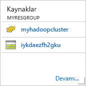

# Hızlı Başlangıç: Kaynak Yöneticisi şablonunu kullanarak Azure HDInsight’ta Hadoop ve Hive’ı kullanmaya başlama

Bu makalede, Kaynak Yöneticisi şablonunu kullanarak HDInsight’ta [Hadoop](http://hadoop.apache.org/) kümeleri oluşturmayı ve HDInsight’ta Hive işlerini çalıştırmayı öğrenirsiniz. Hadoop işlerinin çoğu toplu işlemdir. Bir küme oluşturur, bazı işleri çalıştırır ve kümeyi silersiniz. Bu makalede, üç görevi de gerçekleştirirsiniz.

Bu hızlı başlangıçta, HDInsight Hadoop kümesi oluşturmak için Kaynak Yöneticisi şablonu kullanırsınız. [Azure Portal](apache-hadoop-linux-create-cluster-get-started-portal.md)’ı kullanarak da küme oluşturabilirsiniz.

Şu anda HDInsight [yedi farklı küme türüyle](./apache-hadoop-introduction.md#cluster-types-in-hdinsight) ile birlikte gelir. Her küme türü farklı bir bileşen kümesini destekler. Tüm küme türleri Hive'ı destekler. HDInsight’ta desteklenen bileşenlerin listesi için bkz. [HDInsight tarafından sağlanan Hadoop küme sürümlerindeki yenilikler nelerdir?](../hdinsight-component-versioning.md)  

Azure aboneliğiniz yoksa başlamadan önce [ücretsiz bir hesap oluşturun](https://azure.microsoft.com/free/).

## Hadoop kümesi oluşturma

Bu bölümde, Azure Resource Manager şablonu kullanarak HDInsight'ta Hadoop kümesi oluşturursunuz. Bu makaleyi izlemek için Kaynak Yöneticisi şablonuyla deneyim sahibi olmak gerekli değildir. 

1. Aşağıdaki **Azure’da dağıt** düğmesine tıklayarak Azure’da oturum açın ve Azure portalında Kaynak Yöneticisi şablonunu açın. 
   
    

2. Aşağıdaki ekran görüntüsünde önerilen değerleri girin veya seçin:

    > [!NOTE]
    > Sağladığınız değerler benzersiz olmalı ve adlandırma yönergelerini izlemelidir. Şablon, doğrulama denetimleri gerçekleştirmez. Sağladığınız değerler zaten kullanılıyorsa veya yönergelere uygun değilse, şablonu gönderdikten sonra bir hata alırsınız.       
    > 
    >
    
    

    Aşağıdaki değerleri yazın veya seçin:
    
    |Özellik  |Açıklama  |
    |---------|---------|
    |**Abonelik**     |  Azure aboneliğinizi seçin. |
    |**Kaynak grubu**     | Bir kaynak grubu oluşturun veya mevcut bir kaynak grubunu seçin.  Kaynak grubu, Azure bileşenleri için bir kapsayıcıdır.  Bu durumda, kaynak grubu HDInsight kümesini ve bağımlı Azure Depolama hesabını içermektedir. |
    |**Konum**     | Kümenizi oluşturmak istediğiniz bir Azure konumunu seçin.  Daha iyi performans için kendinize yakın bir konum seçin. |
    |**Küme Türü**     | **hadoop**’u seçin. |
    |**Küme Adı**     | Hadoop kümesi için bir ad girin. HDInsight’taki tüm kümeler aynı DNS ad alanını paylaştığından, bu adın benzersiz olması gerekir. Ad, harf, rakam ve kısa çizgilerin dahil olduğu en fazla 59 karakterden oluşabilir. Adın ilk ve son karakterleri, kısa çizgi olamaz. |
    |**Küme oturum açma adı ve parolası**     | Varsayılan oturum açma adı **admin**’dir. Parola en az 10 karakter uzunluğunda olmalıdır ve en az bir rakam, bir büyük harf, bir küçük harf, bir alfasayısal olmayan karakter (' " ` karakterleri hariç\) içermelidir. "Pass@word1" gibi genel parolalar **sağlamadığınızdan** emin olun.|
    |**SSH kullanıcı adı ve parolası**     | Varsayılan kullanıcı adı **sshuser** şeklindedir.  SSH kullanıcı adını yeniden adlandırabilirsiniz.  SSH kullanıcı parolasının gereksinimleri, küme oturum açma parolasıyla aynıdır.|
       
    Şablondaki bazı özellikler sabit kodlanmış olabilir.  Bu değerleri şablondan yapılandırabilirsiniz. Bu özellikler hakkında daha fazla açıklama için bkz. [HDInsight'ta Hadoop kümeleri oluşturma](../hdinsight-hadoop-provision-linux-clusters.md).

3. **Yukarıdaki hüküm ve koşulları kabul ediyorum**’u ve **Panoya sabitle**’yi seçip **Satın al**’a tıklayın. Portal panosunda **Dağıtım gönderiliyor** başlıklı yeni bir kutucuk görürsünüz. Bir küme oluşturmak yaklaşık 20 dakika sürer.

    

4. Küme oluşturulduktan sonra, kutucuğun açıklamalı alt yazısı belirttiğiniz kaynak grubu adıyla değişir. Kutucukta, kaynak grubu içinde oluşturulan HDInsight kümesi de listelenir. 
   
    
    
5. Kutucukta, kümeyle ilişkili varsayılan depolama da listelenir. Her kümenin bir [Azure Depolama hesabı](../hdinsight-hadoop-use-blob-storage.md) veya [Azure Data Lake hesabı](../hdinsight-hadoop-use-data-lake-store.md) bağımlılığı vardır. Bu genellikle varsayılan depolama hesabı olarak ifade edilir. HDInsight kümesi ve kümenin varsayılan depolama hesabının aynı Azure bölgesinde bulunması gerekir. Kümeleri silmek depolama hesabını silmez.
    

> [!NOTE]
> Diğer küme oluşturma yöntemleri ve bu öğreticide kullanılan özellikler hakkında bilgi edinmek için bkz. [HDInsight kümeleri oluşturma](../hdinsight-hadoop-provision-linux-clusters.md).       
> 
>

## Hive sorguları çalıştırma

[Apache Hive](hdinsight-use-hive.md) HDInsight’ta kullanılan en popüler bileşendir. HDInsight’ta Hive işleri çalıştırmanın birçok yolu vardır. Bu öğreticide, portalda Ambari Hive görünümünü kullanırsınız. Hive işlerini göndermenin diğer yöntemleri için bkz. [HDInsight’ta Hive kullanma](hdinsight-use-hive.md).

1. Ambari’yi açmak için, önceki ekran görüntüsünden **Küme Panosu**’nu seçin.  Ayrıca, **https://&lt;ClusterName>.azurehdinsight.net** adresine de gidebilirsiniz. Burada &lt;ClusterName> değeri, önceki bölümde oluşturduğunuz kümedir.

    

2. Kümeyi oluştururken belirlediğiniz Hadoop kullanıcı adını ve parolasını girin. Varsayılan kullanıcı adı **admin** şeklindedir.

3. Aşağıdaki ekran görüntüsünde gösterildiği gibi **Hive Görünümü**’nü açın:
   
    

4. Sayfadaki **SORGU** sekmesinde, aşağıdaki HiveQL ifadelerini çalışma sayfasına yapıştırın:
   
        SHOW TABLES;

    
   
   > [!NOTE]
   > Hive noktalı virgül gerektirmektedir.       
   > 
   > 

5. **Yürüt**’ü seçin. **SORGU** sekmesinin altında bir **SONUÇLAR** sekmesi görünür. Bu sekmede işle ilgili bilgiler görüntülenir. 
   
    Sorgu tamamladığında, **SORGU** sekmesinde işlemin sonuçları görüntülenir. **hivesampletable** adlı bir tablo görürsünüz. Bu örnek Hive tablosu tüm HDInsight kümeleri ile birlikte gelir.
   
    

6. Aşağıdaki sorguyu çalıştırmak için 4. ve 5. adımı yineleyin:
   
        SELECT * FROM hivesampletable;
   
7. Ayrıca sorgunun sonuçlarını da kaydedebilirsiniz. Sağdaki menü düğmesini seçtikten sonra, sonuçları CSV dosyası olarak indirme veya kümeyle ilişkili depolama hesabında depolama seçeneklerinden birini belirleyin.

    

Hive işini tamamladıktan sonra, [sonuçları Azure SQL Database’e veya SQL Server veritabanına aktarabilirsiniz](apache-hadoop-use-sqoop-mac-linux.md), ayrıca [Excel kullanarak sonuçları görselleştirebilirsiniz](apache-hadoop-connect-excel-power-query.md). HDInsight’ta Hive kullanma hakkında daha fazla bilgi için bkz. [Örnek Apache log4j dosyasını çözümlemek amacıyla HDInsight’ta Hadoop ile Hive ve HiveQL kullanma](hdinsight-use-hive.md).

## Sorun giderme

HDInsight kümeleri oluştururken sorun yaşarsanız bkz. [erişim denetimi gereksinimleri](../hdinsight-administer-use-portal-linux.md#create-clusters).

## Kaynakları temizleme
Makaleyi tamamladıktan sonra kümeyi silmek isteyebilirsiniz. HDInsight ile, verileriniz Azure Storage’da depolanır, böylece kullanılmadığında bir kümeyi güvenle silebilirsiniz. Ayrıca, kullanılmıyorken dahi HDInsight kümesi için sizden ücret kesilir. Küme ücretleri depolama ücretlerinin birkaç katı olduğundan, kullanılmadığında kümelerin silinmesi mantıklı olandır. 

> [!NOTE]
> HDInsight üzerinde Hadoop kullanarak ETL işlemlerinin nasıl çalıştırılacağını öğrenmek için sonraki öğreticiye *hemen* ilerliyorsanız, kümeyi çalışır durumda tutmak isteyebilirsiniz. Öğreticide tekrar Hadoop kümesi oluşturmanız gerektiğinden bu gereklidir. Ancak sonraki öğreticiye hemen geçmeyecekseniz şimdi kümeyi silmeniz gerekir.
> 
> 

**Küme ve/veya varsayılan depolama hesabını silmek için**

1. Azure portalın bulunduğu tarayıcı sekmesine dönün. Kümeye genel bakış sayfasında olmalısınız. Yalnızca kümeyi silmek, ancak varsayılan depolama hesabını korumak istiyorsanız **Sil**’i seçin.

    

2. Kümeyi ve varsayılan depolama hesabını silmek istiyorsanız, kaynak grubu sayfasını açmak için kaynak grubu adını (önceki ekran görüntüsünde vurgulanan) seçin.

3. **Kaynak grubunu sil**’i seçerek, kümeyi ve varsayılan depolama hesabını içeren kaynak grubunu silin. Kaynak grubu silindiğinde depolama hesabının da silindiğini unutmayın. Depolama hesabını tutmak istiyorsanız, yalnızca küme silmeyi seçin.

## Sonraki adımlar
Bu öğreticide, Kaynak Yöneticisi şablonu kullanarak Linux tabanlı bir HDInsight kümesi oluşturmayı ve temel Hive sorguları gerçekleştirmeyi öğrendiniz. Sonraki makalede, HDInsight üzerinde Hadoop kullanarak ayıklama, dönüştürme ve yükleme (ETL) işlemi gerçekleştirmeyi öğreneceksiniz.

> [!div class="nextstepaction"]
>[HDInsight üzerinde Apache Hive kullanarak verileri ayıklama, dönüştürme ve yükleme](../hdinsight-analyze-flight-delay-data-linux.md)

Kendi verilerinizle çalışmaya başlamaya hazırsanız ve HDInsight’ın verileri nasıl depoladı veya verileri HDInsight’a alma hakkında daha fazla bilgi edinmek istiyorsanız, aşağıdaki makalelere bakın:

* HDInsight’ın Azure Depolama’yı nasıl kullandığı hakkında daha fazla bilgi için bkz. [HDInsight ile Azure Depolama kullanma](../hdinsight-hadoop-use-blob-storage.md).
* HDInsight’a veril yükleme hakkında daha fazla bilgi için bkz. [Verileri HDInsight’a yükleme](../hdinsight-upload-data.md).

HDInsight ile veri çözümleme hakkında daha fazla bilgi için aşağıdaki makalelere bakın:

* Visual Studio'da Hive sorguları gerçekleştirme dahil, HDInsight ile Hive kullanma hakkında daha fazla bilgi için bkz. [HDInsight ile Hive kullanma](hdinsight-use-hive.md).
* Verileri dönüştürmek için kullanılan bir dil olan Pig hakkında bilgi için bkz. [HDInsight ile Pig kullanma](hdinsight-use-pig.md).
* Hadoop’ta verileri işleyen programları yazmanın bir yöntemi olan MapReduce hakkında bilgi edinmek için bkz. [HDInsight ile MapReduce kullanma](hdinsight-use-mapreduce.md).
* HDInsight’taki verileri çözümlemek amacıyla Visual Studio için HDInsight Araçları kullanma hakkında bilgi edinmek için bkz. [HDInsight için Visual Studio Hadoop araçlarını kullanmaya başlama](apache-hadoop-visual-studio-tools-get-started.md).

HDInsight kümesi oluşturma ve yönetme hakkında daha fazla bilgi edinmek istiyorsanız, aşağıdaki makalelere bakın:

* Linux tabanlı HDInsight kümenizi yönetme hakkında bilgi edinmek için bkz. [Ambari kullanarak HDInsight kümelerini yönetme](../hdinsight-hadoop-manage-ambari.md).
* HDInsight kümesi oluştururken tercih edebileceğiniz seçenekler hakkında daha fazla bilgi için bkz. [Özel seçenekleri kullanarak Linux’ta HDInsight oluşturma](../hdinsight-hadoop-provision-linux-clusters.md).

[1]: ../HDInsight/apache-hadoop-visual-studio-tools-get-started.md

[hdinsight-provision]: hdinsight-provision-linux-clusters.md
[hdinsight-upload-data]: hdinsight-upload-data.md
[hdinsight-use-hive]: hdinsight-use-hive.md
[hdinsight-use-pig]: hdinsight-use-pig.md

