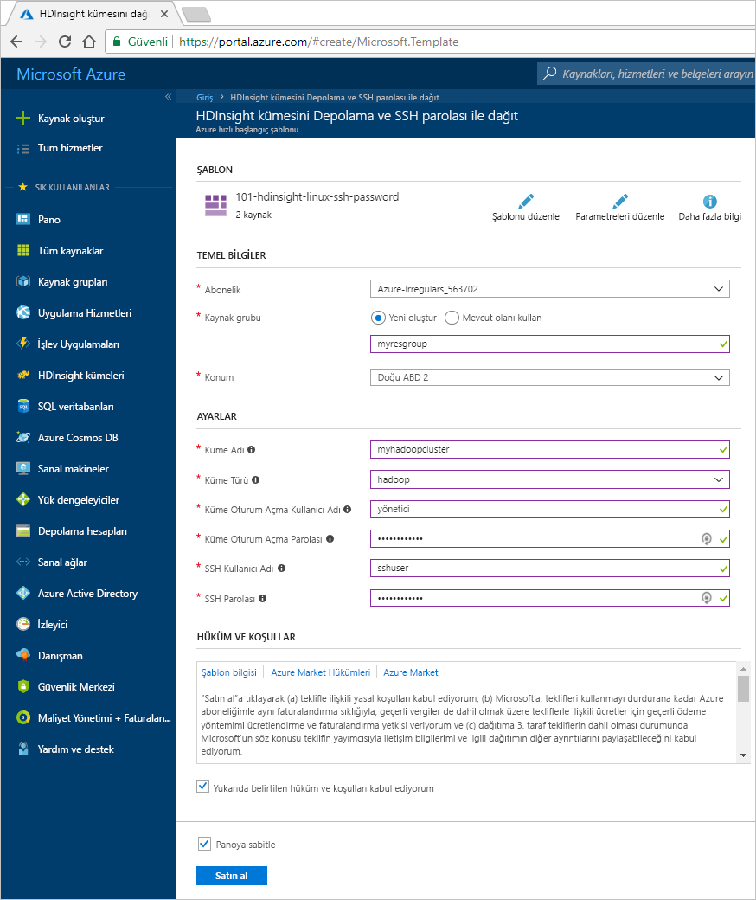
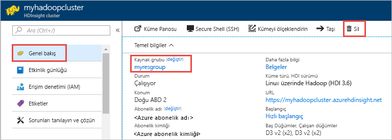

# Hızlı Başlangıç: Azure Resource Manager şablonu kullanarak HDInsight Apache Hadoop kümesi oluşturma

Bu hızlı başlangıçta, Azure Resource Manager şablonu kullanarak HDInsight Apache Hadoop kümesi oluşturma işlemini öğrenin.

Benzer şablonları görüntülenebilir [Azure hızlı başlangıç şablonları](https://azure.microsoft.com/resources/templates/?resourceType=Microsoft.Hdinsight&pageNumber=1&sort=Popular). Şablon başvurusu bulunabilir [burada](https://docs.microsoft.com/azure/templates/microsoft.hdinsight/allversions).  Kullanarak bir küme oluşturabilirsiniz [Azure portalında](apache-hadoop-linux-create-cluster-get-started-portal.md).  

Şu anda HDInsight [yedi farklı küme türüyle](./apache-hadoop-introduction.md#cluster-types-in-hdinsight) ile birlikte gelir. Her küme türü farklı bir bileşen kümesini destekler. Tüm küme türleri Hive'ı destekler. HDInsight’ta desteklenen bileşenlerin listesi için bkz. [HDInsight tarafından sağlanan Hadoop küme sürümlerindeki yenilikler nelerdir?](../hdinsight-component-versioning.md)  

Azure aboneliğiniz yoksa başlamadan önce [ücretsiz bir hesap oluşturun](https://azure.microsoft.com/free/).

## Hadoop kümesi oluşturma

1. Seçin **azure'a Dağıt** Azure'da oturum açın ve Azure portalında Resource Manager şablonu açmak için aşağıdaki düğmeye.
   
    

2. Aşağıdaki değerleri yazın veya seçin:

    |Özellik  |Açıklama  |
    |---------|---------|
    |**Abonelik**     |  Azure aboneliğinizi seçin. |
    |**Kaynak grubu**     | Bir kaynak grubu oluşturun veya mevcut bir kaynak grubunu seçin.  Kaynak grubu, Azure bileşenleri için bir kapsayıcıdır.  Bu durumda, kaynak grubu HDInsight kümesini ve bağımlı Azure Depolama hesabını içermektedir. |
    |**Konum**     | Kümenizi oluşturmak istediğiniz bir Azure konumunu seçin.  Daha iyi performans için kendinize yakın bir konum seçin. |
    |**Küme Adı**     | Hadoop kümesi için bir ad girin. HDInsight’taki tüm kümeler aynı DNS ad alanını paylaştığından, bu adın benzersiz olması gerekir. Ad yalnızca küçük harf, sayı ve kısa çizgi içerebilir ve bir harf ile başlaması gerekir.  Her kısa çizginin önünde ve arkasında kısa çizgi dışında bir karakter bulunmalıdır.  Adı, ayrıca 3 ila 59 karakter uzunluğunda olmalıdır. |
    |**Küme Türü**     | **hadoop**’u seçin. |
    |**Küme oturum açma adı ve parolası**     | Varsayılan oturum açma adı **admin**’dir. Parola en az 10 karakter uzunluğunda olmalıdır ve en az bir rakam, bir büyük harf, bir küçük harf, bir alfasayısal olmayan karakter (' " ` karakterleri hariç\) içermelidir. "Pass@word1" gibi genel parolalar **sağlamadığınızdan** emin olun.|
    |**SSH kullanıcı adı ve parolası**     | Varsayılan kullanıcı adı **sshuser** şeklindedir.  SSH kullanıcı adını yeniden adlandırabilirsiniz.  SSH kullanıcı parolasının gereksinimleri, küme oturum açma parolasıyla aynıdır.|

    Şablondaki bazı özellikler sabit kodlanmış olabilir.  Bu değerleri şablondan yapılandırabilirsiniz. Bu özellikler hakkında daha fazla açıklama için bkz: [Apache Hadoop kümeleri oluşturma HDInsight](../hdinsight-hadoop-provision-linux-clusters.md).

    > [!NOTE]  
    > Sağladığınız değerler benzersiz olmalı ve adlandırma yönergelerini izlemelidir. Şablon, doğrulama denetimleri gerçekleştirmez. Sağladığınız değerler zaten kullanılıyorsa veya yönergelere uygun değilse, şablonu gönderdikten sonra bir hata alırsınız.  

    

3. Seçin **hüküm ve koşulları yukarıda belirtilen kabul ediyorum**ve ardından **satın alma**. Dağıtımınızı sürmekte olan bir bildirim alırsınız.  Bir küme oluşturmak yaklaşık 20 dakika sürer.

4. Küme oluşturulduktan sonra alacak bir **dağıtım başarılı** bildirimi bir **kaynak grubuna gidin** bağlantı.  **Kaynak grubu** sayfası yeni HDInsight kümenize ve kümeyle ilişkilendirilmiş varsayılan depolama alanı listeler. Her küme sahip bir [Azure depolama hesabı](../hdinsight-hadoop-use-blob-storage.md) veya [Azure Data Lake Store hesabına](../hdinsight-hadoop-use-data-lake-store.md) bağımlılık. Bu genellikle varsayılan depolama hesabı olarak ifade edilir. HDInsight kümesi ve kümenin varsayılan depolama hesabının aynı Azure bölgesinde birlikte gerekir. Kümeleri silmek depolama hesabını silmez.

> [!NOTE]  
> Diğer küme oluşturma yöntemleri ve bu hızlı başlangıçta kullanılan özellikler hakkında bilgi edinmek bkz [oluşturma HDInsight kümeleri](../hdinsight-hadoop-provision-linux-clusters.md).

## Sorun giderme

HDInsight kümeleri oluştururken sorun yaşarsanız bkz. [erişim denetimi gereksinimleri](../hdinsight-hadoop-customize-cluster-linux.md#access-control).

## Kaynakları temizleme
Hızlı başlangıcı tamamladıktan sonra kümeyi silmek isteyebilirsiniz. HDInsight ile, verileriniz Azure Storage’da depolanır, böylece kullanılmadığında bir kümeyi güvenle silebilirsiniz. Ayrıca, kullanılmıyorken dahi HDInsight kümesi için sizden ücret kesilir. Küme ücretleri depolama ücretlerinin birkaç katı olduğundan, kullanılmadığında kümelerin silinmesi mantıklı olandır.

> [!NOTE]  
> HDInsight üzerinde Hadoop kullanarak ETL işlemlerinin nasıl çalıştırılacağını öğrenmek için sonraki öğreticiye *hemen* ilerliyorsanız, kümeyi çalışır durumda tutmak isteyebilirsiniz. Bir Hadoop kümesini yeniden oluşturmak zorunda öğreticide olmasıdır. Ancak sonraki öğreticiye hemen geçmeyecekseniz şimdi kümeyi silmeniz gerekir.

**Küme ve/veya varsayılan depolama hesabını silmek için**

1. Azure portalın bulunduğu tarayıcı sekmesine dönün. Kümeye genel bakış sayfasında olmalısınız. Yalnızca kümeyi silmek, ancak varsayılan depolama hesabını korumak istiyorsanız **Sil**’i seçin.

    

2. Kümeyi ve varsayılan depolama hesabını silmek istiyorsanız, kaynak grubu sayfasını açmak için kaynak grubu adını (önceki ekran görüntüsünde vurgulanan) seçin.

3. **Kaynak grubunu sil**’i seçerek, kümeyi ve varsayılan depolama hesabını içeren kaynak grubunu silin. Kaynak grubu silindiğinde depolama hesabının da silindiğini unutmayın. Depolama hesabını tutmak istiyorsanız, yalnızca küme silmeyi seçin.

## Sonraki adımlar

Bu hızlı başlangıçta, bir Resource Manager şablonu kullanarak HDInsight Apache Hadoop kümesi oluşturma işlemini öğrendiniz. Sonraki makalede, HDInsight üzerinde Hadoop kullanarak ayıklama, dönüştürme ve yükleme (ETL) işlemi gerçekleştirmeyi öğreneceksiniz.

> [!div class="nextstepaction"]
>[Ayıklama, dönüştürme ve HDInsight üzerinde Apache Hive kullanarak verileri yükleme](../hdinsight-analyze-flight-delay-data-linux.md)