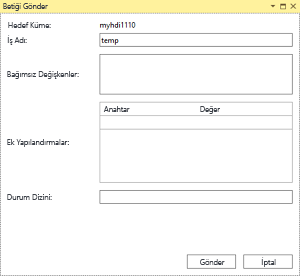
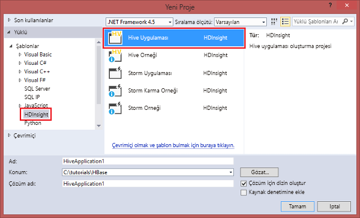

# Bağlanmak için Azure HDInsight ve Apache Hive sorguları çalıştırmak için Visual Studio için Data Lake Araçları'nı kullanın

Nasıl kullanacağınızı öğrenin [Microsoft Azure Data Lake ve Stream Analytics araçları Visual Studio için](https://www.microsoft.com/download/details.aspx?id=49504) (Ayrıca adlı Data Lake Apache Hadoop'a bağlama için araçları) kümeleri içinde [Azure HDInsight](../hdinsight-hadoop-introduction.md) ve Hive sorguları göndermek.  

HDInsight'ı kullanma hakkında daha fazla bilgi için [HDInsight'a giriş](../hdinsight-hadoop-introduction.md) ve [HDInsight ile çalışmaya başlama](apache-hadoop-linux-tutorial-get-started.md) bölümlerine göz atın.  

Bir Apache Storm kümesine bağlanma hakkında daha fazla bilgi için bkz. [geliştirme C# Visual Studio kullanarak HDInsight üzerinde Apache Storm topolojilerini](../storm/apache-storm-develop-csharp-visual-studio-topology.md).

Visual Studio için Data Lake Araçlarını hem Azure Data Lake Analytics’e hem de HDInsight’a erişmek için kullanabilirsiniz. Data Lake Araçları hakkında bilgi için bkz. [Visual Studio için Data Lake Araçları'nı kullanarak U-SQL betikleri geliştirme](../../data-lake-analytics/data-lake-analytics-data-lake-tools-get-started.md).

## Ön koşullar

Bu öğreticiyi tamamlamak ve Visual Studio için Data Lake Araçları’nı kullanmak üzere şunlar gerekir:

* Bir Azure HDInsight kümesi. Bir HDInsight kümesi oluşturmak için bkz: [Azure HDInsight Apache Hadoop kullanmaya başlama](apache-hadoop-linux-tutorial-get-started.md). Etkileşimli Apache Hive sorguları çalıştırmak için gereken bir [HDInsight etkileşimli sorgu](../interactive-query/apache-interactive-query-get-started.md) kümesi.  

* [Visual Studio](https://visualstudio.microsoft.com/downloads/) (2013 veya daha yeni).  [Visual Studio Community sürümü](https://visualstudio.microsoft.com/vs/community/) ücretsizdir.  Ayrıca bkz [Visual Studio 2017'yi yükleme](https://docs.microsoft.com/visualstudio/install/install-visual-studio).

  > [!IMPORTANT]  
  > Data Lake araçları artık Visual Studio 2013 için desteklenmiyor. 

## Visual Studio için Data Lake Araçları’nı yükleme.  

* Visual Studio 2017  
  Yükleme sırasında dahil en az olun iş yükleri **Azure geliştirme** veya **veri depolama ve işleme**.  

  Var olan yüklemeler için menü çubuğundan gitmek için **Araçları** > **araçları ve özellikleri Al...**  Visual Studio Yükleyicisi'ni açın.  Ardından en az iş yükleri **Azure geliştirme** veya **veri depolama ve işleme**.

  

* Visual Studio 2013 ve 2015  
  [Data Lake araçlarını indirin](https://www.microsoft.com/download/details.aspx?id=49504). Visual Studio sürümünüzle eşleşen Data Lake Araçları sürümünü seçin.  

> [!NOTE]  
> Şu anda Visual Studio için Data Lake Araçları’nın yalnızca İngilizce sürümü mevcuttur.

## Visual Studio için Data Lake araçları güncelleştirme  

1. Visual Studio'yu açın.

2. Menü çubuğundan gidin **Araçları** > **Uzantılar ve güncelleştirmeler...** .

3. Gelen **Uzantılar ve güncelleştirmeler** penceresini genişletin **güncelleştirmeleri** soldaki.

4. Bir güncelleştirme varsa **Azure Data Lake ve Stream analitik araçlar** ana penceresinde görünür.  Seçin **güncelleştirme**.

> [!NOTE]  
> Etkileşimli Sorgu kümelerine bağlanmak ve etkileşimli Hive sorguları çalıştırmak için yalnızca Data Lake Araçları sürüm 2.3.0.0 veya üzerini kullanabilirsiniz.

## Azure aboneliklerine bağlanma
Visual Studio için Data Lake Araçları’nı kullanarak HDInsight kümelerinize bağlanabilir, bazı temel yönetim işlemlerini gerçekleştirebilir ve Hive sorguları çalıştırabilirsiniz.

> [!NOTE]  
> Genel bir Hadoop kümesine bağlanma hakkında bilgi için bkz. [Visual Studio kullanarak Hive sorguları yazma ve gönderme](https://blogs.msdn.com/b/xiaoyong/archive/2015/05/04/how-to-write-and-submit-hive-queries-using-visual-studio.aspx).

Azure aboneliğinize bağlanmak için:

1. Visual Studio'yu açın.

2. Menü çubuğundan gidin **görünümü** > **Sunucu Gezgini**.

3. Sunucu Gezgini'nden sağ **Azure**seçin **Microsoft Azure aboneliğine Bağlan...** ve oturum açma işlemini tamamlayın.

4. Sunucu Gezgini'nde, var olan HDInsight kümelerinin listesi görünür. Kümeniz yoksa Azure portalı, Azure PowerShell veya HDInsight SDK’yı kullanarak bir küme oluşturabilirsiniz. Daha fazla bilgi için bkz. [HDInsight kümesi oluşturma](../hdinsight-hadoop-provision-linux-clusters.md).

   

5. HDInsight kümesini genişletin. **Hive Veritabanları**, varsayılan depolama hesabı, bağlantılı depolama hesapları ve **Hadoop Hizmeti günlüğü** görüntülenir. Varlıkları daha da genişletebilirsiniz.

Azure aboneliğinize bağlandıktan sonra aşağıdaki görevleri gerçekleştirebilirsiniz.

Visual Studio'dan Azure portalına bağlanmak için:

1. Sunucu Gezgini'nden gidin **Azure** > **HDInsight** ve kümenizi seçin.

2. Bir HDInsight kümesine sağ tıklayın ve seçin **kümeyi Azure portalında Yönet**.

Soru sorun ve/veya Visual Studio geri bildirim sağlamak için:

1. Sunucu Gezgini'nden gidin **Azure** > **HDInsight**.

2. Sağ **HDInsight** ya da seçin **MSDN Forumu** sorularınızı sormak için veya **geribildirimde** geri bildirim sağlamak için.

## Bağlantılı kaynakları araştırma
Sunucu Gezgini'nde, varsayılan depolama hesabını ve bağlı tüm depolama hesaplarını görebilirsiniz. Varsayılan depolama hesabını genişletirseniz, depolama hesabında kapsayıcıları görebilirsiniz. Varsayılan depolama hesabı ve varsayılan kapsayıcı işaretlenmiştir. Kapsayıcı içeriğini görüntülemek için kapsayıcıların herhangi birine sağ tıklayın.

Bir kapsayıcıyı açtıktan sonra aşağıdaki düğmeleri kullanarak blob’ları karşıya yükleyebilir, silebilir ve indirebilirsiniz:

## Etkileşimli Apache Hive sorguları çalıştırma
[Apache Hive](https://hive.apache.org), Hadoop üzerinde oluşturulmuş bir veri ambarı altyapısıdır. Hive veri özetleme, sorgular ve analiz için kullanılır. Visual Studio’dan Hive sorguları çalıştırmak üzere Visual Studio için Data Lake Araçları’nı kullanabilirsiniz. Hive hakkında daha fazla bilgi için bkz. [HDInsight ile Hive kullanma Apache](hdinsight-use-hive.md).

[Etkileşimli Sorgu](../interactive-query/apache-interactive-query-get-started.md), Apache Hive 2.1 sürümünde [LLAP üzerinde Hive](https://cwiki.apache.org/confluence/display/Hive/LLAP) kullanır. Etkileşimli Sorgu büyük, depolanmış veri kümelerinde karmaşık veri ambarı stili sorgulara etkileşim katar. Etkileşimli Sorgu üzerinde Hive sorgularının çalıştırılması, geleneksel Hive toplu işlerine kıyasla çok daha hızlıdır. Apache Hive toplu işleri çalıştırma daha fazla bilgi için bkz.

> [!NOTE]  
> Etkileşimli Hive sorgularını yalnızca bir [HDInsight Etkileşimli Sorgu](../interactive-query/apache-interactive-query-get-started.md) kümesine bağlandığınızda çalıştırabilirsiniz.

Ayrıca, Visual Studio için Data Lake Araçları’nı kullanarak bir Hive işinin içeriğini görebilirsiniz. Visual Studio için Data Lake Araçları bazı Hive işlerinin Yarn günlüklerini toplar ve yüzeye çıkarır.

Sunucu Gezgini'nden gidin **Azure** > **HDInsight** ve kümenizi seçin.  Bu, başlangıç noktası olarak bölümlerde izlemek için Sunucu Gezgini olacaktır.

### Görünüm hivesampletable
Tüm HDInsight kümeleri adlı bir varsayılan örnek Hive tablosuna sahiptir `hivesampletable`.  

Gidin, kümenizden **Hive veritabanları** > **varsayılan** > **hivesampletable**.

* Görüntülenecek `hivesampletable` şema:  
Genişletin **hivesampletable**.

* Görüntülenecek `hivesampletable` veri:  
Sağ **hivesampletable**seçip **ilk 100 satırı görüntüle**.  Bu, Hive ODBC sürücüsünü kullanarak aşağıdaki Hive sorgusunu çalıştırmaya eşdeğerdir:

   `SELECT * FROM hivesampletable LIMIT 100`

  Satır sayısını özelleştirebilirsiniz.

  

### Hive tabloları oluşturma
Bir Hive tablosu oluşturmak için GUI’yi ya da Hive sorgularını kullanabilirsiniz. Hive sorguları kullanma hakkında daha fazla bilgi için bkz: [Apache Hive sorgularını çalıştırma](#run.queries).

1. Gidin, kümenizden **Hive veritabanları** > **varsayılan**.

2. Sağ **varsayılan**seçip **Create Table**.

3. Tabloyu istediğiniz gibi yapılandırın.  

4. Yeni Hive tablosu oluşturmak üzere işi göndermek için **Tablo Oluştur**’u seçin.

    

### Oluşturma ve Hive sorguları çalıştırma
Hive sorguları oluşturmak ve çalıştırmak için iki seçeneğiniz vardır:

* Geçici sorgular oluşturma
* Hive uygulaması oluşturma

Oluşturmak ve geçici sorguları çalıştırmak için:

1. Sorguyu çalıştırmak ve istediğiniz kümeye sağ **Hive sorgusu yaz**.  

2. Hive sorgularını girin.  

    Hive düzenleyicisi IntelliSense’i destekler. Visual Studio için Data Lake Araçları, Hive betiğinizi düzenlerken uzak meta verilerin yüklenmesini destekler. Örneğin, `SELECT * FROM`, IntelliSense önerilen tablo adlarını listeler. Bir tablo adı belirtildiğinde, IntelliSense sütun adlarını listeler. Araçlar çoğu Hive DML deyimlerini, alt sorguları ve yerleşik UDF'leri destekler.

    

    

   > [!NOTE]  
   > IntelliSense yalnızca HDInsight araç çubuğunda seçilen kümelerin meta verilerini önerir.

3. Yürütme modunu seçin:

    * **Etkileşimli**  

      Olun **etkileşimli** seçilir ve ardından **yürütme**.

        

    * **Batch**  

      Olun **Batch** seçilir ve ardından **Gönder**.  Gelişmiş gönderme seçeneğini belirlerseniz, yapılandırma **iş adı**, **bağımsız değişkenleri**, **ek yapılandırmalar**, ve **durum dizini**komut.

        

      

      > [!NOTE]  
      > Etkileşimli sorgu kümelerine toplu gönderebilirsiniz değil.  Etkileşimli mod kullanmanız gerekir.

Hive çözümü oluşturmak ve çalıştırmak için:

1. Menü çubuğundan gidin **dosya** > **yeni** > **proje...** .

2. Sol bölmede gidin **yüklü** > **Azure Data Lake** > **HIVE (HDInsight)**.  

3. Orta bölmede seçin **Hive Uygulaması**’nı seçin. Özellikleri girip **Tamam**’ı seçin.

    

4. Betiği açmak için **Çözüm Gezgini**’nde **Script.hql** öğesine çift tıklayın.

### İş özeti görüntüle ve çıkış

İş özetinde arasında biraz farklılık gösterir **Batch** ve **etkileşimli** modu.

Kullanım **Yenile** iş durumu olana kadar durumunu güncelleştirmek için düğme **tamamlandı**.  

* İş ayrıntıları için **Batch** modunda görmek için alt kısımdaki bağlantıları seçin **iş sorgusu**, **iş çıktısı**, **iş günlüğü**, veya **Yarn günlüğü**.

* İş ayrıntıları için **etkileşimli** modu, bkz: sekmeler **çıkış** ve **HiveServer2 çıkışı**.

  

### İş grafiği görüntüle

Şu anda iş grafiklerini, yalnızca yürütme altyapısı Tez kullanan Hive işleri için gösterilir.  Tez etkinleştirme hakkında daha fazla bilgi için bkz: [Apache Hive, HDInsight kullanma](hdinsight-use-hive.md).  Ayrıca bkz [Map Reduce yerine Apache Tez kullanma](../hdinsight-hadoop-optimize-hive-query.md#use-apache-tez-instead-of-map-reduce).  

Köşe içindeki tüm işleçleri görüntülemek için iş grafiğinin köşelerine çift tıklayın. Ayrıca, işleç hakkında daha fazla ayrıntı görmek için belirli bir işleci işaret edebilirsiniz.

Hiçbir Tez uygulaması başlatılmadan, Tez yürütme altyapısı belirtilmiş olsa bile iş grafiğinin görünmeyebilir.  Bunun nedeni işin DML deyimleri içermemesi veya DML deyimlerinin bir Tez uygulaması başlatılmadan döndürebilir gerçekleşebilir. Örneğin, `SELECT * FROM table1` Tez uygulamasını başlatmaz.

### Görev Yürütme Ayrıntısı

İş grafiği, seçtiğiniz **görev yürütme ayrıntısı** almak için yapılandırılmış ve görselleştirilmiş bilgiler Hive işleri için. Bununla birlikte, daha fazla iş ayrıntısı alabilirsiniz. Performans sorunları oluşursa, sorun hakkında daha fazla bilgi almak için bu görünümü kullanabilirsiniz. Örneğin, her bir görevin nasıl çalıştığı hakkında bilgi ve her görev (veri okuma/yazma, zamanlama/başlangıç/bitiş zamanı vb.) hakkında ayrıntılı bilgi elde edebilirsiniz. İş yapılandırmalarını veya sistem mimarisini görselleştirilmiş bilgilere göre ayarlamak için bilgileri kullanın.

### Hive İşlerini Görüntüleme
Hive işleri için iş sorguları, iş çıktısı, iş günlükleri ve Yarn günlüklerini görüntüleyebilirsiniz.

Araçların en son sürümünde Yarn günlüklerini toplayarak ve görünmesini sağlayarak Hive işlerinizin içeriğini görebilirsiniz. Yarn günlüğü, performans sorunlarını araştırmanıza yardımcı olabilir. HDInsight'ın Yarn günlüklerini nasıl topladığı hakkında daha fazla bilgi için bkz. [HDInsight uygulama günlüklerine programlamayla erişme](../hdinsight-hadoop-access-yarn-app-logs-linux.md).

Hive işlerini görüntülemek için:

1. Bir HDInsight kümesine sağ tıklayın ve seçin **işleri görüntüle**. Küme üzerinde çalıştırılan Hive işlerinin listesi görüntülenir.  

2. Bir iş seçin. **Hive İş Özeti** penceresinde aşağıdakilerden birini seçin:
   - **İş Sorgusu**
   - **İş Çıktısı**
   - **İş Günlüğü**  
   - **Yarn günlüğü**

     

## Apache Pig betikleri çalıştırma

1. Menü çubuğundan gidin **dosya** > **yeni** > **proje...** .

2. Sol bölmede gidin **yüklü** > **Azure Data Lake** > **Pig (HDInsight)**.  

3. Orta bölmede seçin **Pig uygulama**. Özellikleri girip **Tamam**’ı seçin.

4. İçinde **Çözüm Gezgini**, çift **Script.pig** komut dosyasını açın.

## Geri bildirim ve bilinen sorunlar
* Null değerlerle başlatılan sonuçların gösterilmediği bir sorun düzeltilmiştir. Bu sorun sizi engelliyorsa destek ekibine başvurun.
* Visual Studio tarafından oluşturulan HQL betiği kullanıcının yerel bölge ayarlarına bağlı olarak kodlanır. Betiği bir kümeye ikili dosya olarak yüklerseniz betik doğru şekilde yürütülmez.

## Sonraki adımlar
Bu makalede Visual Studio’dan HDInsight kümelerine bağlanmak üzere Visual Studio için Data Lake Araçları paketini kullanmayı öğrendiniz. Ayrıca bir Hive sorgusu çalıştırmayı öğrendiniz. Daha fazla bilgi için şu makalelere bakın:

* [Visual Studio için Data Lake araçları kullanarak Apache Hive sorguları çalıştırma](apache-hadoop-use-hive-visual-studio.md)
* [HDInsight'ta Hadoop Hive kullanma](hdinsight-use-hive.md)
* [HDInsight Apache Hadoop kullanmaya başlama](apache-hadoop-linux-tutorial-get-started.md)
* [HDInsight, Apache Hadoop işlerini gönderme](submit-apache-hadoop-jobs-programmatically.md)
* [HDInsight, Apache Hadoop ile twitter verilerini çözümleme](../hdinsight-analyze-twitter-data-linux.md)

