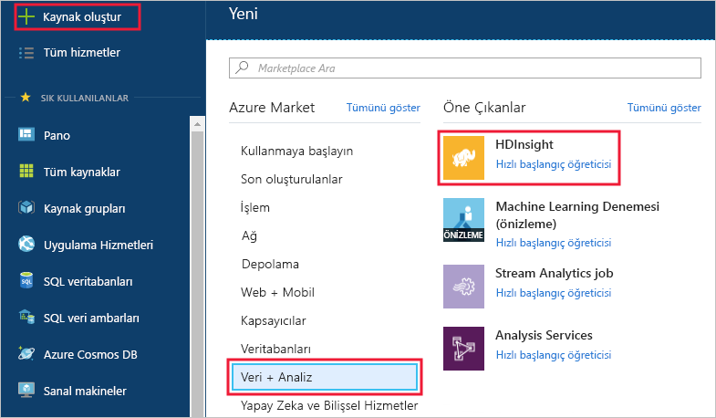
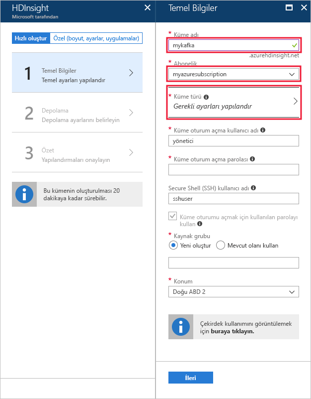
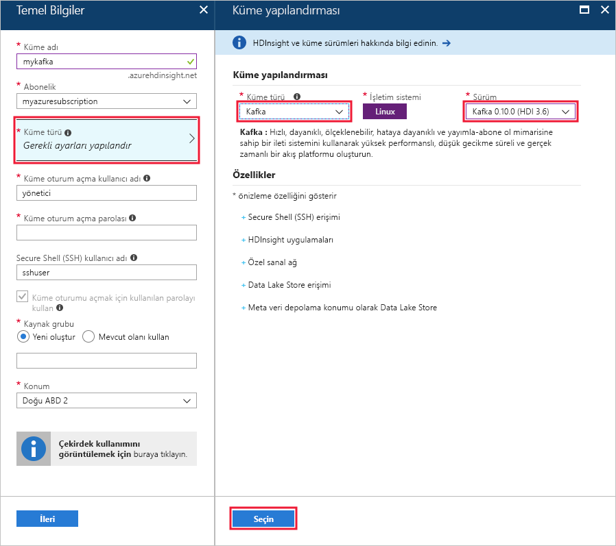
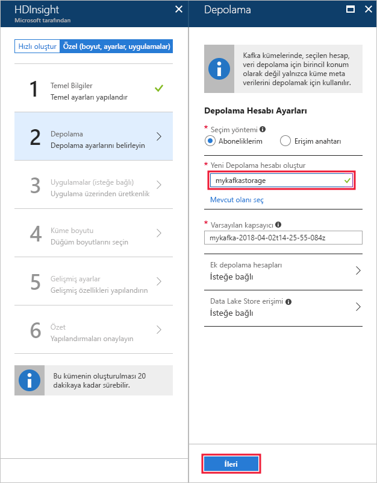
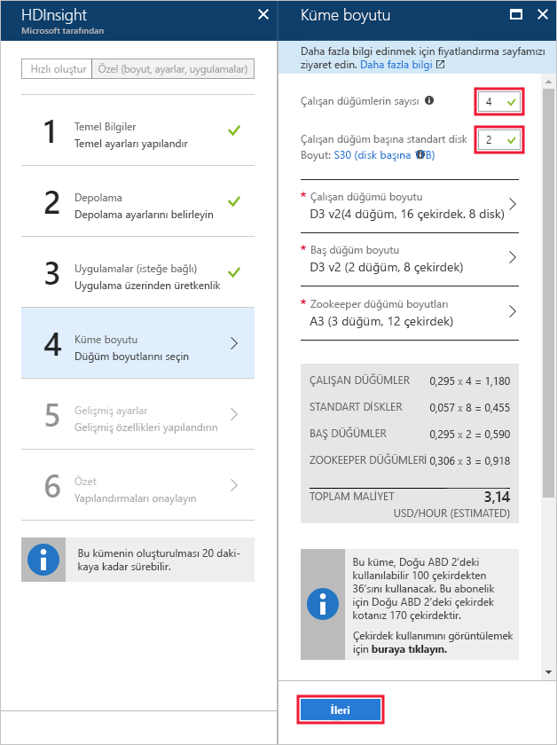
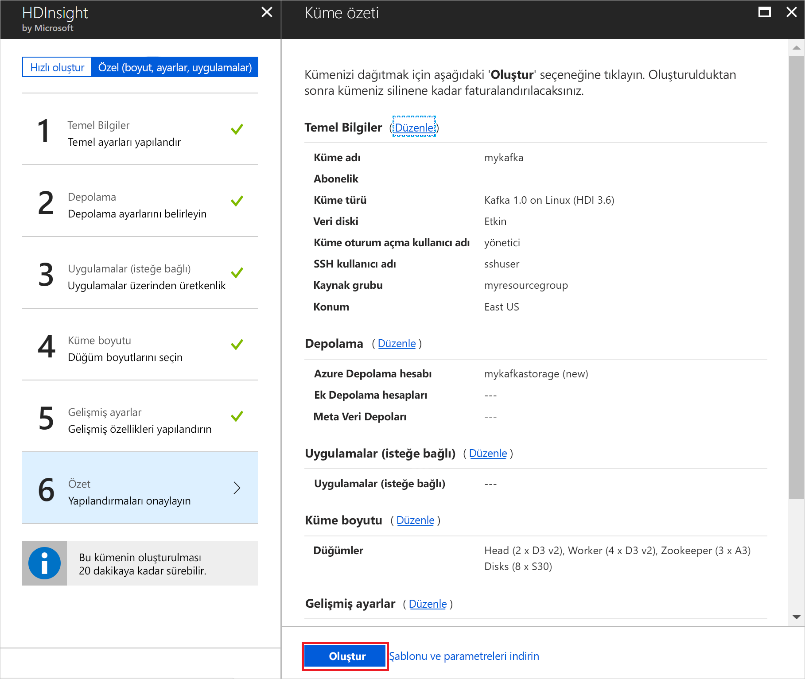

# <a name="quickstart-create-a-kafka-on-hdinsight-cluster"></a>Hızlı Başlangıç: HDInsight kümesi üzerinde Kafka oluşturma

Kafka, açık kaynaklı bir dağıtılmış akış platformudur. Yayımla-abone ol ileti kuyruğuna benzer işlevler sağladığı için genellikle ileti aracısı olarak kullanılır. 

Bu hızlı başlangıçta, Azure portalını kullanarak [Apache Kafka](https://kafka.apache.org) kümesi oluşturmayı öğrenirsiniz. Ayrıca Kafka kullanarak ileti göndermek ve almak için, birlikte sunulan yardımcı programları kullanmayı da öğrenirsiniz.

[!INCLUDE [delete-cluster-warning](../../../includes/hdinsight-delete-cluster-warning.md)]

> [!IMPORTANT]
> Kafka API’sine yalnızca aynı sanal ağ içindeki kaynaklar tarafından erişilebilir. Bu hızlı başlangıçta, doğrudan SSH kullanarak kümeye erişirsiniz. Diğer hizmetleri, ağları veya sanal makineleri Kafka’ya bağlamak için önce bir sanal ağ oluşturmanız e sonra ağ içinde kaynakları oluşturmanız gerekir.
>
> Daha fazla bilgi için [Sanal ağ kullanarak Kafka’ya bağlanma](apache-kafka-connect-vpn-gateway.md) belgesine bakın.

## <a name="prerequisites"></a>Ön koşullar

* Azure aboneliği. Azure aboneliğiniz yoksa başlamadan önce [ücretsiz bir hesap](https://azure.microsoft.com/free/?WT.mc_id=A261C142F) oluşturun.

* Bir SSH istemcisi. Bu belgede yer alan adımlarda, kümeye bağlanmak için SSH kullanılır.

    Linux, Unix ve macOS sistemlerinde varsayılan olarak `ssh` komutu sağlanır. Windows 10’da, `ssh` komutunu yüklemek için aşağıdaki yöntemlerden birini kullanın:

    * [Azure Cloud Shell](https://docs.microsoft.com/azure/cloud-shell/quickstart)’i kullanın. Cloud shell, `ssh` komutunu sağlar ve kabuk ortamı olarak Bash veya PowerShell kullanılacak şekilde yapılandırılabilir.

    * [Linux için Windows Alt Sistemini yükleyin](https://docs.microsoft.com/windows/wsl/install-win10). Microsoft Store aracılığıyla kullanılabilir olan Linux dağıtımları, `ssh` komutunu sağlar.

    > [!IMPORTANT]
    > Bu belgede yer alan adımlarda, yukarıda belirtilen SSH istemcilerinden birisini kullandığınız varsayılır. Farklı bir SSH istemcisi kullanıyorsanız ve sorunlarla karşılaşıyorsanız lütfen SSH istemciniz için belgelere başvurun.
    >
    > Daha fazla bilgi için [HDInsight ile SSH kullanma](../hdinsight-hadoop-linux-use-ssh-unix.md) belgesine bakın.

## <a name="create-a-kafka-cluster"></a>Kafka kümesi oluşturma

HDInsight kümesinde Kafka oluşturmak için aşağıdaki adımları kullanın:

1. [Azure portalında](https://portal.azure.com) **+Kaynak oluştur**, **Veri ve Analiz**, **HDInsight** adımlarını izleyin.
   
    

2. **Temel Bilgiler** bölümünde aşağıdaki bilgileri girin veya seçin:

    | Ayar | Değer |
    | --- | --- |
    | Küme Adı | HDInsight kümesine ait benzersiz bir ad. |
    | Abonelik | Aboneliğinizi seçin. |
    
    **Küme yapılandırması**’nı görüntülemek için __Küme Türü__’nü seçin.

    

3. __Küme yapılandırması__’ndan aşağıdaki değerleri seçin:

    | Ayar | Değer |
    | --- | --- |
    | Küme Türü | Kafka |
    | Sürüm | Kafka 1.0.0 (HDI 3.6) |

    **Seç** düğmesini kullanarak küme türü ayarlarını kaydedin ve __Temel Bilgiler__ menüsüne dönün.

    

4. __Temel Bilgiler__ bölümünde aşağıdaki bilgileri girin veya seçin:

    | Ayar | Değer |
    | --- | --- |
    | Küme oturum açma kullanıcı adı | Web hizmetlerine veya küme üzerinde barındırılan REST API’lerine erişirken kullanılan oturum açma kimliği. Varsayılan değeri (admin) değiştirmeyin. |
    | Küme oturum açma parolası | Web hizmetlerine veya küme üzerinde barındırılan REST API’lerine erişirken kullanılan oturum açma parolası. |
    | Secure Shell (SSH) kullanıcı adı | SSH üzerinden kümeye erişirken kullanılan oturum açma bilgileri. Varsayılan olarak parola, küme oturum açma parolası ile aynıdır. |
    | Kaynak Grubu | İçinde kümenin oluşturulduğu kaynak grubu. |
    | Konum | İçinde kümenin oluşturulacağı Azure bölgesi. |

    > [!TIP]
    > Her Azure bölgesi (konum) _hata etki alanları_ sağlar. Hata etki alanı, bir Azure veri merkezinde temel donanımlardan oluşan mantıksal bir gruplandırmadır. Her hata etki alanı ortak bir güç kaynağı ve ağ anahtarına sahiptir. Bir HDInsight kümesi içindeki düğümleri uygulayan sanal makineler ve yönetilen diskler, bu hata etki alanlarına dağıtılır. Bu mimari, fiziksel donanım hatalarının olası etkisini sınırlar.
    >
    > Verilerin yüksek kullanılabilirliği için, __üç hata etki alanı__ içeren bir bölge (konum) seçin. Bir bölgedeki hata etki alanlarının sayısı hakkında bilgi almak için [Linux sanal makinelerinin kullanılabilirliği](../../virtual-machines/windows/manage-availability.md#use-managed-disks-for-vms-in-an-availability-set) belgesine bakın.

    

    __İleri__ düğmesini kullanarak temel yapılandırmayı tamamlayın.

5. **Depolama**’dan bir depolama hesabı seçin veya oluşturun. Bu belgedeki adımlar için diğer alanları varsayılan değerlerinde bırakın. __İleri__ düğmesini kullanarak depolama yapılandırmasını kaydedin.

    

6. __Uygulamalar (isteğe bağlı)__ bölümünden __İleri__'yi seçerek varsayılan ayarlarla devam edin.

7. __Küme boyutu__ bölümünden __İleri__'yi seçerek varsayılan ayarlarla devam edin.

    > [!IMPORTANT]
    > Kafka’nın HDInsight üzerinde kullanılabilirliğini garanti etmek için __çalışan düğümleri sayısı__ girişinin 3 veya daha büyük bir değere ayarlanması gerekir. Varsayılan değer 4'tür.
    
    > [!TIP]
    > **Çalışan düğümü başına disk sayısı** girdisi, HDInsight üzerinde Kafka'nın ölçeklenebilirliğini yapılandırır. HDInsight üzerinde Kafka, verileri depolamak için kümedeki sanal makinelerin yerel diskini kullanır. Kafka, G/Ç açısından yoğun olduğundan, yüksek aktarım hızı ve düğüm başına daha fazla depolama alanı sağlamak için [Azure Yönetilen Diskler](../../virtual-machines/windows/managed-disks-overview.md) kullanılır. Yönetilen diskin türü __Standart__ (HDD) veya __Premium__ (SSD) olabilir. Disk türü, çalışan düğümleri (Kafka aracıları) tarafından kullanılan sanal makine boyutuna bağlıdır. Premium diskler otomatik olarak DS ve GS serisi sanal makinelerle kullanılır. Diğer tüm VM türleri standart disk kullanır.

    

8. __Gelişmiş ayarlar__ bölümünden __İleri__'yi seçerek varsayılan ayarlarla devam edin.

9. **Özet**’ten kümenin yapılandırmasını gözden geçirin. Yanlış olan ayarları değiştirmek için __Düzenle__ bağlantılarını kullanın. Son olarak, __Oluştur__ düğmesini kullanarak kümeyi oluşturun.
   
    
   
    > [!NOTE]
    > Kümenin oluşturulması 20 dakika sürebilir.

## <a name="connect-to-the-cluster"></a>Kümeye bağlanma

1. Kafka kümesinin birincil baş düğümüne bağlanmak için aşağıdaki komutu kullanın. `sshuser` değerini, SSH kullanıcı adıyla değiştirin. `mykafka` değerini, Kafka kümenizin adıyla değiştirin

    ```bash
    ssh sshuser@mykafka-ssh.azurehdinsight.net
    ```

2. Kümeye ilk kez bağlandığınızda SSH istemciniz ana bilgisayarın orijinalliğinin belirlenemediği yönünde bir uyarı görüntüleyebilir. Ana bilgisayarı SSH istemcinizin güvenilen sunucular listesine eklemek isteyip istemediğiniz sorulduğunda __evet__’i seçin ve sonra __Enter__ tuşuna basın.

3. İstendiğinde, SSH kullanıcısının parolasını girin.

Bağlandığında, aşağıdaki metne benzer bilgiler görürsünüz:

```text
Authorized uses only. All activity may be monitored and reported.
Welcome to Ubuntu 16.04.4 LTS (GNU/Linux 4.13.0-1011-azure x86_64)

 * Documentation:  https://help.ubuntu.com
 * Management:     https://landscape.canonical.com
 * Support:        https://ubuntu.com/advantage

  Get cloud support with Ubuntu Advantage Cloud Guest:
    http://www.ubuntu.com/business/services/cloud

83 packages can be updated.
37 updates are security updates.


Welcome to Kafka on HDInsight.

Last login: Thu Mar 29 13:25:27 2018 from 108.252.109.241
ssuhuser@hn0-mykafk:~$
```

## <a id="getkafkainfo"></a>Zookeeper ve Aracı konak bilgilerini alma

Kafka ile çalışırken *Zookeeper* ve *Aracı* konaklarını bilmeniz gerekir. Bu konaklar Kafka API’si ve Kafka ile gönderilen yardımcı programların birçoğu ile birlikte kullanılır.

Bu bölümde, kümedeki Ambari REST API’sinden ana bilgisayar bilgilerini alırsınız.

1. Küme ile SSH bağlantısından aşağıdaki komutu kullanarak `jq` yardımcı programını yükleyin. Bu yardımcı program, JSON belgelerini ayrıştırmak için kullanılır ve ana bilgisayar bilgilerini almak için yararlıdır:
   
    ```bash
    sudo apt -y install jq
    ```

2. Bir ortam değişkenini küme adına ayarlamak için aşağıdaki komutu kullanın:

    ```bash
    read -p "Enter the Kafka on HDInsight cluster name: " CLUSTERNAME
    ```

    İstendiğinde, Kafka kümesinin adını girin.

3. Bir ortam değişkenini Zookeeper konak bilgileriyle ayarlamak için aşağıdaki komutu kullanın:
    
    ```bash
    export KAFKAZKHOSTS=`curl -sS -u admin -G http://headnodehost:8080/api/v1/clusters/$CLUSTERNAME/services/ZOOKEEPER/components/ZOOKEEPER_SERVER | jq -r '["\(.host_components[].HostRoles.host_name):2181"] | join(",")' | cut -d',' -f1,2`
    ```

    > [!TIP]
    > Bu komut küme baş düğümünde doğrudan Ambari hizmetini sorgular. Aynı zamanda `https://$CLUSTERNAME.azurehdinsight.net:80/` genel adresini kullanarak da Ambari’ye erişebilirsiniz. Bazı ağ yapılandırmaları genel adrese erişimi engelleyebilir. Örneğin, bir sanal ağda HDInsight’a erişimi kısıtlamak için Ağ Güvenlik Grupları’nı (NSG) kullanmak gibi.

    İstendiğinde, küme oturum açma hesabı (SSH hesabı değil) için parolayı girin.

    > [!NOTE]
    > Bu komut tüm Zookeeper ana bilgisayarlarını alır ve yalnızca ilk iki girişi döndürür. Bunun nedeni, bir ana bilgisayarın ulaşılamaz olması durumunda yedeklilik istemenizdir.

4. Ortam değişkeninin düzgün şekilde ayarlandığını doğrulamak için aşağıdaki komutu kullanın:

    ```bash
     echo '$KAFKAZKHOSTS='$KAFKAZKHOSTS
    ```

    Bu komutun aşağıdaki metne benzer bilgiler döndürmesi gerekir:

    `zk0-kafka.eahjefxxp1netdbyklgqj5y1ud.ex.internal.cloudapp.net:2181,zk2-kafka.eahjefxxp1netdbyklgqj5y1ud.ex.internal.cloudapp.net:2181`

5. Bir ortam değişkenini Kafka aracı konak bilgileriyle ayarlamak için aşağıdaki komutu kullanın:

    ```bash
    export KAFKABROKERS=`curl -sS -u admin -G http://headnodehost:8080/api/v1/clusters/$CLUSTERNAME/services/KAFKA/components/KAFKA_BROKER | jq -r '["\(.host_components[].HostRoles.host_name):9092"] | join(",")' | cut -d',' -f1,2`
    ```

    İstendiğinde, küme oturum açma hesabı (SSH hesabı değil) için parolayı girin.

6. Ortam değişkeninin düzgün şekilde ayarlandığını doğrulamak için aşağıdaki komutu kullanın:

    ```bash   
    echo '$KAFKABROKERS='$KAFKABROKERS
    ```

    Bu komutun aşağıdaki metne benzer bilgiler döndürmesi gerekir:
   
    `wn1-kafka.eahjefxxp1netdbyklgqj5y1ud.cx.internal.cloudapp.net:9092,wn0-kafka.eahjefxxp1netdbyklgqj5y1ud.cx.internal.cloudapp.net:9092`

## <a name="manage-kafka-topics"></a>Kafka konularını yönetme

Kafka, veri akışlarını *konular* içinde depolar. Konuları yönetmek için `kafka-topics.sh` yardımcı programını kullanabilirsiniz.

* **Bir konu oluşturmak için**, SSH bağlantısında aşağıdaki komutu kullanın:

    ```bash
    /usr/hdp/current/kafka-broker/bin/kafka-topics.sh --create --replication-factor 3 --partitions 8 --topic test --zookeeper $KAFKAZKHOSTS
    ```

    Bu komut, `$KAFKAZKHOSTS` içinde depolanan konak bilgilerini kullanarak Zookeeper’a bağlanır. Ardından **test** adlı bir Kafka konusu oluşturur. 

    * Bu konuda depolanan veriler, sekiz bölüm halinde bölümlenir.

    * Her bölüm, kümedeki üç çalışan düğümü arasında çoğaltılır.

        > [!IMPORTANT]
        > Üç hata etki alanı sağlayan bir Azure bölgesinde kümeyi oluşturduysanız, 3 çoğaltma katsayısını kullanın. Aksi takdirde 4 çoğaltma katsayısını kullanın.
        
        Üç hata etki alanı içeren bölgelerde 3 çoğaltma katsayısı, çoğaltmaların hata etki alanları arasında yayılmasına olanak sağlar. İki hata etki alanı içeren bölgelerde dört çoğaltma katsayısı, çoğaltmaların etki alanları arasında eşit şekilde yayılmasına olanak sağlar.
        
        Bir bölgedeki hata etki alanlarının sayısı hakkında bilgi almak için [Linux sanal makinelerinin kullanılabilirliği](../../virtual-machines/windows/manage-availability.md#use-managed-disks-for-vms-in-an-availability-set) belgesine bakın.

        > [!IMPORTANT] 
        > Kafka, Azure hata etki alanları ile uyumlu değildir. Konular için bölüm çoğaltmaları oluşturulurken, çoğaltmalar yüksek kullanılabilirlik için düzgün şekilde dağıtılmayabilir.

        Yüksek kullanılabilirlik sağlamak için [Kafka bölüm yeniden dengeleme aracını](https://github.com/hdinsight/hdinsight-kafka-tools) kullanın. Bu araç bir SSH bağlantısından Kafka kümenizin baş düğümüne doğru çalıştırılmalıdır.

        Kafka verilerinizin en yüksek kullanılabilirliğe sahip olması için, aşağıdaki durumlarda konunuz için bölüm çoğaltmalarını yeniden dengelemeniz gerekir:

        * Yeni bir konu veya bölüm oluşturduğunuzda

        * Bir kümenin ölçeğini artırdığınızda

* **Konuları listelemek için** aşağıdaki komutu kullanın:

    ```bash
    /usr/hdp/current/kafka-broker/bin/kafka-topics.sh --list --zookeeper $KAFKAZKHOSTS
    ```

    Bu komut, Kafka kümesinde kullanılabilir olan konuları listeler.

* **Bir konuyu silmek için** aşağıdaki komutu kullanın:

    ```bash
    /usr/hdp/current/kafka-broker/bin/kafka-topics.sh --delete --topic topicname --zookeeper $KAFKAZKHOSTS
    ```

    Bu komut, `topicname` adlı konuyu siler.

    > [!WARNING]
    > Daha önce oluşturulan `test` konusunu silerseniz, yeniden oluşturmanız gerekir. Bu belgenin ilerleyen kısmındaki adımlarda kullanılacaktır.

`kafka-topics.sh` yardımcı programı ile kullanılabilen komutlar hakkında daha fazla bilgi için aşağıdaki komutu kullanın:

```bash
/usr/hdp/current/kafka-broker/bin/kafka-topics.sh
```

## <a name="produce-and-consume-records"></a>Kayıt oluşturma ve kullanma

Kafka, konu başlıklarında *records* (kayıtlar) depolar. Kayıtlar, *Üreticiler* tarafından oluşturulur ve *tüketiciler* tarafından kullanılır. Üreticiler ve tüketiciler, *Kafka aracısı* hizmetiyle iletişim kurar. HDInsight kümenizdeki her çalışan düğümü bir Kafka aracısı ana bilgisayarıdır.

Daha önce oluşturduğunuz test konu başlığında kayıtları depolamak ve ardından bir tüketici kullanarak bunları okumak için aşağıdaki adımları kullanın:

1. Konuya kayıtlar yazmak için SSH bağlantısından `kafka-console-producer.sh` yardımcı programını kullanın:
   
    ```bash
    /usr/hdp/current/kafka-broker/bin/kafka-console-producer.sh --broker-list $KAFKABROKERS --topic test
    ```
   
    Bu komuttan sonra boş bir satıra ulaşırsınız.

2. Boş satıra bir metin iletisi yazın ve Enter tuşuna basın. Bu şekilde birkaç ileti girin ve sonra normal isteme geri dönmek için **Ctrl + C** tuşlarını kullanın. Her satır, Kafka konusuna ayrı bir kayıt olarak gönderilir.

3. Konudan kayıtları okumak için SSH bağlantısından `kafka-console-consumer.sh` yardımcı programını kullanın:
   
    ```bash
    /usr/hdp/current/kafka-broker/bin/kafka-console-consumer.sh --bootstrap-server $KAFKABROKERS --topic test --from-beginning
    ```
   
    Bu komutla, kayıtlar konu başlığından alınır ve görüntülenir. `--from-beginning` kullanılması, tüketiciye akışın başından başlamasını söyler, böylece tüm kayıtlar alınır.

    > [!NOTE]
    > Kafka’nın eski bir sürümünü kullanıyorsanız `--bootstrap-server $KAFKABROKERS` değerini `--zookeeper $KAFKAZKHOSTS` ile değiştirin.

4. Tüketiciyi durdurmak için __Ctrl + C__ tuşlarını kullanın.

Ayrıca programlı olarak üretici ve tüketici de oluşturabilirsiniz. Bu API’yi kullanmayla ilgili bir örnek için [HDInsight ile Kafka Üretici ve Tüketici API’si](apache-kafka-producer-consumer-api.md) belgesine göz atın.

## <a name="clean-up-resources"></a>Kaynakları temizleme

Bu hızlı başlangıç tarafından oluşturulan kaynakları temizlemek için kaynak grubunu silebilirsiniz. Kaynak grubunun silinmesi, ilişkili HDInsight kümesini ve kaynak grubuyla ilişkili diğer tüm kaynakları da siler.

Azure portalını kullanarak kaynak grubunu kaldırmak için:

1. Azure portalında sol taraftaki menüyü genişleterek hizmet menüsünü açın ve sonra __Kaynak Grupları__'nı seçerek kaynak gruplarınızın listesini görüntüleyin.
2. Silinecek kaynak grubunu bulun ve sonra listenin sağ tarafındaki __Daha fazla__ düğmesine (...) sağ tıklayın.
3. __Kaynak grubunu sil__'i seçip onaylayın.

> [!WARNING]
> HDInsight kümesi faturalandırması küme oluşturulduğunda başlar ve küme silindiğinde sona erer. Fatura dakikalara eşit olarak dağıtıldığından, kullanılmayan kümelerinizi mutlaka silmelisiniz.
> 
> HDInsight üzerinde Kafka kümesinin silinmesi Kafka’da depolanmış tüm verileri siler.

## <a name="next-steps"></a>Sonraki adımlar

> [!div class="nextstepaction"]
> [Apache Spark’ı Kafka ile kullanma](../hdinsight-apache-kafka-spark-structured-streaming.md)

