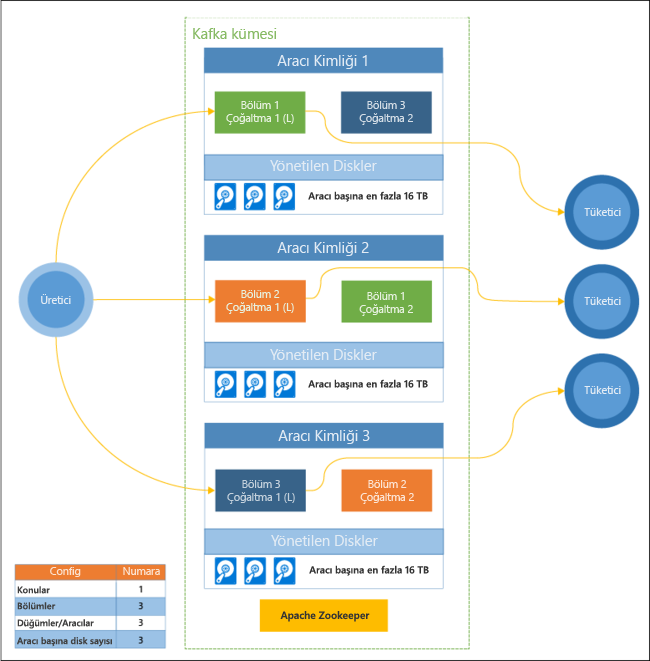

# Azure HDInsight, Apache Kafka nedir

[Apache Kafka](https://kafka.apache.org), gerçek zamanlı akış verisi işlem hatları ve uygulamaları oluşturmak için kullanılabilen, açık kaynak dağıtılmış akış platformudur. Kafka ayrıca, adlandırılmış veri akışları yayımlayıp abone olabileceğiniz bir ileti kuyruğuna benzer aracı işlevselliği sağlar. 

Aşağıda, HDInsight üzerinde Kafka’ya özgü özellikler verilmiştir:

* Bu, basitleştirilmiş bir yapılandırma işlemi sağlayan yönetilen bir hizmettir. Sonuçta, Microsoft tarafından test edilen ve desteklenen bir yapılandırma elde edilir.

* Microsoft, Kafka çalışma süresinde %99,9 Hizmet Düzeyi Sözleşmesi (SLA) sağlar. Daha fazla bilgi için [HDInsight için SLA bilgileri](https://azure.microsoft.com/support/legal/sla/hdinsight/v1_0/) belgesine bakın.

* Kafka için yedekleme deposu olarak Azure Yönetilen Diskler’i kullanır. Yönetilen Diskler, her Kafka aracısı için 16 TB’a kadar depolama alanı sağlayabilir. HDInsight üzerinde Kafka ile yönetilen diskleri yapılandırma hakkında daha fazla bilgi için bkz: [HDInsight üzerinde Apache Kafka'nın ölçeklenebilirliğini artırma](apache-kafka-scalability.md).

    Yönetilen diskler hakkında daha fazla bilgi için bkz. [Azure Yönetilen Diskler](../../virtual-machines/windows/managed-disks-overview.md).

* Kafka, bir rafın tek bir boyutlu görünümüyle tasarlanmıştır. Azure, bir rafı iki boyuta ayırır: Güncelleştirme Etki Alanları (UD) ve Hata Etki Alanları (FD). Microsoft, UD ve FD’ler genelinde Kafka bölümleri ve çoğaltmalarını yeniden dengeleyen araçlar sağlar. 

    Daha fazla bilgi için [HDInsight üzerinde Apache Kafka ile yüksek kullanılabilirlik](apache-kafka-high-availability.md).

* HDInsight, küme oluşturulduktan sonra çalışan düğümlerinin sayısını (Kafka aracısını barındıran) değiştirmenize olanak sağlar. Ölçeklendirme Azure portalı, Azure PowerShell ve diğer Azure yönetim arabirimleri üzerinde gerçekleştirilebilir. Kafka için, bölüm çoğaltmalarını ölçeklendirme işlemlerinden sonra yeniden dengelemeniz gerekir. Bölümleri yeniden dengelemek, Kafka’nın yeni çalışan düğüm sayısından yararlanabilmesini sağlar.

    Daha fazla bilgi için [HDInsight üzerinde Apache Kafka ile yüksek kullanılabilirlik](apache-kafka-high-availability.md).

* Azure İzleyici günlüklerine, HDInsight üzerinde Kafka izlemek için kullanılabilir. Azure İzleyici yüzeyleri sanal makine düzeyinde bilgi açığa disk, NIC ölçüleri ve JMX ölçüleri gibi Kafka'dan günlüğe kaydeder.

    Daha fazla bilgi için [HDInsight üzerinde Apache Kafka için günlük çözümleme](apache-kafka-log-analytics-operations-management.md).

### HDInsight mimarisi üzerinde Apache Kafka

Aşağıdaki diyagram, olayların hata dayanıklılığı ile paralel olarak okunması için tüketici gruplarını, bölümlemeyi ve çoğaltmayı kullanan tipik Kafka yapılandırmasını göstermektedir:

Apache ZooKeeper, Kafka kümesinin durumunu yönetir. Zookeeper, eşzamanlı, esnek ve düşük gecikme süreli işlemler için derlenmiştir. 

Kafka, kayıtları (verileri) **konular** içinde depolar. Kayıtlar, **Üreticiler** tarafından oluşturulur ve **tüketiciler** tarafından kullanılır. Üreticiler, Kafka **aracılarına** kayıtlar gönderir. HDInsight kümenizdeki her çalışan düğümü bir Kafka aracısıdır. 

Aracılar arasında konuların bölüm kayıtları. Kayıtları tüketirken, verilerin paralel işlemesini elde etmek için bölüm başına en fazla bir tüketici kullanabilirsiniz.

Çoğaltma, düğümler arasında bölmeleri çoğaltmak ve düğüm (aracı) kesintilerine karşı koruma sağlamak için kullanılır. Diyagramda *(L)* harfi bulunan bölüm, verilen bölümün lideridir. Üretici trafiği ZooKeeper tarafından yönetilen durum kullanılarak her düğümün liderine yönlendirilir.

## Neden HDInsight üzerinde Apache Kafka kullanmalıyım?

Aşağıda, HDInsight üzerinde Kafka kullanılarak gerçekleştirilebilen yaygın görevler ve desenler verilmiştir:

* **Apache Kafka verilerini çoğaltma**: Kafka, Kafka kümeleri arasında verileri çoğaltan MirrorMaker yardımcı programını sağlar.

    Mirrormaker hakkında daha fazla bilgi için bkz: [Apache Kafka konularını çoğaltma HDInsight üzerinde Apache Kafka ile](apache-kafka-mirroring.md).

* **Yayımla-abone ol Mesajlaşma modeli**: Kafka, Kafka konu yayımlama kayıtlar için bir Producer API sağlar. Bir konu başlığına abone olurken Consumer API (Tüketici API’si) kullanılır.

    Daha fazla bilgi için [HDInsight üzerinde Apache Kafka kullanmaya başlama](apache-kafka-get-started.md).

* **Stream işleme**: Kafka genellikle gerçek zamanlı akış işleme için Apache Storm veya Spark ile birlikte kullanılır. Kafka 0.10.0.0 (HDInsight sürüm 3.5 ve 3.6), Storm ya da Spark gerektirmeden akış çözümleri oluşturmanızı sağlayan bir akış API’sini kullanıma sunmuştur.

    Daha fazla bilgi için [HDInsight üzerinde Apache Kafka kullanmaya başlama](apache-kafka-get-started.md).

* **Yatay ölçek**: Kafka, HDInsight kümesindeki düğümler arasında akış bölümleri. Kayıtlar kullanılırken yük dengeleme sağlamak üzere tüketici işlemleri, tek bölümlerle ilişkilendirilebilir.

    Daha fazla bilgi için [HDInsight üzerinde Apache Kafka kullanmaya başlama](apache-kafka-get-started.md).

* **Sıralı teslim**: Her bölüm kayıtlar alındıkları sırayla akışa depolanır. Bölüm başına bir tüketici işlemi ile ilişkilendirerek, kayıtların sırayla işlenmesini garanti edebilirsiniz.

    Daha fazla bilgi için [HDInsight üzerinde Apache Kafka kullanmaya başlama](apache-kafka-get-started.md).

## Uygulama alanları

* **Mesajlaşma**: Yayımlama desteklediğinden-abone ol ileti modelini, Kafka genellikle ileti aracısı olarak kullanılır.

* **Etkinlik izleme**: Kafka, kayıtların sıralı günlüğü sağlar. bu yana, izlemek ve etkinlikleri yeniden oluşturmak için kullanılabilir. Örneğin, bir web sitesindeki veya uygulamadaki kullanıcı işlemleri.

* **Toplama**: Akış işleme kullanarak, birleştirmek ve işletimsel verileri bilgisini merkezileştirmek için farklı akışlarından bilgi toplayabilirsiniz.

* **Dönüştürme**: Akış işlemeyi kullanarak, birleştirmek ve verileri birden fazla girdi konu birine zenginleştirmek veya daha fazla çıktı konu.

## Sonraki adımlar

HDInsight’ta Apache Kafka kullanma hakkında bilgi almak için aşağıdaki bağlantıları kullanın:

* [Hızlı Başlangıç: HDInsight üzerinde Apache Kafka oluşturma](apache-kafka-get-started.md)

* [Öğretici: HDInsight üzerinde Apache Kafka ile Apache Spark kullanma](../hdinsight-apache-spark-with-kafka.md)

* [Öğretici: Apache Storm'u HDInsight üzerinde Apache Kafka ile kullanma](../hdinsight-apache-storm-with-kafka.md)
