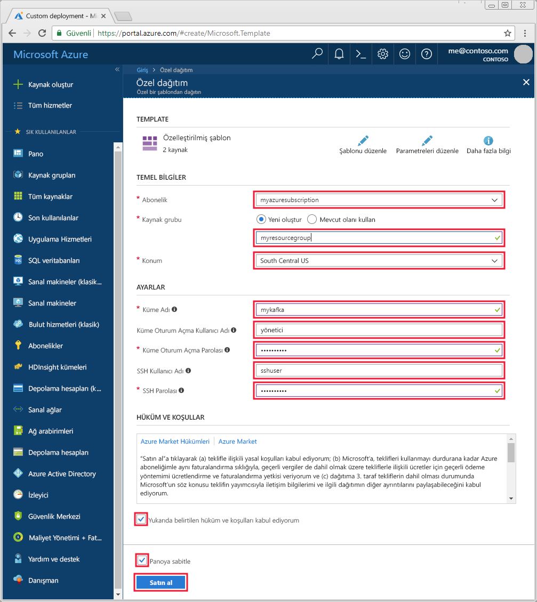

# <a name="quickstart-create-apache-kafka-cluster-in-azure-hdinsight-using-resource-manager-template"></a>Hızlı Başlangıç: Azure Resource Manager şablonu kullanarak HDInsight Apache Kafka kümesi oluşturma

[Apache Kafka](https://kafka.apache.org/) bir açık kaynaklı, dağıtılmış akış platformudur. Yayımla-abone ol ileti kuyruğuna benzer işlevler sağladığı için genellikle ileti aracısı olarak kullanılır. 

Bu hızlı başlangıçta, Azure Resource Manager şablonunu kullanarak bir [Apache Kafka](https://kafka.apache.org) kümesi oluşturmayı öğrenirsiniz. Ayrıca Kafka kullanarak ileti göndermek ve almak için, birlikte sunulan yardımcı programları kullanmayı da öğrenirsiniz. Benzer şablonları görüntülenebilir [Azure hızlı başlangıç şablonları](https://azure.microsoft.com/resources/templates/?resourceType=Microsoft.Hdinsight&pageNumber=1&sort=Popular). Şablon başvurusu bulunabilir [burada](https://docs.microsoft.com/azure/templates/microsoft.hdinsight/allversions).

[!INCLUDE [delete-cluster-warning](../../../includes/hdinsight-delete-cluster-warning.md)]

Kafka API’sine yalnızca aynı sanal ağ içindeki kaynaklar tarafından erişilebilir. Bu hızlı başlangıçta, doğrudan SSH kullanarak kümeye erişirsiniz. Diğer hizmetleri, ağları veya sanal makineleri Kafka’ya bağlamak için önce bir sanal ağ oluşturmanız e sonra ağ içinde kaynakları oluşturmanız gerekir. Daha fazla bilgi için [Sanal ağ kullanarak Apache Kafka'ya bağlanma](apache-kafka-connect-vpn-gateway.md) belgesine bakın.

Azure aboneliğiniz yoksa başlamadan önce [ücretsiz bir hesap](https://azure.microsoft.com/free/?WT.mc_id=A261C142F) oluşturun.

## <a name="prerequisites"></a>Önkoşullar

Bir SSH istemcisi. Daha fazla bilgi için [SSH kullanarak HDInsight (Apache Hadoop) bağlanma](../hdinsight-hadoop-linux-use-ssh-unix.md).

## <a name="create-an-apache-kafka-cluster"></a>Apache Kafka kümesi oluşturma

1. Azure Portal'da bir şablonu açmak için aşağıdaki görüntüye tıklayın.

    <a href="https://portal.azure.com/#create/Microsoft.Template/uri/https%3A%2F%2Fraw.githubusercontent.com%2FAzure-Samples%2Fhdinsight-kafka-java-get-started%2Fmaster%2Fazuredeploy.json" target="_blank"></a>

2. Kafka kümesini oluşturmak için aşağıdaki değerleri kullanın:

    | Özellik | Değer |
    | --- | --- |
    | Abonelik | Azure aboneliğiniz. |
    | Kaynak grubu | Kümenin oluşturulduğu kaynak grubu. |
    | Location | Kümenin oluşturulduğu Azure bölgesi. |
    | Küme Adı | Kafka kümesinin adı. |
    | Küme Oturum Açma Kullanıcı Adı | Kümede barındırılan HTTPs tabanlı hizmetlerde oturum açmak için kullanılan hesap adı. |
    | Küme Oturum Açma Parolası | Oturum açma adının parolası. |
    | SSH Kullanıcı Adı | SSH kullanıcı adı. Bu hesap, SSH kullanarak kümeye erişebilir. |
    | SSH Parolası | SSH kullanıcısı için parola. |

    

3. **Yukarıdaki hüküm ve koşulları kabul ediyorum**'u ve ardından **Panoya sabitle**'yi seçip **Satın al**'a tıklayın. Kümenin oluşturulması 20 dakika sürebilir.

## <a name="connect-to-the-cluster"></a>Kümeye bağlanma

1. Kafka kümesinin birincil baş düğümüne bağlanmak için aşağıdaki komutu kullanın. `sshuser` değerini, SSH kullanıcı adıyla değiştirin. `mykafka` değerini, Kafka kümenizin adıyla değiştirin

    ```bash
    ssh sshuser@mykafka-ssh.azurehdinsight.net
    ```

2. Kümeye ilk kez bağlandığınızda SSH istemciniz ana bilgisayarın orijinalliğinin belirlenemediği yönünde bir uyarı görüntüleyebilir. Ana bilgisayarı SSH istemcinizin güvenilen sunucular listesine eklemek isteyip istemediğiniz sorulduğunda __evet__’i seçin ve sonra __Enter__ tuşuna basın.

3. İstendiğinde, SSH kullanıcısının parolasını girin.

    Bağlandığında, aşağıdaki metne benzer bilgiler görürsünüz:
    
    ```text
    Authorized uses only. All activity may be monitored and reported.
    Welcome to Ubuntu 16.04.4 LTS (GNU/Linux 4.13.0-1011-azure x86_64)
    
     * Documentation:  https://help.ubuntu.com
     * Management:     https://landscape.canonical.com
     * Support:        https://ubuntu.com/advantage
    
      Get cloud support with Ubuntu Advantage Cloud Guest:
        https://www.ubuntu.com/business/services/cloud
    
    83 packages can be updated.
    37 updates are security updates.
    
    
    Welcome to Kafka on HDInsight.
    
    Last login: Thu Mar 29 13:25:27 2018 from 108.252.109.241
    ssuhuser@hn0-mykafk:~$
    ```

## <a id="getkafkainfo"></a>Apache Zookeeper ve aracı konak bilgilerini alma

Kafka ile çalışırken bilmeniz gerekir *Apache Zookeeper* ve *Aracısı* konaklar. Bu konaklar Kafka API’si ve Kafka ile gönderilen yardımcı programların birçoğu ile birlikte kullanılır.

Bu bölümde, kümedeki Ambari REST API’sinden ana bilgisayar bilgilerini alırsınız.

1. Küme ile SSH bağlantısından aşağıdaki komutu kullanarak `jq` yardımcı programını yükleyin. Bu yardımcı program, JSON belgelerini ayrıştırmak için kullanılır ve ana bilgisayar bilgilerini almak için yararlıdır:
   
    ```bash
    sudo apt -y install jq
    ```

2. Bir ortam değişkenini küme adına ayarlamak için aşağıdaki komutu kullanın:

    ```bash
    read -p "Enter the Kafka on HDInsight cluster name: " CLUSTERNAME
    ```

    İstendiğinde, Kafka kümesinin adını girin.

3. Bir ortam değişkenini Zookeeper konak bilgileriyle ayarlamak için aşağıdaki komutu kullanın. Komut, tüm Zookeeper konaklar alır, ardından yalnızca ilk iki girişe döndürür. Bunun nedeni, bir ana bilgisayarın ulaşılamaz olması durumunda yedeklilik istemenizdir.

    ```bash
    export KAFKAZKHOSTS=`curl -sS -u admin -G https://$CLUSTERNAME.azurehdinsight.net/api/v1/clusters/$CLUSTERNAME/services/ZOOKEEPER/components/ZOOKEEPER_SERVER | jq -r '["\(.host_components[].HostRoles.host_name):2181"] | join(",")' | cut -d',' -f1,2`
    ```

    İstendiğinde, küme oturum açma hesabı (SSH hesabı değil) için parolayı girin.

4. Ortam değişkeninin düzgün şekilde ayarlandığını doğrulamak için aşağıdaki komutu kullanın:

    ```bash
     echo '$KAFKAZKHOSTS='$KAFKAZKHOSTS
    ```

    Bu komutun aşağıdaki metne benzer bilgiler döndürmesi gerekir:

    `zk0-kafka.eahjefxxp1netdbyklgqj5y1ud.ex.internal.cloudapp.net:2181,zk2-kafka.eahjefxxp1netdbyklgqj5y1ud.ex.internal.cloudapp.net:2181`

5. Bir ortam değişkenini Kafka aracı konak bilgileriyle ayarlamak için aşağıdaki komutu kullanın:

    ```bash
    export KAFKABROKERS=`curl -sS -u admin -G https://$CLUSTERNAME.azurehdinsight.net/api/v1/clusters/$CLUSTERNAME/services/KAFKA/components/KAFKA_BROKER | jq -r '["\(.host_components[].HostRoles.host_name):9092"] | join(",")' | cut -d',' -f1,2`
    ```

    İstendiğinde, küme oturum açma hesabı (SSH hesabı değil) için parolayı girin.

6. Ortam değişkeninin düzgün şekilde ayarlandığını doğrulamak için aşağıdaki komutu kullanın:

    ```bash   
    echo '$KAFKABROKERS='$KAFKABROKERS
    ```

    Bu komutun aşağıdaki metne benzer bilgiler döndürmesi gerekir:
   
    `wn1-kafka.eahjefxxp1netdbyklgqj5y1ud.cx.internal.cloudapp.net:9092,wn0-kafka.eahjefxxp1netdbyklgqj5y1ud.cx.internal.cloudapp.net:9092`

## <a name="manage-apache-kafka-topics"></a>Apache Kafka konularını yönetme

Kafka, veri akışlarını *konular* içinde depolar. Konuları yönetmek için `kafka-topics.sh` yardımcı programını kullanabilirsiniz.

* **Bir konu oluşturmak için**, SSH bağlantısında aşağıdaki komutu kullanın:

    ```bash
    /usr/hdp/current/kafka-broker/bin/kafka-topics.sh --create --replication-factor 3 --partitions 8 --topic test --zookeeper $KAFKAZKHOSTS
    ```

    Bu komut, `$KAFKAZKHOSTS` içinde depolanan konak bilgilerini kullanarak Zookeeper’a bağlanır. Ardından **test** adlı bir Kafka konusu oluşturur. 

    * Bu konuda depolanan veriler, sekiz bölüm halinde bölümlenir.

    * Her bölüm, kümedeki üç çalışan düğümü arasında çoğaltılır.

        Üç hata etki alanı sağlayan bir Azure bölgesinde kümeyi oluşturduysanız, 3 çoğaltma katsayısını kullanın. Aksi takdirde 4 çoğaltma katsayısını kullanın.
        
        Üç hata etki alanı içeren bölgelerde 3 çoğaltma katsayısı, çoğaltmaların hata etki alanları arasında yayılmasına olanak sağlar. İki hata etki alanı içeren bölgelerde dört çoğaltma katsayısı, çoğaltmaların etki alanları arasında eşit şekilde yayılmasına olanak sağlar.
        
        Bir bölgedeki hata etki alanlarının sayısı hakkında bilgi almak için [Linux sanal makinelerinin kullanılabilirliği](../../virtual-machines/windows/manage-availability.md#use-managed-disks-for-vms-in-an-availability-set) belgesine bakın.

        Kafka, Azure hata etki alanları ile uyumlu değildir. Konular için bölüm çoğaltmaları oluşturulurken, çoğaltmalar yüksek kullanılabilirlik için düzgün şekilde dağıtılmayabilir.

        Yüksek kullanılabilirlik sağlamak için kullanın [Apache Kafka bölüm yeniden Dengeleme aracını](https://github.com/hdinsight/hdinsight-kafka-tools). Bu araç bir SSH bağlantısından Kafka kümenizin baş düğümüne doğru çalıştırılmalıdır.

        Kafka verilerinizin en yüksek kullanılabilirliğe sahip olması için, aşağıdaki durumlarda konunuz için bölüm çoğaltmalarını yeniden dengelemeniz gerekir:

        * Yeni bir konu veya bölüm oluşturduğunuzda

        * Bir kümenin ölçeğini artırdığınızda

* **Konuları listelemek için** aşağıdaki komutu kullanın:

    ```bash
    /usr/hdp/current/kafka-broker/bin/kafka-topics.sh --list --zookeeper $KAFKAZKHOSTS
    ```

    Bu komut, Kafka kümesinde kullanılabilir olan konuları listeler.

* **Bir konuyu silmek için** aşağıdaki komutu kullanın:

    ```bash
    /usr/hdp/current/kafka-broker/bin/kafka-topics.sh --delete --topic topicname --zookeeper $KAFKAZKHOSTS
    ```

    Bu komut, `topicname` adlı konuyu siler.

    > [!WARNING]  
    > Daha önce oluşturulan `test` konusunu silerseniz, yeniden oluşturmanız gerekir. Bu belgenin ilerleyen kısmındaki adımlarda kullanılacaktır.

`kafka-topics.sh` yardımcı programı ile kullanılabilen komutlar hakkında daha fazla bilgi için aşağıdaki komutu kullanın:

```bash
/usr/hdp/current/kafka-broker/bin/kafka-topics.sh
```

## <a name="produce-and-consume-records"></a>Kayıt oluşturma ve kullanma

Kafka, konu başlıklarında *records* (kayıtlar) depolar. Kayıtlar, *Üreticiler* tarafından oluşturulur ve *tüketiciler* tarafından kullanılır. Üreticiler ve tüketiciler, *Kafka aracısı* hizmetiyle iletişim kurar. HDInsight kümenizdeki her çalışan düğümü bir Kafka aracısı ana bilgisayarıdır.

Daha önce oluşturduğunuz test konu başlığında kayıtları depolamak ve ardından bir tüketici kullanarak bunları okumak için aşağıdaki adımları kullanın:

1. Konuya kayıtlar yazmak için SSH bağlantısından `kafka-console-producer.sh` yardımcı programını kullanın:
   
    ```bash
    /usr/hdp/current/kafka-broker/bin/kafka-console-producer.sh --broker-list $KAFKABROKERS --topic test
    ```
   
    Bu komuttan sonra boş bir satıra ulaşırsınız.

2. Boş satıra bir metin iletisi yazın ve Enter tuşuna basın. Bu şekilde birkaç ileti girin ve sonra normal isteme geri dönmek için **Ctrl + C** tuşlarını kullanın. Her satır, Kafka konusuna ayrı bir kayıt olarak gönderilir.

3. Konudan kayıtları okumak için SSH bağlantısından `kafka-console-consumer.sh` yardımcı programını kullanın:
   
    ```bash
    /usr/hdp/current/kafka-broker/bin/kafka-console-consumer.sh --bootstrap-server $KAFKABROKERS --topic test --from-beginning
    ```
   
    Bu komutla, kayıtlar konu başlığından alınır ve görüntülenir. `--from-beginning` kullanılması, tüketiciye akışın başından başlamasını söyler, böylece tüm kayıtlar alınır.

    Kafka’nın eski bir sürümünü kullanıyorsanız `--bootstrap-server $KAFKABROKERS` değerini `--zookeeper $KAFKAZKHOSTS` ile değiştirin.

4. Tüketiciyi durdurmak için __Ctrl + C__ tuşlarını kullanın.

Ayrıca programlı olarak üretici ve tüketici de oluşturabilirsiniz. Bu API kullanma örneği için bkz: [Apache Kafka üretici ve tüketici API'si HDInsight ile](apache-kafka-producer-consumer-api.md) belge.

## <a name="clean-up-resources"></a>Kaynakları temizleme

Bu hızlı başlangıç tarafından oluşturulan kaynakları temizlemek isterseniz, kaynak grubunu silebilirsiniz. Kaynak grubunun silinmesi, ilişkili HDInsight kümesini ve kaynak grubuyla ilişkili diğer tüm kaynakları da siler.

Azure portalını kullanarak kaynak grubunu kaldırmak için:

1. Azure portalında sol taraftaki menüyü genişleterek hizmet menüsünü açın ve sonra __Kaynak Grupları__'nı seçerek kaynak gruplarınızın listesini görüntüleyin.
2. Silinecek kaynak grubunu bulun ve sonra listenin sağ tarafındaki __Daha fazla__ düğmesine (...) sağ tıklayın.
3. __Kaynak grubunu sil__'i seçip onaylayın.

> [!WARNING]  
> HDInsight kümesi faturalandırması küme oluşturulduğunda başlar ve küme silindiğinde sona erer. Fatura dakikalara eşit olarak dağıtıldığından, kullanılmayan kümelerinizi mutlaka silmelisiniz.
> 
> HDInsight üzerinde Kafka kümesinin silinmesi Kafka’da depolanmış tüm verileri siler.

## <a name="next-steps"></a>Sonraki adımlar

> [!div class="nextstepaction"]
> [Apache Kafka ile Apache Spark kullanma](../hdinsight-apache-kafka-spark-structured-streaming.md)