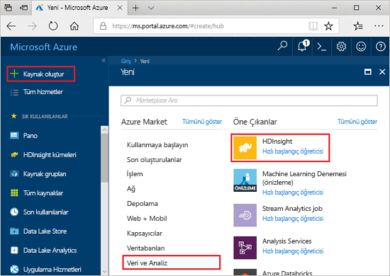
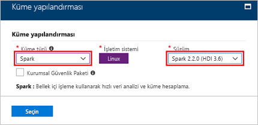
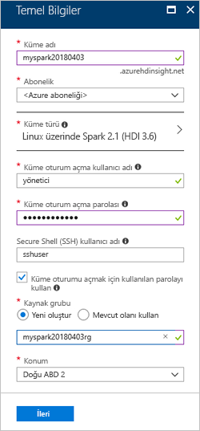
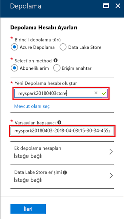

# <a name="quickstart-create-an-apache-spark-cluster-in-hdinsight-using-the-azure-portal"></a>Hızlı Başlangıç: Azure portalını kullanarak HDInsight Apache Spark kümesi oluşturma
Azure HDInsight’ta Apache Spark kümesinin nasıl oluşturulacağını ve Spark SQL sorgularının Hive tablolarına karşı nasıl çalıştırılacağını öğrenin. Apache Spark, bellek içi işleme kullanarak hızlı veri analizi ve küme hesaplama sağlar. HDInsight üzerinde Spark hakkında daha fazla bilgi için bkz: [genel bakış: Azure HDInsight üzerinde Apache Spark](apache-spark-overview.md).

Bu hızlı başlangıçta, HDInsight Spark kümesi oluşturmak için Azure portalını kullanırsınız. Küme, küme depolama alanı olarak Azure Depolama Bloblarını kullanır. Data Lake depolama Gen2 kullanma hakkında daha fazla bilgi için bkz. [hızlı başlangıç: HDInsight kümelerinde ayarlama](../../storage/data-lake-storage/quickstart-create-connect-hdi-cluster.md).

> [!IMPORTANT]  
> İster kullanın, ister kullanmayın, HDInsight kümeleri faturalaması dakika başına eşit olarak dağıtılmıştır. Kullanmayı bitirdikten sonra kümenizi sildiğinizden emin olun. Daha fazla bilgi için bu makalenin [Kaynakları temizleme](#clean-up-resources) bölümüne bakın.

Azure aboneliğiniz yoksa başlamadan önce [ücretsiz bir hesap oluşturun](https://azure.microsoft.com/free/).

## <a name="create-an-hdinsight-spark-cluster"></a>HDInsight Spark kümesi oluşturma

1. Azure portalında **kaynak Oluştur** > **Analytics** > **HDInsight**. 

    
2. **Temel Bilgiler** bölümünde aşağıdaki değerleri sağlayın:
     
    |Özellik  |Açıklama  |
    |---------|---------|
    |**Küme adı**     | HDInsight Spark kümenize bir ad verin. Bu hızlı başlangıç için kullanılan küme adı, **myspark20180403** şeklindedir.|
    |**Abonelik**     | Açılan listeden, bu küme için kullanılan bir Azure aboneliği seçin. Bu hızlı başlangıç için kullanılan abonelik, **&lt;Azure aboneliği** şeklindedir. |
    |**Küme türü**| Öğeyi genişletin, sonra küme türü olarak **Spark**’ı seçin ve Spark kümesi sürümünü belirtin. <br/>  |
    |**Küme oturum açma kullanıcı adı**| Küme oturum açma kullanıcı adını girin.  Varsayılan ad, *admin* şeklindedir. Bu hızlı başlangıcın ilerleyen kısmında Jupyter Notebook’ta oturum açmak için bu hesabı kullanacaksınız. |
    |**Küme oturum açma parolası**| Küme oturum açma parolasını girin. |
    |**Secure Shell (SSH) kullanıcı adı**| SSH kullanıcı adını girin. Bu hızlı başlangıç için kullanılan SSH kullanıcı adı, **sshuser** şeklindedir. Varsayılan olarak bu hesap, *Küme Oturum Açma kullanıcı adı* hesabıyla aynı parolayı paylaşır. |
    |**Kaynak grubu**     | Yeni bir kaynak grubu oluşturmayı veya mevcut bir kaynak grubunu kullanmayı seçin. Kaynak grubu, bir Azure çözümü için ilgili kaynakları bir arada tutan kapsayıcıdır. Bu hızlı başlangıç için kullanılan kaynak grubu adı, **myspark20180403rg** şeklindedir. |
    |**Konum**     | Kaynak grubu için bir konum seçin. Şablon hem kümeyi oluşturmak için hem de varsayılan küme depolaması için bu konumu kullanır. Bu hızlı başlangıç için kullanılan konum, **Doğu ABD 2**’dir. |

    

    **İleri**’yi seçerek **Depolama** sayfasından devam edin.
3. **Depolama** bölümünde aşağıdaki değerleri sağlayın:

   - **Depolama hesabı seçin**: **Yeni oluştur**’u seçin ve sonra yeni depolama hesabına bir ad verin. Bu hızlı başlangıç için kullanılan depolama hesabı adı, **myspark20180403store** şeklindedir.

     

     > [!NOTE]  
     > Ekran görüntüsünde **Mevcut olanı seç** seçeneği gösterilir. Bağlantı, **Yeni oluştur** ile **Mevcut olanı seç** arasında geçiş yapar.

     **Varsayılan kapsayıcı**, varsayılan bir ada sahiptir.  İsterseniz adı değiştirebilirsiniz.

     **İleri**’yi seçerek **Özet** sayfasından devam edin. 


3. **Özet** bölümünde **Oluştur**’u seçin. Kümenin oluşturulması yaklaşık 20 dakika sürer. Sonraki oturumuna devam etmeden önce küme oluşturulması gerekir.

HDInsight kümelerini oluştururken sorunlarla karşılaşırsanız, bunu yapmak için doğru izinlere sahip olmayabilirsiniz. Daha fazla bilgi için bkz. [Erişim denetimi gereksinimleri](../hdinsight-hadoop-create-linux-clusters-portal.md).

## <a name="create-a-jupyter-notebook"></a>Jupyter not defteri oluşturma

Jupyter Notebook, çeşitli programlama dillerini destekleyen etkileşimli bir not defteri ortamıdır. Not defteri, verilerle etkileşim kurmanıza, kodu markdown metniyle birleştirmenize ve basit görselleştirmeler gerçekleştirmenize olanak sağlar. 

1. [Azure portalı](https://portal.azure.com) açın.
2. **HDInsight kümeleri**’ni ve sonra oluşturduğunuz kümeyi seçin.

    

3. Portaldan **Küme panoları**’nı ve sonra **Jupyter Notebook**’u seçin. İstendiğinde, küme için küme oturum açma kimlik bilgilerini girin.

   

4. **Yeni** > **PySpark** seçeneklerini belirleyerek bir not defteri oluşturun. 

   

   Untitled(Untitled.pynb) adıyla yeni bir not defteri oluşturulur ve açılır.


## <a name="run-spark-sql-statements"></a>Spark SQL deyimleri çalıştırma

SQL (Yapılandırılmış Sorgu Dili), veri sorgulama ve tanımlama için en çok kullanılan dildir. Bilinen SQL söz dizimini kullanan Spark SQL, yapısal verileri işleyen bir Apache Spark uzantısı olarak çalışır.

1. Çekirdeğin hazır olduğunu doğrulayın. Not defterinde çekirdek adının yanında boş bir daire görmeniz, çekirdeğin hazır olduğu anlamına gelir. Dolu daire, çekirdeğin meşgul olduğunu belirtir.

    

    Not defterini ilk kez başlattığınızda, çekirdek arka planda birkaç görev gerçekleştirir. Çekirdeğin hazır olmasını bekleyin. 
2. Aşağıdaki kodu boş bir hücreye yapıştırın ve kodu çalıştırmak için **SHIFT + ENTER** tuşlarına basın. Komut, kümedeki Hive tablolarını listeler:

    ```PySpark
    %%sql
    SHOW TABLES
    ```
    HDInsight Spark kümeniz için yapılandırılmış bir Jupyter not defteri kullanırken, Spark SQL ile Hive sorguları çalıştırmak için kullanabileceğiniz önceden ayarlanmış bir `sqlContext` alırsınız. `%%sql`, Hive sorgusunu çalıştırmak için Jupyter Not Defteri’ne `sqlContext` ön ayarını kullanmasını söyler. Sorgu, varsayılan olarak tüm HDInsight kümelerinde sağlanan Hive tablosundaki (**hivesampletable**) ilk 10 satırı getirir. Sonuçları almak 30 saniye kadar sürer. Çıkış aşağıdakine benzer olacaktır: 

    

    Jupyter’de bir sorguyu her çalıştırdığınızda web tarayıcınızın pencere başlığında not defteri başlığı ile birlikte **(Meşgul)** durumu gösterilir. Ayrıca sağ üst köşedeki **PySpark** metninin yanında içi dolu bir daire görürsünüz.
    
2. `hivesampletable` komutundaki verileri görmek için başka bir sorgu çalıştırın.

    ```PySpark
    %%sql
    SELECT * FROM hivesampletable LIMIT 10
    ```
    
    Sorgu çıkışının görüntülenmesi için ekranın yenilenmesi gerekir.

    

2. Not defterindeki **Dosya** menüsünden **Kapat ve Durdur**’u seçin. Not defterini kapatmak, küme kaynaklarını serbest bırakır.

## <a name="clean-up-resources"></a>Kaynakları temizleme
HDInsight, verilerinizi Azure Depolama’da veya Azure Data Lake Storage’da depolar, böylece kullanılmadığında bir kümeyi güvenle silebilirsiniz. Ayrıca, kullanılmıyorken dahi HDInsight kümesi için sizden ücret kesilir. Küme ücretleri depolama ücretlerinin birkaç katı olduğundan, kullanılmadığında kümelerin silinmesi mantıklı olandır. [Sonraki adımlar](#next-steps) içinde listelenen öğretici üzerinde hemen çalışmayı planlıyorsanız, kümeyi tutmak isteyebilirsiniz.

Azure portalına geri dönüp **Sil**’i seçin.


Kaynak grubu adını seçerek de kaynak grubu sayfasını açabilir ve sonra **Kaynak grubunu sil**’i seçebilirsiniz. Kaynak grubunu silerek hem HDInsight Spark kümesini hem de varsayılan depolama hesabını silersiniz.

## <a name="next-steps"></a>Sonraki adımlar 

Bu hızlı başlangıçta HDInsight Spark kümesi oluşturmayı ve temel Spark SQL sorgusunu çalıştırmayı öğrendiniz. HDInsight Spark kümesini kullanarak örnek veriler üzerinde etkileşimli sorgular çalıştırma hakkında daha fazla bilgi edinmek için sonraki makaleye ilerleyin.

> [!div class="nextstepaction"]
>[Apache Spark üzerinde etkileşimli sorguları çalıştırma](./apache-spark-load-data-run-query.md)

