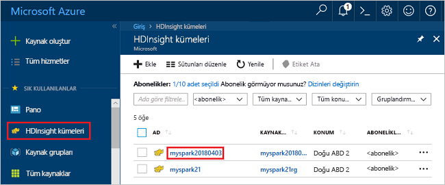
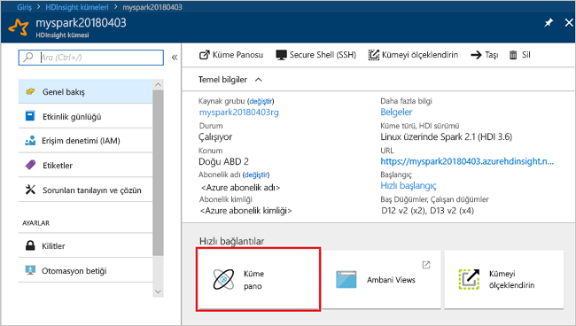
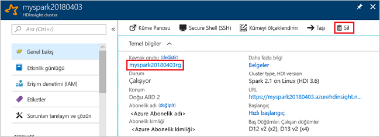

# <a name="quickstart-create-an-apache-spark-cluster-in-hdinsight-using-powershell"></a>Hızlı Başlangıç: PowerShell kullanarak HDInsight Apache Spark kümesi oluşturma
Oluşturmayı [Apache Spark](https://spark.apache.org/) karşı Spark SQL sorgularının nasıl çalıştırılacağını ve Azure HDInsight kümesinde [Apache Hive](https://hive.apache.org/) tablolar. Apache Spark, bellek içi işleme kullanarak hızlı veri analizi ve küme hesaplama sağlar. HDInsight üzerinde Spark hakkında daha fazla bilgi için bkz: [genel bakış: Azure HDInsight üzerinde Apache Spark](apache-spark-overview.md).

Bu hızlı başlangıçta, HDInsight Spark kümesi oluşturmak için Azure PowerShell kullanırsınız. Küme, küme depolama alanı olarak Azure Depolama Bloblarını kullanır. Data Lake depolama Gen2 kullanma hakkında daha fazla bilgi için bkz. [hızlı başlangıç: HDInsight kümelerinde ayarlama](../../storage/data-lake-storage/quickstart-create-connect-hdi-cluster.md).

> [!IMPORTANT]  
> İster kullanın, ister kullanmayın, HDInsight kümeleri faturalaması dakika başına eşit olarak dağıtılmıştır. Kullanmayı bitirdikten sonra kümenizi sildiğinizden emin olun. Daha fazla bilgi için bu makalenin [Kaynakları temizleme](#clean-up-resources) bölümüne bakın.

Azure aboneliğiniz yoksa başlamadan önce [ücretsiz bir hesap oluşturun](https://azure.microsoft.com/free/).

[!INCLUDE [updated-for-az](../../../includes/updated-for-az.md)]

## <a name="create-an-hdinsight-spark-cluster"></a>HDInsight Spark kümesi oluşturma

HDInsight kümesi oluşturma işlemi, aşağıdaki Azure nesnelerinin ve kaynaklarının oluşturulmasını kapsar:

- Bir Azure kaynak grubu. Azure kaynak grubu, Azure kaynakları için bir kapsayıcıdır. 
- Bir Azure depolama hesabına veya Azure Data Lake Storage.  Her HDInsight kümesi için bağımlı bir veri depolama alanı gerekir. Bu hızlı başlangıçta bir depolama hesabı oluşturursunuz.
- Farklı küme türlerinde bir HDInsight kümesi.  Bu hızlı başlangıçta bir Spark 2.3 kümesi oluşturursunuz.

Kaynakları oluşturmak için bir PowerShell betiği kullanırsınız.  Betiği çalıştırdığınızda aşağıdaki değerleri girmeniz istenir:

|Parametre|Değer|
|------|------|
|Azure kaynak grubu adı | Kaynak grubu için benzersiz bir ad girin.|
|Location| Azure bölgesini belirtin (örneğin, 'Orta ABD'). |
|Varsayılan depolama hesabı adı | Depolama hesabına benzersiz bir ad verin. |
|Küme adı | HDInsight Spark kümesine benzersiz bir ad verin.|
|Küme oturum açma kimlik bilgileri | Hızlı başlangıcın ilerleyen kısmında küme panosuna bağlanmak için bu hesabı kullanırsınız.|
|SSH kullanıcı kimlik bilgileri | HDInsight kümeleriyle uzak bir komut satırı oturumu oluşturmak için SSH istemcileri kullanılabilir.|


1. Aşağıdaki kod bloğu için sağ üst köşedeki **Deneyin** seçeneğine tıklayarak [Azure Cloud Shell](../../cloud-shell/overview.md)’i açın ve Azure’a bağlanmak için yönergeleri izleyin.
2. Aşağıdaki PowerShell betiğini kopyalayıp cloud shell’e yapıştırın. 

    ```azurepowershell-interactive
    ### Create a Spark 2.3 cluster in Azure HDInsight
        
    # Create the resource group
    $resourceGroupName = Read-Host -Prompt "Enter the resource group name"
    $location = Read-Host -Prompt "Enter the Azure region to create resources in, such as 'Central US'"
    New-AzResourceGroup -Name $resourceGroupName -Location $location
    
    $defaultStorageAccountName = Read-Host -Prompt "Enter the default storage account name"
    
    # Create an Azure storae account and container
    New-AzStorageAccount `
        -ResourceGroupName $resourceGroupName `
        -Name $defaultStorageAccountName `
        -Type Standard_LRS `
        -Location $location
    $defaultStorageAccountKey = (Get-AzStorageAccountKey `
                                    -ResourceGroupName $resourceGroupName `
                                    -Name $defaultStorageAccountName)[0].Value
    $defaultStorageContext = New-AzStorageContext `
                                    -StorageAccountName $defaultStorageAccountName `
                                    -StorageAccountKey $defaultStorageAccountKey
    
    # Create a Spark 2.3 cluster
    $clusterName = Read-Host -Prompt "Enter the name of the HDInsight cluster"
    # Cluster login is used to secure HTTPS services hosted on the cluster
    $httpCredential = Get-Credential -Message "Enter Cluster login credentials" -UserName "admin"
    # SSH user is used to remotely connect to the cluster using SSH clients
    $sshCredentials = Get-Credential -Message "Enter SSH user credentials"
    
    # Default cluster size (# of worker nodes), version, type, and OS
    $clusterSizeInNodes = "1"
    $clusterVersion = "3.6"
    $clusterType = "Spark"
    $clusterOS = "Linux"
    
    # Set the storage container name to the cluster name
    $defaultBlobContainerName = $clusterName
    
    # Create a blob container. This holds the default data store for the cluster.
    New-AzStorageContainer `
        -Name $clusterName -Context $defaultStorageContext 
    
    $sparkConfig = New-Object "System.Collections.Generic.Dictionary``2[System.String,System.String]"
    $sparkConfig.Add("spark", "2.3")
    
    # Create the HDInsight cluster
    New-AzHDInsightCluster `
        -ResourceGroupName $resourceGroupName `
        -ClusterName $clusterName `
        -Location $location `
        -ClusterSizeInNodes $clusterSizeInNodes `
        -ClusterType $clusterType `
        -OSType $clusterOS `
        -Version $clusterVersion `
        -ComponentVersion $sparkConfig `
        -HttpCredential $httpCredential `
        -DefaultStorageAccountName "$defaultStorageAccountName.blob.core.windows.net" `
        -DefaultStorageAccountKey $defaultStorageAccountKey `
        -DefaultStorageContainer $clusterName `
        -SshCredential $sshCredentials 
    
    Get-AzHDInsightCluster -ResourceGroupName $resourceGroupName -ClusterName $clusterName
    ```
   Kümenin oluşturulması yaklaşık 20 dakika sürer. Sonraki oturumuna devam etmeden önce küme oluşturulması gerekir.

HDInsight kümelerini oluştururken sorunlarla karşılaşırsanız, bunu yapmak için doğru izinlere sahip olmayabilirsiniz. Daha fazla bilgi için bkz. [Erişim denetimi gereksinimleri](../hdinsight-hadoop-create-linux-clusters-portal.md).

## <a name="create-a-jupyter-notebook"></a>Jupyter not defteri oluşturma

[Jupyter not defteri](https://jupyter.org/) çeşitli destekleyen etkileşimli bir not defteri ortam programlama dilleri. Not defteri, verilerle etkileşim kurmanıza, kodu markdown metniyle birleştirmenize ve basit görselleştirmeler gerçekleştirmenize olanak sağlar. 

1. [Azure portalı](https://portal.azure.com) açın.
2. **HDInsight kümeleri**’ni ve sonra oluşturduğunuz kümeyi seçin.

    

3. Portaldan **Küme panoları**’nı ve sonra **Jupyter Notebook**’u seçin. İstendiğinde, küme için küme oturum açma kimlik bilgilerini girin.

   

4. **Yeni** > **PySpark** seçeneklerini belirleyerek bir not defteri oluşturun. 

   

   Untitled(Untitled.pynb) adıyla yeni bir not defteri oluşturulur ve açılır.


## <a name="run-spark-sql-statements"></a>Spark SQL deyimleri çalıştırma

SQL (Yapılandırılmış Sorgu Dili), veri sorgulama ve tanımlama için en çok kullanılan dildir. Bilinen SQL söz dizimini kullanan Spark SQL, yapısal verileri işleyen bir Apache Spark uzantısı olarak çalışır.

1. Çekirdeğin hazır olduğunu doğrulayın. Not defterinde çekirdek adının yanında boş bir daire görmeniz, çekirdeğin hazır olduğu anlamına gelir. Dolu daire, çekirdeğin meşgul olduğunu belirtir.

    

    Not defterini ilk kez başlattığınızda, çekirdek arka planda birkaç görev gerçekleştirir. Çekirdeğin hazır olmasını bekleyin. 
2. Aşağıdaki kodu boş bir hücreye yapıştırın ve kodu çalıştırmak için **SHIFT + ENTER** tuşlarına basın. Komut, kümedeki Hive tablolarını listeler:

    ```PySpark
    %%sql
    SHOW TABLES
    ```
    HDInsight Spark kümeniz için yapılandırılmış bir Jupyter not defteri kullanırken, Spark SQL ile Hive sorguları çalıştırmak için kullanabileceğiniz önceden ayarlanmış bir `sqlContext` alırsınız. `%%sql`, Hive sorgusunu çalıştırmak için Jupyter Not Defteri’ne `sqlContext` ön ayarını kullanmasını söyler. Sorgu, varsayılan olarak tüm HDInsight kümelerinde sağlanan Hive tablosundaki (**hivesampletable**) ilk 10 satırı getirir. Sonuçları almak 30 saniye kadar sürer. Çıkış aşağıdakine benzer olacaktır: 

    

    Jupyter’de bir sorguyu her çalıştırdığınızda web tarayıcınızın pencere başlığında not defteri başlığı ile birlikte **(Meşgul)** durumu gösterilir. Ayrıca sağ üst köşedeki **PySpark** metninin yanında içi dolu bir daire görürsünüz.
    
2. `hivesampletable` komutundaki verileri görmek için başka bir sorgu çalıştırın.

    ```PySpark
    %%sql
    SELECT * FROM hivesampletable LIMIT 10
    ```
    
    Sorgu çıkışının görüntülenmesi için ekranın yenilenmesi gerekir.

    

2. Not defterindeki **Dosya** menüsünden **Kapat ve Durdur**’u seçin. Not defterini kapatmak, küme kaynaklarını serbest bırakır.

## <a name="clean-up-resources"></a>Kaynakları temizleme
HDInsight, verilerinizi Azure Depolama’da veya Azure Data Lake Storage’da depolar, böylece kullanılmadığında bir kümeyi güvenle silebilirsiniz. Ayrıca, kullanılmıyorken dahi HDInsight kümesi için sizden ücret kesilir. Küme ücretleri depolama ücretlerinin birkaç katı olduğundan, kullanılmadığında kümelerin silinmesi mantıklı olandır. [Sonraki adımlar](#next-steps) içinde listelenen öğretici üzerinde hemen çalışmayı planlıyorsanız, kümeyi tutmak isteyebilirsiniz.

Azure portalına geri dönüp **Sil**’i seçin.



Kaynak grubu adını seçerek de kaynak grubu sayfasını açabilir ve sonra **Kaynak grubunu sil**’i seçebilirsiniz. Kaynak grubunu silerek hem HDInsight Spark kümesini hem de varsayılan depolama hesabını silersiniz.

## <a name="next-steps"></a>Sonraki adımlar 

Bu hızlı başlangıçta HDInsight Spark kümesi oluşturmayı ve temel Spark SQL sorgusunu çalıştırmayı öğrendiniz. HDInsight Spark kümesini kullanarak örnek veriler üzerinde etkileşimli sorgular çalıştırma hakkında daha fazla bilgi edinmek için sonraki makaleye ilerleyin.

> [!div class="nextstepaction"]
>[Apache Spark üzerinde etkileşimli sorguları çalıştırma](./apache-spark-load-data-run-query.md)
