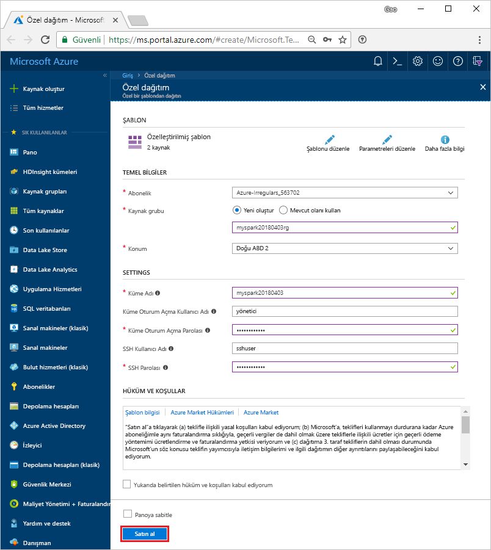

# <a name="quickstart-create-apache-spark-cluster-in-azure-hdinsight-using-resource-manager-template"></a>Hızlı Başlangıç: Azure Resource Manager şablonu kullanarak HDInsight Apache Spark kümesi oluşturma

Oluşturmayı bir [Apache Spark](https://spark.apache.org/) karşı Spark SQL sorgularının nasıl çalıştırılacağını ve Azure HDInsight kümesinde [Apache Hive](https://hive.apache.org/) tablolar. Apache Spark, bellek içi işleme kullanarak hızlı veri analizi ve küme hesaplama sağlar. HDInsight üzerinde Spark hakkında daha fazla bilgi için bkz: [genel bakış: Azure HDInsight üzerinde Apache Spark](apache-spark-overview.md).

Bu hızlı başlangıçta, HDInsight Spark kümesi oluşturmak için Kaynak Yöneticisi şablonu kullanırsınız. Benzer şablonları görüntülenebilir [Azure hızlı başlangıç şablonları](https://azure.microsoft.com/resources/templates/?resourceType=Microsoft.Hdinsight&pageNumber=1&sort=Popular). Şablon başvurusu bulunabilir [burada](https://docs.microsoft.com/azure/templates/microsoft.hdinsight/allversions).

Küme, küme depolama alanı olarak Azure Depolama Bloblarını kullanır. Data Lake depolama Gen2 kullanma hakkında daha fazla bilgi için bkz. [hızlı başlangıç: HDInsight kümelerinde ayarlama](../../storage/data-lake-storage/quickstart-create-connect-hdi-cluster.md).

> [!IMPORTANT]  
> İster kullanın, ister kullanmayın, HDInsight kümeleri faturalaması dakika başına eşit olarak dağıtılmıştır. Kullanmayı bitirdikten sonra kümenizi sildiğinizden emin olun. Daha fazla bilgi için bu makalenin [Kaynakları temizleme](#clean-up-resources) bölümüne bakın.

Azure aboneliğiniz yoksa başlamadan önce [ücretsiz bir hesap oluşturun](https://azure.microsoft.com/free/).

## <a name="create-an-hdinsight-spark-cluster"></a>HDInsight Spark kümesi oluşturma

Azure Resource Manager şablonu kullanarak bir HDInsight Spark kümesi oluşturun. Şablon bulunabilir [GitHub](https://azure.microsoft.com/resources/templates/101-hdinsight-spark-linux/). JSON söz dizimi ve küme özelliklerini için bkz: [Microsoft.HDInsight/clusters](/azure/templates/microsoft.hdinsight/clusters).

1. Azure portalındaki şablonu yeni bir tarayıcı sekmesinde açmak için aşağıdaki bağlantıyı seçin:

    <a href="https://portal.azure.com/#create/Microsoft.Template/uri/https%3A%2F%2Fraw.githubusercontent.com%2FAzure%2Fazure-quickstart-templates%2Fmaster%2F101-hdinsight-spark-linux%2Fazuredeploy.json" target="_blank">Azure’a Dağıtma</a>

2. Aşağıdaki değerleri girin:

    | Özellik | Değer |
    |---|---|
    |**Abonelik**|Bu kümeyi oluşturmak için kullanılan Azure aboneliğinizi seçin. Bu hızlı başlangıç için kullanılan abonelik, **&lt;Azure abonelik adı>** şeklindedir. |
    | **Kaynak grubu**|Kaynak grubu oluşturun veya var olan bir grubu seçin. Kaynak grubu, projelerinize ait Azure kaynaklarını yönetmek için kullanılır. Bu hızlı başlangıç için kullanılan yeni kaynak grubu adı, **myspark20180403rg** şeklindedir.|
    | **Konum**|Kaynak grubu için bir konum seçin. Şablon hem kümeyi oluşturmak için hem de varsayılan küme depolaması için bu konumu kullanır. Bu hızlı başlangıç için kullanılan konum, **Doğu ABD 2**’dir.|
    | **ClusterName**|Oluşturmak istediğiniz HDInsight kümesi için bir ad girin. Bu hızlı başlangıç için kullanılan yeni küme adı, **myspark20180403** şeklindedir.|
    | **Küme oturum açma adı ve parolası**|Varsayılan oturum açma adı, admin’dir. Kümede oturum açmak için bir parola seçin. Bu hızlı başlangıç için kullanılan oturum açma adı, admin’dir.|
    | **SSH kullanıcı adı ve parolası**|SSH kullanıcısı için bir parola seçin. Bu hızlı başlangıç için kullanılan SSH kullanıcı adı, **sshuser** şeklindedir.|

    

3. **Yukarıdaki hüküm ve koşulları kabul ediyorum**’u ve ardından **Panoya sabitle**’yi seçip **Satın al**’a tıklayın. Artık **Şablon Dağıtımını dağıtma** başlıklı yeni bir kutucuk görebilirsiniz. Kümenin oluşturulması yaklaşık 20 dakika sürer. Sonraki oturumuna devam etmeden önce küme oluşturulması gerekir.

HDInsight kümelerini oluştururken sorunlarla karşılaşırsanız, bunu yapmak için doğru izinlere sahip olmayabilirsiniz. Daha fazla bilgi için bkz. [Erişim denetimi gereksinimleri](../hdinsight-hadoop-create-linux-clusters-portal.md).

## <a name="install-intellijeclipse-for-spark-application"></a>Spark uygulaması için IntelliJ/Eclipse’i yükleme
Yazılan Spark uygulamaları geliştirmek için Intellij/Eclipse için eklenti Azure Araç Seti'ni kullanma [Scala](https://www.scala-lang.org/)ve ardından bunları bir Azure HDInsight Spark kümesine göndermek doğrudan Intellij/Eclipse tümleşik geliştirme ortamı () IDE). Daha fazla bilgi için bkz. [Spark uygulaması yazmak/göndermek için IntelliJ kullanma](./apache-spark-intellij-tool-plugin.md) ve [Spark uygulaması yazmak/göndermek için Eclipse kullanma](./apache-spark-eclipse-tool-plugin.md).

## <a name="install-vscode-for-pysparkhive-applications"></a>PySpark/hive uygulamaları için VSCode yükleme
Hive toplu işleri, etkileşimli Hive sorguları, PySpark toplu işi ve PySpark etkileşimli betikleri oluşturup göndermek için Visual Studio Code (VSCode) için Azure HDInsight Araçları’nın nasıl kullanılacağını öğrenin. Azure HDInsight Tools, VSCode tarafından desteklenen platformlara yüklenebilir. Bunlar arasında Windows, Linux ve MacOS yer alır. Daha fazla bilgi için bkz. [PySpark uygulaması yazmak/göndermek için VSCode kullanma](../hdinsight-for-vscode.md).

## <a name="create-a-jupyter-notebook"></a>Jupyter not defteri oluşturma

[Jupyter not defteri](https://jupyter.org/) çeşitli destekleyen etkileşimli bir not defteri ortam programlama dilleri. Not defteri, verilerle etkileşim kurmanıza, kodu markdown metniyle birleştirmenize ve basit görselleştirmeler gerçekleştirmenize olanak sağlar.

1. [Azure portalı](https://portal.azure.com) açın.
2. **HDInsight kümeleri**’ni ve sonra oluşturduğunuz kümeyi seçin.

    

3. Portalda, **Küme panoları** bölümünde **Jupyter Notebook**’a tıklayın. İstendiğinde, küme için küme oturum açma kimlik bilgilerini girin.

   

4. **Yeni** > **PySpark** seçeneklerini belirleyerek bir not defteri oluşturun.

   

   Untitled(Untitled.pynb) adıyla yeni bir not defteri oluşturulur ve açılır.


## <a name="run-spark-sql-statements"></a>Spark SQL deyimleri çalıştırma

SQL (Yapılandırılmış Sorgu Dili), veri sorgulama ve dönüştürme için en yaygın kullanılan dildir. Bilinen SQL söz dizimini kullanan Spark SQL, yapısal verileri işleyen bir Apache Spark uzantısı olarak çalışır.

1. Çekirdeğin hazır olduğunu doğrulayın. Not defterinde çekirdek adının yanında boş bir daire görmeniz, çekirdeğin hazır olduğu anlamına gelir. Dolu daire, çekirdeğin meşgul olduğunu belirtir.

    

    Not defterini ilk kez başlattığınızda, çekirdek arka planda birkaç görev gerçekleştirir. Çekirdeğin hazır olmasını bekleyin.
2. Aşağıdaki kodu boş bir hücreye yapıştırın ve kodu çalıştırmak için **SHIFT + ENTER** tuşlarına basın. Komut, kümedeki Hive tablolarını listeler:

    ```sql
    %%sql
    SHOW TABLES
    ```
    HDInsight Spark kümeniz için yapılandırılmış bir Jupyter not defteri kullanırken, Spark SQL ile Hive sorguları çalıştırmak için kullanabileceğiniz önceden ayarlanmış bir `spark` oturumu alırsınız. `%%sql`, Hive sorgusunu çalıştırmak için Jupyter Not Defteri’ne `spark` oturumu ön ayarını kullanmasını söyler. Sorgu, varsayılan olarak tüm HDInsight kümelerinde sağlanan Hive tablosundaki (**hivesampletable**) ilk 10 satırı getirir. Sorguyu ilk kez gönderdiğinizde Jupyter not defteri için Spark Uygulaması oluşturur. Tamamlanması yaklaşık 30 saniye sürer. Spark uygulaması hazır olduğunda sorgu yaklaşık bir saniyede yürütülür ve sonuçları üretir. Çıkış aşağıdakine benzer olacaktır:

    

    Jupyter’de bir sorguyu her çalıştırdığınızda web tarayıcınızın pencere başlığında not defteri başlığı ile birlikte **(Meşgul)** durumu gösterilir. Ayrıca sağ üst köşedeki **PySpark** metninin yanında içi dolu bir daire görürsünüz.

2. `hivesampletable` komutundaki verileri görmek için başka bir sorgu çalıştırın.

    ```sql
    %%sql
    SELECT * FROM hivesampletable LIMIT 10
    ```
    
    Sorgu çıkışının görüntülenmesi için ekranın yenilenmesi gerekir.

    

2. Not defterindeki **Dosya** menüsünden **Kapat ve Durdur**’u seçin. Not defterini kapatmak, Spark Uygulaması da dahil olmak üzere küme kaynaklarını serbest bırakır.

## <a name="clean-up-resources"></a>Kaynakları temizleme
HDInsight, verilerinizi ve Jupyter not defterlerini Azure Depolama’da veya Azure Data Lake Store’da depolar; böylece kullanımda olmayan bir kümeyi güvenle silebilirsiniz. Ayrıca, kullanılmıyorken dahi HDInsight kümesi için sizden ücret kesilir. Küme ücretleri depolama ücretlerinin birkaç katı olduğundan, kullanılmadığında kümelerin silinmesi mantıklı olandır. [Sonraki adımlar](#next-steps) içinde listelenen öğretici üzerinde hemen çalışmayı planlıyorsanız, kümeyi tutmak isteyebilirsiniz.

Azure portalına geri dönüp **Sil**’i seçin.


Kaynak grubu adını seçerek de kaynak grubu sayfasını açabilir ve sonra **Kaynak grubunu sil**’i seçebilirsiniz. Kaynak grubunu silerek hem HDInsight Spark kümesini hem de varsayılan depolama hesabını silersiniz.

## <a name="next-steps"></a>Sonraki adımlar

Bu hızlı başlangıçta HDInsight Spark kümesi oluşturmayı ve temel Spark SQL sorgusunu çalıştırmayı öğrendiniz. HDInsight Spark kümesini kullanarak örnek veriler üzerinde etkileşimli sorgular çalıştırma hakkında daha fazla bilgi edinmek için sonraki makaleye ilerleyin.

> [!div class="nextstepaction"]
>[Apache Spark üzerinde etkileşimli sorguları çalıştırma](./apache-spark-load-data-run-query.md)


