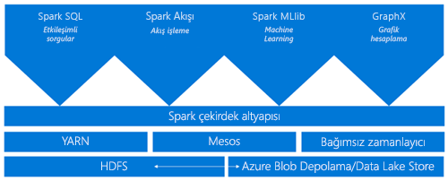
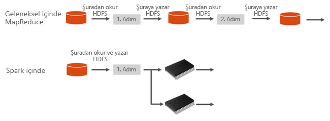
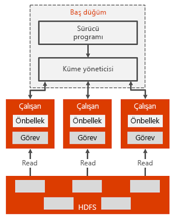

# Azure HDInsight’ta Apache Spark nedir?

*Apache Spark*, büyük veri analizi uygulamalarının performansını artırmak üzere bellek içi işlemeyi destekleyen paralel işleme altyapısıdır. Azure HDInsight’ta Apache Spark, Microsoft'un buluttaki Apache Hadoop uygulamasıdır. HDInsight, Azure’da bir Spark kümesi oluşturup yapılandırmayı kolaylaştırır. HDInsight'taki Spark kümeleri, Azure Depolama ve Azure Data Lake Store ile uyumludur. Bu nedenle, HDInsight Spark kümelerini Azure’da depolanmış verilerinizi işlemek için kullanabilirsiniz. Bileşenler ve sürüm bilgileri için bkz. [Azure HDInsight’taki Hadoop bileşenleri ve sürümleri](../hdinsight-component-versioning.md).

## Spark nedir?

Spark, bellek içi küme hesaplama için temel bileşenleri sunar. Bir Spark işi belleğe veri yükleyip önbelleğe alabilir ve verileri tekrarlayarak sorgulayabilir. Bellek içi hesaplama, HDFS üzerinden paylaşım yapan Hadoop gibi disk tabanlı uygulamalardan çok daha hızlıdır. Spark ayrıca Scala programlama diliyle tümleştirilerek yerel koleksiyonlar gibi dağıtılmış veri kümelerini işlemenizi sağlar. Her şeyi harita olarak yapılandırmaya gerek olmadığı için işlem sayısı azalmış olur.

HDInsight’ta Spark kümeleri, tam olarak yönetilen bir Spark hizmeti sunar. HDInsight'ta bir Spark kümesi oluşturmanın avantajları burada listelenmiştir.

| Özellik | Açıklama |
| --- | --- |
| Kolay oluşturma |Azure portalı, Azure PowerShell veya HDInsight .NET SDK kullanarak dakikalar içinde HDInsight’ta yeni bir Spark kümesi oluşturabilirsiniz. Bkz. [HDInsight’ta Spark kümesi kullanmaya başlama](apache-spark-jupyter-spark-sql.md) |
| Kullanım kolaylığı |HDInsight’ta Spark kümesi, Jupyter ve Zeppelin not defterlerini içerir. Etkileşimli veri işleme ve görselleştirme için bu not defterlerini kullanabilirsiniz.|
| REST API'leri |HDInsight’ta Spark kümeleri, işleri uzaktan göndermek ve izlemek amacıyla REST API tabanlı Spark iş sunucusu olan [Livy](https://github.com/cloudera/hue/tree/master/apps/spark/java#welcome-to-livy-the-rest-spark-server)’yi içerir. |
| Azure Data Lake Store desteği | HDInsight’ta Spark kümeleri, birincil depolama veya ek depolama olarak Azure Data Lake Store kullanabilir. Data Lake Store hakkında daha fazla bilgi için bkz. [Azure Data Lake Store’a Genel Bakış](../../data-lake-store/data-lake-store-overview.md). |
| Azure hizmetleriyle tümleştirme |HDInsight’ta Spark kümesi, Azure Event Hubs için bir bağlayıcı ile birlikte sunulur. Zaten Spark’ın parçası olarak kullanılabilir olan [Kafka](http://kafka.apache.org/)’nın yanı sıra, Event Hubs’ı kullanarak akış uygulamaları oluşturabilirsiniz. |
| ML Server desteği | HDInsight'ta ML Server desteği **ML Services** küme türü olarak sağlanır. Bir Spark kümesiyle taahhüt edilen hızlarda dağıtılmış R hesaplamaları çalıştırmak için ML Services kümesi ayarlayabilirsiniz. Daha fazla bilgi için bkz. [HDInsight’ta ML Server kullanmaya başlama](../r-server/r-server-get-started.md). |
| Üçüncü taraf IDE’lerle tümleştirme | HDInsight, bir HDInsight Spark kümesinde uygulama oluşturup göndermek için faydalı olacak birkaç IDE eklentisi sağlar. Daha fazla bilgi için bkz. [IntelliJ IDEA için Azure Araç Seti'ni Kullanma](apache-spark-intellij-tool-plugin.md),[VSCode için HDInsight Kullanma](../hdinsight-for-vscode.md) ve [Eclipse için Azure Araç Seti'ni Kullanma](apache-spark-eclipse-tool-plugin.md).|
| Eş zamanlı sorgular |HDInsight’ta Spark kümeleri, eş zamanlı sorguları destekler. Bu özellik, bir kullanıcıdan veya çeşitli kullanıcılar ve uygulamalardan gelen birden çok sorgunun aynı küme kaynaklarında paylaşılmasını sağlar. |
| SSD’de önbelleğe alma |Bellekte veya küme düğümlerine ekli SSD’lerde verileri önbelleğe almayı için seçebilirsiniz. Bellekte önbelleğe almak en iyi sorgu performansını sağlar ancak pahalı olabilir. SSD’lerde önbelleğe alma, veri kümesinin tamamının belleğe sığması için gerekli olan boyutta bir küme oluşturmak zorunda kalmadan sorgu performansını artırmak için harika bir seçenek sağlar. |
| BI araçları ile tümleştirme |HDInsight’ta Spark kümeleri, veri analizlerine yönelik olarak BI araçları için [Power BI](http://www.powerbi.com/) gibi bağlayıcılar sağlar. |
| Önceden yüklenmiş Anaconda kitaplıkları |HDInsight’ta Spark kümeleri önceden yüklenmiş Anaconda kitaplıkları ile gelir. [Anaconda](http://docs.continuum.io/anaconda/) machine learning, veri analizi, görselleştirme vb. için 200’e yakın kitaplık sağlar. |
| Ölçeklenebilirlik | HDInsight, küme düğümlerinin sayısını değiştirmenize izin verir. Ayrıca, tüm veriler Azure Depolama’da veya Data Lake Store’da depolandığından, Spark kümeleri veri kaybı olmadan bırakılabilir. |
| SLA |HDInsight’ta Spark kümeleri, 7 gün 24 saat destek ve % 99,9 çalışma süreli SLA ile birlikte sunulur. |

HDInsight’ta Spark kümeleri, kümelerde varsayılan olarak bulunan aşağıdaki bileşenleri içerir.

* [Spark Core](https://spark.apache.org/docs/1.5.1/). Spark Core, Spark SQL, Spark akış API’leri, GraphX ve MLlib’i içerir.
* [Anaconda](http://docs.continuum.io/anaconda/)
* [Livy](https://github.com/cloudera/hue/tree/master/apps/spark/java#welcome-to-livy-the-rest-spark-server)
* [Jupyter not defteri](https://jupyter.org)
* [Zeppelin not defteri](http://zeppelin-project.org/)

HDInsight’ta Spark kümeleri, Microsoft Power BI gibi BI araçlarından HDInsight’ta Spark kümelerine bağlantı için bir [ODBC sürücüsü](http://go.microsoft.com/fwlink/?LinkId=616229) de sağlar.

## Spark kümesi mimarisi

Spark’ın HDInsight kümeleri üzerinde çalışması anlaşılarak Spark bileşenlerinin anlaşılması kolaydır.

Spark uygulamaları bir küme üzerinde, ana programınızdaki (sürücü programı olarak adlandırılır) SparkContext nesnesi tarafından koordine edilen bağımsız kümeler halinde çalışır.

SparkContext, uygulamalar arasında kaynakları ayıran birkaç türde küme yöneticisine bağlanabilir. Bu küme yöneticileri Apache Mesos, Apache YARN veya Spark küme yöneticisini içerir. Spark, HDInsight'ta YARN küme yöneticisini kullanarak çalışır. Bağlantı kurulduktan sonra Spark, kümedeki çalışan düğümleri üzerinde yürütücüler devralır. Bunlar, uygulamalarınız için hesaplamalar yapan ve verileri depolayan işlemlerdir. Ardından, uygulama kodunuzu (SparkContext’e geçirilen JAR veya Python dosyaları ile tanımlanır) yürütücülerinize gönderir. Son olarak SparkContext, yürütücülere çalıştırılacak görevleri gönderir.

SparkContext, kullanıcının ana işlevini çalıştırır ve çalışan düğümlerinde çeşitli paralel işlemleri yürütür. Daha sonra SparkContext, işlemlerin sonuçlarını toplar. Çalışan düğümleri Hadoop dağıtılmış dosya sistemi (HDFS) verilerini okur ve yazar. Çalışan düğümleri aynı zamanda dönüştürülmüş verileri Dayanıklı Dağıtılmış Veri Kümesi (RDD) olarak bellek içinde önbelleğe alır.

SparkContext, Spark ana bileşenine bağlanır ve bir uygulamayı çalışan düğümleri üzerindeki yürütücü işlemi içinde yürütülen tek görevlerden oluşan yönlü grafiğe (DAG) oluşturmaktan sorumludur. Her uygulama, uygulama süresince devam eden ve görevleri birden fazla iş parçacığında çalıştıran kendi yürütücü işlemine sahiptir.

## HDInsight'ta Spark kullanım örnekleri

HDInsight'ta Spark kümeleri, aşağıdaki temel senaryolara olanak tanır:

- Etkileşimli veri analizi ve BI

    HDInsight'ta Apache Spark, verileri Azure Depolama’da veya Azure Data Lake Store’da depolar. İş uzmanları ve temel karar alıcılar, bu verileri çözümleyebilir ve bunlar temelinde raporlar oluşturabilir ve çözümlenen verilerden etkileşimli raporlar oluşturmak için Microsoft Power BI kullanabilir. Analistler küme depolama alanındaki yapılandırılmamış/yarı yapılandırılmış verilerden başlayabilir, not defterlerini kullanarak veriler için bir şema tanımlayabilir ve ardından Microsoft Power BI kullanarak veri modelleri oluşturabilir. HDInsight'da Spark kümeleri, Tableau gibi çeşitli üçüncü taraf BI araçlarını da desteklediğinden veri analistleri, iş uzmanları ve temel karar alıcılar için işleri kolaylaştırır.

    [Öğretici: Power BI kullanarak Spark verilerini görselleştirme](apache-spark-use-bi-tools.md)
- Spark Machine Learning

    Apache Spark, Spark üzerinde kurulu bir makine öğrenimi kitaplığı olan ve HDInsight’ta Spark kümesinden kullanabileceğiniz [MLlib](http://spark.apache.org/mllib/) ile birlikte sunulur. HDInsight’ta Spark kümesi, dağıtımı Python tarafından yapılan ve makine öğrenimi için çeşitli paketlere sahip Anaconda’yı da içerir. Jupyter ve Zeppelin not defterleri için yerleşik destekle bir araya geldiğinde, makine öğrenimi uygulamaları oluşturmak için bir ortama sahip olmanızı sağlar.

    [Öğretici: HVAC verilerini kullanarak bina sıcaklıklarını tahmin etme](apache-spark-ipython-notebook-machine-learning.md) [Öğretici: Gıda denetimi sonuçlarını tahmin etme](apache-spark-machine-learning-mllib-ipython.md)    
- Spark akış ve gerçek zamanlı veri çözümleme

    HDInsight’ta Spark kümeleri, gerçek zamanlı analiz çözümleri oluşturmak için zengin destek sunar. Spark, Kafka, Flume, Twitter, ZeroMQ veya TCP yuvaları gibi pek çok kaynaktan veri almak için halihazırda bağlayıcılara sahip olmakla birlikte,HDInsight’ta Spark Azure Event Hubs’tan veri almak için birinci sınıf destek eklemektedir. Event Hubs Azure'da en yaygın şekilde kullanılan sıraya alma hizmetidir. Event Hubs için sunulan kullanıma hazır destek, HDInsight’ta Spark kümelerini gerçek zamanlı analiz işlem hattı oluşturmak için ideal bir platform hâline getirir.
    
## Nereden başlamalıyım?

HDInsight’ta Spark hakkında daha fazla bilgi için aşağıdaki makaleleri kullanabilirsiniz:

- [Hızlı Başlangıç: HDInsight’ta Spark kümesi oluşturma ve Jupyter kullanarak etkileşimli sorgu çalıştırma](./apache-spark-jupyter-spark-sql.md)
- [Öğretici: Jupyter kullanarak Spark işi çalıştırma](./apache-spark-load-data-run-query.md)
- [Öğretici: BI araçlarını kullanarak verileri çözümleme](./apache-spark-use-bi-tools.md)
- [Öğretici: Spark kullanarak makine öğrenimi](./apache-spark-ipython-notebook-machine-learning.md)
- [Öğretici: Intellij kullanarak Scala Maven uygulaması oluşturma](./apache-spark-create-standalone-application.md)

## Sonraki Adımlar

Bu genel bakışta, Azure HDInsight'ta Apache Spark ile ilgili bazı temel bilgiler edindiniz. HDInsight Spark kümesi oluşturma ve bazı Spark SQL sorgularını çalıştırma hakkında bilgi almak için sonraki makaleye ilerleyin:

- [HDInsight’ta Spark kümesi oluşturma](./apache-spark-jupyter-spark-sql.md)

