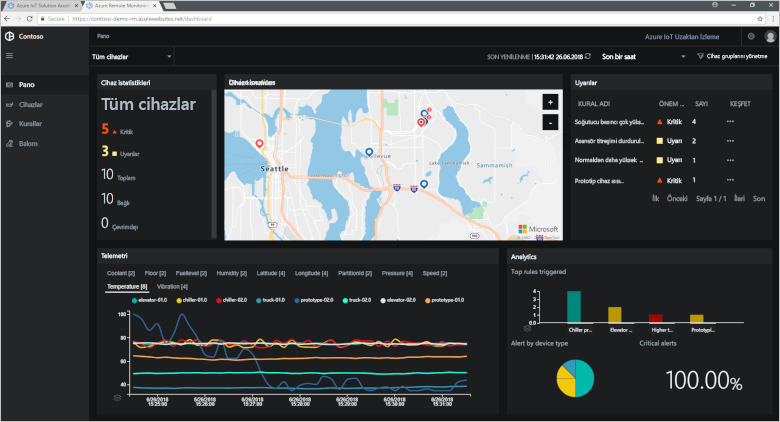

# Azure IoT çözüm hızlandırıcıları nedir?

Bulut tabanlı bir IoT çözümünde genelde cihaz bağlantısı, veri işleme, veri analizi ve sunum yönetimi için özel kodlar ve birden fazla bulut hizmeti kullanılır.

IoT çözüm hızlandırıcıları uzaktan izleme, bağlı fabrika ve tahmine dayalı bakım gibi sık kullanılan IoT senaryolarını uygulayan tam kapsamlı ve dağıtıma hazır IoT çözümü koleksiyonudur. Bir çözüm hızlandırıcısını dağıttığınızda gerekli tüm bulut tabanlı hizmetler ve gerekli uygulama kodları dağıtılır.

Çözüm hızlandırıcıları, kendi IoT çözümlerinizi oluşturmak için başlangıç noktalarıdır. Tüm çözüm hızlandırıcılarının kaynak kodu açık kaynaktır ve GitHub üzerinde mevcuttur. Çözüm hızlandırıcılarını indirmeniz ve gereksinimlerinize göre [özelleştirmeniz](iot-accelerators-remote-monitoring-customize.md) önerilir.

Sıfırdan özel bir IoT çözümü derlemeden önce çözüm hızlandırıcılarını eğitim aracı olarak kullanabilirsiniz. Çözüm hızlandırıcıları, bulut tabanlı IoT çözümleri için uygulayabileceğiniz kanıtlanmış yöntemler sunar.

Her çözüm hızlandırıcısındaki uygulama kodunda çözüm hızlandırıcısını yönetmenizi sağlayan bir pano bulunur. Örneğin panoyu kullanarak bağlı cihazlarınızdan gelen telemetri verilerini görüntüleyebilir, yeni cihazlar sağlayabilir veya bağlı cihazlarınızdaki üretici yazılımını yükseltebilirsiniz:

## Desteklenen IoT senaryoları

Şu anda dağıtıma hazır dört çözüm hızlandırıcısı vardır:

### Uzaktan İzleme

Birden fazla uzak cihazdan telemetri verileri almak ve bu cihazları denetlemek için bu çözüm hızlandırıcısını kullanabilirsiniz. Cihazlara örnek olarak müşterilerinizin tesislerindeki soğutma sistemleri veya uzak pompa istasyonlarındaki valfler verilebilir.

### Bağlı Fabrika

[OPC Unified Architecture](https://opcfoundation.org/about/opc-technologies/opc-ua/) arabirimine sahip olan endüstriyel varlıklardan telemetri verilerini toplamak ve bu varlıkları denetlemek için bu çözüm hızlandırıcısını kullanabilirsiniz. Endüstriyel varlıklar arasında bir fabrikanın üretim hattındaki montaj ve test istasyonları olabilir.

### Tahmine Dayalı Bakım

Tahmin edilen arıza ortaya çıkmadan önce bakım çalışmalarını tamamlama amacıyla uzak bir cihazın arıza verebileceği zamanı tahmin etmek için bu çözüm hızlandırıcısını kullanabilirsiniz. Bu çözüm hızlandırıcısı, cihazların telemetri verilerini kullanarak arıza tahmini gerçekleştirmek için makine öğrenimi algoritmalarını kullanır. Örnek cihazlar uçak motorları veya asansörler olabilir.

### Cihaz Benzetimi

Gerçekçi telemetri verileri oluşturan sanal cihazları çalıştırmak için bu çözüm hızlandırıcısını kullanabilirsiniz. Bu çözüm hızlandırıcısını kullanarak diğer çözüm hızlandırıcılarının davranışını veya kendi IoT çözümlerinizi test edebilirsiniz.

## Tasarım ilkeleri

Tüm çözüm hızlandırıcıları aynı tasarım ilkelerini ve hedeflerini takip etmektedir. Bu bileşenler şu şekilde tasarlanmıştır:

* **Ölçeklenebilir**: Milyonlarca cihaz bağlamanıza ve yönetmenize izin verir.
* **Genişletilebilir**: Çözümleri ihtiyaçlarınıza göre özelleştirmenizi sağlar.
* **Anlaşılır**: Çözümlerin nasıl çalıştığını ve nasıl uygulandığını kavramanızı sağlar.
* **Modüler**: Hizmetleri alternatifleriyle değiştirmeniz izin verir.
* **Güvenli**: Azure güvenliğini yerleşik bağlantı ve cihaz güvenliği özellikleriyle birleştirir.

## Mimariler ve diller

Özgün çözüm hızlandırıcıları .NET ile model-görünüm-denetleyici (MVC) mimarisi kullanılarak yazılmıştır. Microsoft, çözüm hızlandırıcıları yeni bir mikro hizmet mimarisiyle güncelleştirmektedir. Her mikro hizmetin hem [Java](https://github.com/Azure/azure-iot-pcs-remote-monitoring-java) hem de [.NET](https://github.com/Azure/azure-iot-pcs-remote-monitoring-dotnet) sürümü GitHub'da mevcuttur. Aşağıdaki tabloda, çözüm hızlandırıcılarının geçerli durumu gösterilmektedir:

| Çözüm hızlandırıcısı   | Mimari  | Diller     |
| ---------------------- | ------------- | ------------- |
| Uzaktan İzleme      | Mikro hizmetler | Java ve .NET |
| Tahmine Dayalı Bakım | MVC           | .NET          |
| Bağlı Fabrika      | MVC           | .NET          |

Mikro hizmet mimarisi hakkında daha fazla bilgi için [.NET Uygulama Mimarisi](https://www.microsoft.com/net/learn/architecture) ve [Mikro hizmetler: Bulut tarafından desteklenen bir uygulama devrimi](https://azure.microsoft.com/blog/microservices-an-application-revolution-powered-by-the-cloud/) konusunu inceleyin.

## Dağıtım seçenekleri

Mikro hizmet tabanlı çözüm hızlandırıcılarını aşağıdaki yapılandırmalarla dağıtabilirsiniz:

* **Standart:** Bir üretim dağıtımı geliştirmek için genişletilmiş altyapı dağıtımı. Azure Container Service, mikro hizmetleri birden fazla Azure sanal makinesine dağıtır. Kubernetes mikro hizmetleri tek tek barındıran Docker kapsayıcılarını düzenler.
* **Temel:** Tanıtım için veya bir dağıtımı test etmek için daha düşük maliyetli sürüm. Tüm mikro hizmetler tek bir Azure sanal makinesine dağıtılır.
* **Yerel:** Test ve geliştirme için yerel makineye dağıtma. Bu yaklaşımda mikro hizmetler yerel bir Docker kapsayıcısına dağıtılır ve buluttaki IoT Hub, Azure Cosmos DB ve Azure depolama hizmetlerine bağlanır.

Çözüm hızlandırıcısını çalıştırmanın maliyeti [arka planda çalışan Azure hizmetlerinin maliyetinin](https://azure.microsoft.com/pricing) toplamıdır. Kullanılan Azure hizmetlerinin ayrıntılarını dağıtım seçeneklerinizi belirlerken görebilirsiniz.

## Sonraki adımlar

IoT çözüm hızlandırıcılarından birini denemek için [Bulut tabanlı uzaktan izleme çözümü dağıtma](quickstart-remote-monitoring-deploy.md) hızlı başlangıcına bakın.
