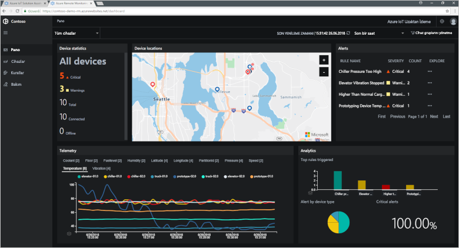
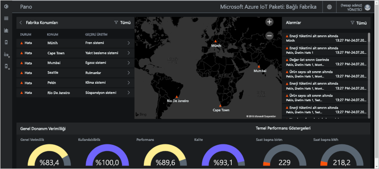
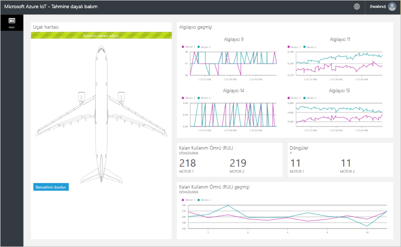
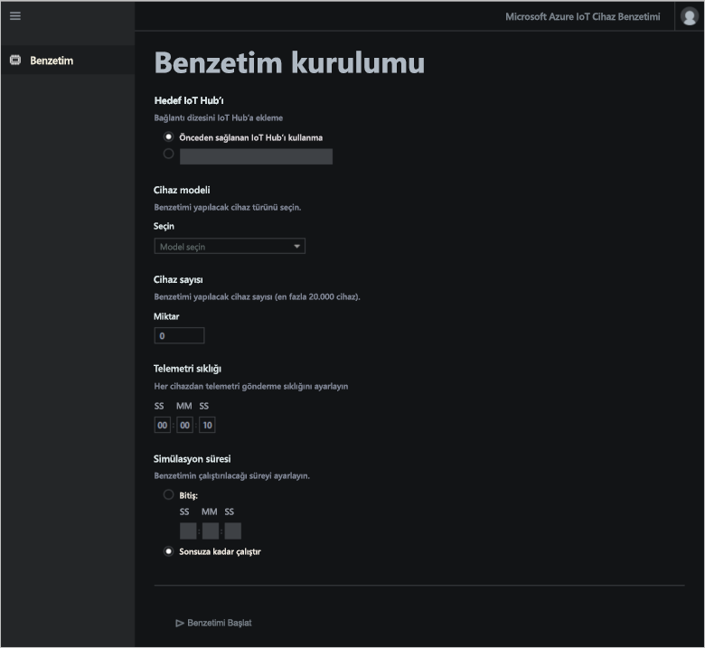

# Azure IoT çözüm hızlandırıcıları nedir?

Bulut tabanlı bir IOT çözüm genellikle özel kod ve bulut Hizmetleri cihaz bağlantısı, veri işleme ve analiz ve sunu yönetmek için kullanır.

IOT Çözüm Hızlandırıcıları, ortak IOT senaryolarını uygulayan tam, dağıtımı hazır IOT çözümlerini kullanıyorsunuz. Uzaktan izleme, bağlı Fabrika, Tahmine dayalı Bakım ve cihaz benzetimi senaryolar içerir. Bir çözüm hızlandırıcısını dağıttığınızda gerekli tüm bulut tabanlı hizmetler ve gerekli uygulama kodları dağıtılır.

Çözüm hızlandırıcıları, kendi IoT çözümlerinizi oluşturmak için başlangıç noktalarıdır. Tüm çözüm hızlandırıcılarının kaynak kodu açık kaynaktır ve GitHub üzerinde mevcuttur. Çözüm hızlandırıcılarını indirmeniz ve gereksinimlerinize göre özelleştirmeniz önerilir.

Sıfırdan özel bir IoT çözümü derlemeden önce çözüm hızlandırıcılarını eğitim aracı olarak kullanabilirsiniz. Çözüm hızlandırıcıları, bulut tabanlı IoT çözümleri için uygulayabileceğiniz kanıtlanmış yöntemler sunar.

Her çözüm hızlandırıcısındaki uygulama kodunda çözüm hızlandırıcısını yönetmenizi sağlayan bir web uygulaması bulunur.

## Desteklenen IoT senaryoları

Şu anda dağıtıma hazır dört çözüm hızlandırıcısı vardır:

### Uzaktan İzleme

Kullanım [Uzaktan izleme çözüm hızlandırıcısının](iot-accelerators-remote-monitoring-sample-walkthrough.md) uzak cihazlardan telemetri toplamaya ve bunları denetlemek için. Cihazlara örnek olarak müşterilerinizin tesislerindeki soğutma sistemleri veya uzak pompa istasyonlarındaki valfler verilebilir.

Uzaktan izleme panosunu kullanarak bağlı cihazlarınızdan gelen telemetri verilerini görüntüleyebilir, yeni cihazlar sağlayabilir veya bağlı cihazlarınızdaki üretici yazılımını yükseltebilirsiniz:

### Bağlı Fabrika

Kullanım [bağlı Fabrika Çözüm Hızlandırıcısı](iot-accelerators-connected-factory-features.md) endüstriyel varlıklarla telemetri toplamak için bir [OPC birleşik mimarisi](https://opcfoundation.org/about/opc-technologies/opc-ua/) arabirimi ve bunları denetlemek için. Endüstriyel varlıklar arasında bir fabrikanın üretim hattındaki montaj ve test istasyonları olabilir.

Bağlı fabrika panonuzu kullanarak endüstriyel cihazlarınızı izleyebilir ve yönetebilirsiniz:

### Tahmine Dayalı Bakım

Kullanım [Tahmine dayalı bakım Çözüm Hızlandırıcısı](iot-accelerators-predictive-walkthrough.md) tahmin, uzak cihaz cihaz başarısız olmadan önce bakım gerçekleştirmek için başarısız olması bekleniyor. Bu çözüm hızlandırıcısı, cihazların telemetri verilerini kullanarak arıza tahmini gerçekleştirmek için makine öğrenimi algoritmalarını kullanır. Örnek cihazlar uçak motorları veya asansörler olabilir.

Tahmine dayalı bakım panosunu kullanarak tahmine dayalı bakım analizlerini görüntüleyebilirsiniz:

### Cihaz Benzetimi

Kullanım [cihaz benzetimi Çözüm Hızlandırıcısı](iot-accelerators-device-simulation-overview.md) gerçekçi telemetri oluşturmak sanal cihazlar çalıştırılacak. Bu çözüm hızlandırıcısını kullanarak diğer çözüm hızlandırıcılarının davranışını veya kendi IoT çözümlerinizi test edebilirsiniz.

Cihaz benzetimi web uygulamasını kullanarak benzetimlerinizi yapılandırabilir ve çalıştırabilirsiniz:

## Tasarım ilkeleri

Tüm çözüm hızlandırıcıları aynı tasarım ilkelerini ve hedeflerini takip etmektedir. Bu bileşenler şu şekilde tasarlanmıştır:

* **Ölçeklenebilir**: Milyonlarca cihaz bağlamanıza ve yönetmenize izin verir.
* **Genişletilebilir**: Çözümleri ihtiyaçlarınıza göre özelleştirmenizi sağlar.
* **Anlaşılır**: Çözümlerin nasıl çalıştığını ve nasıl uygulandığını kavramanızı sağlar.
* **Modüler**: Hizmetleri alternatifleriyle değiştirmeniz izin verir.
* **Güvenli**: Azure güvenliğini yerleşik bağlantı ve cihaz güvenliği özellikleriyle birleştirir.

## Mimariler ve diller

Özgün çözüm hızlandırıcıları .NET ile model-görünüm-denetleyici (MVC) mimarisi kullanılarak yazılmıştır. Microsoft, çözüm hızlandırıcıları yeni bir mikro hizmet mimarisiyle güncelleştirmektedir. Aşağıdaki tabloda, çözüm hızlandırıcılarının geçerli durumu ve GitHub deposu bağlantıları gösterilmektedir:

| Çözüm hızlandırıcısı   | Mimari  | Languages     |
| ---------------------- | ------------- | ------------- |
| Uzaktan İzleme      | Mikro hizmetler | [Java](https://github.com/Azure/azure-iot-pcs-remote-monitoring-java) ve [.NET](https://github.com/Azure/azure-iot-pcs-remote-monitoring-dotnet) |
| Tahmine Dayalı Bakım | MVC           | [.NET](https://github.com/Azure/azure-iot-predictive-maintenance)          |
| Bağlı Fabrika      | MVC           | [.NET](https://github.com/Azure/azure-iot-connected-factory)          |
| Cihaz Benzetimi      | Mikro hizmetler | [.NET](https://github.com/Azure/device-simulation-dotnet)          |

Mikro hizmet mimarisi hakkında daha fazla bilgi için bkz: [Azure IOT başvuru mimarisi için giriş](iot-accelerators-architecture-overview.md).

## Dağıtım seçenekleri

Çözüm hızlandırıcılarını [Microsoft Azure IoT Çözüm Hızlandırıcıları](https://www.azureiotsolutions.com/Accelerators#) sitesinden veya komut satırını kullanarak dağıtabilirsiniz.

Uzaktan İzleme çözümü hızlandırıcısını aşağıdaki yapılandırmalarla dağıtabilirsiniz:

* **Standart:** Bir üretim dağıtımı geliştirmek için genişletilmiş altyapı dağıtımı. Azure Container Service, mikro Hizmetleri birden fazla Azure sanal makinelerine dağıtır. Kubernetes mikro hizmetleri tek tek barındıran Docker kapsayıcılarını düzenler.
* **Temel:** Tanıtım için veya bir dağıtımı test etmek için daha az maliyet sürümü. Tüm mikro hizmetler tek bir Azure sanal makinesine dağıtılır.
* **Yerel:** Test ve geliştirme için yerel makine dağıtım. Bu yaklaşımda mikro hizmetler yerel bir Docker kapsayıcısına dağıtılır ve buluttaki IoT Hub, Azure Cosmos DB ve Azure depolama hizmetlerine bağlanır.

Çözüm Hızlandırıcısını çalıştırma maliyeti birleşik, [temel alınan Azure Hizmetleri çalıştıran maliyeti](https://azure.microsoft.com/pricing). Kullanılan Azure hizmetlerinin ayrıntılarını dağıtım seçeneklerinizi belirlerken görebilirsiniz.

## Sonraki adımlar

IoT çözüm hızlandırıcılarından birini denemek için hızlı başlangıçları inceleyin:

* [Uzaktan izleme çözümü deneyin](quickstart-remote-monitoring-deploy.md)
* [Bağlı fabrika çözümünü deneyin](quickstart-connected-factory-deploy.md)
* [Tahmine dayalı bakım çözümünü deneyin](quickstart-predictive-maintenance-deploy.md)
* [Cihaz benzetimi çözümünü deneyin](quickstart-device-simulation-deploy.md)
