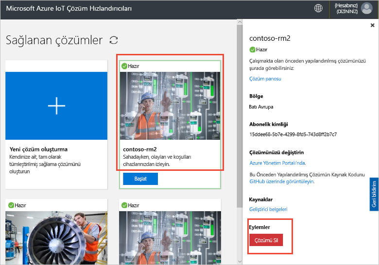

# Uzaktan izleme çözüm Hızlandırıcısını için bir IOT DevKit cihazı bağlayın

[!INCLUDE [iot-suite-selector-connecting](../../includes/iot-suite-selector-connecting.md)]

Bu nasıl yapılır kılavuzunda, IOT DevKit Cihazınızda bir örnek uygulamayı çalıştırma işlemini göstermektedir. Örnek kod telemetri çözüm hızlandırıcınız DevKit cihazda sensörlerden alınan gönderir.

[MXChip IOT DevKit](https://aka.ms/iot-devkit) bir hepsi bir arada Arduino uyumlu zengin çevre ve sensörlerden panosudur. Onu kullanarak geliştirebilirsiniz [Azure IOT cihaz Workbench](https://aka.ms/iot-workbench) veya [Azure IOT Araçları](https://aka.ms/azure-iot-tools) Visual Studio Code uzantısı paketinde. [Projeleri Kataloğu](https://microsoft.github.io/azure-iot-developer-kit/docs/projects/) prototip IOT çözümlerine yardımcı olmak için örnek uygulamalar içerir.

## Başlamadan önce

Bu öğreticideki adımları tamamlamak için önce aşağıdaki görevleri yapın:

* İçindeki adımları izleyerek, DevKit hazırlama [IOT DevKit AZ3166 bulutta Azure IOT hub'a bağlanma](/azure/iot-hub/iot-hub-arduino-iot-devkit-az3166-get-started).

## Açık örnek proje

Uzaktan izleme örnek VS Code'da açmak için:

1. Bilgisayarınıza, IOT DevKit olmadığından emin olun. VS Code ilk kez başlatın ve ardından DevKit bilgisayarınıza bağlayın.

1. Tıklayın `F1` komut paletini açın için girin ve seçin **Azure IOT cihaz Workbench: Örnek Aç...** . Ardından **IOT DevKit** tablosu olarak.

1. Bulma **Uzaktan izleme** tıklatıp **açık örnek**. Proje klasörünü gösteren yeni bir VS Code penceresinin açılır:

   

## Cihazı yapılandırma

DevKit cihazınızın IOT Hub cihaz bağlantı dizesini yapılandırmak için:

1. IOT DevKit içine geçiş **yapılandırma modunu**:

    * Düğmesini basılı **A**.
    * Anında iletme ve yayın **sıfırlama** düğmesi.

1. Ekran DevKit Kimliğini görüntüler ve `Configuration`.

    

1. Tuşuna **F1** komut paletini açın için girin ve seçin **Azure IOT cihaz Workbench: Cihaz ayarlarını yapılandırma > yapılandırma cihaz bağlantı dizesini**.

1. Daha önce kopyaladığınız bağlantı dizesini yapıştırın ve basın **Enter** cihaz yapılandırmak için.

## Kodu oluşturma

Oluşturmak ve cihaz kodu yüklemek için:

1. Tuşuna `F1` komut paletini açın için girin ve seçin **Azure IOT cihaz Workbench: Cihaz kodu karşıya**:

1. VS Code, derler ve kod DevKit cihazınıza yükler:

    

1. DevKit cihaz yeniden başlatılır ve karşıya yüklediğiniz kodunu çalıştırır.

## Örnek test

DevKit cihaza yüklediğiniz örnek uygulamayı çalışır durumda olduğunu doğrulamak için aşağıdaki adımları tamamlayın:

### Uzaktan izleme çözümüne gönderilen telemetri görüntüleme

Örnek uygulama çalıştırıldığında DevKit cihaz çözüm hızlandırıcınız Wi-Fi algılayıcı verilerini telemetri gönderir. Telemetri görmek için:

1. Çözüm panonuza gidin ve tıklatın **Device Explorer**.

1. DevKit cihazınızın cihaz adına tıklayın. sağ taraftaki sekmesinde DevKit gerçek zamanlı olarak gelen telemetriyi görebilirsiniz:

    

### DevKit cihazı denetleme

Uzaktan izleme çözüm Hızlandırıcısını Cihazınızı uzaktan denetlemenize olanak tanır. Örnek kod görebilirsiniz üç yöntem uygulayan **yöntemi** bölümünde cihaz seçtiğinizde **Device Explorer** sayfası:

DevKit LED'lerini birinin rengini değiştirmek için kullanın **LedColor** yöntemi:

1. Cihaz listesinden cihaz adını seçin ve tıklayın **işleri**:

    

1. Aşağıdaki değerleri kullanarak işleri yapılandırmak ve tıklatın **Uygula**:

   * İşi seçin: **Run yöntemi**
   * Yöntem adı: **LedColor**
   * İş Adı: **ChangeLedColor**

     

1. Birkaç saniye sonra üzerinde DevKit RGB LED (Aşağıda, bir düğme) rengini değiştirir:

    

## Kaynakları temizleme

Öğreticilere devam etmeyi planlıyorsanız Uzaktan İzleme çözümü hızlandırıcısı dağıtımını bırakın.

Çözüm Hızlandırıcısını artık ihtiyacınız kalmadığında, seçerek ve ardından silme çözüm tıklayarak sağlanan çözümleri sayfasından silin:

## Sorunları ve geri bildirim

Tüm sorunlarla karşılaşırsanız, bakın [IOT DevKit SSS'leri](https://microsoft.github.io/azure-iot-developer-kit/docs/faq/) veya aşağıdaki kanalları kullanarak bize ulaşın:

* [Gitter.im](https://gitter.im/Microsoft/azure-iot-developer-kit)
* [Stack Overflow](https://stackoverflow.com/questions/tagged/iot-devkit)

## Sonraki adımlar

Uzaktan izleme çözüm Hızlandırıcısını için DevKit cihaz bağlayamama öğrendiniz, bazı önerilen sonraki adımlar şunlardır:

* [Azure IOT çözüm hızlandırıcılarına genel bakış](https://docs.microsoft.com/azure/iot-accelerators/)
* [Kullanıcı arabirimini özelleştirme](iot-accelerators-remote-monitoring-customize.md)
* [IOT DevKit Azure IOT Central uygulamanızı bağlayın](../iot-central/howto-connect-devkit.md)