# Hızlı Başlangıç: Deneyin My endüstriyel IOT cihazları yönetmek için bulut tabanlı bir çözüm

Bu hızlı başlangıçta endüstriyel IoT cihazlarını izleme ve yönetme amacıyla bulut tabanlı bir uygulama çalıştırmak için Azure IoT Bağlı Fabrika çözüm hızlandırıcısını dağıtmayı öğreneceksiniz. Bağlı Fabrika çözüm hızlandırıcısını dağıttığınızda, genel bir endüstriyel IoT senaryosunu adım adım görmenize olanak sağlayan sanal kaynaklar ile önceden doldurulur. Çözüme bağlanmış olan birçok sanal fabrika, genel donanım verimliliğini (OEE) ve ana performans göstergelerini (KPI) hesaplamak için gereken veri değerlerini raporlar. Bu hızlı başlangıçta çözüm panosunu kullanarak aşağıdaki işlemleri gerçekleştireceksiniz:

* Fabrikayı, üretim hatlarını, istasyon OEE ve KPI değerlerini izleme.
* Bu cihazlardan oluşturulan telemetri verilerini analiz etme.
* Uyarılara yanıt verme.

Bu hızlı başlangıcı tamamlamak etkin bir Azure aboneliğinizin olması gerekir.

Azure aboneliğiniz yoksa başlamadan önce [ücretsiz bir hesap](https://azure.microsoft.com/free/?WT.mc_id=A261C142F) oluşturun.

## Çözümü dağıtma

Çözüm hızlandırıcısını Azure aboneliğinize dağıttığınızda ayarlamanız gereken yapılandırma seçenekleri vardır.

[Microsoft Azure IoT çözüm hızlandırıcıları](https://www.azureiotsolutions.com) sayfasına gidip Azure hesabı kimlik bilgilerinizle oturum açın.

**Bağlı Fabrika** kutucuğuna tıklayın. **Bağlı Fabrika** sayfasında **Hemen deneyin**’e tıklayın:

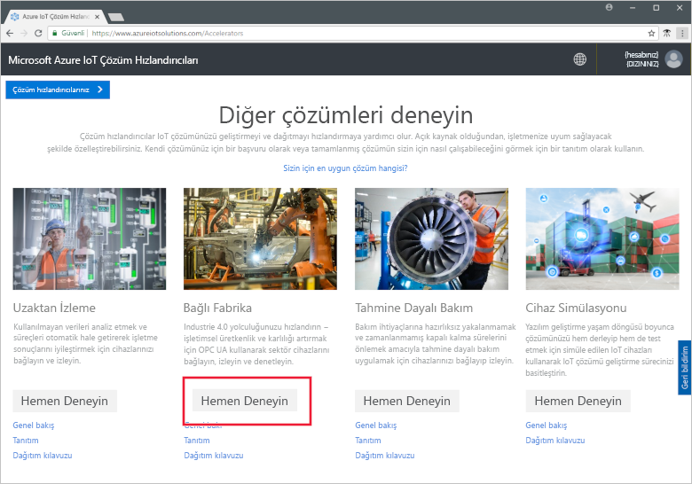

**Bağlı Fabrika çözümü oluştur** sayfasında Bağlı Fabrika çözüm hızlandırıcınız için benzersiz bir **Çözüm adı** girin. Bu ad tüm çözüm hızlandırıcısı kaynaklarını içeren Azure kaynak grubunun adıdır. Bu hızlı başlangıçta **MyDemoConnectedFactory** adı kullanılmıştır.

Çözüm hızlandırıcısını dağıtırken kullanmak istediğiniz **Subscription** (Abonelik) ve **Region** (Bölge) seçimini yapın. Genelde size en yakın bölgeyi seçmeniz gerekir. Bu hızlı başlangıçta **Visual Studio Enterprise** ve **Doğu ABD** kullanıyoruz. Abonelikte [genel yönetici veya kullanıcı](iot-accelerators-permissions.md) olmanız gerekir.

Tıklayın **Oluştur** dağıtımınıza başlamak için. Bu işlemin çalışması en az beş dakika sürer:

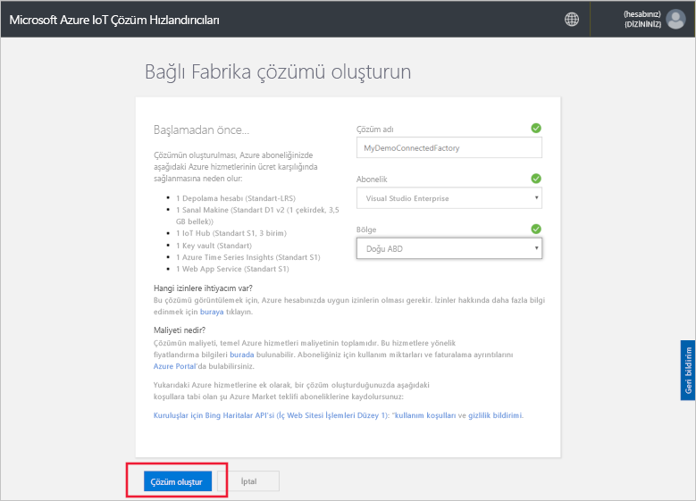

## Çözümde oturum açma

Azure aboneliğinize dağıtım tamamlandığında, çözüm dosyasında yeşil bir onay işareti ve **Hazır** yazısı görürsünüz. Ardık Bağlı Fabrika çözüm Hızlandırıcısı panonuzda oturum açabilirsiniz.

**Sağlanan çözümler** sayfasında yeni Bağlı Fabrika çözümü hızlandırıcınıza tıklayın:

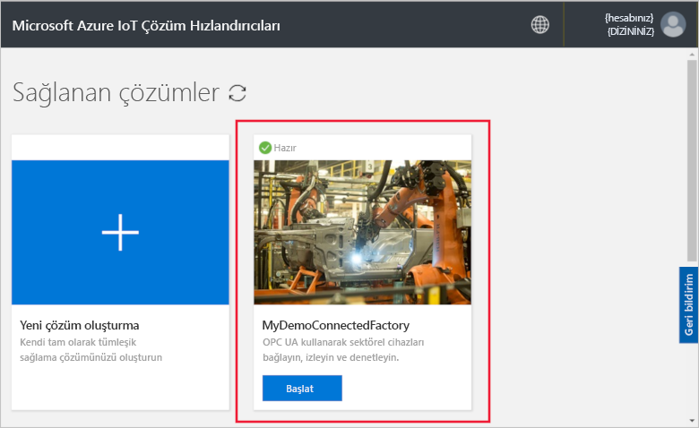

Bağlı Fabrika çözüm hızlandırıcınız görünen sayfasında ilgili bilgileri görüntüleyebilirsiniz. Seçin **çözüm hızlandırıcınız Git** bağlı Fabrika çözüm hızlandırıcınız görüntülemek için:

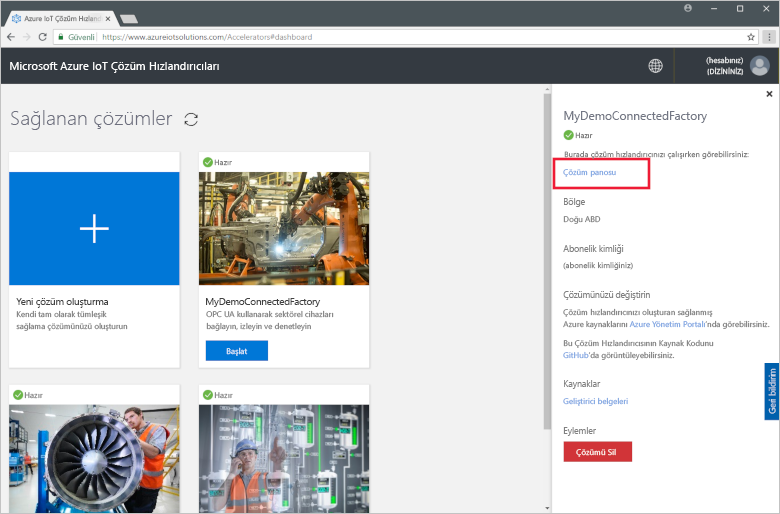

İzin isteğini kabul etmek için **Kabul et** öğesine tıklayın. Bağlı Fabrika çözümü panosu tarayıcınızda görüntülenir. Sanal fabrikalar, üretim hatları ve istasyonları gösterilir.

## Panoyu görüntüleme

Varsayılan görünüm, *pano* şeklindedir. Portalın diğer alanlarına gitmek için sayfanın sol tarafındaki menüyü kullanın:

[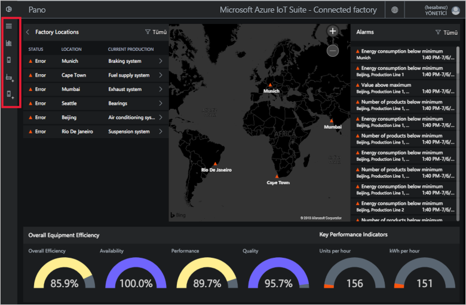](./media/quickstart-connected-factory-deploy/dashboard-expanded.png#lightbox)

Endüstriyel IoT cihazlarınızı yönetmek için panoyu kullanırsınız. Bağlı Fabrika, global fabrika yapılandırmasını göstermek için bir hiyerarşi kullanır. Hiyerarşinin en üst düzeyinde, bir veya daha fazla fabrika içeren kuruluş bulunur. Her fabrika üretim hatlarından ve her üretim hattı da istasyonlardan oluşur. Her düzeyde OEE ve KPI’leri görüntüleyebilir, telemetri için yeni düğümler yayımlayabilir ve alarmlara yanıt verebilirsiniz.

Panoda şunları görebilirsiniz:

## Genel donanım verimliliği

**Genel Donanım Verimliliği** paneli, kuruluşun tamamı için veya görüntülediğiniz fabrika/üretim hattı/istasyon için OEE değerlerini gösterir. Bu değer, kurumsal düzeyi bulmak için istasyon görünümünden toplanır. OEE şekli ve bu şekli oluşturan öğeler daha fazla analiz edilebilir.

[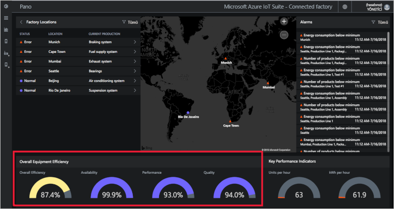](./media/quickstart-connected-factory-deploy/oee-expanded.png#lightbox)

OEE, üretimle ilgili operasyonel parametreleri kullanarak üretim sürecinin verimliliğini derecelendirir. OEE, standart ölçü kullanılabilirlik oranı, performans oranı ve kalite oranının çarpılmasıyla hesaplanan bir sektördür: OEE = kullanılabilirlik x performans x kalite.

Hiyerarşi verilerinin herhangi bir düzeyindeki OEE verilerini daha ayrıntılı bir şekilde analiz edebilirsiniz. OEE, kullanılabilirlik, performans veya kalite yüzdesi halkasına tıklayın. Verilerin farklı zamanlardaki görselleştirmelerinin yer aldığı bir bağlam paneli açılır:

[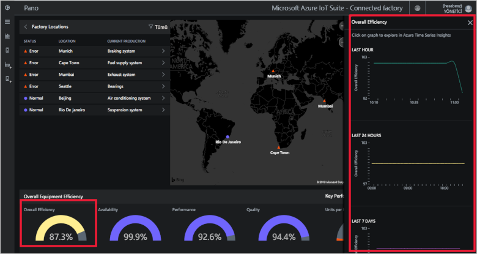](./media/quickstart-connected-factory-deploy/oeedetail-expanded.png#lightbox)

İstediğiniz grafiğe tıklayarak verileri daha ayrıntılı bir şekilde analiz edebilirsiniz.

### Temel performans göstergeleri

**Temel performans göstergeleri**, kuruluşun tamamında veya görüntülediğiniz fabrika/üretim hattı/istasyonda saatte üretilen birimlerin ve kullanılan enerjinin (kWh) görüntülendiği paneldir. Bu değerler, kurumsal düzeyi bulmak için istasyon görünümünden toplanır.

[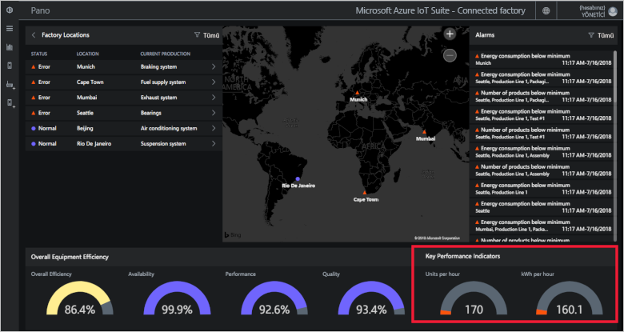](./media/quickstart-connected-factory-deploy/kpis-expanded.png#lightbox)

Hiyerarşi verilerinin herhangi bir düzeyindeki KPI verilerini daha ayrıntılı bir şekilde analiz edebilirsiniz. OEE, kullanılabilirlik, performans veya kalite yüzdesi halkasına tıklayın. Verilerin farklı zamanlardaki görselleştirmelerinin yer aldığı bir bağlam paneli açılır:

[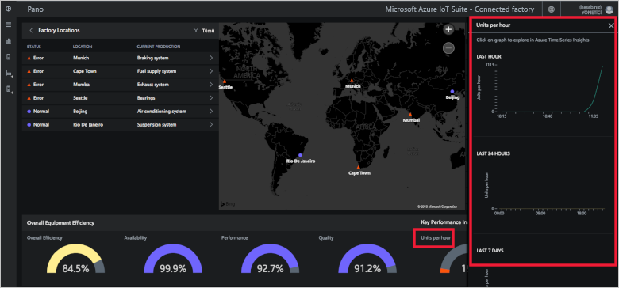](./media/quickstart-connected-factory-deploy/kpidetail-expanded.png#lightbox)

İstediğiniz grafiğe tıklayarak verileri daha ayrıntılı bir şekilde analiz edebilirsiniz.

### Fabrika Konumları

Çözümdeki durumu, konumu ve geçerli üretim yapılandırmasını gösteren bir **fabrika konumları** paneli. Çözüm hızlandırıcısını ilk kez çalıştırdığınızda, panoda sanal fabrikalardan oluşan bir küme görüntülenir. Her üretim hattı benzetimi, benzetimi yapılan görevleri gerçekleştiren ve verileri paylaşan üç gerçek OPC UA sunucusundan oluşur. OPC UA hakkında daha fazla bilgi için bkz. [Bağlı Fabrika SSS](iot-accelerators-faq-cf.md):

[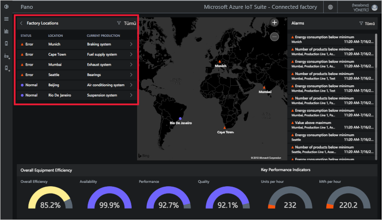](./media/quickstart-connected-factory-deploy/factorylocations-expanded.png#lightbox)

Çözüm hiyerarşisinde gezinebilir ve her düzeydeki OEE ve KPI değerlerini görüntüleyebilirsiniz:

1. **Fabrika Konumları**'nda **Mumbai**'ye tıklayın. Bu konumdaki üretim hatlarını görürsünüz.

1. **Production Line 1**'e tıklayın. Bu üretim hattındaki istasyonları görürsünüz.

1. **Packaging**'e tıklayın. Bu istasyon tarafından yayımlanan OPC UA düğümlerini görürsünüz.

1. **EnergyConsumption**'a tıklayın. Değerin farklı zamanlardaki değişimini gösteren grafikler görürsünüz. İstediğiniz grafiğe tıklayarak verileri daha ayrıntılı bir şekilde analiz edebilirsiniz.

[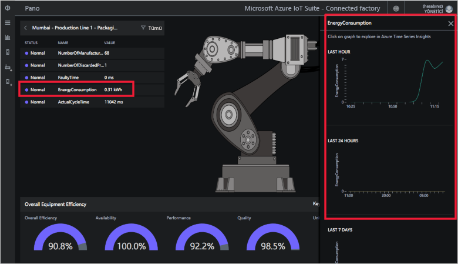](./media/quickstart-connected-factory-deploy/explorelocations-expanded.png#lightbox)

### Eşleme

Aboneliğinizin [Bing Haritalar API’sine](iot-accelerators-faq-cf.md) erişimi varsa, *Fabrikalar* haritasında size çözümdeki tüm fabrikaların coğrafi konumu ve durumu gösterilir. Konumun detaylarına gitmek için haritada görüntülenen konumlara tıklayın.

[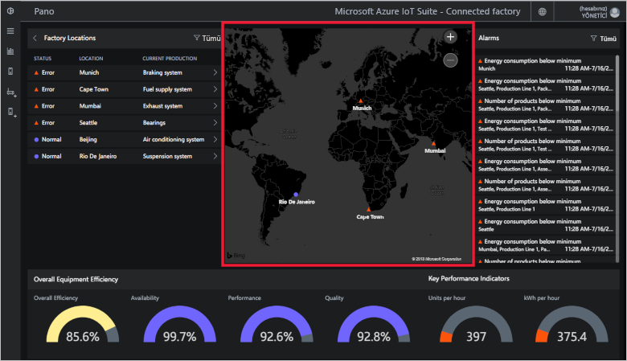](./media/quickstart-connected-factory-deploy/map-expanded.png#lightbox)

### Alarmlar

**Alarmlar** panelinde, raporlanan bir değerin veya hesaplanan OEE/KPI değerinin yapılandırılmış eşiği aşmasından dolayı oluşturulan alarmlar gösterilir. Bu panelde, istasyon düzeyinden kuruluş düzeyine kadar her hiyerarşi düzeyindeki alarmlar görüntülenir. Her alarm açıklama, tarih, saat, konum ve tekrarlanma sayısını içerir:

[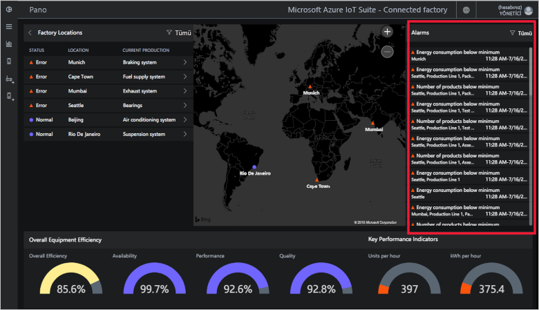](./media/quickstart-connected-factory-deploy/alarms-expanded.png#lightbox)

Panodan alarma neden olan verileri analiz edebilirsiniz. Yöneticiyseniz alarmlar üzerinde şu varsayılan eylemleri gerçekleştirebilirsiniz:

* Alarmı kapatma.
* Alarmı kabul etme.

Alarmlardan birine tıklayın, **Eylem seçin** açılan menüsünde **Uyarıyı kabul et**'i seçin ve **Uygula**'ya tıklayın:

[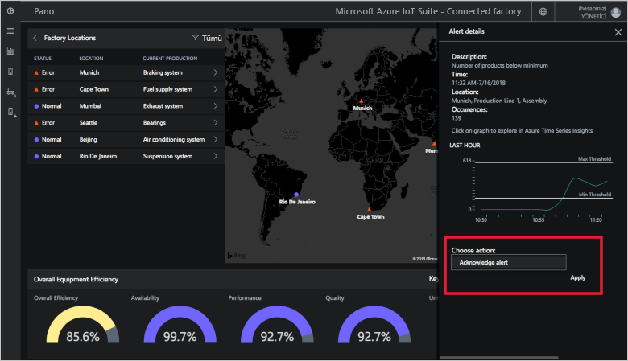](./media/quickstart-connected-factory-deploy/acknowledge-expanded.png#lightbox)

Alarm verilerini daha fazla çözümlemek için, alarm panelindeki grafiğe tıklayın.

Bu alarmlar, çözüm hızlandırıcısındaki yapılandırma dosyasında belirtilen kurallar tarafından oluşturulur. Bu kurallar OEE veya KPI rakamları veya OPC UA düğüm değerleri bir eşiğin üstünde olduğunuzda alarmlar oluşturur. Bu eşik değerini ayarlayabilirsiniz.

## Kaynakları temizleme

Daha fazla incelemeyi planlıyorsanız, Bağlı Fabrika çözüm hızlandırıcısını dağıtımda bırakın.

Çözüm hızlandırıcısına ihtiyacınız kalmadıysa [Sağlanan çözümler](https://www.azureiotsolutions.com/Accelerators#dashboard) sayfasından seçtikten sonra **Çözümü sil**'e tıklayarak silebilirsiniz:

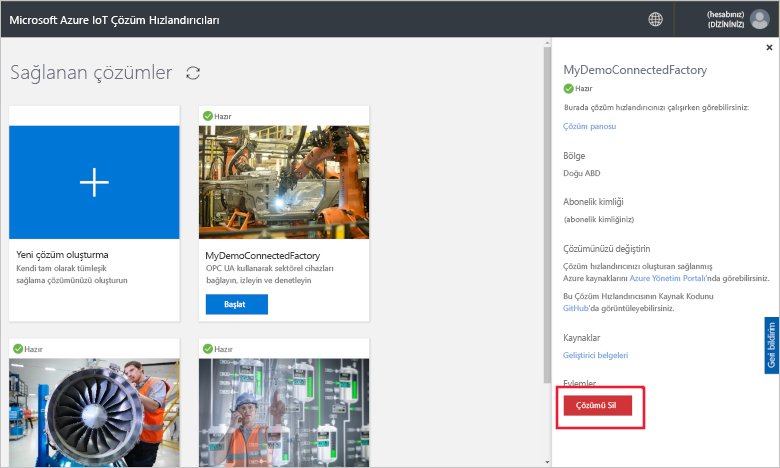

## Sonraki adımlar

Bu hızlı başlangıçta Bağlı Fabrika çözümünü dağıttınız ve fabrikalarınız, üretim hatlarınız ve istasyonlarınız arasında gezinmeyi öğrendiniz. Ayrıca tüm hiyerarşi düzeylerindeki OEE ve KPI değerlerini görüntülediniz ve alarmlara yanıt vermeyi öğrendiniz.

Endüstriyel IoT cihazlarınızı yönetmek için panodaki diğer özellikleri nasıl kullanacağınız hakkında bilgi edinmek için aşağıdaki nasıl yapılır kılavuzuna gidin:

> [!div class="nextstepaction"]
> [Bağlı Fabrika panosunu kullanma](iot-accelerators-connected-factory-dashboard.md)