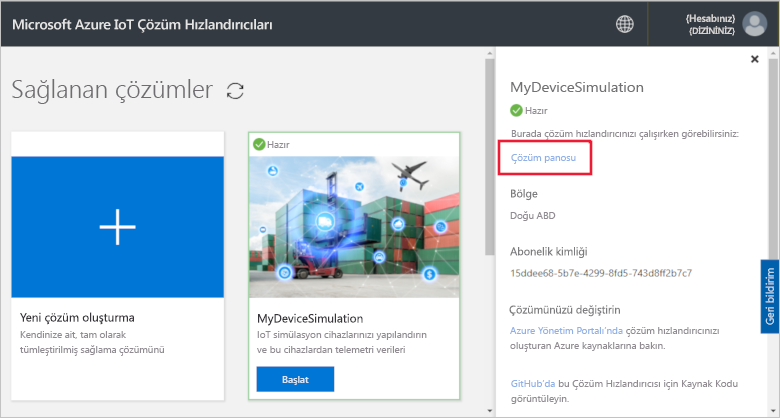
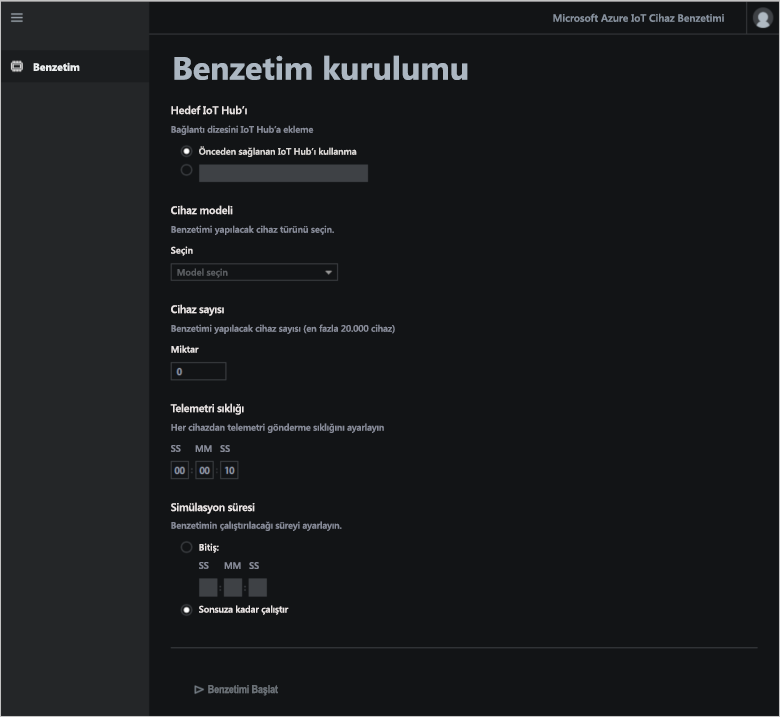
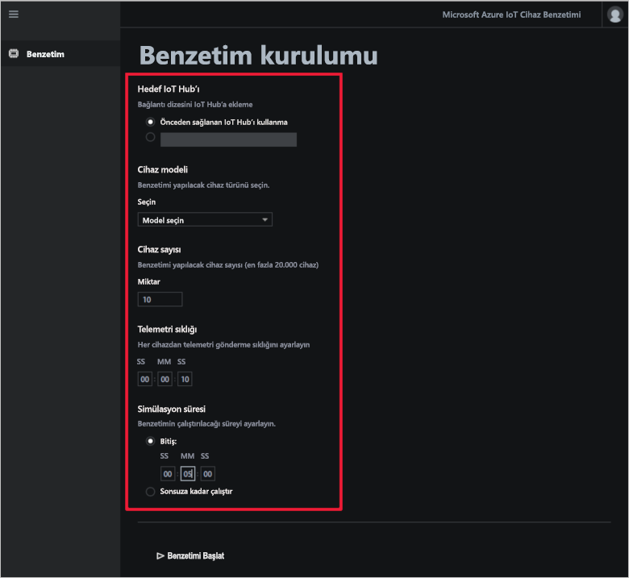
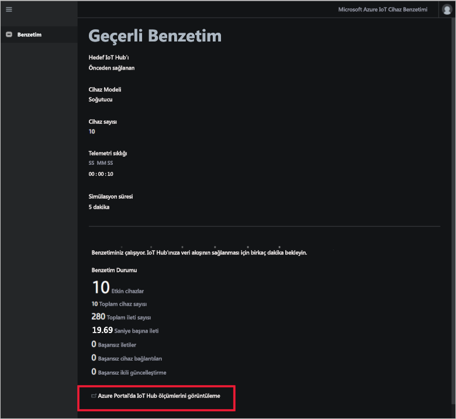

# Hızlı başlangıç: Bulut tabanlı bir cihaz benzetimi çözümünü dağıtma ve çalıştırma

Bu hızlı başlangıçta, IoT çözümünüzü test etmek için kullanılan Azure IoT Cihaz Benzetimi çözüm hızlandırıcısını dağıtma işlemi gösterilir. Çözüm hızlandırıcısını dağıttıktan sonra benzetimi oluşturmak ve çalıştırmak için **Benzetim** sayfasını kullanın.

Bu hızlı başlangıcı tamamlamak etkin bir Azure aboneliğinizin olması gerekir.

Azure aboneliğiniz yoksa başlamadan önce [ücretsiz bir hesap](https://azure.microsoft.com/free/?WT.mc_id=A261C142F) oluşturun.

## Çözümü dağıtma

Çözüm hızlandırıcısını Azure aboneliğinize dağıttığınızda ayarlamanız gereken yapılandırma seçenekleri vardır.

Azure hesabınızın kimlik bilgilerini kullanarak [azureiotsolutions.com](https://www.azureiotsolutions.com/Accelerators) adresinden oturum açın.

**Cihaz Benzetimi** kutucuğunda **Şimdi Deneyin**’e tıklayın.

**Cihaz Benzetimi çözümü oluşturun** sayfasına benzersiz bir **Çözüm adı** girin. Çözüm adınızı not alın; bu ad çözümün tüm kaynaklarını içeren Azure kaynak grubunun adıdır.

Çözüm hızlandırıcısını dağıtırken kullanmak istediğiniz **Subscription** (Abonelik) ve **Region** (Bölge) seçimini yapın. Genelde size en yakın bölgeyi seçmeniz gerekir. Abonelikte [genel yönetici veya kullanıcı](iot-accelerators-permissions.md) olmanız gerekir.

Cihaz Benzetimi çözümünüzle kullanabileceğiniz bir IoT hub’ı dağıtmak için kutuyu işaretleyin. Benzetiminizin kullandığı IoT hub’ını istediğiniz zaman değiştirebilirsiniz.

Çözümünüzü sağlamaya başlamak için **Çözüm Oluştur**’a tıklayın. Bu işlemin çalışması en az beş dakika sürer:

## Çözümde oturum açma

Sağlama işlemi tamamlandığında Cihaz Benzetimi çözüm hızlandırıcısı panonuzda oturum açabilirsiniz.

**Sağlanan çözümler** sayfasında yeni Cihaz Benzetimi çözümü hızlandırıcınıza tıklayın:

Açılan panelden Cihaz Benzetimi çözüm hızlandırıcınızla ilgili bilgileri görüntüleyebilirsiniz. Cihaz Benzetimi çözüm hızlandırıcınızı görüntülemek için **Çözüm panosu** öğesini seçin:

İzin isteğini kabul etmek için **Kabul et** öğesine tıklayın. Cihaz Benzetimi çözümü panosu tarayıcınızda görüntülenir:

## Benzetimi yapılandırma

Panodan bir benzetimi yapılandırabilir ve çalıştırabilirsiniz. Benzetiminizi yapılandırmak için aşağıdaki tabloda verilen değerleri kullanın:

| Ayar             | Değer                       |
| ------------------- | --------------------------- |
| Hedef IoT Hub'ı      | Önceden sağlanan IoT Hub’ı kullan |
| Cihaz modeli        | Soğutucu                     |
| Cihaz sayısı   | 10                          |
| Telemetri sıklığı | 10 saniye                  |
| Benzetim süresi | 5 dakika                   |

## Benzetimi çalıştırma

**Benzetimi başlat**’a tıklayın. Benzetim, belirttiğiniz süre boyunca çalıştırılır. Benzetimi istediğiniz zaman **Benzetimi durdur**’a tıklayarak durdurabilirsiniz. Benzetim, geçerli çalışmadaki istatistikleri gösterir. IoT hub'ı tarafından bildirilen ölçümleri görmek için **IoT Hub'ı ölçümlerini Azure portalda görüntüle**’ye tıklatın.

Çözüm hızlandırıcısının sağlanan bir örneğinden aynı anda yalnızca bir benzetim çalıştırabilirsiniz.

## Kaynakları temizleme

Daha fazla incelemeyi planlıyorsanız, Cihaz Benzetimi çözüm hızlandırıcısını dağıtımda bırakın.

Çözüm hızlandırıcısına ihtiyacınız kalmadıysa [Sağlanan çözümler](https://www.azureiotsolutions.com/Accelerators#dashboard) sayfasından seçtikten sonra **Çözümü sil**'e tıklayarak silebilirsiniz:

## Sonraki adımlar

Bu hızlı başlangıçta Cihaz Benzetimi çözüm hızlandırıcısını dağıttınız ve bir IoT cihaz benzetimini çalıştırdınız.

Benzetimde, varolan bir IoT Hub kullanmak isterseniz aşağıdaki Nasıl yapılır kılavuzuna bakın:

> [!div class="nextstepaction"]
> [Cihaz Benzetimi çözüm hızlandırıcısında, var olan bir IoT Hub kullanma](iot-accelerators-device-simulation-choose-hub.md)