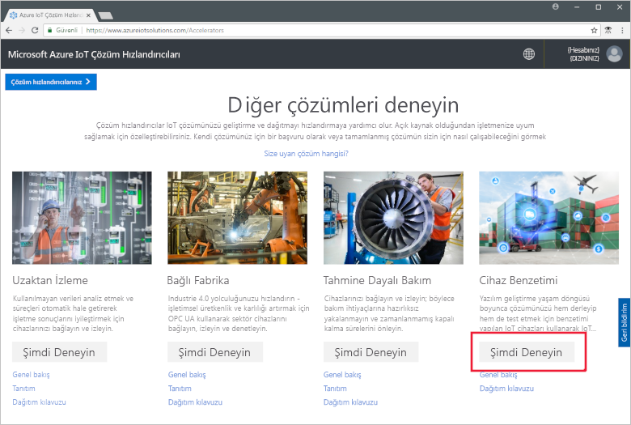
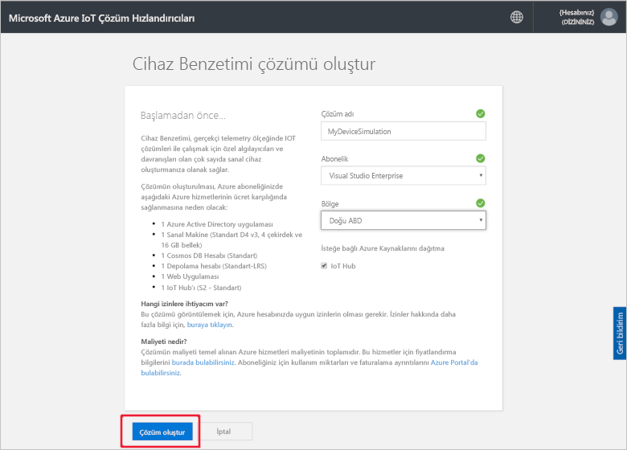
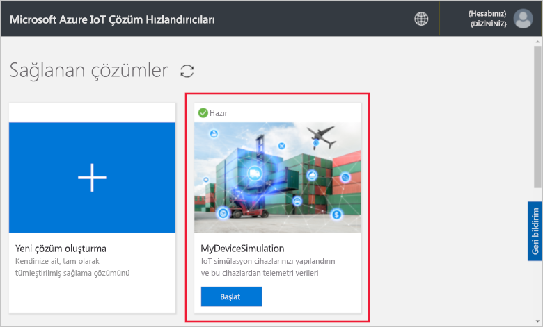
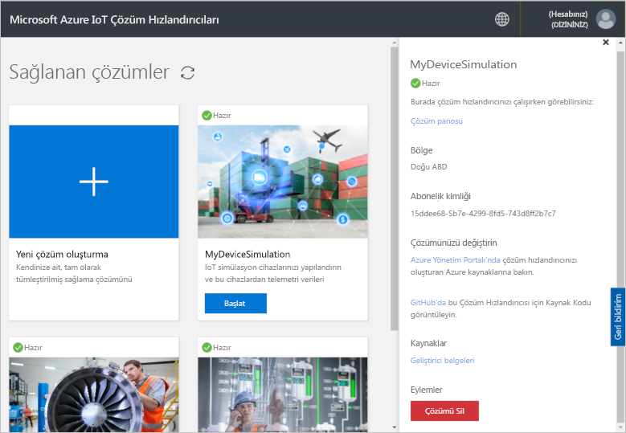

# Hızlı Başlangıç: Dağıtın ve bir IOT cihaz benzetimi Azure'da çalıştırın

Bu hızlı başlangıçta, IoT çözümünüzü test etmek için Azure IoT Cihaz Benzetimini dağıtma işlemi gösterilir. Çözüm hızlandırıcısını dağıttıktan sonra çalışmaya başlamak için bir örnek benzetim çalıştırırsınız.

Bu hızlı başlangıcı tamamlamak etkin bir Azure aboneliğinizin olması gerekir.

Azure aboneliğiniz yoksa başlamadan önce [ücretsiz bir hesap](https://azure.microsoft.com/free/?WT.mc_id=A261C142F) oluşturun.

## Cihaz Benzetimini Dağıtma

Cihaz Benzetimini Azure aboneliğinize dağıttığınızda ayarlamanız gereken yapılandırma seçenekleri vardır.

Azure hesabınızın kimlik bilgilerini kullanarak [azureiotsolutions.com](https://www.azureiotsolutions.com/Accelerators) adresinden oturum açın.

**Cihaz Benzetimi** kutucuğuna tıklayın:

Cihaz Benzetimi açıklama sayfasındaki **Şimdi Deneyin**’e tıklayın:

**Cihaz Benzetimi çözümü oluşturun** sayfasına benzersiz bir **Çözüm adı** girin.

Çözüm hızlandırıcısını dağıtırken kullanmak istediğiniz **Subscription** (Abonelik) ve **Region** (Bölge) seçimini yapın. Genelde size en yakın bölgeyi seçmeniz gerekir. Abonelikte [genel yönetici veya kullanıcı](iot-accelerators-permissions.md) olmanız gerekir.

Cihaz Benzetimi çözümünüzle kullanabileceğiniz bir IoT hub’ı dağıtmak için kutuyu işaretleyin. Benzetiminizin kullandığı IoT hub’ını istediğiniz zaman değiştirebilirsiniz.

Tıklayın **Oluştur** çözümünüzü hazırlamaya başlamak için. Bu işlemin çalışması en az beş dakika sürer:

## Çözümde oturum açma

Hazırlama işlemi tamamlandığında **Başlat**’a tıklayarak kendi Cihaz Benzetimi örneğinizde oturum açabilirsiniz:

İzin isteğini kabul etmek için **Kabul et** öğesine tıklayın. Cihaz Benzetimi çözümü panosu tarayıcınızda görüntülenir.

İlk açıldığında **Başlarken** kılavuzunun bulunduğu Cihaz Benzetimi panosunu görürsünüz. Örnek benzetimi açmak için ilk kutucuğa tıklayın. **Başlarken** kılavuzunu kapatırsanız **Örnek Basit Benzetim**’i kutucuğuna tıklayarak panodan açabilirsiniz:

## Örnek Benzetim

Örnek benzetim olduğu için düzenlenemez. Benzetim aşağıdaki ayarlarla yapılandırılır:

| Ayar             | Değer                       |
| ------------------- | --------------------------- |
| Hedef IoT Hub'ı      | Önceden sağlanan IoT Hub’ı kullan |
| Cihaz modeli        | Tır                       |
| Cihaz sayısı   | 10                          |
| Telemetri sıklığı | 10 saniye                  |
| Benzetim süresi | Süresiz olarak çalıştır            |

## Benzetimi çalıştırma

**Benzetimi başlat**’a tıklayın. Benzetim, yapılandırıldığı gibi süresiz olarak çalıştırılır. Benzetimi istediğiniz zaman **Benzetimi durdur**’a tıklayarak durdurabilirsiniz. Benzetim, geçerli çalışmadaki istatistikleri gösterir.

Cihaz Benzetimi örneğinden aynı anda yalnızca bir benzetim çalıştırabilirsiniz.

## Kaynakları temizleme

Daha fazla incelemeyi planlıyorsanız, Cihaz Benzetimini dağıtımda bırakın.

Cihaz Benzetimine artık ihtiyacınız kalmadıysa [Sağlanan çözümler](https://www.azureiotsolutions.com/Accelerators#dashboard) sayfasında kutucuğuna ve ardından **Çözümü Sil**’e tıklayarak bunu silin:

## Sonraki adımlar

Bu hızlı başlangıçta Cihaz Benzetimini dağıttınız ve örnek IoT cihazı benzetimini çalıştırdınız.

> [!div class="nextstepaction"]
> [Bir veya birden fazla cihaz türüyle benzetim oluşturma](iot-accelerators-device-simulation-create-simulation.md)