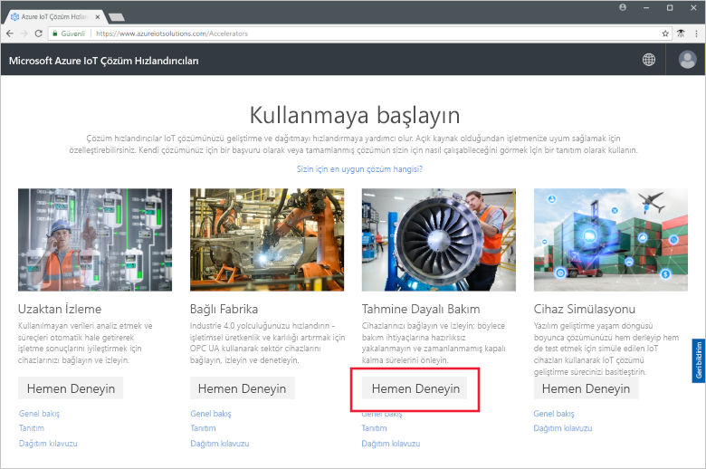
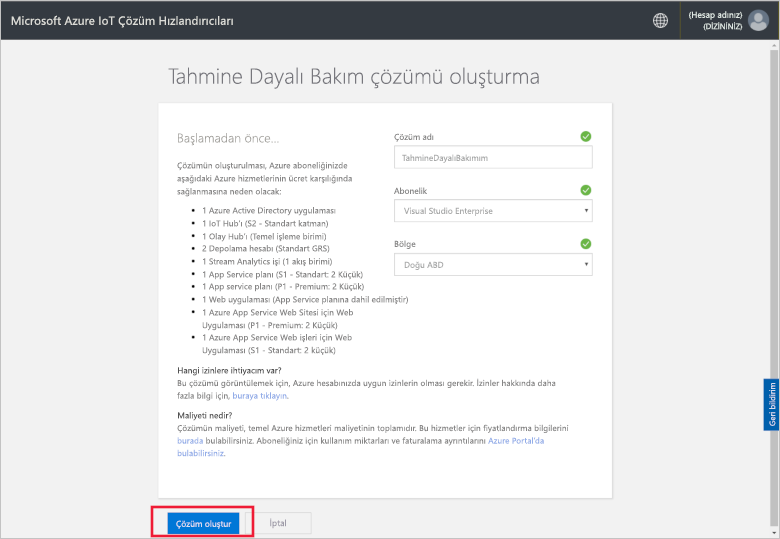
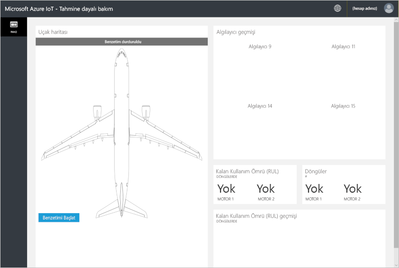
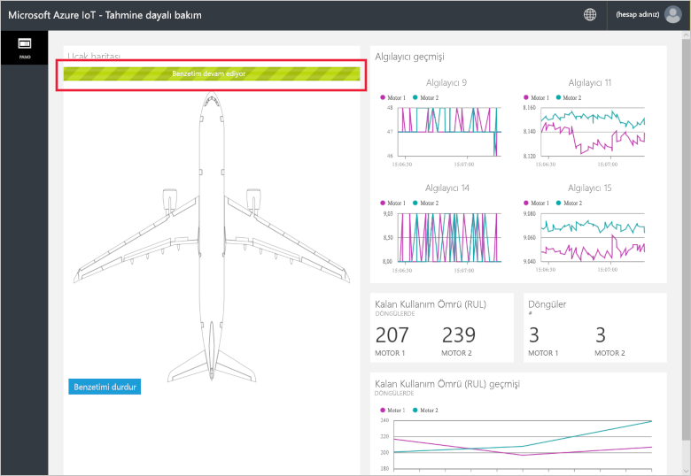
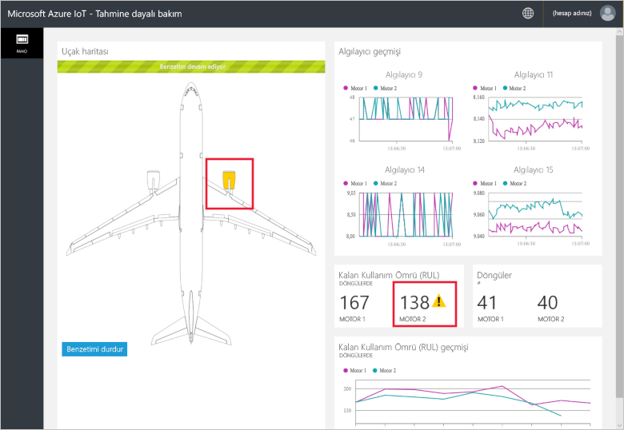
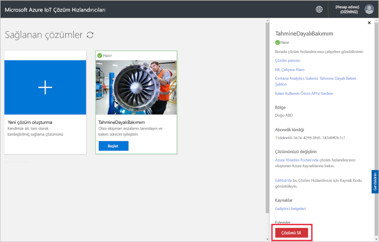

# Hızlı Başlangıç: Bulut tabanlı bir çözüm bağlı cihazlarım bir Tahmine dayalı bakım analizini Çalıştır'ı deneyin

Bu hızlı başlangıçta Azure IoT Tahmine Dayalı Bakım çözümü hızlandırıcısını dağıtarak bulut tabanlı tahmine dayalı bakım simülasyonu çalıştırmayı öğreneceksiniz. Çözüm hızlandırıcısını dağıttıktan sonra, çözümün **Pano** sayfasını kullanarak simülasyon uçak motoru verilerinden yararlanan tahmine dayalı bakım analizi çalıştırırsınız. Bu çözüm hızlandırıcısını, kendi uygulamanızın başlangıç noktası veya bir öğrenme aracı olarak kullanabilirsiniz.

Simülasyonda fabrikam, rekabetçi fiyatlarıyla büyük müşteri deneyimine odaklanan bölgesel bir havayoludur. Uçuş rötarlarının bir nedeni bakım sorunlarıdır ve uçak motorunun bakımı özellikle zordur. Fabrikam’ın ne olursa olsun uçuş sırasında motor arızasını önlemesi gerekmektedir; bu nedenle düzenli olarak motorları muayene eder ve bakım işlemlerini bir plana göre zamanlar. Ancak, uçak motorları her zaman aynı şekilde yıpranmaz. Motorlarda bazı gereksiz bakımlar gerçekleştirilir. Daha da önemlisi, bakım yapılana kadar çıkan sorunlar nedeniyle uçağın yerde kalmasıdır. Uçak, doğru teknisyenlerin ve yedek parçaların olmadığı bir yerdeyse bu sorunlar yüksek maliyetli gecikmelere neden olabilir.

Fabrikam uçağının motorları, uçuş sırasında motor koşullarını izleyen algılayıcılarla donatılmıştır. Fabrikam, yıllar boyunca bu sensörlerden alınan motor çalışma ve arıza verilerine sahiptir. Fabrikam'ın veri bilimcileri bu verileri kullanarak bir uçak motorunun Kalan Kullanım Ömrünü (RUL) tahmin eden bir model geliştirmiştir. Bu model, dört motor algılayıcısından alınan veriler ve arızalara neden olan motor yıpranmaları arasındaki bağıntıyı kullanmaktadır. Fabrikam düzenli güvenlik denetimleri yapmaya devam ederken, her uçuştan sonra her motor için RUL hesaplayacak modelleri kullanmaktadır. Fabrikam artık arızanın ve bakım planının ileri tarihli noktalarını tahmin edebilmekte ve uçağın yerde geçirdiği süreyi en aza indirebilmektedir. Bu işlem operasyon giderlerini azaltırken yolcuların ve personelin güvende olmasını sağlamaktadır.

Bu hızlı başlangıcı tamamlamak etkin bir Azure aboneliğinizin olması gerekir.

Azure aboneliğiniz yoksa başlamadan önce [ücretsiz bir hesap](https://azure.microsoft.com/free/?WT.mc_id=A261C142F) oluşturun.

## Çözümü dağıtma

Çözüm hızlandırıcısını Azure aboneliğinize dağıttığınızda ayarlamanız gereken yapılandırma seçenekleri vardır.

[Microsoft Azure IoT çözüm hızlandırıcıları](https://www.azureiotsolutions.com) sayfasına gidip Azure hesabı kimlik bilgilerinizle oturum açın.

**Tahmine Dayalı Bakım** kutucuğunu seçin. **Tahmine Dayalı Bakım** sayfasındaki **Hemen deneyin** öğesine tıklayın:

**Tahmine Dayalı Bakım çözümü oluştur** sayfasında Tahmine Dayalı Bakım çözümü hızlandırıcınıza benzersiz bir **Çözüm adı** girin. Bu hızlı başlangıçta **MyPredictiveMaintenance** kullanıyoruz.

Çözüm hızlandırıcısını dağıtırken kullanmak istediğiniz **Subscription** (Abonelik) ve **Region** (Bölge) seçimini yapın. Genelde size en yakın bölgeyi seçmeniz gerekir. Bu hızlı başlangıçta **Visual Studio Enterprise** ve **Doğu ABD** kullanıyoruz. Abonelikte [genel yönetici veya kullanıcı](iot-accelerators-permissions.md) olmanız gerekir.

Tıklayın **Oluştur** dağıtımına başlamak için. Bu işlemin çalışması en az beş dakika sürer:

## Çözümde oturum açma

Azure aboneliğinize dağıtım tamamlandığında, çözüm dosyasında yeşil bir onay işareti ve **Hazır** yazısı görürsünüz. Tahmine Dayalı Bakım çözüm hızlandırıcısı panonuzda artık oturum açabilirsiniz.

**Sağlanan Çözümler** sayfasında yeni Tahmine Dayalı Bakım çözümü hızlandırıcınıza tıklayın.

 Çözüm Hızlandırıcısını hakkında bilgi görüntülenen sayfasında görüntüleyebilirsiniz. Seçin **çözüm hızlandırıcınız Git** Tahmine dayalı bakım çözüm hızlandırıcınız görüntülemek için:

İzin isteğini kabul etmek için **Kabul Et**'e tıklayın. Tahmine Dayalı Bakım çözümü panosu tarayıcınızda görüntülenir:

Benzetimi başlatmak için **Benzetimi başlat**’a tıklayın. Algılayıcı geçmişi, RUL, Döngüler ve RUL geçmişi panoda yer alır:

RUL değeri 160’tan (gösterim amaçlı seçilen rastgele bir eşik) azsa, çözüm portalında RUL görüntüsünün yanında bir uyarı simgesi görüntülenir. Çözüm portalı da uçak motorunu sarı renkle vurgular. RUL değerlerinde topluca genel bir düşüş eğilimi olsa da aşağı ve yukarı sıçramalar da olduğunu fark edebilirsiniz. Bu davranış, değişen döngü uzunlukları ve model doğruluğundan sonuçlanır.

Tam benzetim, 148 döngüyü tamamlamak için yaklaşık 35 dakika sürer. 160 RUL eşiği ilk seferinde yaklaşık 5 dakikayı karşılar, her iki motor da yaklaşık 8 dakikada eşiği yakalar.

Benzetim 148 döngü için tam veri kümesinde çalışır, son RUL ve döngü değerlerinde de kapanır.

Benzetimi istediğiniz an durdurabilirsiniz; ancak, **Benzetimi Başlat**’a tıkladığınızda benzetim veri kümesinin başından başlayarak yeniden oynatılır.

## Kaynakları temizleme

Daha fazla incelemeyi planlıyorsanız, Tahmine Dayalı Bakım çözümü hızlandırıcısını dağıtımda bırakın.

Çözüm hızlandırıcısına ihtiyacınız kalmadıysa [Sağlanan çözümler](https://www.azureiotsolutions.com/Accelerators#dashboard) sayfasında hızlandırıcıyı seçip **Çözümü Sil**’e tıklayarak bunu silebilirsiniz:

## Sonraki adımlar

Bu hızlı başlangıçta Tahmine Dayalı Bakım çözümü hızlandırıcısını dağıttınız ve bir benzetim çalıştırdınız.

Çözüm hızlandırıcısı ve simülasyon uçak motorları hakkında daha fazla bilgi için aşağıdaki makaleyle devam edin.

> [!div class="nextstepaction"]
> [Tahmine Dayalı Bakım çözüm hızlandırıcısına genel bakış](iot-accelerators-predictive-walkthrough.md)
