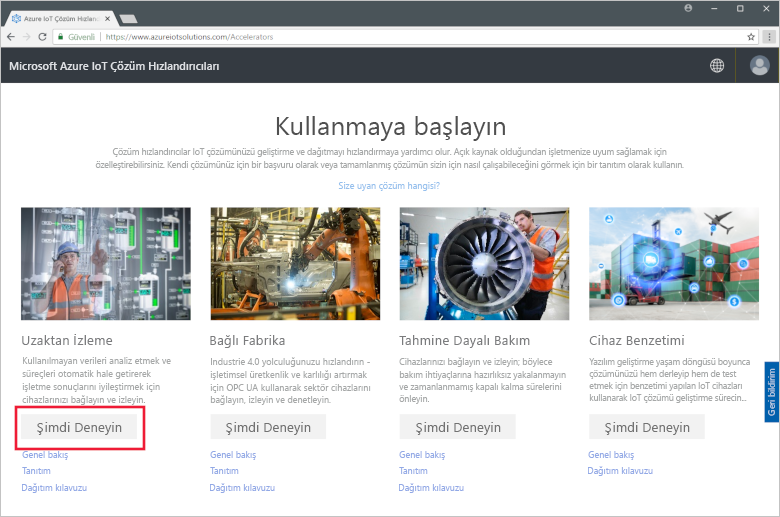
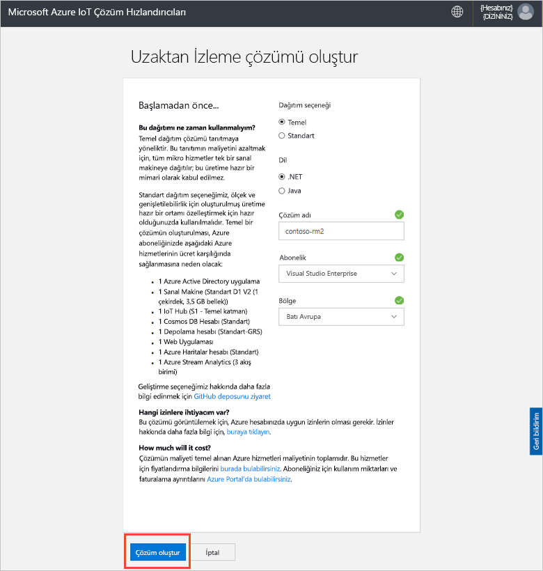
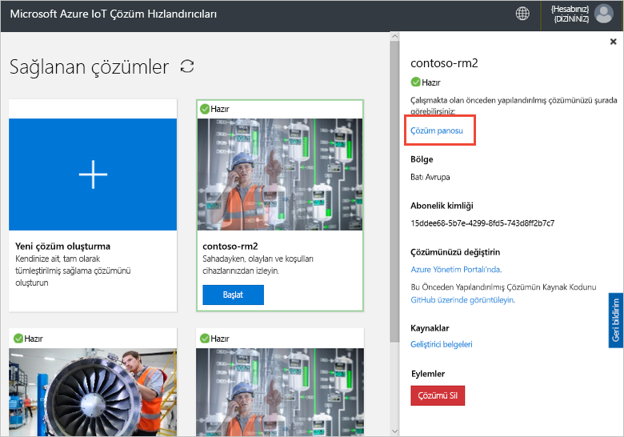
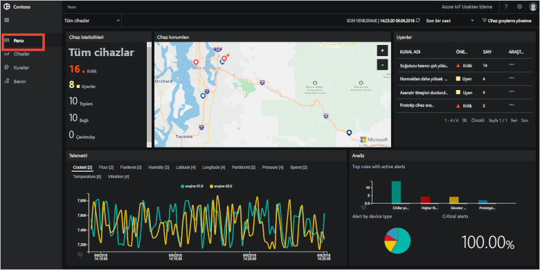
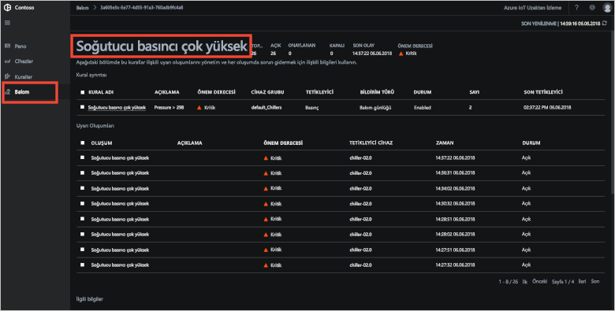
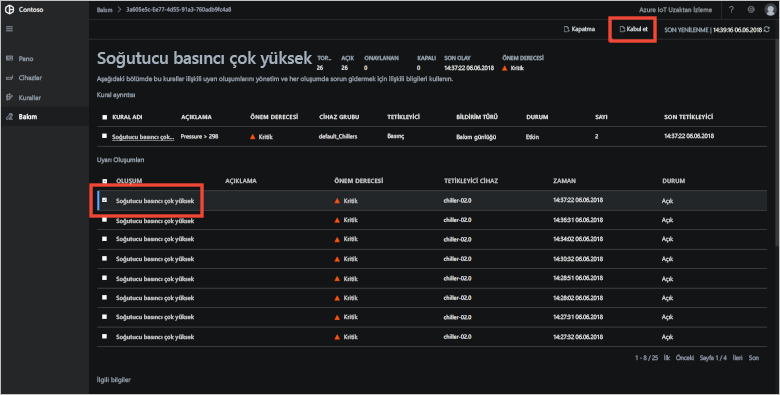
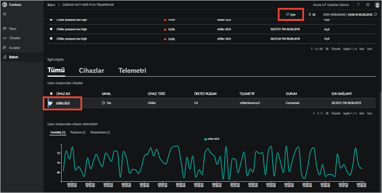
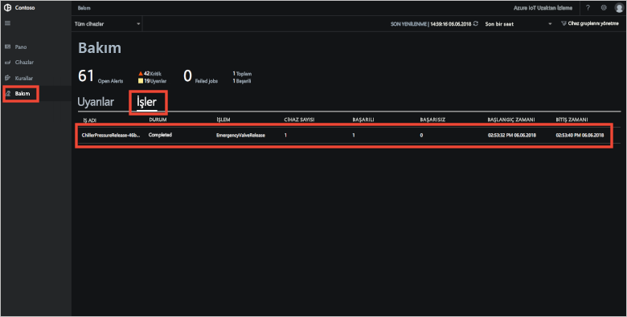
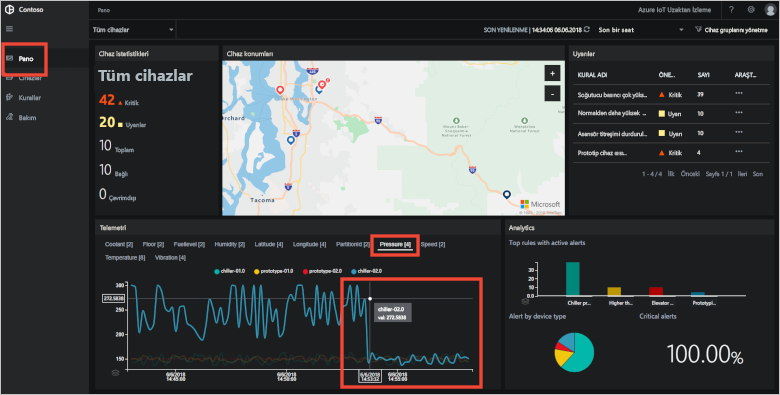
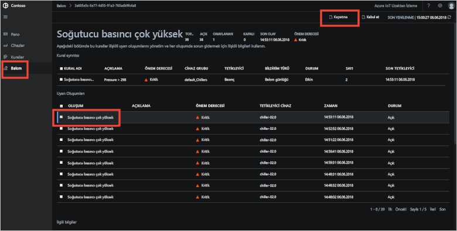

# Hızlı Başlangıç: Bir bulut tabanlı uzaktan izleme çözümünü deneyin

Bu hızlı başlangıçta Azure IoT Uzaktan İzleme çözümü hızlandırıcısını dağıtmayı öğreneceksiniz. Bu bulut tabanlı çözümde **Dashboard** (Pano) sayfasını kullanarak sanal cihazları harita üzerinde görselleştirecek ve **Maintenance** (Bakım) sayfasını kullanarak sanal bir soğutucu cihazından gelen basınç uyarısına müdahale edeceksiniz. Bu çözüm hızlandırıcısını, kendi uygulamanızın başlangıç noktası veya bir öğrenme aracı olarak kullanabilirsiniz.

İlk dağıtımda, Contoso adlı bir şirket için bir çözüm hızlandırıcısı yapılandırılır. Contoso'da çalışan bir operatör olarak, farklı fiziksel ortamlara dağıtılmış olan soğutucular gibi farklı türdeki cihazları yönetiyorsunuz. Soğutucu cihazı Uzaktan İzleme çözümü hızlandırıcısına sıcaklık, nem ve basınç telemetri verilerini göndermektedir.

Bu hızlı başlangıçta dağıtan bir **temel** maliyetlerinizi azaltırken diğer yandan çözüm Hızlandırıcısını sınama ve tanıtma amaçlarıyla sürümü. Dağıtabileceğiniz farklı sürümleri hakkında daha fazla bilgi için bkz. [temel ve standart dağıtımları](iot-accelerators-remote-monitoring-deploy-cli.md#basic-and-standard-deployments).

Bu hızlı başlangıcı tamamlamak etkin bir Azure aboneliğinizin olması gerekir.

Azure aboneliğiniz yoksa başlamadan önce [ücretsiz bir hesap](https://azure.microsoft.com/free/?WT.mc_id=A261C142F) oluşturun.

## Çözümü dağıtma

Çözüm hızlandırıcısını Azure aboneliğinize dağıttığınızda ayarlamanız gereken yapılandırma seçenekleri vardır.

Azure hesabınızın kimlik bilgilerini kullanarak [azureiotsolutions.com](https://www.azureiotsolutions.com/Accelerators) adresinden oturum açın.

Tıklayın **Uzaktan izleme** Döşe. Üzerinde **Uzaktan izleme** sayfasında **şimdi deneyin**:

Seçin  **C# mikro Hizmetler** olarak **dağıtım seçenekleri**. Java ve C# uygulamalara aynı özelliklere sahip.

Uzaktan İzleme çözümü hızlandırıcınız için benzersiz bir **Solution name** (Çözüm adı) değeri girin. Bu hızlı başlangıçta biz bizim arıyoruz **contoso-rm**.

Çözüm hızlandırıcısını dağıtırken kullanmak istediğiniz **Subscription** (Abonelik) ve **Region** (Bölge) seçimini yapın. Genelde size en yakın bölgeyi seçmeniz gerekir. Bu hızlı başlangıçta kullanıyoruz **Doğu ABD**.
Seçebileceğiniz **Visual Studio Enterprise**, ancak siz bir [genel yönetici veya kullanıcı](iot-accelerators-permissions.md) Bunu yapmak için.

Dağıtımınıza başlamak için tıklatın **Oluştur**. Bu işlemin çalışması en az beş dakika sürer:

## Çözümde oturum açma

Azure aboneliğinize dağıtım tamamlandığında, çözüm dosyasında yeşil bir onay işareti ve **Hazır** yazısı görürsünüz. Artık Uzaktan İzleme çözümü hızlandırıcınızda oturum açabilirsiniz.

**Provisioned solutions** (Sağlanan çözümler) sayfasında yeni Uzaktan İzleme çözümü hızlandırıcınıza tıklayın:

Açılan panelden Uzaktan İzleme çözümü hızlandırıcınızla ilgili bilgileri görüntüleyebilirsiniz. Seçin **çözüm hızlandırıcınız Git** Uzaktan izleme çözüm hızlandırıcınız görüntülemek için:

İzin isteğini kabul etmek için **Accept** (Kabul et) öğesine tıklayın. Uzaktan İzleme çözümü panosu tarayıcınızda görüntülenir:

## Cihazlarınızı görüntüleme

Çözüm panosu Contoso'nun simülasyon cihazlarıyla ilgili aşağıdaki bilgileri görüntüler:

* **Device statistics** (Cihaz istatistikleri) panelinde uyarıların özeti ve toplam cihaz sayısı gösterilir. Varsayılan dağıtımda Contoso farklı türlerde 10 sanal cihaza sahiptir.

* **Device locations** (Cihaz konumları) panelinde cihazların bulunduğu fiziksel konumlar gösterilir. Cihazda uyarılar olduğunda raptiyenin rengi değişir.

* **Alerts** (Uyarılar) panelinde cihazlarınızdan gelen uyarılar gösterilir.

* **Telemetry** (Telemetri) panelinde cihazlarınızdan gelen telemetri verileri gösterilir. Üstteki telemetri türlerine tıklayarak farklı telemetri akışlarını görüntüleyebilirsiniz.

* **Analytics** (Analiz) panelinde cihazlarınızdaki uyarılar hakkında toplu bilgiler gösterilir.

## Uyarıya yanıt verme

Contoso'da bir operatör olarak cihazlarınızı çözüm panosundan izleyebilirsiniz. **Device statistics** (Cihaz istatistikleri) panelinde birçok kritik uyarı olduğunu, **Alerts** (Uyarılar) panelinde ise çoğunun bir soğutucu cihazından geldiği gösterilmektedir. Contoso'nun soğutucu cihazlarında 250 PSI üzerindeki iç basınç değeri cihazın düzgün çalışmadığını göstermektedir.

### Sorunu tanımlama

**Dashboard** (Pano) sayfasının **Alerts** (Uyarılar) panelinde **Chiller pressure too high** (Soğutucu basıncı çok yüksek) uyarısını görebilirsiniz. Soğutucu harita üzerinde kırmızı raptiyeyle gösterilmektedir (haritayı kaydırmanız ve yakınlaştırmanız gerekebilir):

**Alerts** (Uyarılar) panelinde, **Explore** (Keşfet) sütununda **Chiller pressure too high** (Soğutucu basıncı çok yüksek) kuralının yanındaki **...** simgesine tıklayın. Bu eylem sizi uyarıyı tetikleyen kuralın ayrıntılarını görüntüleyebileceğiniz **Maintenance** (Bakım) sayfasına yönlendirir.

**Chiller pressure too high** (Soğutucu basıncı çok yüksek) bakım sayfasında uyarıları tetikleyen kuralın ayrıntıları gösterilir. Bu sayfada uyarıların tetiklendiği zaman ve bunları tetikleyen cihaz da görüntülenir:

Uyarıyı tetikleyen sorunu ve ilgili cihazı tanımladınız. Operatör olarak gerçekleştirmeniz gereken sonraki adımlar uyarıyı onaylamak ve sorunu gidermektir.

### Sorunu giderme

Diğer operatörlere bu uyarının üzerinde çalıştığınızı göstermek için uyarıyı seçin ve **Alert status** (Uyarı durumu) bilgisini **Acknowledged** (Onaylandı) olarak değiştirin:

Durum sütunundaki değer **Acknowledged** (Onaylandı) olarak değiştirilir.

Soğutucu üzerinde işlem yapmak için **Related information** (İlgili bilgiler) bölümüne inin, **Alerted devices** (Uyarıya sahip cihazlar) listesinden soğutucu cihazını seçin ve **Jobs** (İşler) öğesini seçin:

**İşler** panelinde **Çalıştırma yöntemi**’ni ve ardından **EmergencyValveRelease** yöntemini seçin. **ChillerPressureRelease** iş adını ekleyin ve **Uygula**’ya tıklayın. Bu ayarlar sizin için hemen yürütülen bir iş oluşturur.

İş durumunu görüntülemek için **Maintenance** (Bakım) sayfasına dönün ve **Jobs** (İşler) görünümünde iş listesini görüntüleyin. İşlemi çalıştırıldı görebilmek için önce birkaç saniye beklemeniz gerekebilir:

### Basıncın normale dönüp dönmediğini kontrol etme

Soğutucudan gelen basınç telemetrisini görüntülemek için **Dashboard** (Pano) sayfasına gidin, telemetri panelinden **Pressure** (Basınç) girişini seçin ve **chiller-02.0** adlı cihazın basınç değerini kontrol edin:

Olayı kapatmak için **Maintenance** (Bakım) sayfasına gidin, uyarıyı seçin ve durumunu **Closed** (Kapalı) olarak ayarlayın:

Durum sütunundaki değer **Closed** (Kapalı) olarak değiştirilir.

## Kaynakları temizleme

Öğreticilere devam etmeyi planlıyorsanız Uzaktan İzleme çözümü hızlandırıcısı dağıtımını bırakın.

Çözüm hızlandırıcısına ihtiyacınız kalmadıysa [Sağlanan çözümler](https://www.azureiotsolutions.com/Accelerators#dashboard) sayfasında hızlandırıcıyı seçip **Çözümü Sil**’e tıklayarak bunu silebilirsiniz:

## Sonraki adımlar

Bu hızlı başlangıçta Uzaktan İzleme çözümü hızlandırıcısını dağıttınız ve varsayılan Contoso dağıtımındaki sanal cihazları kullanarak bir izleme görevini tamamladınız.

Simülasyon cihazları kullanan çözüm hızlandırıcısı hakkında daha fazla bilgi için aşağıdaki öğreticiyle devam edin.

> [!div class="nextstepaction"]
> [Öğretici: IOT cihazlarınızı izleme](iot-accelerators-remote-monitoring-monitor.md)