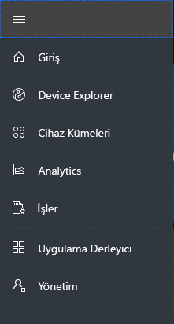
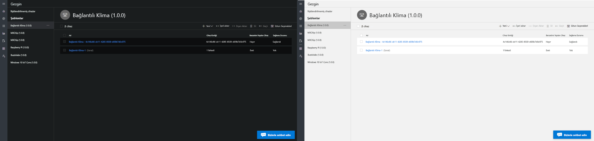
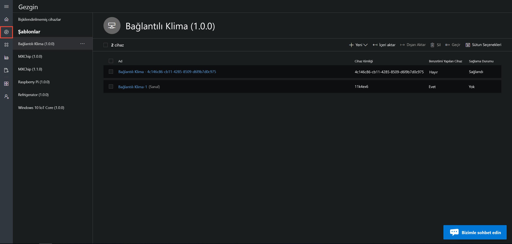
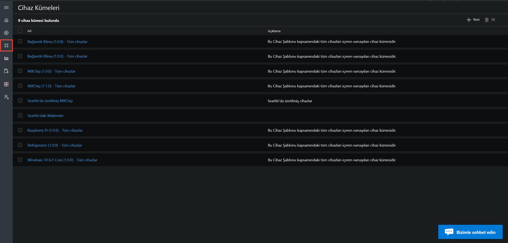
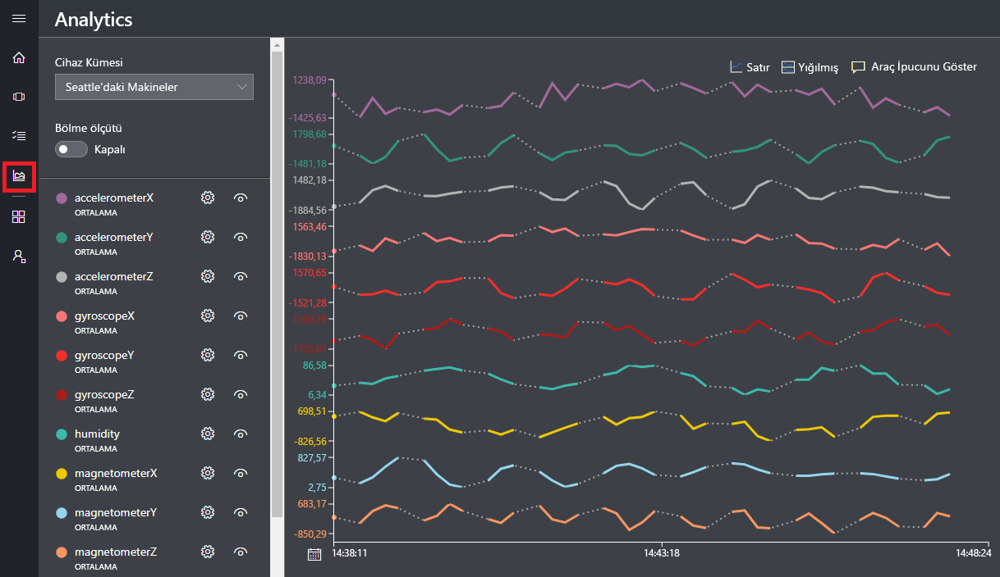
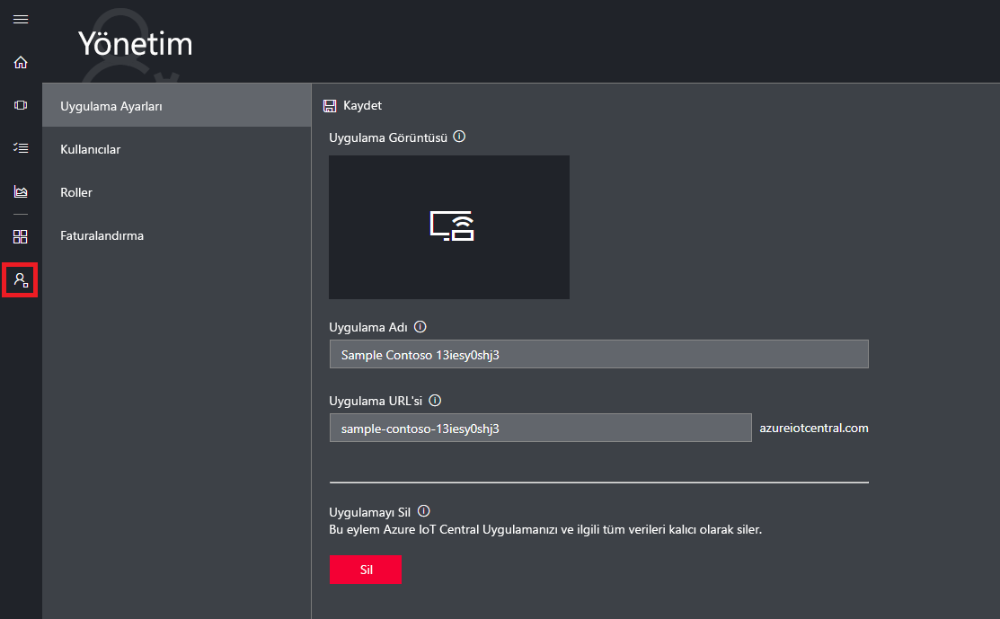

# Azure IoT Central Kullanıcı Arabirimi turuna katılın

Bu makalede, Microsoft Azure IoT Central kullanıcı arabirimi tanıtılmaktadır. Kullanıcı arabirimini kullanarak bir Azure IoT Central çözümü ile bağlı cihazlarını oluşturabilir, yönetebilir ve kullanabilirsiniz.

_Oluşturucu_ olarak, Azure IoT Central kullanıcı arabirimini kullanarak Azure IoT Central çözümünüzü tanımlayabilirsiniz. Kullanıcı arabirimini kullanarak şunları yapabilirsiniz:

- Çözümünüze bağlanan cihaz türlerini tanımlama.
- Cihazlarınız için kurallar ve eylemler yapılandırma.
- Kullanıcı arabirimini, çözümünüzü kullanan bir _operatör_ için özelleştirme.

_Operatör_ olarak, Azure IoT Central kullanıcı arabirimini kullanarak Azure IoT Central çözümünüzü yönetebilirsiniz. Kullanıcı arabirimini kullanarak şunları yapabilirsiniz:

- Cihazlarınızı izleme.
- Cihazlarınızı yapılandırma.
- Cihazlarınızla ilgili sorunları giderme ve düzeltme.
- Yeni cihazları hazırlama.

## Sol gezinti menüsünü kullanma

Sol gezinti menüsünde, uygulamanın farklı alanlara erişmek için kullanın. Genişlet veya seçerek gezinti çubuğunu Daralt **<** veya **>** :

| Menü | Açıklama |
| ---- | ----------- |
|  | <ul><li>**Pano** düğmesi uygulama Panonuzda görüntüler. Bir oluşturucu, işleçleri için panoyu özelleştirebilirsiniz. Kullanıcılar ayrıca kendi panolarınızı oluşturabilirsiniz.</li><li>**Device Explorer** düğmesi, uygulamadaki her bir cihaz şablonuyla ilişkili sanal ve gerçek cihazları listeler. Operatör olarak, **Device Explorer**’ı kullanarak bağlı cihazlarınızı yönetebilirsiniz.</li><li>**Cihaz Kümeleri** düğmesi, cihaz kümelerini görüntüleyip oluşturmanızı sağlar. Operatör olarak, bir sorgu tarafından belirtilen cihazların mantıksal bir koleksiyonu olarak cihaz kümeleri oluşturabilirsiniz.</li><li>**Analiz** düğmesi, cihazlar ve cihaz kümeleri için cihaz telemetrisinden türetilen analizleri gösterir. Operatör olarak, uygulamanızdan içgörüler türetmek için cihaz verileri üzerinde özel görünümler oluşturabilirsiniz.</li><li>**İşler** düğmesi, uygun ölçekte güncelleştirmeler gerçekleştirmek için iş oluşturmanız ve çalıştırmanız gerekmeden toplu cihaz yönetimi sağlar.</li><li>**Cihaz şablonları** düğmesini gösteren bir oluşturucu kullanan cihaz şablonları oluşturmak ve yönetmek için Araçlar.</li><li>**Verileri sürekli dışarı aktarma** depolama ve kuyruk gibi diğer Azure Hizmetleri için sürekli dışarı aktarma yapılandırmak için yönetici düğmesi.</li><li>**Yönetim** düğmesi, bir yöneticinin uygulama ayarlarını, kullanıcıları ve rolleri yönetebildiği uygulama yönetimi sayfalarını gösterir.</li></ul> |

## Arama, yardım ve destek

Üstteki menü her sayfada görünür:

- Cihaz şablonlarını ve cihazlar için arama yapmak için girin bir **arama** değeri.
- Kullanıcı Arabirimi dilini veya tema değiştirme tercih **ayarları** simgesi.
- Uygulamadaki oturumunu oturum açmayı tercih **hesabı** simgesi.
- Yardım ve destek almak için, kaynak listesinden **Yardım** açılır listesini seçin. Bir deneme uygulamasında, destek kaynakları erişimini içerir. [canlı sohbet](howto-show-hide-chat.md).

Kullanıcı arabirimi için açık renkli tema veya koyu renkli temayı seçebilirsiniz:

> [!NOTE]
> Açık ve koyu temalar arasında seçim yapma olanağı, uygulama için özel bir tema yöneticinize yapılandırdıysa kullanılamaz.

## Pano

* Azure IOT Central uygulamanıza oturum açtığınızda gördüğünüz ilk sayfa panodur. Bir oluşturucu, diğer kullanıcılar için uygulama Panosu döşemeler ekleyerek özelleştirebilirsiniz. Daha fazla bilgi almak için [Azure IoT Central operatör görünümünü özelleştirme](tutorial-customize-operator.md) öğreticisine bakın.

* Bir operatör olarak, kişiselleştirilmiş panolar oluşturun ve bunları ve varsayılan pano arasında geçiş yapabilirsiniz. Daha fazla bilgi için bkz. [oluştur ve kişisel panoları Yönet](howto-personalize-dashboard.md) nasıl yapılır makalesi.

## Device Explorer

Gezgini sayfa gösterir _cihazları_ göre gruplandırılmış uygulamanızda Azure IOT Central _cihaz şablonu_.

* Cihaz şablonu, uygulamanıza bağlanabilen bir cihaz türünü tanımlar. Daha fazla bilgi almak için bkz. [Azure IoT Central uygulamanızda yeni bir cihaz türü tanımlama](tutorial-define-device-type.md).
* Cihaz, uygulamanızdaki gerçek veya sanal bir cihazı temsil eder. Daha fazla bilgi almak için bkz. [Azure IoT Central uygulamanıza yeni bir cihaz ekleme](tutorial-add-device.md).

## Cihaz kümeleri

_Cihaz kümeleri_ sayfası, oluşturucu tarafından oluşturulan cihaz kümelerini gösterir. Cihaz kümesi, ilişkili cihazların bir koleksiyonudur. Oluşturucu, bir cihaz kümesine eklenen cihazları belirlemek üzere bir sorgu tanımlar. Uygulamanızdaki analizleri özelleştirirken cihaz kümelerini kullanırsınız. Daha fazla bilgi almak için [Azure IoT Central uygulamanızda cihaz kümelerini kullanma](howto-use-device-sets.md) makalesine bakın.

## Analiz

Analiz sayfasında, uygulamanıza bağlı cihazların nasıl davrandığını anlamanıza yardımcı olan grafikler gösterilir. Operatör bu sayfayı kullanarak bağlı cihazlarla ilgili sorunları izler ve araştırır. Oluşturucu, bu sayfada gösterilen grafikleri tanımlayabilir. Daha fazla bilgi almak için [Azure IoT Central uygulamanız için özel analizler oluşturma](howto-use-device-sets.md) makalesine bakın.

## İşler

İşler sayfası toplu cihaz yönetimi işlemleri cihazlarınızda çalıştırmanızı sağlar. Oluşturucu, cihaz özelliklerini, ayarları ve komutları güncelleştirmek için bu sayfayı kullanır. Daha fazla bilgi edinmek için [İş çalıştırma](howto-run-a-job.md) makalesine bakın.

## Cihaz şablonları

Cihaz şablonları burada bir oluşturucu oluşturur ve uygulamanın cihaz şablonlarında yönetir sayfasıdır. Bir cihaz şablon gibi cihaz özelliklerini belirtir:

- Telemetri, durum ve olay ölçümleri.
- Ayarları ve özellikleri.
- Komutları.
- Olayları veya telemetri değerleri temel alan kuralları.

Daha fazla bilgi almak için [Azure IoT Central uygulamanızda yeni bir cihaz türü tanımlama](tutorial-define-device-type.md) öğreticisine bakın.

## Verileri sürekli dışarı aktarma

Sürekli veri dışarı aktarma Burada, uygulamadan telemetri gibi bir veri akışını nasıl bir yöneticinin tanımladığı sayfasıdır. Diğer hizmetler, dışarı aktarılan verileri saklamak veya analiz için kullanın. Daha fazla bilgi için bkz. [Azure IOT Central verilerinizi dışarı](howto-export-data.md) makalesi.

## Yönetim

Yönetim sayfasını yönetici kullanıcıları ve rolleri uygulamasında tanımlama ve kullanıcı arabirimini özelleştirme gibi kullanan araçlarına bağlantılar içerir. Daha fazla bilgi almak için [Azure IoT Central uygulamanızı yönetme](howto-administer.md) makalesine bakın.

## Sonraki adımlar

Azure IoT Central’a genel bir bakış elde ettiğinize ve kullanıcı arabiriminin düzenini tanıdığınıza göre önerilen sıradaki adım, [Azure IoT Central uygulaması oluşturma](quick-deploy-iot-central.md) hızlı başlangıcının tamamlanmasıdır.