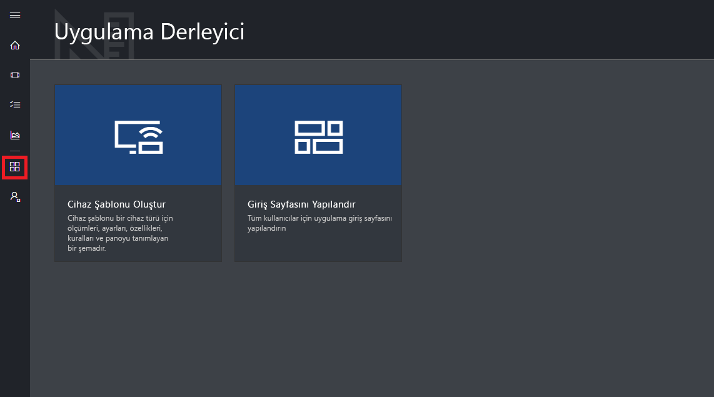

# Azure IoT Central Kullanıcı Arabirimi turuna katılın

Bu makalede, Microsoft Azure IoT Central kullanıcı arabirimi tanıtılmaktadır. Kullanıcı arabirimini kullanarak bir Azure IoT Central çözümü ile bağlı cihazlarını oluşturabilir, yönetebilir ve kullanabilirsiniz.

_Oluşturucu_ olarak, Azure IoT Central kullanıcı arabirimini kullanarak Azure IoT Central çözümünüzü tanımlayabilirsiniz. Kullanıcı arabirimini kullanarak şunları yapabilirsiniz:

- Çözümünüze bağlanan cihaz türlerini tanımlama.
- Cihazlarınız için kurallar ve eylemler yapılandırma.
- Kullanıcı arabirimini, çözümünüzü kullanan bir _operatör_ için özelleştirme.

_Operatör_ olarak, Azure IoT Central kullanıcı arabirimini kullanarak Azure IoT Central çözümünüzü yönetebilirsiniz. Kullanıcı arabirimini kullanarak şunları yapabilirsiniz:

- Cihazlarınızı izleme.
- Cihazlarınızı yapılandırma.
- Cihazlarınızla ilgili sorunları giderme ve düzeltme.
- Yeni cihazları hazırlama.

[!INCLUDE [iot-central-experimental-note](../../includes/iot-central-experimental-note.md)]

## Sol gezinti menüsünü kullanma

Uygulamanın farklı alanlarına erişmek için sol gezinti menüsünü kullanın:

| Menü | Açıklama |
| ---- | ----------- |
|  | <ul><li>**Pano** düğmesi uygulama Panonuzda görüntüler. Bir oluşturucu, işleçleri için panoyu özelleştirebilirsiniz. Kullanıcılar ayrıca kendi panolarınızı oluşturabilirsiniz.</li><li>**Device Explorer** düğmesi hem uygulamanızda tanımlanmış cihaz şablonlarını hem de her bir cihaz şablonuyla ilişkili sanal ve gerçek cihazları listeler. Operatör olarak, **Device Explorer**’ı kullanarak bağlı cihazlarınızı yönetebilirsiniz.</li><li>**Cihaz Kümeleri** düğmesi, cihaz kümelerini görüntüleyip oluşturmanızı sağlar. Operatör olarak, bir sorgu tarafından belirtilen cihazların mantıksal bir koleksiyonu olarak cihaz kümeleri oluşturabilirsiniz.</li><li>**Analiz** düğmesi, cihazlar ve cihaz kümeleri için cihaz telemetrisinden türetilen analizleri gösterir. Operatör olarak, uygulamanızdan içgörüler türetmek için cihaz verileri üzerinde özel görünümler oluşturabilirsiniz.</li><li>**İşler** düğmesi, uygun ölçekte güncelleştirmeler gerçekleştirmek için iş oluşturmanız ve çalıştırmanız gerekmeden toplu cihaz yönetimi sağlar.</li><li>**Uygulama Oluşturucu** düğmesi, bir oluşturucunun kullandığı **Cihaz Şablonu Oluşturma** aracı gibi araçları gösterir.</li><li>**Yönetim** düğmesi, bir yöneticinin uygulama ayarlarını, kullanıcıları ve rolleri yönetebildiği uygulama yönetimi sayfalarını gösterir.</li></ul> |

## Arama, yardım ve destek

Üstteki menü her sayfada görünür:

- Cihaz şablonlarını ve cihazları aramak için **Arama** simgesini seçin.
- Yardım ve destek almak için, kaynak listesinden **Yardım** açılır listesini seçin.
- Öğreticileri denetlemek için kullanıcı arabirimi temasını değiştirin veya uygulama oturumunu kapatıp **Hesap** simgesini seçin.

Kullanıcı arabirimi için açık renkli tema veya koyu renkli temayı seçebilirsiniz:

## Pano

Giriş sayfası, Azure IoT Central uygulamanızda oturum açtığınızda gördüğünüz birinci sayfadır. Azure IOT Central uygulamanıza oturum açtığınızda gördüğünüz ilk sayfa panodur. Bir oluşturucu, diğer kullanıcılar için uygulama Panosu döşemeler ekleyerek özelleştirebilirsiniz. Daha fazla bilgi almak için [Azure IoT Central operatör görünümünü özelleştirme](tutorial-customize-operator.md) öğreticisine bakın. Kullanıcılar aynı zamanda [kendi kişisel panolar oluşturma](howto-personalize-dashboard.md).

## Device Explorer

Gezgin sayfası, Azure IoT Central uygulamanızdaki _cihaz şablonlarını_ ve _cihazları_ gösterir.

* Cihaz şablonu, uygulamanıza bağlanabilen bir cihaz türünü tanımlar. Daha fazla bilgi almak için bkz. [Azure IoT Central uygulamanızda yeni bir cihaz türü tanımlama](tutorial-define-device-type.md).
* Cihaz, uygulamanızdaki gerçek veya sanal bir cihazı temsil eder. Daha fazla bilgi almak için bkz. [Azure IoT Central uygulamanıza yeni bir cihaz ekleme](tutorial-add-device.md).

## Cihaz kümeleri

_Cihaz kümeleri_ sayfası, oluşturucu tarafından oluşturulan cihaz kümelerini gösterir. Cihaz kümesi, ilişkili cihazların bir koleksiyonudur. Oluşturucu, bir cihaz kümesine eklenen cihazları belirlemek üzere bir sorgu tanımlar. Uygulamanızdaki analizleri özelleştirirken cihaz kümelerini kullanırsınız. Daha fazla bilgi almak için [Azure IoT Central uygulamanızda cihaz kümelerini kullanma](howto-use-device-sets.md) makalesine bakın.

## Analiz

Analiz sayfasında, uygulamanıza bağlı cihazların nasıl davrandığını anlamanıza yardımcı olan grafikler gösterilir. Operatör bu sayfayı kullanarak bağlı cihazlarla ilgili sorunları izler ve araştırır. Oluşturucu, bu sayfada gösterilen grafikleri tanımlayabilir. Daha fazla bilgi almak için [Azure IoT Central uygulamanız için özel analizler oluşturma](howto-create-analytics.md) makalesine bakın.

## İşler

İşler sayfası, cihazlarınızda toplu cihaz yönetimi işlemleri gerçekleştirmenize olanak sağlar. Oluşturucu, cihaz özelliklerini, ayarları ve komutları güncelleştirmek için bu sayfayı kullanır. Daha fazla bilgi edinmek için [İş çalıştırma](howto-run-a-job.md) makalesine bakın.

## Uygulama Oluşturucu

Uygulama oluşturucu sayfası, cihaz şablonları oluşturma ve giriş sayfasını yapılandırma gibi bir oluşturucunun Azure IoT Central uygulaması oluşturmak için kullandığı araçların bağlantılarını içerir. Daha fazla bilgi almak için [Azure IoT Central uygulamanızda yeni bir cihaz türü tanımlama](tutorial-define-device-type.md) öğreticisine bakın.

## Yönetim

Yönetim sayfası, uygulamadaki kullanıcıları ve rolleri tanımlama gibi bir yöneticinin kullandığı araçların bağlantılarını içerir. Daha fazla bilgi almak için [Azure IoT Central uygulamanızı yönetme](howto-administer.md) makalesine bakın.

## Sonraki adımlar

Azure IoT Central’a genel bir bakış elde ettiğinize ve kullanıcı arabiriminin düzenini tanıdığınıza göre önerilen sıradaki adım, [Azure IoT Central uygulaması oluşturma](quick-deploy-iot-central.md) hızlı başlangıcının tamamlanmasıdır.