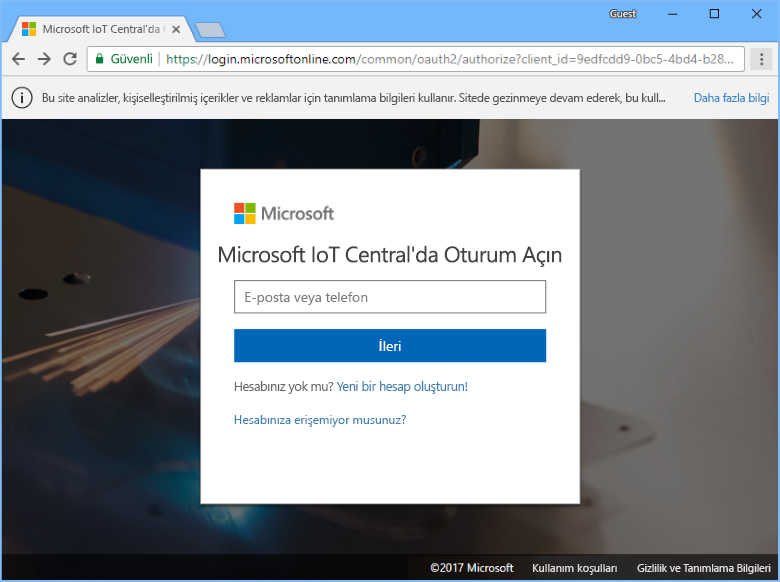
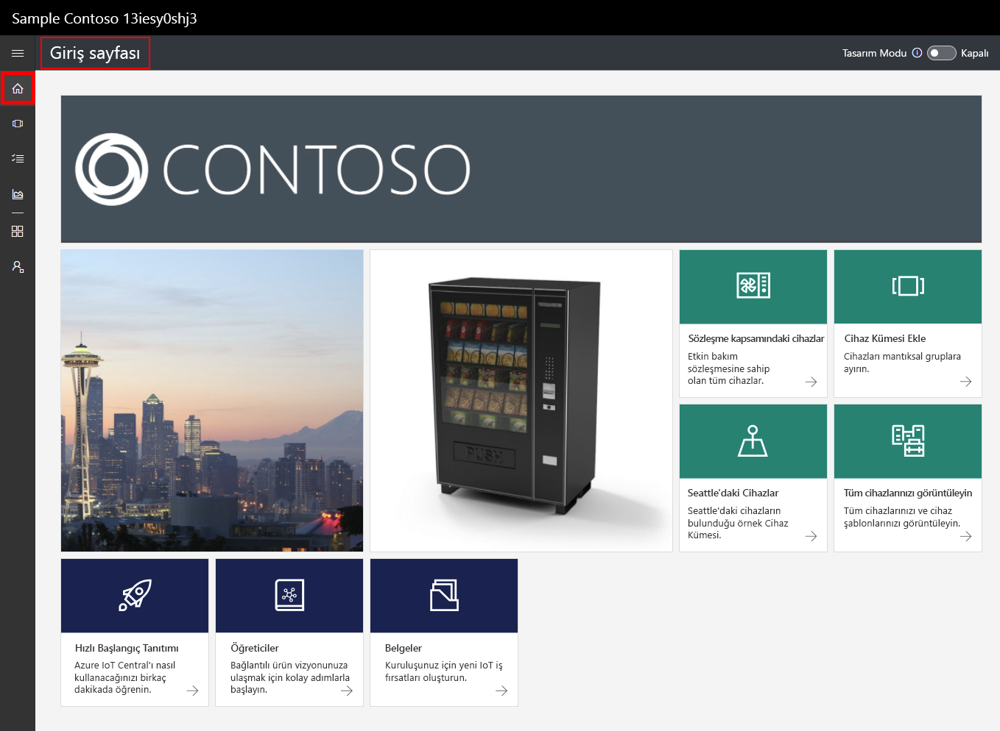
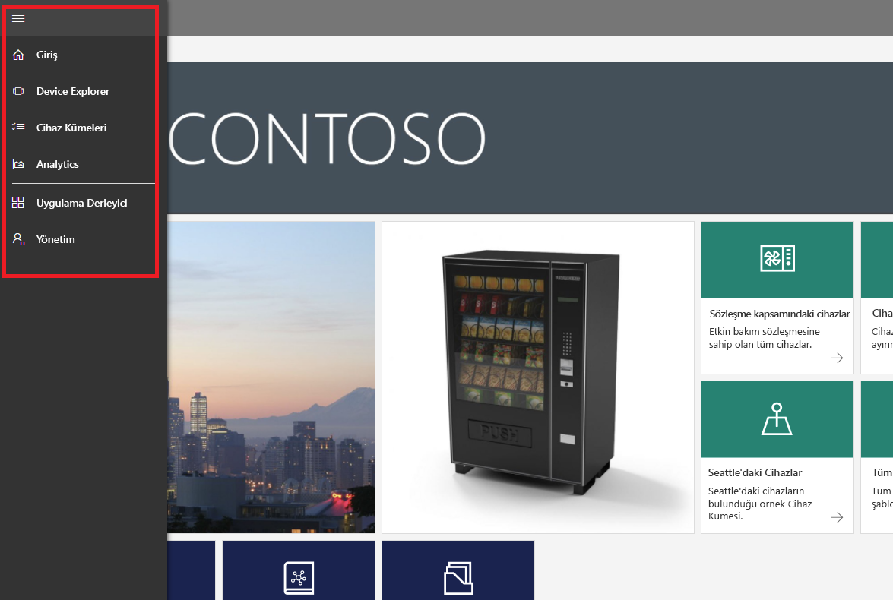
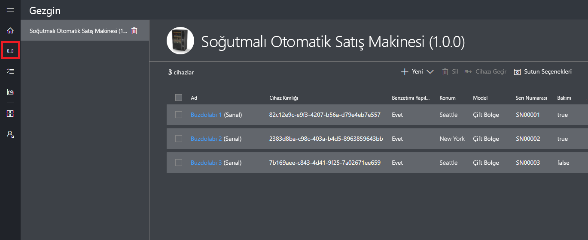
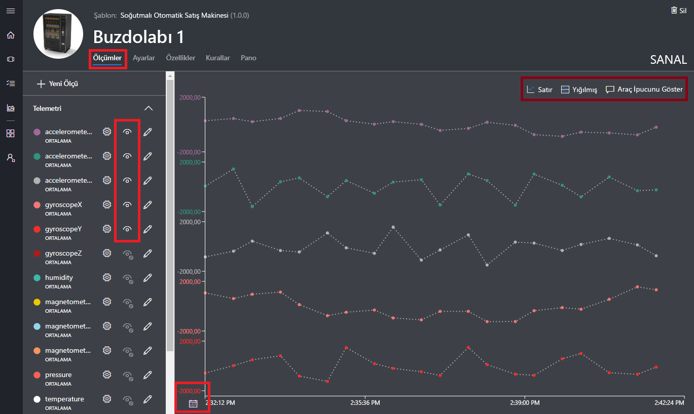
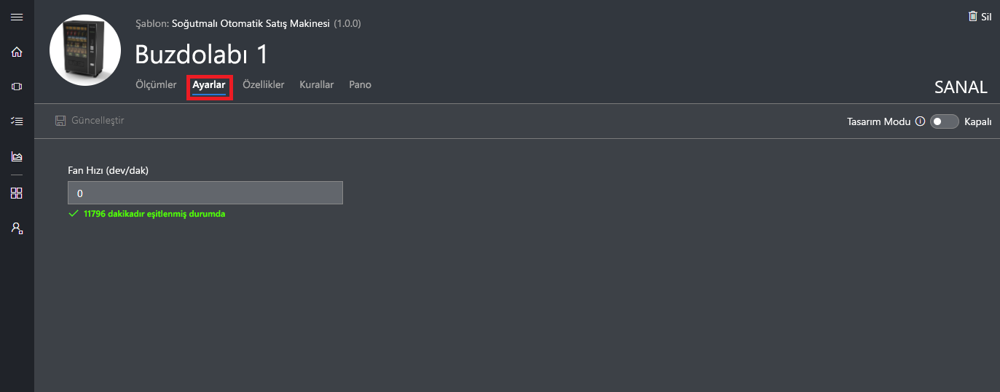
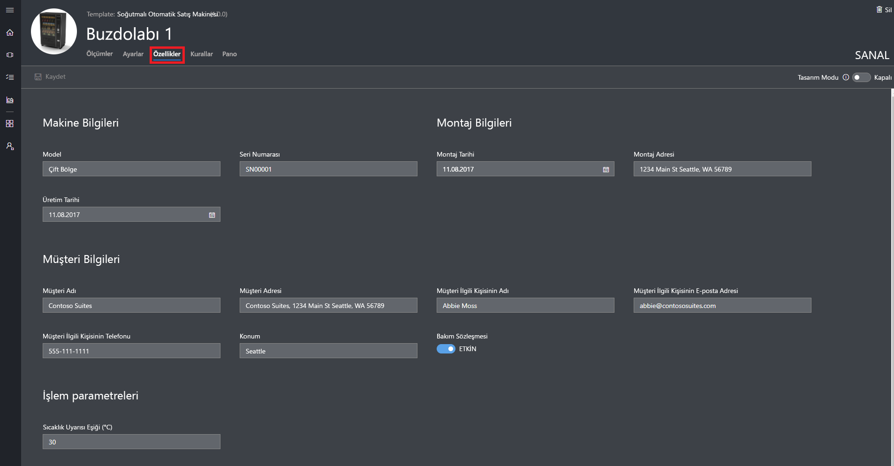
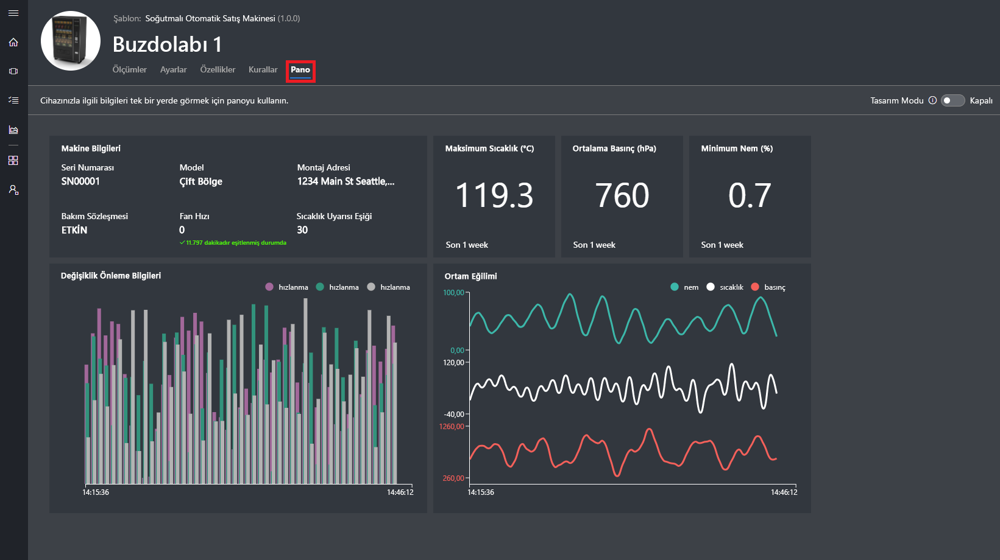
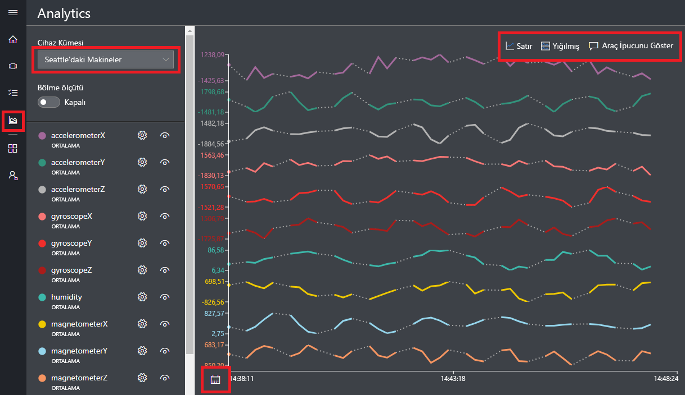

# Azure IoT Central uygulaması oluşturma

_Oluşturucu_ olarak, Azure IoT Central kullanıcı arabirimini kullanarak Microsoft Azure IoT Central uygulamanızı tanımlayabilirsiniz. Bu hızlı başlangıçta şu işlemleri nasıl yapacağınız gösterilir:

- Örnek bir _cihaz şablonu_ ve simülasyon _cihazları_ içeren bir Azure IoT Central uygulaması oluşturun.
- Uygulamanızda **Soğutmalı Otomat** cihaz şablonunun özelliklerini görüntüleyin.
- Simülasyon **Buzdolabı** cihazlarınızın telemetri verilerini ve analizini görüntüleyin.

Bu hızlı başlangıçta, bir cihaz şablonundan simülasyon **Buzdolabı** cihazını görüyorsunuz. Simülasyon cihazı:

* Uygulamanıza sıcaklık ve basınç gibi telemetri verileri gönderir.
* Uygulamanıza hareket uyarısı gibi cihaz özelliği değerlerini bildirir.
* Uygulamada ayarlayabileceğiniz fan hızı gibi cihaz ayarlarını içerir.

Azure IoT Central uygulamasında bir cihaz şablonundan simülasyon cihazı oluşturduğunuzda, simülasyon cihazı gerçek bir cihaz bağlamadan önce uygulamanızı test etmenize olanak tanır.

## Uygulama oluşturma

Bu hızlı başlangıcı tamamlamak için, **Örnek Contoso** uygulama şablonundan bir Azure IoT Central uygulaması oluşturmalısınız.

Azure IoT Central [Uygulama Yöneticisi](https://aka.ms/iotcentral) sayfasına gidin. Sonra Azure aboneliğinize erişmek için kullandığınız e-posta adresini ve parolayı girin:

Yeni bir Azure IoT Central uygulaması oluşturmaya başlamak için **Yeni Uygulama**'yı seçin:

Yeni bir Azure IoT Central uygulaması oluşturmak için:

1. **Ücretsiz Deneme Uygulaması** ödeme planını seçin.
1. **Contoso IoT** gibi kolay bir uygulama adı seçin. Azure IoT Central sizin için benzersiz bir URL ön eki oluşturur. Bu URL ön ekini daha akılda kalır bir şeyle değiştirebilirsiniz.
1. **Örnek Contoso** uygulama şablonunu seçin.
1. Ardından **Oluştur**’u seçin.

## Uygulamaya gidin

Uygulamanız hazır olduğunda, uygulamanızın **Giriş Sayfası** görüntülenir. Giriş Sayfasını düzenlemek için sağ üst kısımda _Tasarım Modu_'na geçilebilir. Uygulama URL'si, önceki adımda belirttiğiniz URL'dir:

Yeni Azure IoT Central uygulamanızın farklı alanlarına erişmek için _sol gezinti menüsünü_ kullanın:

Uygulamanızdaki cihaz şablonlarını ve cihazları görüntülemek için, sol gezinti menüsünde **Device Explorer**'ı seçin. Örnek uygulama **Soğutmalı Otomat** cihaz şablonunu içerir. Bu cihaz şablonundan önceden oluşturulmuş üç simülasyon cihazı vardır:

## Cihaz şablonunu ve cihazları görüntüleme

Aşağıdaki adımları kullanarak **Soğutmalı Otomat** cihaz şablonundan oluşturulmuş olan buzdolabı cihazını görüntüleyin. Cihaz şablonu şunları tanımlar:

* _Ölçümler_, örneğin sıcaklık telemetrisi; cihazdan gönderilir.
* _Ayarlar_, örneğin fan hızı; cihazı denetlemenize olanak tanır.
* _Özellikler_, örneğin seri numarası; cihaz hakkındaki bilgileri depolar.
* [Kurallar](howto-create-telemetry-rules.md); cihazın davranışı temelinde eylemleri otomatik hale getirmenize olanak tanır.
* Özelleştirilebilir _pano_; cihaz hakkındaki bilgileri görüntüler.

Cihaz şablonundan hem simülasyon hem de gerçek cihazlar oluşturabilirsiniz.

### Ölçümler

**Refrigerator 1** cihazının **Ölçümler** sayfası görüntülenir. Simülasyon cihazından gönderilen ölçümlerin listesini görebilirsiniz. Sayfada ayrıca görünen ölçümlerin özelleştirilebilir bir grafiği de gösterilir:

Tek tek öğelerin görünürlük durumunu değiştirebilir ve grafiği özelleştirebilirsiniz. Geçerli grafikte, simülasyon cihazından gelen telemetri gösterilir. Uygun izinleriniz varsa cihaz şablonuna yeni ölçümler ekleyebilirsiniz.

> [!NOTE]
> Simülasyon verilerinin grafikte gösterilmesi için kısa bir süre beklemeniz gerekebilir.

### Ayarlar

**Ayarlar**'ı seçin. **Ayarlar** sayfasında cihazı denetleyebilirsiniz. Örneğin, buzdolabının fan hızını güncelleştirebilirsiniz:

Cihaz değişikliği kabul ettiğinde ayar **eşitlenmiş** olarak gösterilir.

### Özellikler

**Özellikler**'i seçin. **Özellikler** sayfasında şunları yapabilirsiniz:

* Cihazınız hakkında müşteri adı gibi bilgileri koruyabilirsiniz.
* Cihaz tarafından bildirilen hareket uyarısı gibi özellik değerlerini görüntüleyebilirsiniz.

### Pano

**Pano**'yu seçin. Pano, cihazınız hakkındaki ölçümler, özellikler ve KPI'ler gibi bilgilerin özelleştirilebilir bir görünümüdür:

## Görünüm analizi

Önceki bölümde tek bir cihaz hakkındaki bilgileri nasıl görüntüleyeceğini görmüştünüz. Birden çok cihazdan gelen birleştirilmiş bilgileri görüntülemek için [cihaz kümeleri](howto-use-device-sets.md) ve [analiz](howto-create-analytics.md) kullanabilirsiniz.

Cihaz kümesi, ölçütlere uyan bir grup cihazı dinamik olarak seçmek için sorgu kullanır. Örneğin, **Machines in Seattle** cihaz kümesi konumu Seattle olan buzdolabı cihazlarını seçer. **Machines in Seattle** cihaz kümesini görüntülemek için, sol gezinti menüsünde **Cihaz Kümeleri**'ni seçin ve sonra da **Machines in Seattle**'ı seçin:

**Analiz** sayfasında, cihaz kümesindeki cihazların analiz verilerini görüntüleyebilirsiniz:

## Sonraki adımlar

Bu hızlı başlangıçta, **Soğutmalı Otomat** cihaz şablonunu ve simülasyon cihazlarını içeren, önceden doldurulmuş bir Azure IoT Central uygulaması oluşturdunuz. Bir oluşturucu olarak kendi cihaz şablonlarınızı tanımlama hakkında daha fazla bilgi edinmek için bkz. [Uygulamanızda yeni cihaz şablonu tanımlama](tutorial-define-device-type.md).
