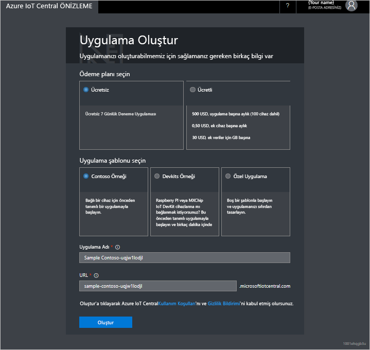

# Azure IoT Central uygulaması oluşturma

_Oluşturucu_ olarak, Azure IoT Central kullanıcı arabirimini kullanarak Microsoft Azure IoT Central uygulamanızı tanımlayabilirsiniz. Bu hızlı başlangıç örnek bir _cihaz şablonu_ ve simülasyon _cihazları_ içeren bir Azure IoT Central uygulaması oluşturma adımlarını göstermektedir.

## Uygulama oluşturma

Azure IoT Central [Uygulama Yöneticisi](https://aka.ms/iotcentral) sayfasına gidin. Microsoft kişisel ya da iş veya okul hesabıyla oturum açmalısınız.

Yeni bir Azure IoT Central uygulaması oluşturmaya başlamak için **Yeni Uygulama**'yı seçin. Bu sizi **Uygulama Oluştur** sayfasına götürür.

Yeni bir Azure IoT Central uygulaması oluşturmak için:

1. Ödeme planını seçin:
   - **Deneme** uygulamaları, süresi dolmadan 7 gün ücretsiz kullanılabilir. Süresi dolmadan önce herhangi bir anda Kullandıkça Öde uygulamasına dönüştürülebilir. Oluşturursanız, bir **deneme** uygulama için gereksinim duyduğunuz iletişim bilgilerinizi girin ve Microsoft'tan bilgi ve ipuçları almak isteyip istemediğinizi seçin.
   - **Kullandıkça Öde** uygulamaları, ilk 5 cihaz ücretsiz olmak üzere cihaz başına ücretlendirilir. Oluşturursanız, bir **Kullandıkça Öde** uygulama için gereksinim duyduğunuz seçin, *dizin*, *Azure abonelik*, ve *bölge*:
      - *Dizin* Azure Active Directory (uygulamanızı oluşturmak için ad). Kullanıcı kimliklerini, kimlik bilgilerini ve diğer kuruluş bilgilerini içerir. Azure AD yoksa, bir Azure aboneliği oluşturduğunuzda bir sizin için oluşturulur.
      - *Azure Aboneliği*, Azure hizmetlerinin örneklerini oluşturmanıza olanak tanır. IoT Central aboneliğinizde kaynakları sağlayacaktır. Azure aboneliğiniz yoksa, [Azure kayıt sayfasında](https://aka.ms/createazuresubscription) bir abonelik oluşturabilirsiniz. Azure aboneliğini oluşturduktan sonra, **Uygulama Oluştur** sayfasına geri gidin. Yeni aboneliğiniz **Azure Aboneliği** açılan listesinde gösterilir.
      - *Bölge*, uygulamanızı oluşturmak istediğiniz fiziksel konumdur. Normalde, en uygun performansı elde etmek için cihazlarınıza en yakın fiziksel konumu seçmeniz gerekir. Azure IoT Central'ın sağlandığı bölgeleri, [Bölgeye göre sağlanan ürünler](https://azure.microsoft.com/regions/services/) sayfasında görebilirsiniz. Bir bölge seçtikten sonra daha sonra uygulamanızı farklı bir bölgeye taşıyamazsınız.

      [Azure IoT Central fiyatlandırma sayfasında](https://azure.microsoft.com/pricing/details/iot-central/), fiyatlar hakkında daha fazla bilgi edinin.

1. **Contoso IoT** gibi kolay bir uygulama adı seçin. Azure IoT Central sizin için benzersiz bir URL ön eki oluşturur. Bu URL ön ekini daha akılda kalır bir şeyle değiştirebilirsiniz.

1. Uygulama şablonunu seçin. Uygulama şablonu, başlamanıza yardımcı olacak cihaz şablonları ve panolar gibi önceden tanımlanmış öğeleri içerebilir.

    | Uygulama şablonu | Açıklama |
    | -------------------- | ----------- |
    | Örnek Contoso       | Bir Soğutmalı Otomat için önceden oluşturulmuş cihaz şablonunu içeren bir uygulama oluşturur. Azure IoT Central'ı incelemeye başlamak için bu şablonu kullanın. |
    | Devkits Örneği       | MXChip veya Raspberry Pi cihazını bağlamak amacıyla sizin için hazırlanmış cihaz şablonlarıyla bir uygulama oluşturur. Bu cihazlardan birini deneyen bir cihaz gelişticisiyseniz bu şablonu kullanın. |
    | Özel uygulama   | Kendi cihaz şablonlarınız ve cihazlarınızla doldurabileceğiniz boş bir uygulama oluşturur. |

1. **Oluştur**’u seçin.

## Sonraki adımlar

Bu hızlı başlangıçta bir IoT Central uygulaması oluşturdunuz. Önerilen sonraki adım:

> [!div class="nextstepaction"]
> [IoT Central'da bir tura katılın](overview-iot-central-tour.md)
