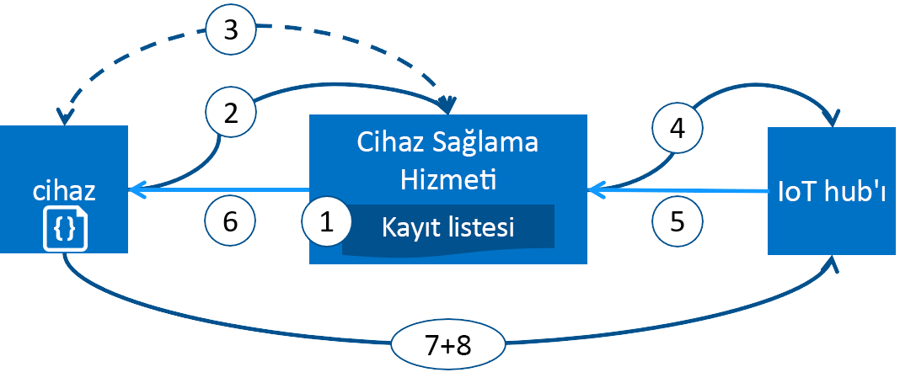

# Azure IoT Hub Cihazı Sağlama Hizmeti ile cihaz sağlama
Microsoft Azure, tüm IoT çözüm ihtiyaçlarınız için zengin bir tümleşik genel bulut hizmetleri kümesi sağlar. IoT Hub Cihazı Sağlama Hizmeti doğru IoT hub’a, kullanıcı müdahalesi gerektirmeden tam zamanında sağlama olanağı sunan bir yardımcı hizmettir. Bu sayede müşteriler milyonlarca cihazı güvenli ve ölçeklenebilir bir şekilde sağlayabilir.

## Cihaz Sağlama Hizmeti’ni kullanma zamanı
Cihaz Sağlama Hizmeti’nin cihazları IoT Hub’a bağlamak ve yapılandırmak için ideal bir seçenek olduğu birçok sağlama senaryosu vardır. Örneğin:

* IoT Hub bağlantı bilgilerini fabrikada sabit kodlamaya gerek kalmadan tek bir IoT çözümüne dokunma olmadan sağlama (ilk kurulum)
* Birden fazla hub’da cihazlar için yük dengeleme
* Cihazları satış işlemi verilerine göre cihaz sahibinin IoT çözümüne bağlama (çoklu kiracı)
* Cihazları kullanım durumuna göre belirli bir IoT çözümüne bağlama (çözüm yalıtımı)
* Bir cihazı en düşük gecikme süresine sahip IoT hub’a bağlama (coğrafi parçalama)
* Cihazdaki bir değişikliğe göre yeniden sağlama
* Cihaz tarafından IoT Hub’a bağlanmak için kullanılan anahtarları değiştirme (bağlanmak için X.509 sertifikaları kullanılmadığında)

## Arka planda
Önceki bölümde listelenen senaryoların tümü aynı akışta dokunma olmadan sağlama için sağlama hizmeti kullanılarak gerçekleştirilebilir. Cihaz Sağlama Hizmeti ile geleneksel yöntemlerde sağlama sürecinde gerçekleştirilen el ile yapılan adımların birçoğu otomatik hale getirilerek IoT cihazlarını dağıtma süresi kısaltılmakta ve el ile gerçekleştirilen işlem kaynaklı hata riski düşürülmektedir. Aşağıdaki bölümde bir cihazın sağlanması için arka planda gerçekleştirilen işlemler açıklanmaktadır. İlk adım el ile, sonraki adımların tümü ise otomatik olarak gerçekleştirilmektedir.

1. Cihaz üreticisi, cihaz kayıt bilgilerini Azure portalındaki kayıt listesine ekler.
2. Cihaz, fabrikada belirlenen sağlama hizmeti uç noktasıyla iletişime geçer. Cihaz, kimliğini kanıtlamak için kimlik bilgilerini sağlama hizmetine iletir.
3. Sağlama hizmeti bir kerelik anahtar kullanarak ([Güvenilir Platform Modülü](https://trustedcomputinggroup.org/work-groups/trusted-platform-module/)) veya standart X.509 doğrulamasıyla (X.509) cihaz kimliğini ve anahtarını kayıt listesi girişiyle doğrulayarak cihazın kimliğini doğrular.
4. Sağlama hizmeti cihazı bir IoT hub’a kaydeder ve cihazın [istenen ikiz durumunu](../iot-hub/iot-hub-devguide-device-twins.md) gösterir.
5. IoT hub, cihazın kimlik bilgilerini sağlama hizmetine döndürür.
6. Sağlama hizmeti IoT hub bağlantı bilgilerini cihaza döndürür. Cihaz artık doğrudan IoT hub’a veri göndermeye başlayabilir.
7. Cihaz IoT hub’a bağlanır.
8. Cihaz IoT hub’daki cihaz ikizinden istenen durumu alır.

## Sağlama işlemi
Bir cihazın dağıtım işleminde Cihaz Sağlama Hizmeti’nin rol aldığı ve ayrı ayrı gerçekleştirilebilen iki farklı adım vardır:

* Fabrikada cihazın oluşturulduğu ve hazırlandığı **üretim adımı** ve
* Cihaz Sağlama Hizmeti’nin otomatik sağlama için yapılandırıldığı **bulut kurulumu adımı**.

Bu adımların ikisi de mevcut üretim ve dağıtım işlemlerine sorunsuz olarak eklenebilir. Cihaz Sağlama Hizmeti, bağlantı bilgilerinin cihaza eklenmesi için el ile gerçekleştirilen çok sayıda adımın yer aldığı bazı dağıtım işlemlerini de kolaylaştırır.

### Üretim adımı
Bu adım, üretim hattında gerçekleştirilen işlemleri kapsar. Bu adımda bulunan roller silikon tasarımcısı, silikon üreticisi, tümleştirici ve/veya cihazın son üreticisidir. Bu adım, donanımı oluşturmayla ilgilidir.

Cihaz Sağlama Hizmeti, üretim işlemlerine yeni bir adım eklemez, bunun yerine ilk yazılımın ve (ideal olarak) HSM bileşeninin cihaza yüklendiği mevcut adıma bağlanır. Bu adımda cihaz kimliği oluşturma yerine cihaz, sağlama hizmeti bilgileriyle programlanarak açıldığında bağlantı bilgilerini/IoT çözümü atamasını almak üzere sağlama hizmetini araması sağlanır.

Ayrıca bu adımda üretici cihaz dağıtıcısına/operatöre kimlik anahtarı bilgilerini iletir. Bu bilgilerin sağlanması, tüm cihazların cihaz dağıtıcısı/operatörü tarafından sağlanan imzalama sertifikası ile oluşturulmuş olan bir X.509 sertifikasına sahip olduğunun onaylanması kadar basit veya her bir TPM cihazından TPM onay anahtarının genel bölümünün ayıklanması kadar karmaşık olabilir. Bu hizmetler günümüzde birçok silikon üreticisi tarafından sunulmaktadır.

### Bulut kurulumu adımı
Bu adımda bulut, uygun otomatik sağlama için yapılandırılır. Bulut kurulumu adımında genellikle iki tür kullanıcı vardır. Cihazların ilk kurulumunun nasıl olması gerektiğini bilen bir kullanıcı (cihaz operatörü) ve cihazların IoT hub’larına nasıl dağıtılması gerektiğini bilen bir kullanıcı (çözüm operatörü).

Sağlama süresinde genellikle çözüm operatörü tarafından gerçekleştirilen tek seferlik bir kurulum adımı vardır. Sağlama hizmeti yapılandırıldıktan sonra kullanım örneği değiştirilmediği sürece değiştirilmesi gerekmez.

Hizmet otomatik sağlama için yapılandırıldıktan sonra cihaz kaydına hazır duruma getirilmesi gerekir. Bu adım, cihazların istenen yapılandırmasını bilen ve IoT hub’ını arayan cihazın kimliğinin sağlama hizmeti tarafından uygun şekilde kanıtlayacağından emin olma konusunda yetkili olan cihaz operatörü tarafından gerçekleştirilir. Cihaz operatörü tanımlama anahtarını üreticiden alır ve kayıt listesine ekler. Yeni girişlerin eklenmesi veya var olan girişlerin cihazlar hakkındaki en son bilgilerle güncelleştirmesi nedeniyle kayıt listesinde daha sonradan güncelleştirme yapılabilir.

## Kayıt ve sağlama
*Sağlama*, terimin kullanıldığı sektöre bağlı olarak farklı anlamlara gelebilir. IoT cihazlarını bulut çözümlerine sağlama bağlamında sağlama işlemi iki bölümden oluşan bir işlemdir:

1. İlk bölüm, cihazı kaydederek cihaz ile IoT çözümü arasındaki ilk bağlantıyı kurmaktır.
2. İkinci bölüm ise kaydedildiği çözümün gereksinimlerine bağlı olarak cihaz uygun yapılandırmanın uygulanmasıdır.

Bu adımların ikisi de tamamlandıktan sonra cihazın tam olarak sağlandığını söylemek mümkündür. Bazı bulut hizmetleri cihazları IoT çözümü uç noktasına kaydedip ilk yapılandırmayı gerçekleştirmeyerek sağlama işleminin yalnızca ilk bölümünü tamamlar. Cihaz Sağlama Hizmeti, bu adımların ikisini de otomatikleştirerek cihaz için sorunsuz bir sağlama deneyimi sağlar.

## Cihaz Sağlama Hizmeti’nin özellikleri
Cihaz Sağlama Hizmeti sahip olduğu birçok özellik sayesinde cihaz sağlama için ideal bir çözümdür.

* **Güvenli kanıtlama**: Hem X.509 hem de TPM tabanlı kimlikler için destek.
* **Kayıt listesi**: Bir noktada kaydedilebilecek cihazların/cihaz gruplarının tam kaydını içerir. Kayıt listesi, kaydedilen cihazın istenen yapılandırması hakkında bilgi içerir ve istenen zamanda güncelleştirilebilir.
* **Birden fazla ayırma ilkesi**: Cihaz Sağlama Hizmeti’nin senaryolarınızı destekleme amacıyla cihazları IoT hub’larına atama biçimini kontrol etmenizi sağlar.
* **İzleme ve tanılama günlüğü**: Her şeyin düzgün çalıştığından emin olmanızı sağlar.
* **Çoklu hub desteği**: Cihaz Sağlama Hizmeti’nin cihazları birden fazla IoT hub’a atamasını sağlar. Cihaz Sağlama Hizmeti birden fazla Azure aboneliğindeki hub’larla iletişim kurabilir.
* **Bölgeler arası destek**: Cihaz Sağlama Hizmeti’nin cihazları diğer bölgelerdeki IoT hub’lara atamasını sağlar.

[Cihaz kavramları](concepts-device.md), [hizmet kavramları](concepts-service.md) ve [güvenlik kavramları](concepts-security.md) bölümlerinde cihaz sağlamayla ilgili kavramlar ve özellikler hakkında daha fazla bilgi edinebilirsiniz.

## Platformlar arası destek
Diğer tüm Azure IoT hizmetleri gibi Cihaz Sağlama Hizmeti de birden fazla işletim sistemi üzerinde çalışma desteği sunar. Azure, cihazların bağlanmasını ve hizmetin yönetilmesini kolaylaştırmak amacıyla birçok [dilde](https://github.com/Azure/azure-iot-sdks) açık kaynak SDK’ları sunar. Cihaz Sağlama Hizmeti, cihaz bağlantısı için aşağıdaki protokolleri destekler:

* HTTPS
* AMQP
* Web yuvaları üzerinden AMQP
* MQTT
* Web yuvaları üzerinden MQTT

Cihaz Sağlama Hizmeti, hizmet işlemleri için yalnızca HTTPS bağlantılarını destekler.

## Bölgeler
Cihaz Sağlama Hizmeti birçok bölgede kullanılabilir. Tüm hizmetler için mevcut ve yeni duyurulan bölgelerin güncel listesi [Azure Bölgeleri](https://azure.microsoft.com/regions/) sayfasında yer almaktadır. Cihaz Sağlama Hizmeti’nin kullanılabilirliğini [Azure Durumu](https://azure.microsoft.com/status/) sayfasından kontrol edebilirsiniz.

> [!NOTE]
> Cihaz Sağlama Hizmeti konumdan bağımsız, genel bir hizmettir. Ancak Cihaz Sağlama Hizmeti profilinizle ilişkili meta verilerin saklanacağı bir bölge belirtmeniz gerekir.

## Kullanılabilirlik
Cihaz Sağlama Hizmeti için %99,9 Hizmet Düzeyi Sözleşmesi mevcuttur, [SLA’yı okuyabilirsiniz](https://azure.microsoft.com/support/legal/sla/iot-hub/). [Azure SLA](https://azure.microsoft.com/support/legal/sla/) şartları, Azure’un tamamının kullanılabilirlik garantisini açıklamaktadır.

## Kotalar
Her Azure aboneliği varsayılan kota sınırları içerir ve bu sınırlar, IoT çözümünüzün kapsamını etkileyebilir. Abonelik başına geçerli sınır, 10 Cihaz Sağlama Hizmeti/abonelik şeklindedir.

Kota sınırları hakkındaki diğer ayrıntılar için:

* [Azure abonelik hizmeti limitleri](../azure-subscription-service-limits.md)

## İlgili Azure bileşenleri
Cihaz Sağlama Hizmeti, cihaz sağlamayı Azure IoT Hub ile otomatikleştirir. [IoT Hub](https://docs.microsoft.com/azure/iot-hub/) hakkında daha fazla bilgi edinin.

## Sonraki adımlar
Artık Azure’da IoT cihazlarını sağlama hakkında genel bilgilere sahipsiniz. Bir sonraki adımda uçtan uca bir IoT senaryosunu tamamlamayı deneyeceksiniz.
> [!div class="nextstepaction"]
> [Azure portalıyla IoT Hub Cihazı Sağlama Hizmetini ayarlama](quick-setup-auto-provision.md)
> [Simülasyon cihazı oluşturma ve sağlama](quick-create-simulated-device.md)
> [Cihazı sağlama için ayarlama](tutorial-set-up-device.md)
