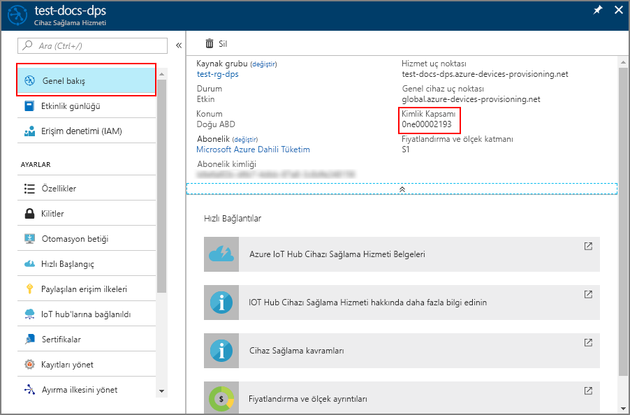

# <a name="how-to-provision-legacy-devices-using-symmetric-keys"></a>Simetrik anahtarlar kullanarak eski cihazları sağlamasını yapma


Bunlar genellikle tek bir bilgi parçasını oluşan bir kimliğe sahip birçok eski cihazları yaygın bir sorun var. Bu kimlik bilgileri, bir MAC adresi veya bir seri numarası genellikle içindir. Eski cihazları, bir sertifika, TPM veya cihaz güvenli bir şekilde tanımlamak için kullanılan herhangi bir güvenlik özelliği olmayabilir. IOT hub cihazı sağlama hizmeti, simetrik anahtar kanıtı içerir. Simetrik anahtar kanıtı, MAC adresi veya bir seri numarası gibi bilgileri devre dışı tabanlı bir cihazı tanımlamak için kullanılabilir.

Kolayca yüklerseniz, bir [donanım güvenlik modülü (HSM)](concepts-security.md#hardware-security-module) ve bir sertifika sonra tanımlamak ve cihazlarınızın sağlanması için daha iyi bir yaklaşım olabilir. Olduğundan bu yaklaşım, tüm cihazlara dağıttığınız kodunu güncelleştirme atlamak izin verebilir ve bir gizli anahtar, cihaz görüntüde gömülü erişemeyecek.

Bu makalede, bir HSM ya da bir sertifika kaydının uygulanabilir bir seçenek olduğunu varsayar. Ancak, bu cihazlar sağlamak için cihaz sağlama hizmeti kullanmak için cihaz kodu güncelleştirme bazı yöntemini sahip olduğunuz varsayılır. 

Bu makale, ayrıca cihaz güncelleştirmesi Ana Grup anahtarı veya türetilmiş cihaz anahtarı yetkisiz erişimi önlemek için güvenli bir ortamda yer aldığını varsayar.

Bu makale Windows tabanlı bir iş istasyonuna yöneliktir. Ancak yordamları Linux üzerinde gerçekleştirebilirsiniz. Bir Linux örneği için, bkz. [Çoklu kiracı için sağlama](how-to-provision-multitenant.md).


## <a name="overview"></a>Genel Bakış

Benzersiz kayıt kimliği bu cihaza tanımlayan bilgilere göre her bir cihaz için tanımlanır. Örneğin, MAC adresini veya seri numarası.

Kullanan bir kayıt grubu [simetrik anahtar kanıtı](concepts-symmetric-key-attestation.md) cihaz sağlama hizmeti ile oluşturulur. Kayıt grubu bir grup ana anahtarı içerir. Bu ana anahtar, her cihaz için bir benzersiz cihaz anahtarı oluşturmak için her bir benzersiz kayıt Kimliğini karma için kullanılacak. Cihaz, türetilen cihaz anahtar, cihaz sağlama hizmeti ile onaylamasını ve bir IOT hub'ına atanması için benzersiz kayıt Kimliğini kullanır.

Bu makalede gösterilmiştir cihaz kodu olarak aynı deseni takip [hızlı başlangıç: Simetrik anahtarlar ile bir sanal cihaz sağlama](quick-create-simulated-device-symm-key.md). Kod, bir örnekten kullanarak bir cihazı benzetimini yapacaksınız [Azure IOT C SDK'sı](https://github.com/Azure/azure-iot-sdk-c). Sanal cihaz kayıt grubu yerine bireysel kayıt ile hızlı başlangıç bölümünde gösterildiği gibi onaylamasını.

[!INCLUDE [quickstarts-free-trial-note](../../includes/quickstarts-free-trial-note.md)]


## <a name="prerequisites"></a>Önkoşullar

* Tamamlanmasından [IOT Hub cihazı sağlama hizmetini Azure portalıyla ayarlama](./quick-setup-auto-provision.md) hızlı başlangıç.
* ["C++ ile masaüstü geliştirme"](https://www.visualstudio.com/vs/support/selecting-workloads-visual-studio-2017/) iş yükünün etkinleştirildiği Visual Studio 2015 veya [Visual Studio 2017](https://www.visualstudio.com/vs/).
* [Git](https://git-scm.com/download/)'in en son sürümünün yüklemesi.


## <a name="prepare-an-azure-iot-c-sdk-development-environment"></a>Azure IoT C SDK'sı için geliştirme ortamını hazırlama

Bu bölümde, [Azure IoT C SDK'sını](https://github.com/Azure/azure-iot-sdk-c) oluşturmak için kullanılan geliştirme ortamını hazırlayacaksınız. 

SDK'sı sanal cihaz için örnek kod içerir. Simülasyon cihazı, cihazın önyükleme dizisi sırasında sağlamayı dener.

1. İndirme [CMake derleme sistemini](https://cmake.org/download/).

    `CMake` yüklemesine başlamadan **önce** makinenizde Visual Studio önkoşullarının (Visual Studio ve "C++ ile masaüstü geliştirme" iş yükü) yüklenmiş olması önemlidir. Önkoşullar sağlandıktan ve indirme doğrulandıktan sonra, CMake derleme sistemini yükleyin.

2. Komut istemini veya Git Bash kabuğunu açın. Aşağıdaki komutu yürüterek Azure IoT C SDK'sı GitHub deposunu kopyalayın:
    
    ```cmd/sh
    git clone https://github.com/Azure/azure-iot-sdk-c.git --recursive
    ```
    Bu işlemin tamamlanması için birkaç dakika beklemeniz gerekebilir.


3. Git deposunun kök dizininde bir `cmake` alt dizini oluşturun ve o klasöre gidin. 

    ```cmd/sh
    cd azure-iot-sdk-c
    mkdir cmake
    cd cmake
    ```

4. SDK’nın geliştirme istemci platformunuza ve özgü bir sürümünü oluşturmak için aşağıdaki komutu çalıştırın. `cmake` dizininde simülasyon cihazı için bir Visual Studio çözümü de oluşturulur. 

    ```cmd
    cmake -Dhsm_type_symm_key:BOOL=ON -Duse_prov_client:BOOL=ON  ..
    ```
    
    `cmake`, C++ derleyicinizi bulamazsa yukarıdaki komutu çalıştırırken derleme hatalarıyla karşılaşabilirsiniz. Bu durumda bu komutu [Visual Studio komut isteminde](https://docs.microsoft.com/dotnet/framework/tools/developer-command-prompt-for-vs) çalıştırmayı deneyin. 

    Derleme başarılı olduktan sonra, son birkaç çıkış satırı aşağıdaki çıkışa benzer olacaktır:

    ```cmd/sh
    $ cmake -Dhsm_type_symm_key:BOOL=ON -Duse_prov_client:BOOL=ON  ..
    -- Building for: Visual Studio 15 2017
    -- Selecting Windows SDK version 10.0.16299.0 to target Windows 10.0.17134.
    -- The C compiler identification is MSVC 19.12.25835.0
    -- The CXX compiler identification is MSVC 19.12.25835.0

    ...

    -- Configuring done
    -- Generating done
    -- Build files have been written to: E:/IoT Testing/azure-iot-sdk-c/cmake
    ```


## <a name="create-a-symmetric-key-enrollment-group"></a>Bir simetrik anahtar kayıt grubu oluşturma

1. Oturum [Azure portalında](https://portal.azure.com), cihaz sağlama hizmeti örneğinizi açın.

2. Seçin **kayıtları Yönet** sekmesine ve ardından **kayıt grubu Ekle** sayfanın üstünde düğme. 

3. Üzerinde **kayıt grubu Ekle**, aşağıdaki bilgileri girin ve tıklayın **Kaydet** düğmesi.

   - **Grup adı**: Girin **mylegacydevices**.

   - **Kanıtlama türü**: Seçin **simetrik anahtar**.

   - **Anahtarları otomatik olarak oluştur**: Bu kutuyu işaretleyin.

   - **Hub'lara cihazları atamak istediğiniz seçin**: Seçin **statik yapılandırma** belirli bir hub'ına atayabilmenizi sağlayacak.

   - **Bu grup atanabilen IOT hub'ları seçin**: Hubs'ınız birini seçin.

     

4. Ortamınızı kaydettikten sonra, **Birincil Anahtar** ve **İkincil Anahtar** oluşturularak kayıt girişine eklenir. Simetrik anahtar kayıt grubunuz görünür **mylegacydevices** altında *grup adı* sütununda *kayıt grupları* sekmesi. 

    Kaydı açın ve oluşturduğunuz **Birincil Anahtar** değerini kopyalayın. Ana Grup anahtarınızı anahtardır.


## <a name="choose-a-unique-registration-id-for-the-device"></a>Bir cihaz için benzersiz kayıt kimliği seçin

Her bir cihazı tanımlamak için benzersiz kayıt kimliği tanımlanmış olması gerekir. MAC adresi, seri numarası veya cihazın benzersiz bilgileri kullanabilirsiniz. 

Bu örnekte, bir MAC adresi ve seri numarası, aşağıdaki dize için bir kayıt kimliği oluşturan bir birleşimi kullanıyoruz

```
sn-007-888-abc-mac-a1-b2-c3-d4-e5-f6
```

Cihazınız için bir benzersiz kayıt kimliği oluşturun. Geçerli karakterler: küçük harf alfasayısal ve kısa çizgi ('-').


## <a name="derive-a-device-key"></a>Bir cihaz anahtarı türetin 

Cihaz anahtarı oluşturmak için işlem grubu ana anahtarı kullanmak bir [HMAC SHA256](https://wikipedia.org/wiki/HMAC) sonucu Base64 biçimine dönüştür ve cihaz için benzersiz kayıt kimliği.

Grup ana anahtarınızı cihaz kodunuzda içermez.


#### <a name="linux-workstations"></a>Linux iş istasyonları

Bir Linux iş istasyonu kullanıyorsanız, aşağıdaki örnekte gösterildiği gibi türetilen cihaz anahtarı oluşturmak için openssl kullanabilirsiniz.

Değiştirin **anahtarı** ile **birincil anahtar** daha önce not ettiğiniz.

Değiştirin **REG_ID** kayıt kimliğinizle

```bash
KEY=8isrFI1sGsIlvvFSSFRiMfCNzv21fjbE/+ah/lSh3lF8e2YG1Te7w1KpZhJFFXJrqYKi9yegxkqIChbqOS9Egw==
REG_ID=sn-007-888-abc-mac-a1-b2-c3-d4-e5-f6

keybytes=$(echo $KEY | base64 --decode | xxd -p -u -c 1000)
echo -n $REG_ID | openssl sha256 -mac HMAC -macopt hexkey:$keybytes -binary | base64
```

```bash
Jsm0lyGpjaVYVP2g3FnmnmG9dI/9qU24wNoykUmermc=
```


#### <a name="windows-based-workstations"></a>Windows tabanlı iş istasyonları

Windows tabanlı bir iş istasyonu kullanıyorsanız, aşağıdaki örnekte gösterildiği gibi türetilen cihaz anahtarı oluşturmak için PowerShell kullanabilirsiniz.

Değiştirin **anahtarı** ile **birincil anahtar** daha önce not ettiğiniz.

Değiştirin **REG_ID** kayıt kimliğinizle

```powershell
$KEY='8isrFI1sGsIlvvFSSFRiMfCNzv21fjbE/+ah/lSh3lF8e2YG1Te7w1KpZhJFFXJrqYKi9yegxkqIChbqOS9Egw=='
$REG_ID='sn-007-888-abc-mac-a1-b2-c3-d4-e5-f6'

$hmacsha256 = New-Object System.Security.Cryptography.HMACSHA256
$hmacsha256.key = [Convert]::FromBase64String($KEY)
$sig = $hmacsha256.ComputeHash([Text.Encoding]::ASCII.GetBytes($REG_ID))
$derivedkey = [Convert]::ToBase64String($sig)
echo "`n$derivedkey`n"
```

```powershell
Jsm0lyGpjaVYVP2g3FnmnmG9dI/9qU24wNoykUmermc=
```


Cihazınız türetilen cihaz anahtarı, sağlama sırasında kayıt grubu simetrik anahtar kanıtı gerçekleştirmek için benzersiz kayıt Kimliğinizi kullanır.


## <a name="create-a-device-image-to-provision"></a>Sağlama cihaz görüntüsü oluşturma

Bu bölümde, adlı bir sağlama örnek güncelleştirecektir **prov\_geliştirme\_istemci\_örnek** Azure IOT C ayarladığınız daha önce SDK'sı bulunur. 

Bu örnek kod, cihaz sağlama hizmeti örneğinizi sağlama isteği gönderdiği cihaz önyükleme sırası benzetimini yapar. Önyükleme sırasını tanınır ve IOT hub'ına kayıt grubunda yapılandırılmış atanan cihazın neden olur.

1. Azure Portal'da Cihaz Sağlama hizmetiniz için **Genel Bakış** sekmesini seçin ve **_Kimlik Kapsamı_** değerini not alın.

     

2. Visual Studio'da açın **azure_iot_sdks.sln** CMake çalıştırarak daha önce oluşturulan çözüm dosyası. Çözüm dosyası şu konumda olmalıdır:

    ```
    \azure-iot-sdk-c\cmake\azure_iot_sdks.sln
    ```

3. Visual Studio'nun *Çözüm Gezgini* penceresinde **Sağlama\_Örnekleri** klasörüne gidin. **prov\_dev\_client\_sample** adlı örnek projeyi genişletin. **Kaynak Dosyalar**'ı genişletin ve **prov\_dev\_client\_sample.c** dosyasını açın.

4. `id_scope` sabitini bulun ve değeri daha önce kopyalamış olduğunuz **Kimlik Kapsamı** değerinizle değiştirin. 

    ```c
    static const char* id_scope = "0ne00002193";
    ```

5. Aynı dosyada `main()` işlevinin tanımını bulun. `hsm_type` değişkeninin aşağıda gösterildiği gibi `SECURE_DEVICE_TYPE_SYMMETRIC_KEY` değerine ayarlandığından emin olun:

    ```c
    SECURE_DEVICE_TYPE hsm_type;
    //hsm_type = SECURE_DEVICE_TYPE_TPM;
    //hsm_type = SECURE_DEVICE_TYPE_X509;
    hsm_type = SECURE_DEVICE_TYPE_SYMMETRIC_KEY;
    ```

6. Çağrısını bulmak `prov_dev_set_symmetric_key_info()` içinde **prov\_geliştirme\_istemci\_sample.c** hangi dışında bırakılır.

    ```c
    // Set the symmetric key if using they auth type
    //prov_dev_set_symmetric_key_info("<symm_registration_id>", "<symmetric_Key>");
    ```

    İşlev çağrısının açıklamasını kaldırın ve benzersiz kayıt kimliği, cihaz ve oluşturduğunuz türetilen cihaz anahtarı ile (açılı ayraçlar dahil) yer tutucu değerlerini değiştirin.

    ```c
    // Set the symmetric key if using they auth type
    prov_dev_set_symmetric_key_info("sn-007-888-abc-mac-a1-b2-c3-d4-e5-f6", "Jsm0lyGpjaVYVP2g3FnmnmG9dI/9qU24wNoykUmermc=");
    ```
   
    Dosyayı kaydedin.

7. **prov\_dev\_client\_sample** projesine sağ tıklayın ve **Başlangıç Projesi Olarak Ayarla**’yı seçin. 

8. Çözümü çalıştırmak için Visual Studio menüsünde **Hata Ayıkla** > **Hata ayıklama olmadan başlat**'ı seçin. Projeyi yeniden derleme isteminde **Evet**'e tıklayarak, çalıştırmadan önce projeyi yeniden derleyin.

    Aşağıdaki çıkış, bir simülasyon cihazının başarıyla önyüklemesini yapma ve bir IoT hub’ına atanmak üzere sağlama Hizmeti örneğine bağlanma işlemlerinin bir örneğidir:

    ```cmd
    Provisioning API Version: 1.2.8

    Registering Device

    Provisioning Status: PROV_DEVICE_REG_STATUS_CONNECTED
    Provisioning Status: PROV_DEVICE_REG_STATUS_ASSIGNING
    Provisioning Status: PROV_DEVICE_REG_STATUS_ASSIGNING

    Registration Information received from service: 
    test-docs-hub.azure-devices.net, deviceId: sn-007-888-abc-mac-a1-b2-c3-d4-e5-f6

    Press enter key to exit:
    ```

9. Portalda, simülasyon cihazınızın atandığı IoT hub’ına gidin ve **IoT Cihazları** sekmesine tıklayın. Simülasyon cihazının hub'a başarıyla sağlanması durumunda, cihaz kimliği **IoT Cihazları** dikey penceresinde *DURUM* değeri **etkinleştirildi** olarak gösterilir. En üstteki **Yenile** düğmesine tıklamanız gerekebilir. 

     


## <a name="security-concerns"></a>Güvenlik sorunları

Bu önerilen bir güvenlik en iyi uygulaması değildir görüntünün bir parçası olarak dahil edilen türetilen cihaz anahtarı bırakır dikkat edin. Güvenlik ve kullanım kolaylığı ödünler neden olan bir nedeni budur. 


## <a name="next-steps"></a>Sonraki adımlar

* Reprovisioning daha fazla bilgi edinmek için [IOT Hub cihaz kavramları çıkış](concepts-device-reprovision.md) 
* [Hızlı Başlangıç: Simetrik anahtarlar ile bir sanal cihaz sağlama](quick-create-simulated-device-symm-key.md)
* Daha fazla sağlama kaldırmayı bilgi edinmek için [nasıl daha önce otomatik olarak sağlanan cihazları sağlamasını kaldırmak](how-to-unprovision-devices.md) 


