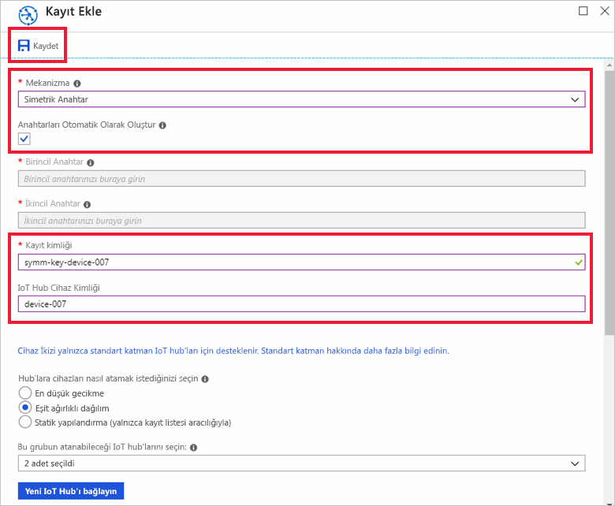

# <a name="quickstart-provision-a-simulated-device-with-symmetric-keys"></a>Hızlı Başlangıç: Simetrik anahtarlar ile bir sanal cihaz sağlama

Bu hızlı başlangıçta, Windows geliştirme makinesi üzerinde bir cihaz simülatörü oluşturmayı ve çalıştırmayı öğreneceksiniz. Bu simülasyon cihazını Cihaz Sağlama Hizmeti örneği ile kimlik doğrulaması yapmak ve bir IoT hub'ına atanmak için bir simetrik anahtar kullanmak üzere yapılandıracaksınız. Sağlamayı başlatan cihaz için önyükleme sırası simülasyonu yapmak için [Azure IoT C SDK'sından](https://github.com/Azure/azure-iot-sdk-c) alınan örnek kod kullanılacaktır. Cihaz, sağlama hizmeti örneği ile ayrı kayıt durumuna göre tanınacak ve bir IoT hub'ına atanacaktır.

Bu makalede bireysel bir kayıt ile sağlama gösterilse de, kayıt grupları için aynı yordamları kullanabilirsiniz. Tek fark, cihaz için benzersiz bir kayıt kimliğine sahip olan türetilmiş bir cihaz anahtarı kullanmanız gerekmesidir. Kayıt grupları ile, kayıttaki simetrik anahtar doğrudan kullanılmaz. Simetrik anahtar kayıt grupları eski cihazlarla sınırlı olmasa da, [Simetrik anahtar kanıtı kullanarak eski cihazları sağlama](how-to-legacy-device-symm-key.md) bölümünde bir kayıt grubu örneği sağlanmaktadır. Daha fazla bilgi için, bkz. [Simetrik Anahtar Kanıtlama için Grup Kayıtları](concepts-symmetric-key-attestation.md#group-enrollments).

Otomatik sağlama işlemini bilmiyorsanız, [Otomatik sağlama kavramlarını](concepts-auto-provisioning.md) gözden geçirin. 

Ayrıca, bu hızlı başlangıçla devam etmeden önce [IoT Hub Cihazı Sağlama Hizmetini Azure portalla ayarlama](./quick-setup-auto-provision.md) bölümünde bulunan adımları tamamladığınızdan emin olun. Bu hızlı başlangıç, Cihaz Sağlama Hizmeti örneğinizi zaten oluşturmuş olmanızı gerektirir.

Bu makale Windows tabanlı bir iş istasyonuna yöneliktir. Ancak yordamları Linux üzerinde gerçekleştirebilirsiniz. Bir Linux örneği için, bkz. [Çoklu kiracı için sağlama](how-to-provision-multitenant.md).


[!INCLUDE [quickstarts-free-trial-note](../../includes/quickstarts-free-trial-note.md)]


## <a name="prerequisites"></a>Önkoşullar

* ["C++ ile masaüstü geliştirme"](https://www.visualstudio.com/vs/support/selecting-workloads-visual-studio-2017/) iş yükünün etkinleştirildiği Visual Studio 2015 veya [Visual Studio 2017](https://www.visualstudio.com/vs/).
* [Git](https://git-scm.com/download/)'in en son sürümünün yüklemesi.


<a id="setupdevbox"></a>

## <a name="prepare-an-azure-iot-c-sdk-development-environment"></a>Azure IoT C SDK'sı için geliştirme ortamını hazırlama

Bu bölümde, [Azure IoT C SDK'sını](https://github.com/Azure/azure-iot-sdk-c) oluşturmak için kullanılan geliştirme ortamını hazırlayacaksınız. 

SDK bir simülasyon cihazı için örnek kod içerir. Simülasyon cihazı, cihazın önyükleme dizisi sırasında sağlamayı dener.

1. İndirme [CMake derleme sistemini](https://cmake.org/download/). İndirdiğiniz sürümüne karşılık gelen şifreleme karması değerini kullanarak indirilen ikili doğrulayın. Şifreleme karma değerlerini de zaten sağlanan CMake karşıdan yükleme bağlantısını yer alır.

    Aşağıdaki örnek, şifreleme karması x64 3.13.4 sürümü için doğrulamak için Windows PowerShell kullanılan MSI dağıtım:

    ```powershell
    PS C:\Downloads> $hash = get-filehash .\cmake-3.13.4-win64-x64.msi
    PS C:\Downloads> $hash.Hash -eq "64AC7DD5411B48C2717E15738B83EA0D4347CD51B940487DFF7F99A870656C09"
    True
    ```

    Aşağıdaki sürüm 3.13.4 karma değerlerini bu makalenin yazıldığı sırada CMake sitesinde listelenen:

    ```
    563a39e0a7c7368f81bfa1c3aff8b590a0617cdfe51177ddc808f66cc0866c76  cmake-3.13.4-Linux-x86_64.tar.gz
    7c37235ece6ce85aab2ce169106e0e729504ad64707d56e4dbfc982cb4263847  cmake-3.13.4-win32-x86.msi
    64ac7dd5411b48c2717e15738b83ea0d4347cd51b940487dff7f99a870656c09  cmake-3.13.4-win64-x64.msi
    ```

    `CMake` yüklemesine başlamadan **önce** makinenizde Visual Studio önkoşullarının (Visual Studio ve "C++ ile masaüstü geliştirme" iş yükü) yüklenmiş olması önemlidir. Önkoşullar sağlandıktan ve indirme doğrulandıktan sonra, CMake derleme sistemini yükleyin.

2. Komut istemini veya Git Bash kabuğunu açın. Aşağıdaki komutu yürüterek Azure IoT C SDK'sı GitHub deposunu kopyalayın:
    
    ```cmd/sh
    git clone https://github.com/Azure/azure-iot-sdk-c.git --recursive
    ```
    Bu deponun boyutu şu anda 220 MB kadardır. Bu işlemin tamamlanması için birkaç dakika beklemeniz gerekebilir.


3. Git deposunun kök dizininde bir `cmake` alt dizini oluşturun ve o klasöre gidin. 

    ```cmd/sh
    cd azure-iot-sdk-c
    mkdir cmake
    cd cmake
    ```

4. SDK’nın geliştirme istemci platformunuza ve özgü bir sürümünü oluşturmak için aşağıdaki komutu çalıştırın. `cmake` dizininde simülasyon cihazı için bir Visual Studio çözümü de oluşturulur. 

    ```cmd
    cmake -Dhsm_type_symm_key:BOOL=ON -Duse_prov_client:BOOL=ON  ..
    ```
    
    `cmake`, C++ derleyicinizi bulamazsa yukarıdaki komutu çalıştırırken derleme hatalarıyla karşılaşabilirsiniz. Bu durumda bu komutu [Visual Studio komut isteminde](https://docs.microsoft.com/dotnet/framework/tools/developer-command-prompt-for-vs) çalıştırmayı deneyin. 

    Derleme başarılı olduktan sonra, son birkaç çıkış satırı aşağıdaki çıkışa benzer olacaktır:

    ```cmd/sh
    $ cmake -Dhsm_type_symm_key:BOOL=ON -Duse_prov_client:BOOL=ON  ..
    -- Building for: Visual Studio 15 2017
    -- Selecting Windows SDK version 10.0.16299.0 to target Windows 10.0.17134.
    -- The C compiler identification is MSVC 19.12.25835.0
    -- The CXX compiler identification is MSVC 19.12.25835.0

    ...

    -- Configuring done
    -- Generating done
    -- Build files have been written to: E:/IoT Testing/azure-iot-sdk-c/cmake
    ```


## <a name="create-a-device-enrollment-entry-in-the-portal"></a>Portalda bir cihaz kaydı girişi oluşturma

1. Azure portalında oturum açın, sol taraftaki menüden **Tüm kaynaklar** düğmesine tıklayın ve Cihaz Sağlama hizmetinizi açın.

2. **Kayıtları yönet** sekmesini seçin ve ardından üstteki **Tek kayıt ekle** düğmesine tıklayın. 

3. **Kayıt ekle** altında aşağıdaki bilgileri girin ve **Kaydet** düğmesine tıklayın.

   - **Mekanizması**: Seçin **simetrik anahtar** kimlik kanıtlama *mekanizması*.

   - **Anahtarları otomatik olarak oluştur**: Bu kutuyu işaretleyin.

   - **Kayıt Kimliği**: Kayıt tanımlamak için bir kayıt kimliği girin. Yalnızca küçük alfasayısal karakterler ile kısa çizgi ('-') karakterlerini kullanın. Örneğin, `symm-key-device-007`.

   - **IOT Hub cihaz kimliği:** Cihaz tanımlayıcısı girin. Örneğin, **device-007**.

     

4. Ortamınızı kaydettikten sonra, **Birincil Anahtar** ve **İkincil Anahtar** oluşturularak kayıt girişine eklenir. Simetrik anahtar cihaz kaydınız *Bireysel Kayıtlar* sekmesindeki *Kayıt Kimliği* sütununun altında **symm-key-device-007** olarak gösterilir. 

    Kaydı açın ve oluşturduğunuz **Birincil Anahtar** değerini kopyalayın.


<a id="firstbootsequence"></a>

## <a name="simulate-first-boot-sequence-for-the-device"></a>Cihazın ilk önyükleme sırasını benzetim olarak çalıştırma

Bu bölümde cihazın önyükleme sırasını Cihaz Sağlama Hizmeti örneğinize göndermek için örnek kodu güncelleştireceksiniz. Bu önyükleme sırası cihazın tanınmasına ve Cihaz Sağlama Hizmeti örneğine bağlı bir IoT hub'ına atanmasına neden olur.


1. Azure Portal'da Cihaz Sağlama hizmetiniz için **Genel Bakış** sekmesini seçin ve **_Kimlik Kapsamı_** değerini not alın.

     

2. Visual Studio’da, CMake çalıştırılarak oluşturulan **azure_iot_sdks.sln** çözüm dosyasını açın. Çözüm dosyası şu konumda olmalıdır:

    ```
    \azure-iot-sdk-c\cmake\azure_iot_sdks.sln
    ```

3. Visual Studio'nun *Çözüm Gezgini* penceresinde **Sağlama\_Örnekleri** klasörüne gidin. **prov\_dev\_client\_sample** adlı örnek projeyi genişletin. **Kaynak Dosyalar**'ı genişletin ve **prov\_dev\_client\_sample.c** dosyasını açın.

4. `id_scope` sabitini bulun ve değeri daha önce kopyalamış olduğunuz **Kimlik Kapsamı** değerinizle değiştirin. 

    ```c
    static const char* id_scope = "0ne00002193";
    ```

5. Aynı dosyada `main()` işlevinin tanımını bulun. `hsm_type` değişkeninin aşağıda gösterildiği gibi `SECURE_DEVICE_TYPE_SYMMETRIC_KEY` değerine ayarlandığından emin olun:

    ```c
    SECURE_DEVICE_TYPE hsm_type;
    //hsm_type = SECURE_DEVICE_TYPE_TPM;
    //hsm_type = SECURE_DEVICE_TYPE_X509;
    hsm_type = SECURE_DEVICE_TYPE_SYMMETRIC_KEY;
    ```

6. Çağrısını bulmak `prov_dev_set_symmetric_key_info()` içinde **prov\_geliştirme\_istemci\_sample.c** hangi dışında bırakılır.

    ```c
    // Set the symmetric key if using they auth type
    //prov_dev_set_symmetric_key_info("<symm_registration_id>", "<symmetric_Key>");
    ```

    İşlev çağrısının açıklamasını kaldırın ve yer tutucu değerlerini (açılı ayraçlar dahil), kayıt kimliği ve birincil anahtar değerlerini değiştirin.

    ```c
    // Set the symmetric key if using they auth type
    prov_dev_set_symmetric_key_info("symm-key-device-007", "your primary key here");
    ```
   
    Dosyayı kaydedin.

7. **prov\_dev\_client\_sample** projesine sağ tıklayın ve **Başlangıç Projesi Olarak Ayarla**’yı seçin. 

8. Çözümü çalıştırmak için Visual Studio menüsünde **Hata Ayıkla** > **Hata ayıklama olmadan başlat**'ı seçin. Projeyi yeniden derleme isteminde **Evet**'e tıklayarak, çalıştırmadan önce projeyi yeniden derleyin.

    Aşağıdaki çıkış, bir simülasyon cihazının başarıyla önyüklemesini yapma ve bir IoT hub’ına atanmak üzere sağlama Hizmeti örneğine bağlanma işlemlerinin bir örneğidir:

    ```cmd
    Provisioning API Version: 1.2.8

    Registering Device

    Provisioning Status: PROV_DEVICE_REG_STATUS_CONNECTED
    Provisioning Status: PROV_DEVICE_REG_STATUS_ASSIGNING
    Provisioning Status: PROV_DEVICE_REG_STATUS_ASSIGNING

    Registration Information received from service: 
    test-docs-hub.azure-devices.net, deviceId: device-007    
    Press enter key to exit:
    ```

9. Portalda, simülasyon cihazınızın atandığı IoT hub’ına gidin ve **IoT Cihazları** sekmesine tıklayın. Simülasyon cihazının hub'a başarıyla sağlanması durumunda, cihaz kimliği **IoT Cihazları** dikey penceresinde *DURUM* değeri **etkinleştirildi** olarak gösterilir. En üstteki **Yenile** düğmesine tıklamanız gerekebilir. 

     


## <a name="clean-up-resources"></a>Kaynakları temizleme

Cihaz istemci örneği üzerinde çalışmaya ve inceleme yapmaya devam etmeyi planlıyorsanız bu Hızlı Başlangıç’ta oluşturulan kaynakları silmeyin. Devam etmeyi planlamıyorsanız, bu hızlı başlangıç ile oluşturulan tüm kaynakları silmek için aşağıdaki adımları kullanın:

1. Makinenizde cihaz istemci örnek çıktı penceresini kapatın.
1. Azure portalında sol taraftaki menüden **Tüm kaynaklar**’ı ve ardından Cihaz Sağlama hizmetini seçin. Hizmetinizle ilgili **Kayıtları Yönetme**’yi açın ve **Bireysel Kayıtlar** sekmesine tıklayın. Bu Hızlı Başlangıç adımlarını kullanarak kaydettiğiniz cihazın *KAYIT KİMLİĞİ* değerini seçip en üstte bulunan **Sil** düğmesine tıklayın. 
1. Azure portalında sol taraftaki menüden **Tüm kaynaklar**’ı ve ardından IoT hub’ınızı seçin. Hub'ınızın **IoT Cihazları** seçeneğini açıp bu Hızlı Başlangıç adımlarını kullanarak kaydettiğiniz cihazın *CİHAZ KİMLİĞİ* değerini seçin ve en üstte bulunan **Sil** düğmesine tıklayın.

## <a name="next-steps"></a>Sonraki adımlar

Bu Hızlı Başlangıçta, Windows makinenizde bir simülasyon cihazı oluşturdunuz ve portaldaki Azure IOT Hub Cihaz Sağlama Hizmeti ile Simetrik anahtar kullanarak IoT hub'ınıza sağladınız. Cihazınızı programlı bir şekilde kaydetmeyi öğrenmek için X.509 cihazlarının programlı kaydının yer aldığı Hızlı Başlangıç adımlarına gidin. 

> [!div class="nextstepaction"]
> [Azure Hızlı Başlangıcı - X.509 cihazlarını Azure IoT Hub Cihaz Sağlama Hizmeti'ne kaydetme](quick-enroll-device-x509-java.md)
