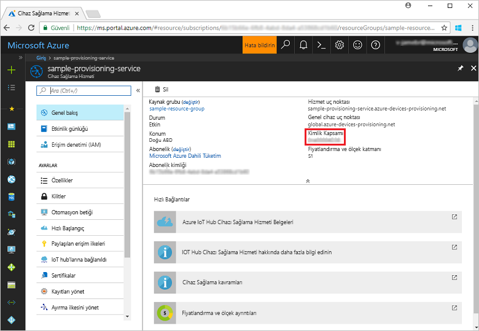
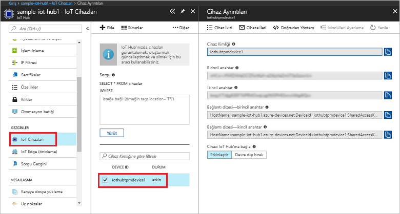

# <a name="create-and-provision-a-simulated-tpm-device-using-c-device-sdk-for-iot-hub-device-provisioning-service"></a>IoT Hub Cihazı Sağlama Hizmeti için C# cihaz SDK'sını kullanarak sanal bir TPM cihazı oluşturma ve sağlama
> [!div class="op_single_selector"]
> * [C](quick-create-simulated-device.md)
> * [Java](quick-create-simulated-device-tpm-java.md)
> * [C#](quick-create-simulated-device-tpm-csharp.md)
> * [Python](quick-create-simulated-device-tpm-python.md)

Bu adımlar, Windows işletim sistemi çalıştıran geliştirme makinenizde Azure IoT Hub C# SDK'sı sanal TPM cihazı örneğini derlemeyi ve sanal cihazı Cihaz Sağlama Hizmeti ve IoT hub'ınızla bağlamayı gösterir. Örnek kodda cihazın [Donanım Güvenlik Modülü (HSM)](https://azure.microsoft.com/blog/azure-iot-supports-new-security-hardware-to-strengthen-iot-security/) olarak Windows TPM simülatörü kullanılmaktadır. 

Devam etmeden önce [IoT Hub Cihazı Sağlama Hizmetini Azure portalıyla ayarlama](./quick-setup-auto-provision.md) bölümünde bulunan adımları tamamladığınızdan emin olun.

<a id="setupdevbox"></a>
## <a name="prepare-the-development-environment"></a>Geliştirme ortamını hazırlama 

1. Makinenizde [.Net Core SDK'sının](https://www.microsoft.com/net/download/windows) yüklü olduğundan emin olun. 

1. `git` uygulamasının makinenizde yüklü olduğundan ve komut penceresinden erişilebilir ortam değişkenlerine eklendiğinden emin olun. Yüklenecek `git` araçlarının son sürümleri için [Software Freedom Conservancy’nin Git istemci araçlarına](https://git-scm.com/download/) bakın. Bunlara yerel Git deponuzla etkileşim kurmak için kullanabileceğiniz bir komut satırı uygulaması olan **Git Bash** dahildir. 

4. Bir komut istemi veya Git Bash’i açın. Azure IoT SDK for C# GitHub deposunu kopyalayın:
    
    ```cmd
    git clone --recursive https://github.com/Azure/azure-iot-sdk-csharp.git
    ```

## <a name="provision-the-simulated-device"></a>Sanal cihazı sağlama


1. Azure portalında oturum açın. Sol taraftaki menüden **Tüm kaynaklar**'a tıklayın ve Cihaz Sağlama hizmetinizi açın. **Genel Bakış** dikey penceresine gidin. **_Kimlik Kapsamı_** değerini not edin.

     


2. Komut isteminde dizini TPM cihaz sağlama örneğinin proje dizini olacak şekilde değiştirin.

    ```cmd
    cd .\azure-iot-sdk-csharp\provisioning\device\samples\ProvisioningDeviceClientTpm
    ```

2. TPM cihaz sağlama örneğini derlemek ve çalıştırmak için aşağıdaki komutu yazın. `<IDScope>` değerinin yerine sağlama hizmetinizin Kimlik Kapsamını girin. 

    ```cmd
    dotnet run <IDScope>
    ```

1. Komut penceresinde cihaz kaydı için gereken **_Onay Anahtarı_**, **_Kayıt Kimliği_** ve önerilen **_Cihaz Kimliği_** görüntülenir. Bu değerleri not alın. 
   > [!NOTE]
   > Komut çıktısını içeren pencereyi TPM simülatörü çıktısını içeren pencereyle karıştırmayın. Komut penceresini öne getirmek için tıklamanız gerekebilir.

     


4. Azure portalının Cihaz Sağlama Hizmeti özet dikey penceresinde, **Kayıtları yönetme**'yi seçin. **Bireysel Kayıtlar** sekmesini seçin ve üstteki **Ekle** düğmesine tıklayın. 

5. **Kayıt listesi girişi ekle** bölümüne aşağıdaki bilgileri girin:
    - Kimlik onay *Mekanizması* olarak **TPM** seçeneğini belirleyin.
    - TPM cihazınızın *Kayıt kimliği* ve *Onay anahtarı* bilgilerini girin. 
    - İsteğe bağlı olarak sağlama hizmetinizle bağlanacak IoT hub'ını seçin.
    - Benzersiz bir cihaz kimliği girin. Örnek çıktıda önerilen cihaz kimliğini girebilir veya kendiniz bir değer belirtebilirsiniz. Kendi belirttiğiniz değeri kullanıyorsanız cihazınızı adlandırırken gizli veriler kullanmaktan kaçının. 
    - **Başlangıç cihaz ikizi durumu** alanını cihaz için istenen başlangıç yapılandırmasına göre güncelleştirin.
    - Tamamlandığında **Kaydet** düğmesine tıklayın. 

      

   Kayıt başarıyla tamamlanınca cihazınızın *Kayıt Kimliği* listenin altında *Tek Tek Kayıtlar* sekmesinde görünür. 

6. Sanal cihazı kaydetmek için Enter'a basın. IoT hub bilgilerinizi almak için cihaz önyüklemesi ve Cihaz Sağlama Hizmetine bağlanma benzetimi gerçekleştiren iletilere dikkat edin. 

1. Cihazın sağlandığını doğrulayın. Sanal cihazın, sağlama hizmetinizle bağlantılı IoT hub ile başarıyla sağlanmasından sonra cihaz kimliği hub'ın **IoT Cihazları** dikey penceresinde görünür. 

     

    Cihazınız için *başlangıç cihaz ikizi durumu* ayarının kayıt girişindeki varsayılan değerini değiştirdiyseniz istenen ikili durumu hub'dan çekerek ona göre hareket edebilir. Daha fazla bilgi için bkz. [IoT Hub'daki cihaz ikizlerini kavrama ve kullanma](../iot-hub/iot-hub-devguide-device-twins.md)


## <a name="clean-up-resources"></a>Kaynakları temizleme

Cihaz istemci örneği üzerinde çalışmaya ve inceleme yapmaya devam etmeyi planlıyorsanız bu Hızlı Başlangıç’ta oluşturulan kaynakları silmeyin. Devam etmeyi planlamıyorsanız, bu hızlı başlangıç ile oluşturulan tüm kaynakları silmek için aşağıdaki adımları kullanın:

1. Makinenizde cihaz istemci örnek çıktı penceresini kapatın.
1. Makinenizde TPM simülatörü penceresini kapatın.
1. Azure portalında sol taraftaki menüden **Tüm kaynaklar**’ı ve ardından Cihaz Sağlama hizmetini seçin. **Tüm kaynaklar** dikey pencerenin en üstündeki **Sil** seçeneğine tıklayın.  
1. Azure portalında sol taraftaki menüden **Tüm kaynaklar**’ı ve ardından IoT hub’ınızı seçin. **Tüm kaynaklar** dikey pencerenin en üstündeki **Sil** seçeneğine tıklayın.  

## <a name="next-steps"></a>Sonraki adımlar

Bu hızlı başlangıçta makinenizde bir TPM sanal cihazı oluşturdunuz ve IoT Hub Cihaz Sağlama Hizmeti ile IoT hub'ınıza sağladınız. TPM cihazınızı programlı bir şekilde kaydetmeyi öğrenmek için TPM cihazının programlı kaydının yer aldığı Hızlı Başlangıç adımlarına gidin. 

> [!div class="nextstepaction"]
> [Azure Hızlı Başlangıcı - TPM cihazını Azure IoT Hub Cihaz Sağlama Hizmeti'ne kaydetme](quick-enroll-device-tpm-csharp.md)
