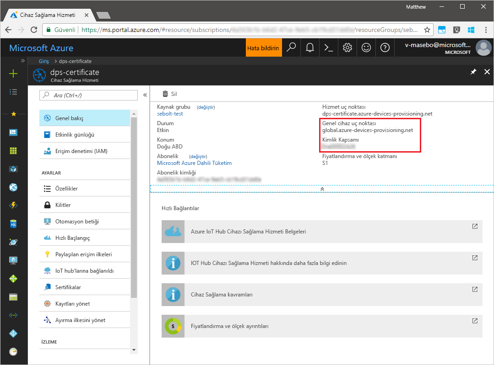
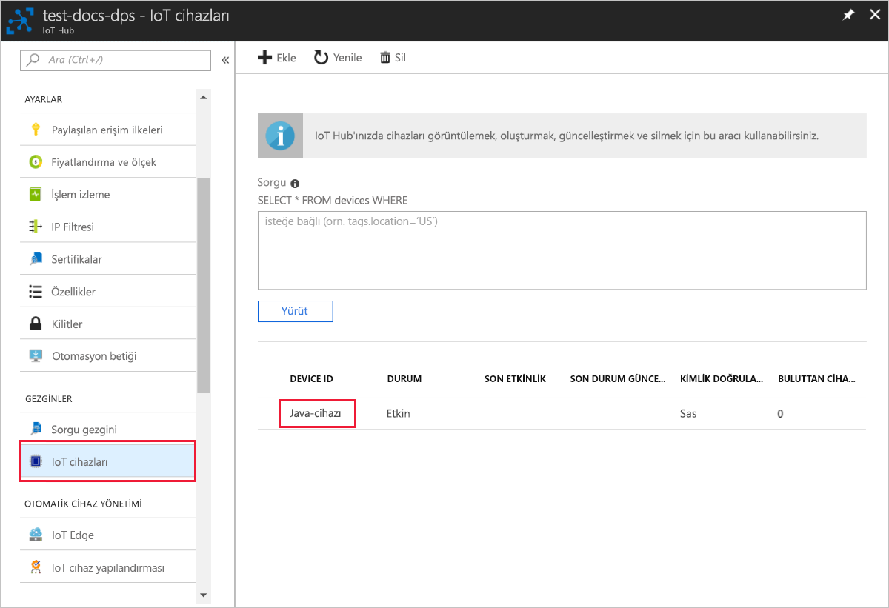

# <a name="create-and-provision-a-simulated-tpm-device-using-java-device-sdk-for-azure-iot-hub-device-provisioning-service"></a>Azure IoT Hub Cihazı Sağlama Hizmeti için Java cihaz SDK'sını kullanarak sanal bir TPM cihazı oluşturma ve sağlama

[!INCLUDE [iot-dps-selector-quick-create-simulated-device-tpm](../../includes/iot-dps-selector-quick-create-simulated-device-tpm.md)]

Bu adımlar, Windows işletim sistemi çalıştıran geliştirme makinenizde sanal makine oluşturmayı, Windows TPM simülatörünü cihazın [Donanım Güvenlik Modülü (HSM)](https://azure.microsoft.com/blog/azure-iot-supports-new-security-hardware-to-strengthen-iot-security/) olarak çalıştırmayı ve örnek kodlar kullanarak bu sanal cihazı Cihaz Sağlama Hizmeti ve IoT hub’ınızla bağlamayı gösterir. 

Otomatik sağlama işlemini bilmiyorsanız, [Otomatik sağlama kavramlarını](concepts-auto-provisioning.md) gözden geçirdiğinizden emin olun. Ayrıca devam etmeden önce [IoT Hub Cihazı Sağlama Hizmetini Azure portalıyla ayarlama](./quick-setup-auto-provision.md) bölümünde bulunan adımları tamamladığınızdan emin olun. 

Azure IoT Cihaz Sağlama Hizmeti iki tür kaydı destekler:
- [Kayıt grupları](concepts-service.md#enrollment-group): Birden çok ilgili cihazları kaydetmek için kullanılır.
- [Bireysel kayıtlar](concepts-service.md#individual-enrollment): Tek bir cihazı kaydetmek için kullanılır.

Bu makalede bireysel kayıtlar gösterilmektedir.

[!INCLUDE [IoT Device Provisioning Service basic](../../includes/iot-dps-basic.md)]

## <a name="prepare-the-environment"></a>Ortamı hazırlama 

1. Makinenizde [Java SE Development Kit 8](https://aka.ms/azure-jdks) uygulamasının yüklü olduğundan emin olun.

1. [Maven](https://maven.apache.org/install.html)'ı indirip yükleyin.

1. `git` uygulamasının makinenizde yüklü olduğundan ve komut penceresinden erişilebilir ortam değişkenlerine eklendiğinden emin olun. Yüklenecek `git` araçlarının son sürümleri için [Software Freedom Conservancy’nin Git istemci araçlarına](https://git-scm.com/download/) bakın. Bunlara yerel Git deponuzla etkileşim kurmak için kullanabileceğiniz bir komut satırı uygulaması olan **Git Bash** dahildir. 

1. Bir komut istemi açın. Cihaz benzetim kod örneği için GitHub deposunu kopyalayın.
    
    ```cmd/sh
    git clone https://github.com/Azure/azure-iot-sdk-java.git --recursive
    ```

1. [TPM](https://docs.microsoft.com/windows/device-security/tpm/trusted-platform-module-overview) simülatörünü çalıştırın. **Erişime izin ver**'e tıklayarak _Windows Güvenlik Duvarı_ ayarlarında değişiklik yapılmasına izin verin. 2321 ve 2322 bağlantı noktalarında bulunan bir yuva üzerinden dinler. Bu pencereyi kapatmayın; Hızlı Başlangıç kılavuzu sonuna kadar simülatörü çalışır durumda tutmanız gerekir. 

    ```cmd/sh
    .\azure-iot-sdk-java\provisioning\provisioning-tools\tpm-simulator\Simulator.exe
    ```

    

1. Ayrı bir komut isteminde, kök klasörüne gidin ve örnek bağımlılıkları derleyin.

    ```cmd/sh
    cd azure-iot-sdk-java
    mvn install -DskipTests=true
    ```

1. Örnek klasörüne gidin.

    ```cmd/sh
    cd provisioning/provisioning-samples/provisioning-tpm-sample
    ```

1. Azure portalında oturum açın, sol taraftaki menüden **Tüm kaynaklar** düğmesine tıklayın ve Cihaz Sağlama hizmetinizi açın. _Kimlik Kapsamı_ ve _Sağlama Hizmeti Genel Uç Noktası_ değerlerini not edin.

    

1. `src/main/java/samples/com/microsoft/azure/sdk/iot/ProvisioningTpmSample.java` girişini düzenleyerek önceden not ettiğiniz _Kimlik Kapsamı_ ve _Sağlama Hizmeti Genel Uç Noktası_ değerlerini girin.  

    ```java
    private static final String idScope = "[Your ID scope here]";
    private static final String globalEndpoint = "[Your Provisioning Service Global Endpoint here]";
    private static final ProvisioningDeviceClientTransportProtocol PROVISIONING_DEVICE_CLIENT_TRANSPORT_PROTOCOL = ProvisioningDeviceClientTransportProtocol.HTTPS;
    ```

1. Projeyi derleyin. Hedef klasöre gidin ve oluşturulan jar dosyasını ayıklayın.

    ```cmd/sh
    mvn clean install
    cd target
    java -jar ./provisioning-tpm-sample-{version}-with-deps.jar
    ```

1. Program çalışmaya başlar. Sonraki bölüm için _Onay Anahtarı_ ve _Kayıt Kimliği_ değerlerini not edip programı çalışır durumda bırakın.

    
    

## <a name="create-a-device-enrollment-entry"></a>Cihaz kaydı girişi oluşturma

1. Azure portalında oturum açın, sol taraftaki menüden **Tüm kaynaklar** düğmesine tıklayın ve Cihaz Sağlama hizmetinizi açın.

2. Cihaz Sağlama Hizmeti özet dikey penceresinde, **Kayıtları yönet**’i seçin. **Bireysel Kayıtlar** sekmesini seçin ve en üstteki **Bireysel kayıt ekle** düğmesine tıklayın. 

3. **Kayıt Ekle** altına aşağıdaki bilgileri girin:
   - Kimlik onay *Mekanizması* olarak **TPM** seçeneğini belirleyin.
   - TPM cihazınızın önceden not ettiğiniz *Kayıt kimliği* ve *Onay anahtarı* bilgilerini girin. 
   - Sağlama hizmetinizle bağlanacak IoT hub'ını seçin.
   - Benzersiz bir cihaz kimliği girin. Cihazınızı adlandırırken gizli veriler kullanmaktan kaçının.
   - **Başlangıç cihaz ikizi durumu** alanını cihaz için istenen başlangıç yapılandırmasına göre güncelleştirin.
   - Tamamlandığında **Kaydet** düğmesine tıklayın. 

       

   Kayıt başarıyla tamamlanınca cihazınızın *Kayıt Kimliği* listenin altında *Bireysel Kayıtlar* sekmesinde görünür. 


## <a name="simulate-the-device"></a>Cihazı benzetme

1. Makinenizde Java örnek kodunu çalıştıran komut penceresinde uygulamayı çalıştırmaya devam etmek için Enter'a basın. IoT hub bilgilerinizi almak için cihaz önyüklemesi ve Cihaz Sağlama Hizmetine bağlanma benzetimi gerçekleştiren iletilere dikkat edin.  

    

1. Benzetimli cihazınızın, sağlama hizmetinizle bağlantılı IoT hub ile başarıyla sağlanmasından sonra cihaz kimliği hub’ın **Device Explorer** dikey penceresinde görünür.

     

    Cihazınız için *başlangıç cihaz ikizi durumu* ayarının kayıt girişindeki varsayılan değerini değiştirdiyseniz istenen ikili durumu hub'dan çekerek ona göre hareket edebilir. Daha fazla bilgi için bkz. [IoT Hub'daki cihaz ikizlerini kavrama ve kullanma](../iot-hub/iot-hub-devguide-device-twins.md)


## <a name="clean-up-resources"></a>Kaynakları temizleme

Cihaz istemci örneği üzerinde çalışmaya ve inceleme yapmaya devam etmeyi planlıyorsanız bu Hızlı Başlangıç’ta oluşturulan kaynakları silmeyin. Devam etmeyi planlamıyorsanız, bu hızlı başlangıç ile oluşturulan tüm kaynakları silmek için aşağıdaki adımları kullanın:

1. Makinenizde cihaz istemci örnek çıktı penceresini kapatın.
1. Makinenizde TPM simülatörü penceresini kapatın.
1. Azure portalında sol taraftaki menüden **Tüm kaynaklar**’ı ve ardından Cihaz Sağlama hizmetini seçin. Hizmetinizin **Kayıtları Yönetme** dikey penceresini açıp **Bireysel Kayıtlar** sekmesine tıklayın. Bu Hızlı Başlangıç adımlarını kullanarak kaydettiğiniz cihazın *KAYIT KİMLİĞİ* değerini seçip en üstte bulunan **Sil** düğmesine tıklayın. 
1. Azure portalında sol taraftaki menüden **Tüm kaynaklar**’ı ve ardından IoT hub’ınızı seçin. Hub'ınızın **IoT Cihazları** dikey penceresini açıp bu Hızlı Başlangıç adımlarını kullanarak kaydettiğiniz cihazın *CİHAZ KİMLİĞİ* değerini seçip en üstte bulunan **Sil** düğmesine tıklayın.

## <a name="next-steps"></a>Sonraki adımlar

Bu hızlı başlangıçta makinenizde bir TPM sanal cihazı oluşturdunuz ve IoT Hub Cihaz Sağlama Hizmeti ile IoT hub'ınıza sağladınız. TPM cihazınızı programlı bir şekilde kaydetmeyi öğrenmek için TPM cihazının programlı kaydının yer aldığı Hızlı Başlangıç adımlarına gidin. 

> [!div class="nextstepaction"]
> [Azure Hızlı Başlangıcı - TPM cihazını Azure IoT Hub Cihaz Sağlama Hizmeti'ne kaydetme](quick-enroll-device-tpm-java.md)
